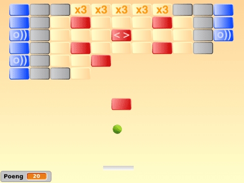

# Introduksjon {.intro}

Breakout er en gammel klassiker opprinnelig laget av Steve Jobs og
Steve Wozniak (grunnleggerene av Apple) på 1970-tallet. På samme måte
som i Pong skal man kontrollere en sprettende ball ved hjelp av en
racket. Men Breakout kan spilles av en spiller hvor man får poeng for
å skyte ned bokser ved hjelp av ballen.  Nyere versjoner har
videreutviklet Breakout på flere måter. For eksempel ved at noen
bokser gir spesielle bonuser, ved at det finnes forskjellige brett av
ulik vanskelighetsgrad og så videre.



# Oversikt over prosjektet {.activity}

*Mesteparten av kodingen av Breakout skal du gjøre selv. Koden for
 racketen og ballen ligner en del på den tilsvarende koden i Pong. Vi
 vil derfor fokusere på boksene i dette prosjektet, og spesielt
 diskutere hvordan man kan bruke kloner på en effektiv måte.*

## Plan {.check}

+ Bokser ... Mange bokser!

+ En sprettende ball og en enkel racket

+ Boksene forsvinner ...

+ Fallende bokser, bonuser, flere brett og andre utfordringer

# Steg 1: Bokser ... Mange bokser! {.activity}

*En sentral del av Breakout er alle boksene man skal prøve å skyte
 ned. Siden disse boksene alle oppfører seg (nesten) likt vil vi bruke
 den samme koden for alle boksene. Til dette bruker vi kloning.*

I Scratch kan vi klone figurer. Det betyr at vi lager en kopi av en
figur, både av utseendet og oppførselen. Her vil vi derfor først lage
en boks, og deretter lage mange kopier av denne.

## Sjekkliste {.check}

+ Start et nytt prosjekt. Slett kattefiguren.

+ Lag en boksfigur. Denne kan du tegne selv eller bruke `Button3` i
  biblioteket.

+ Vi vil nå klone denne ene boksen mange ganger. For å lage flere
  rekker med bokser bruker vi to løkker. Vi trenger også å vite hvor
  mange bokser vi har slik at vi senere kan sjekke om vi har skutt ned
  alle. Lag derfor en variabel `Antall bokser`{.blockdata} som gjelder
  for alle figurer. I denne koden må du kanskje endre de forskjellige
  tallene litt, slik at de passer størrelsen på din boks.

  ```blocks
  når jeg mottar [Nytt spill v]
  skjul
  sett [Antall bokser v] til [0]
  sett y til (160)
  gjenta (5) ganger
      sett x til (-200)
      gjenta (11) ganger
          endre [Antall bokser v] med (1)
          lag klon av [meg v]
          endre x med (40)
      slutt
      endre y med (-25)
  slutt
  ```

+ Selve oppførselen til hver boks kan vi så kode i et eget skript som
  starter når klonen lages. Siden vi enda ikke har en ball, lager vi
  et enkelt skript hvor hver boks (det vil her si alle boksene) blir
  borte når mellomrom trykkes.

  ```blocks
  når jeg starter som klon
  vis
  vent til <tast [mellomrom v] trykket?>
  endre [Antall bokser v] med (-1)
  slett denne klonen
  ```

  Etter at vi har laget en ball og en racket skal vi oppdatere denne
  koden slik at boksene i stedet forsvinner når de blir truffet av
  ballen.

# Steg 2: En sprettende ball og en enkel racket {.activity}

*Når man lager nye programmer og spill er det alltid lurt å lage en
 enkel versjon av spillet tidlig. Denne tidlige versjonen behøver ikke
 kunne gjøre veldig mye, du kan likevel begynne å teste at programmet
 blir som du hadde tenkt nesten med en gang.*

Vi begynner nå med grunnmekanismen i spillet: En ball som spretter og
en racket som kan ta i mot ballen.

## Sjekkliste {.check}

+ Lag en racket-figur. Tegn gjerne en selv, ellers kan du bruke for
  eksempel `Paddle` fra biblioteket.

+ Lag et skript som starter når det mottar `Nytt spill`. Dette
  skriptet må plassere racketen et passende sted nederst på
  skjermen. Deretter kan det gå inn i en løkke hvor racketen alltid
  flyttes sidelengs når `Pil venstre`- eller `Pil høyre`-tastene
  trykkes.

+ Lag en ball-figur. Du kan enten finne en i biblioteket, eller
  tegne en selv.

+ Vi vil ha muligheten til senere enkelt å endre hastigheten til
  ballen. Lag derfor en ny variabel `hastighet`{.blockdata} som
  gjelder for ball-figuren.

+ Lag et skript som starter på `Nytt spill`-meldingen. Først i
  skriptet vil du plassere ballen slik at den hviler på racketen, og
  gi den en tilfeldig retning oppover (for eksempel mellom -45 og 45
  grader). Deretter kan ballen gå inn i en løkke som gjentas helt til
  `y`-posisjonen av ballen blir mindre enn et passende tall (`-160` er
  et bra utgangspunkt, men dette vil variere avhengig av hvor du
  plasserer racketen og hvor stor ballen er). Inne i denne løkken vil
  du flytte ballen `hastighet`{.blockdata} steg, og la den
  `sprette tilbake ved kanten`{.blockmotion}.

+ Vi vil nå la ballen sprette på racketen. I løkken til racketen kan
  du legge til en `hvis`{.blockcontrol}-test hvor du sender en
  `Sprett horisontalt`-melding når ballen berører racketen.

+ Ballen må svare på denne meldingen ved å endre retning, for eksempel
  med kode som ser omtrent ut som følger:

  ```blocks
  når jeg mottar [Sprett horisontalt v]
  pek i retning ((180) - (retning))
  ```

# Steg 3: Boksene forsvinner {.activity}

*Vi skal nå koble sammen boksene og ballen. Boksene skal jo forsvinne
 når de blir truffet av ballen. Samtidig skal ballen sprette når den
 treffer en boks.*

## Sjekkliste {.check}

+ Vi har jo allerede laget kode som får boksene til å forsvinne. Men
  inntil nå har boksene forsvunnet når vi trykker
  mellomrom-tasten. Endre denne koden slik at boksene i stedet
  forsvinner når de berører ballen.

+ La også boksene sende ut en `Sprett horisontalt`--melding etter at
  de har berørt ballen, men før de (klonene) slettes.

Prøv spillet ditt. Grunnmekanismene skal nå fungere.

+ For at spillet skal se litt bedre ut, kan du legge på en startmeny,
  kanskje med en stilig forside eller intro-animasjon?

+ Legg på passende lyd-effekter. Du bør ihvertfall spille av lyder når
  ballen spretter på boksene, men tenk også over om det er andre
  hendelser hvor det passer å spille enkle lyder?

+ La også noe skje når du taper spillet. Det vil si når
  `gjenta til`{.blockcontrol}-løkken på ballen er ferdig.

+ Ved hjelp av `Antall bokser`{.blockdata}-variabelen kan du også
  sjekke om spilleren har klart å fjerne alle boksene og vinne
  spillet. Gi spilleren beskjed om at hun har vunnet!

+ Tenk litt på hvordan du har lyst til å utvikle spillet
  videre. Hvordan kan du gjøre det enda morsommere for deg og dine
  venner? I neste del finnes noen ideer.

# Steg 4: Videreutvikling av spillet {.activity}

*Du står helt fritt i hvordan du vil jobbe videre med spillet ditt,
 men her er noen ideer som kan gjøre spillet enda morsommere å
 spille:*

## Ideer til videreutvikling {.check}

+ Legg til en poeng-teller. Du må først bestemme hva spilleren skal få
  poeng for, for eksempel at ballen treffer en boks. Deretter lager du
  en `Poeng`{.blockdata}-variabel som du endrer etterhvert.

+ La hastigheten øke etterhvert i spillet.

+ En morsommere, og mer naturlig, sprett på racketen kan du få ved å
  ta hensyn til hvor på racketen ballen treffer. Dette kan du gjøre
  for eksempel ved å sammenligne `x`-posisjonen til ballen og
  racketen.

+ Hvis ballen treffer på siden av en boks burde den sprette på en
  vertikal (stående) vegg i stedet for en horisontal (liggende). For å
  kode dette kan du lage en ny melding tilsvarende
  `Sprett horisontalt`. Tallet `180` i koden må byttes ut. Med hvilket
  tall da?

+ Kanskje du kan videreutvikle hele konseptet, slik at det er mulig å
  plukke opp power-ups etterhvert som man spiller. For eksempel noe
  som endrer hastigheten på ballen, endrer størrelsen på racketen, gir
  ekstra poeng eller kanskje lager litt skru på ballen.

+ I stedet for at boksene bare forsvinner når ballen treffer dem, kan
  du la dem løsne og falle nedover. Videre kan spilleren få ekstra
  poeng eller bonuser om hun klarer å fange de fallende boksene med
  racketen.

+ Bruk forskjellige farger på boksene. På denne måten kan du lage
  brett som ser forskjellige ut. Du kan også la de forskjellige
  boksene gi forskjellige poeng eller bonuser.

  En måte å designe slike brett på kan være ved å først lage de
  forskjellige boksene som forskjellige drakter. Deretter kan du
  lage en `brett`{.blockdata}-variabel som lister opp hvilken
  drakt hver boks skal bruke. For eksempel kan denne se slik ut:

  ```blocks
  sett [brett v] til [1111111111111222222211112233322111122222221111111111111]
  ```

  Denne kan så brukes når du setter ut boksene omtrent som dette:

  ```blocks
  bytt drakt til (bokstav (antall bokser) i (brett))
  ```

  Videre i spillet kan du teste på `drakt nr.`{.blocklooks} for å
  vite hvilken type boks du har med å gjøre.
