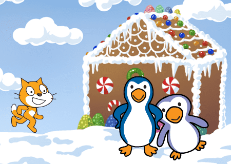

# Om oppgåva {.activity}

Bursdag i Antarktis er ein interaktiv animasjon som fortel historia om ein liten
katt som har gått seg bort på bursdagen sin. Heldigvis treff han nokre
hyggjelege pingvinar han kan feire saman med.

Dette prosjektet viser fram nokre av moglegheitene Scratch gir for å lage
animasjonar og presentasjonar, som samstundes kan koplast opp mot brukarane og
gi rom for interaktivitet.

## Oppgåva passar til: {.check}

__Fag__: Matematikk, norsk, engelsk, kunst og handtverk

__Anbefalte trinn__: 3.-10. trinn.

__Tema__: Koordinatsystem, samansett tekst.

__Tidsbruk__: Dobbelttime eller meir.

## Kompetansemål {.challenge}

- [ ] __Matematikk, 3. trinn__: eksperimentere med og forklare plasseringar i
      koordinatsystemet

- [ ] __Matematikk, 6. trinn__: bruke variablar, løkker, vilkår og funksjonar i
      programmering til å utforske geometriske figurar og mønster

- [ ] __Norsk, 2. trinn__: lage tekstar som kombinerer skrift med bilde

- [ ] __Engelsk fordypning, 10. trinn__: skape digitale produkt som kombinerer
      ulike medietypar

- [ ] __Kunst og handtverk, 7. trinn__: bruke programmering til å skape
      interaktivitet og visuelle uttrykk

## Forslag til læringsmål {.challenge}

- [ ] Elevane kan plassere figurar på bestemte posisjonar i eit koordinatsystem.

- [ ] Elevane kan få figurar til å bevege seg i eit koordinatssystem.

- [ ] Elevane kan lage ein samansett tekst for å fortelje ei historie.

- [ ] Elevane kan få figurar til å interagere på skjermen.

- [ ] Elevane kan bruke variablar for å ta imot informasjon frå brukaren.

## Forslag til vurderingskriterium {.challenge}

- [ ] Eleven syner middels måloppnåing ved å fullføre oppgåva.

- [ ] Eleven syner høg måloppnåing ved å vidareutvikle eigen kode basert på
  oppgåva, til dømes ved å gjere ein eller fleire av variasjonane under.

## Føresetnader og utstyr {.challenge}

- [ ] __Føresetnader__: Elevane bør vere komfortable med Scratch.

- [ ] __Utstyr__: Datamaskiner med Scratch installert. Eventuelt kan elevane
  bruke Scratch i nettlesaren viss dei har ein brukar (eller registrerer seg) på
  [scratch.mit.edu/](https://scratch.mit.edu/). Elevane kan gjerne jobbe to og
  to saman.

## Framgangsmåte

Her finn du tips, erfaringar og utfordringar til dei ulike stega i oppgåva.
[Klikk her for å sjå oppgåveteksten.](../bursdag i antarktis/bursdag i
antarktis_nn.html){target=_blank}

_Me har diverre ikkje nokre tips, erfaringar eller utfordringar knytta til denne
oppgåva endå._

## Variasjonar {.challenge}

- [ ] Elevane kan fortsetje historia utover det som er beskrive i oppgåva.

- [ ] Elevane kan bruke fleire bakgrunnar og fleire figurar.

- [ ] Elevane kan flytte historia til eit anna miljø. Kva med ørkenen?

## Eksterne ressursar {.challenge}

- [ ] Førebels ingen eksterne ressursar...
