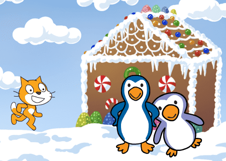
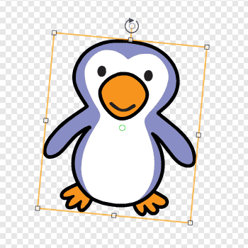

# Introduksjon {.intro}

Bursdag i Antarktis er en interaktiv animasjon som forteller
historien om en liten katt som har gått seg bort på bursdagen
sin. Heldigvis treffer han noen hyggelige pingviner han kan feire
sammen med.



# Steg 1: En katt på villspor {.activity}

*Vi lager en katt som kan gå rundt i Antarktis på egen hånd.*

Vi skal etterhvert fortelle en ganske spennende historie om katten som
møter dansende pingviner på bursdagen sin. Men som alltid er det greit
å begynne med noe ganske enkelt, for deretter å bygge videre på det.

## Sjekkliste {.check}

+ Start et nytt prosjekt. Gi kattefiguren navnet `Felix`, og sett
  rotasjonsmåten hans til
  .

+ Lag en ny bakgrunn ved å klikke
   nede til
  venstre på skjermen. Velg `Holiday/winter`.

+ Legg også til bakgrunnen `Holiday/winter-lights`.

+ Vi begynner med et skript på scenen, som passer på at vi viser
  `winter`-bakgrunnen når animasjonen starter. Gå til
  `Skript`{.blocklightgrey}-fanen og legg til

  ```blocks
  når grønt flagg klikkes
  bytt bakgrunn til [winter v]
  ```

+ Da kan vi få katten til å flytte på seg. Klikk på `Felix` og gi ham
  dette skriptet:

  ```blocks
  når grønt flagg klikkes
  gå til x: (-100) y: (-50)
  ```

  Her kan du eksperimentere litt med tallene for `x` og `y` til du
  finner noe som du synes ser bra ut.

+ La oss nå få Felix til å bevege seg over skjermen. Vi skifter mellom
  de to draktene hans for at det skal se ut som om han går. Utvid
  skriptet til Felix på denne måten:

  ```blocks
  når grønt flagg klikkes
  gå til x: (-100) y: (-50)
  pek i retning (100 v)
  gjenta til <(x-posisjon) > [240]>
      gå (10) steg
      neste drakt
      vent (0.1) sekunder
  slutt
  ```

  Tallet 100 i `pek i retning`{.blockmotion}-klossen gjør at Felix går
  litt nedover mens han går over skjermen. Prøv gjerne med noen
  andre tall for å se effekten av dem.

## Test prosjektet {.flag}

__Klikk på det grønne flagget.__

+ Vandrer Felix over skjermen?

+ Stopper han når kommer til kanten på skjermen?

+ Starter han på nytt på venstre side av skjermen om du klikker på det
  grønne flagget igjen?

### Antarktis {.protip}

Antarktis er navnet på området der Sydpolen ligger. Selv om det ikke
bor hverken mennesker eller katter fast på Antarktis finnes det veldig
mange pingviner der.

## Sjekkliste {.check}

Vi vil nå få bakgrunnen til å endre seg når katten kommer til enden av
skjermen. Vi begynner med noe enkelt, men som dessverre ikke fungerer
så veldig bra.

+ Lag et nytt skript på Scenen.

  ```blocks
  når grønt flagg klikkes
  vent (3) sekunder
  bytt bakgrunn til [winter-lights v]
  ```

+ Legg også til en kloss som flytter Felix inn til veien etter at
  bakgrunnen er byttet.

  ```blocks
  når grønt flagg klikkes
  gå til x: (-100) y: (-50)
  pek i retning (100 v)
  gjenta til <(x-posisjon) > [240]>
      gå (10) steg
      neste drakt
      vent (0.1) sekunder
  slutt
  gå til x: (-20) y: (-100)
  ```

## Test prosjektet {.flag}

__Klikk på det grønne flagget.__

+ Skifter bakgrunnen når Felix kommer til enden av skjermen?

+ Klarer du å endre tallet i klossen `vent 3 sekunder`{.blockcontrol}
  slik at det ser bedre ut?

# Steg 2: Det blir enklere med meldinger {.activity}

*Vi skal nå begynne å bruke meldinger for å få ting til å skje på
 likt.*

Vi har sett at vi kan klare å få ting til å skje samtidig ved å bruke
`vent`{.blockcontrol}-klosser. Men det er vanskelig å finne ut akkurat
hvor lenge vi bør vente, og det er kjedelig å måtte endre på denne
tiden om vi forandrer for eksempel hvor fort Felix går.

Vi skal derfor i stedet bruke __meldinger__. Slike meldinger er noe
figurene kan sende til hverandre eller til scenen uten at de er
synlige for oss som ser på.

## Sjekkliste {.check}

+ La katten sende en melding når han når kanten av skjermen.

  ```blocks
  når grønt flagg klikkes
  gå til x: (-100) y: (-50)
  pek i retning (100 v)
  gjenta til <(x-posisjon) > [240]>
      gå (10) steg
      neste drakt
      vent (0.1) sekunder
  slutt
  send melding [Scene 2 v]
  ```

+ Vi kan nå slette det gamle skriptet på scenen som byttet bakgrunn
  til `winter-lights`, og heller bruke dette:

  ```blocks
  når jeg mottar [Scene 2 v]
  bytt bakgrunn til [winter-lights v]
  ```

+ Felix kan også motta meldinger han sender selv. Vi kan bruke dette
  til å flytte ham inn på veien samtidig som vi bytter bakgrunn. Legg
  til følgende som et nytt skript på Felix:

  ```blocks
  når jeg mottar [Scene 2 v]
  gå til x: (-20) y: (-100)
  ```

## Test prosjektet {.flag}

__Klikk på det grønne flagget.__

+ Går Felix fortsatt over skjermen?

+ Hva skjer når han kommer til kanten av skjermen? Vi har laget to
  skript som sier at bakgrunnen skal endre seg og katten skal flytte
  til midten av skjermen. Skjer dette?

# Steg 3: Felix introduserer seg selv {.activity}

*Før Felix vandrer i vei synes vi at han burde introdusere seg selv!*

Som alle høflige katter introduserer Felix seg når han treffer nye
mennesker.

## Sjekkliste {.check}

+ Start et nytt skript på Felix:

  ```blocks
  når jeg mottar [Si hei v]
  si [Å nei! Hvor er jeg?] i (2) sekunder
  tenk [Jeg har gått meg bort ... også på bursdagen min] i (2) sekunder
  spør [Hvor gammel blir jeg igjen?] og vent
  ```

+ For å teste hvordan skriptet virker kan du bare klikke på for
  eksempel klossen `når jeg mottar Si hei`{.blockevents}. Snakker og
  tenker Felix?

+ Når du svarer på Felix spørsmål blir svaret ditt tatt vare på i en
  variabel som heter `svar`{.blocksensing}. Vi vil lage en ny
  variabel med et bedre navn som kan ta vare på dette svaret. Lag en
  ny variabel som heter `alder`{.blockdata}. La denne variabelen
  gjelde for alle figurer, og fjern avhuking slik at variabelen ikke
  vises.

+ Legg til en kloss nederst i skriptet:

  ```blocks
  når jeg mottar [Si hei v]
  si [Å nei! Hvor er jeg?] i (2) sekunder
  tenk [Jeg har gått meg bort ... også på bursdagen min] i (2) sekunder
  spør [Hvor gammel blir jeg igjen?] og vent
  sett [alder v] til (svar)
  ```

+ Nå vil vi at Felix skal si og gjøre alt dette før han vandrer
  gjennom skogen. Legg til en `send melding`{.blockevents}-kloss i det
  første skriptet til Felix:

  ```blocks
  når grønt flagg klikkes
  gå til x: (-100) y: (-50)
  pek i retning (100 v)
  send melding [Si hei v]
  gjenta til <(x-posisjon) > [240]>
      gå (10) steg
      neste drakt
      vent (0.1) sekunder
  slutt
  send melding [Scene 2 v]
  ```

## Test prosjektet {.flag}

__Klikk på det grønne flagget.__

+ Snakker Felix som han skal?

+ Det er kanskje litt uhøflig at Felix bare springer av gårde mens han
  snakker med oss?

## Sjekkliste {.check}

+ Vi vil at Felix snakker ferdig før han begynner å gå. Dette er
  heldigvis ganske enkelt. Hvis vi bytter ut `send
  melding`{.blockevents}-klossen med en `send melding og
  vent`{.blockevents}-kloss, vil ikke Felix begynne å gå før han er
  ferdig å snakke (og vi har svart på spørsmålet hans):

  ```blocks
  når grønt flagg klikkes
  gå til x: (-100) y: (-50)
  pek i retning (100 v)
  send melding [Si hei v] og vent
  gjenta til <(x-posisjon) > [240]>
      gå (10) steg
      neste drakt
      vent (0.1) sekunder
  slutt
  send melding [Scene 2 v]
  ```

## Test prosjektet {.flag}

__Klikk på det grønne flagget.__

+ Venter Felix med å gå til du har svart på spørsmålet hans?

# Steg 4: Gå opp mot husene {.activity}

*Da er vi klare til å hjelpe Felix med å finne veien opp til de to
 husene.*

Vi skal nå la Felix gå langs veien opp til husene. For at det skal se
ut som om han går oppover mot husene vil vi la han bli mindre og
mindre mens han går.

## Sjekkliste {.check}

+ Vi skal nå fortsette på skriptet til Felix som begynner med at han
  mottar meldingen `Scene 2`. Legg til en liten
  `si`{.blocklooks}-kloss først:

  ```blocks
  når jeg mottar [Scene 2 v]
  gå til x: (-20) y: (-100)
  si [Å! Der er det noen hus!] i (2) sekunder
  ```

+ Nå skal vi la Felix følge veien oppover. Prøv først med følgende
  skript:

  ```blocks
  når jeg mottar [Scene 2 v]
  gå til x: (-20) y: (-100)
  si [Å! Der er det noen hus!] i (2) sekunder
  pek i retning (20 v)
  gjenta (6) ganger
      gå (9) steg
      neste drakt
      endre størrelse med (-2)
      vent (0.1) sekunder
  slutt
  ```

+ Følger Felix veien oppover? Blir han mindre mens han går? Husk at om
  du vil teste dette skriptet uten å se hele animasjonen kan du klikke
  på `når jeg mottar Scene 2`{.blockevents}-klossen. Du bør også klikke
  på `sett størrelse til 100%`{.blocklooks}-klossen i
  `Utseende`{.blocklooks}-kategorien innimellom, slik at Felix får
  tilbake sin vanlige størrelse.

+ Nå vil vi at Felix skal forandre retning slik at han følger
  veien. Et triks er at vi kan gange retningen hans med -1. Da blir
  det som om han snur seg rundt. Siden vi vil gjøre dette fire ganger
  lager vi også en ny `gjenta`{.blockcontrol}-kloss:

  ```blocks
  når jeg mottar [Scene 2 v]
  gå til x: (-20) y: (-100)
  si [Å! Der er det noen hus!] i (2) sekunder
  pek i retning (20 v)
  gjenta (4) ganger
      gjenta (6) ganger
          gå (9) steg
          neste drakt
          endre størrelse med (-2)
          vent (0.1) sekunder
      slutt
      pek i retning ((retning) * (-1))
  slutt
  ```

## Test prosjektet {.flag}

__Klikk på det grønne flagget.__

+ Følger Felix veien oppover mot de to husene?

Hvis du ser litt nærmere på veien ser du at den flater ut. Dette kan
vi etterligne for Felix med å gange med et tall som er litt
forskjellig fra -1 i retningen.

## Sjekkliste {.check}

+ Endre `-1` i `pek i retning`{.blockmotion}-klossen til `-1.5`.

+ For å skjønne bedre hva som skjer kan du klikke på `i`{.blockmotion}
  på Felix og følge med på `retning` mens skriptet kjører.

+ Når Felix kommer fram til huset kan vi skjule ham, og skifte til en
  ny scene.

  ```blocks
  når jeg mottar [Scene 2 v]
  gå til x: (-20) y: (-100)
  si [Å! Der er det noen hus!] i (2) sekunder
  pek i retning (20 v)
  gjenta (4) ganger
      gjenta (6) ganger
          gå (9) steg
          neste drakt
          endre størrelse med (-2)
          vent (0.1) sekunder
      slutt
      pek i retning ((retning) * (-1.5))
  slutt
  skjul
  vent (1) sekunder
  send melding [Scene 3 v]
  ```

+ For den scenen trenger vi en ny bakgrunn. Klikk
   og legg
  til bakgrunnen `Holiday/gingerbread`. Gi scenen dette skriptet:

  ```blocks
  når jeg mottar [Scene 3 v]
  bytt bakgrunn til [gingerbread v]
  ```

+ I det vi skifter til den nye scenen vil vi også at Felix skal få
  tilbake sin vanlige størrelse. Klikk på Felix og start et nytt
  skript:

  ```blocks
  når jeg mottar [Scene 3 v]
  sett størrelse til (100)%
  gå til x: (-160) y: (-65)
  vis
  ```

## Test prosjektet {.flag}

__Klikk på det grønne flagget.__

+ Har Felix blitt flinkere til å følge veien oppover mot de to husene?

+ Skifter bakgrunnen over til huset som det skal?

+ Får Felix riktig størrelse igjen på slutten av animasjonen? Og når
  du starter animasjonen på nytt?

+ Hvordan kan du sørge for at Felix alltid dukker opp i full størrelse
  når det grønne flagget klikkes på nytt?

# Steg 5: Si hei til pingvinene {.activity}

*Felix skal nå møte to pingviner som bor inne i pepperkakehuset. De
 skal komme ut av huset og snakke litt med Felix*

## Sjekkliste {.check}

+ Lag to nye figurer ved å trykke på
  . Velg
  `Dyr/Penguin1` og `Dyr/Penguin2`. Gi pingvinene navn du liker, vi
  har valgt å kalle dem `Pingu` og `Pappa Pingu`.

+ For at pingvinene først skal dukke opp i `Scene 3`, må vi skjule dem
  når animasjonen starter. Legg til følgende skript på begge figurene:

  ```blocks
  når grønt flagg klikkes
  skjul
  ```

+ Først skal Felix spørre om det er noen hjemme, og så skal han sende
  en melding hvor han ber pingvinene om å komme ut. Endre Felix sitt
  skript ved å legge til to klosser på slutten:

  ```blocks
  når jeg mottar [Scene 3 v]
  sett størrelse til (100)%
  gå til x: (-160) y: (-65)
  vis
  si [Oj, så flott hus! Er det noen hjemme?] i (2) sekunder
  send melding [Kom ut v]
  ```

+ Pingu skal nå komme ut av døra og gå litt til siden. Sjekk med
  musepekeren hva `x` og `y`-posisjonen til døren er. Legg til
  følgende skript på Pingu:

  ```blocks
  når jeg mottar [Kom ut v]
  gå til x: (45) y: (-70)
  vis
  gli (1) sekunder til x: (150) y: (-100)
  ```

+ Pappa Pingu kommer ut litt senere, og stiller Felix et spørsmål.
  Legg til følgende script på Pappa Pingu:

  ```blocks
  når jeg mottar [Kom ut v]
  vent (2) sekunder
  gå til x: (45) y: (-70)
  vis
  vent (1) sekunder
  spør [Hva heter du?] og vent
  send melding [Navn1]
  ```

## Test prosjektet {.flag}

__Klikk på det grønne flagget.__

+ Kommer pingvinene ut av huset som forventet?

+ Hva tror du skjer med navnet du skrev inn?

# Steg 6: Pingvinene danser {.activity}

*Pingvinene blir glade for å treffe Felix, og etter en liten samtale
 begynner den ene pingvinen å danse siden det er Felix sin bursdag.*

## Sjekkliste {.check}

+ Få Pappa Pingu til å sende en melding etter at han har spurt hva
  Felix heter. Kall for eksempel meldingen `Navn1`

+ Legg til følgende skript på Pingu

  ```blocks
  når jeg mottar [Navn1 v]
  si (svar) i (2) sekunder
  si [Det er et rart navn!] i (2) sekunder
  send melding [Navn2 v]
  ```

+ Legg til følgende skript på Felix for å få ham til å svare og si at
  han har bursdag:

  ```blocks
  når jeg mottar [Navn2 v]
  si [Jeg har bursdag i dag!] i (2) sekunder
  si (sett sammen [Jeg blir ] (alder)) i (2) sekunder
  send melding [Party v]
  ```

Legg merke til `sett sammen`{.blockoperators}-klossen. Denne kan vi
bruke for å sette sammen tekst. Pass på at du skriver et mellomrom
etter ordet `blir`!

+ Nå skal vi få Pingu til å danse! Lag to nye drakter for Pingu ved å
  importere `Dyr/Penguin1` to ganger. Roter de to nye draktene litt i
  forhold til hverandre ved å klikke på draktene i tegnevinduet og
  rotere rundt med musen (du må kanskje bytte til vektorgrafikk).

  

+ Legg til en lyd du liker under `Lyder`{.blocklightgrey}, og lag
  følgende skript på Pingu (vi har brukt lyden `human beatbox1`):

  ```blocks
  når jeg mottar [Party v]
  spill lyden [human beatbox1 v]
  gjenta (20) ganger
      neste drakt
      vent (0.2) sekunder
  slutt
  ```

## Test prosjektet {.flag}

__Klikk på det grønne flagget.__

+ Danser pingvinen slik du forventet?

+ Hvorfor tror du det kan være lurt å spare på svaret Pappa Pingu får
  i en variabel?

+ Dukker Pingu opp i riktig drakt når du starter animasjonen på nytt
  igjen? Hvis ikke: finn ut hvordan du kan fikse det!

## Lagre prosjektet {.save}

*Nå har vi begynt på historien om katten som feirer bursdagen sin i
 Antarktis. Men kanskje du kan fortelle mer om hva som skjer videre?*

Eller om du heller vil vise fram historien din til familie og venner
kan du velge `Legg ut` på toppen av skjermen.

## Utfordring: Historien fortsetter {.challenge}

Kan du fortsette på historien? Hva skjer videre?

Kanskje du kan introdusere flere figurer, eller flere bakgrunner? For
eksempel kan det hende at pingvinene inviterer katten med seg inn i
huset? Eller kanskje de sammen går videre på leting etter en båt som
katten kan bruke for å komme seg hjem til Norge?

Husk at du kan også blande animasjonen med et lite spill, og så gå
tilbake til mer animasjon! Det er helt opp til deg!
