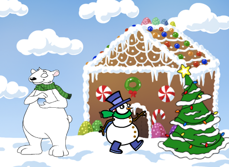
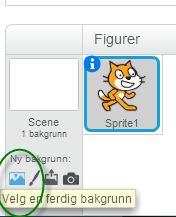
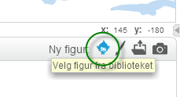
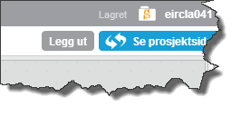

# Introduksjon {.intro}

Vi skal lage et julekort i Scratch. Det skal ha noen enkle funksjoner
og animasjoner. Når det er ferdig vil det se omtrent slik ut.



# Steg 1: Endre bakgrunn og finne figurer {.activity}

Når du er klar til å starte velger du `Programmering` i menyen øverst
på siden <http://scratch.mit.edu/>. Da kommer vi inn i Scratch.


## Sjekkliste {.check}

+ Klikk på scenen ved siden av kattefiguren `Sprite1` i vinduet for
  figurer. Trykk på  for å
  importere en ferdig bakgrunn. Velg den bakgrunnen du vil. Slett
  deretter den tomme bakgrunnen som ligger der.

  

+ Slett kattefiguren `Sprite1` ved å høyreklikke på ham og slette.

+ Velg nye figurer fra biblioteket. Legg til isbjørnen, snømannen og
  juletreet.

  

# Steg 2: Legge til kode {.activity}

Nå skal vi få figurene til å gjøre ting når de blir klikket på.

## Sjekkliste {.check}

+ Velg isbjørnen og fanen `Skript`{.blocklightgrey} og lag denne
  koden. Når isbjørnen blir klikket på skal den si `God jul!`.
  Deretter skal den skifte utseende hvert sekund, 10 ganger.

  ```blocks
  når denne figuren klikkes
  si [God jul!] i (2) sekunder
  gjenta (10) ganger
      neste drakt
      vent (1) sekunder
  slutt
  ```

## Test prosjektet ditt {.flag}

__Klikk på isbjørnen og se om koden din virker.__

+ Sier isbjørnen `God jul!`?

+ Forandrer isbjørnen stilling?

## Sjekkliste {.check}

+ Velg snømannen og fanen `Skript` og lag denne koden.  Snømannen skal
  spørre etter navnet ditt. Den setter svaret inn i en ny
  setning. Deretter skal den skifte farge.

  ```blocks
  når denne figuren klikkes
  spør [Hva er navnet ditt?] og vent
  si (sett sammen [God jul ] (svar)) i (2) sekunder
  for alltid
      endre [farge v] effekt med (25)
  slutt
  ```

## Test prosjektet ditt {.flag}

__Klikk på snømannen og se om koden din virker.__

+ Spør snømannen om navnet ditt?

+ Svarer snømannen med navnet ditt når du har skrevet det inn?

+ Forandrer snømannen farge?

## Sjekkliste {.check}

+ Velg juletreet og fanen `Skript`{.blocklightgrey} og lag denne
koden.  Nå skal juletreet skifte farge og utseende.

  ```blocks
  når grønt flagg klikkes
  for alltid
      vent (0.3) sekunder
      endre [farge v] effekt med (25)
      neste drakt
  slutt
  ```

## Test prosjektet ditt {.flag}

__Trykk på det grønne flagget og se om alt virker.__

+ Endrer treet farge?

+ Danser treet fra side til side?

# Steg 3: Har du ledig tid, sier du? {.activity}

Da har du jobbet godt! Om du fortsatt har ledig tid kan du:

## Sjekkliste {.check}

+ Legge til din egen velkomsthilsen, for eksempel "God jul" eller du
kan synge din egen julesang.

  Klikk på `Scene`, og velg fanen `Lyder`{.blocklightgrey}.

  

  Ta op din egen lyd, og gi den et navn, for eksempel
  `julehilsen`. Gå deretter inn på `Skript`{.blocklightgrey}, og
  legg inn følgende kode:

  ```blocks
  når grønt flagg klikkes
  spill lyden [julehilsen v] til den er ferdig
  ```

+ Kanskje finne på noen andre morsomme animasjoner? Snømannen kan
danse eller turne litt? Kan vi ha snakkende eller hoppende gale
julepresanger? Du bestemmer!

# Steg 4: Lagre og publisere {.activity}

Gi julekortet ditt et navn. Velg deretter `Lagre nå` fra `Fil`menyen.


Deretter kan du publisere julekortet ditt ved å velge `Legg ut`.


