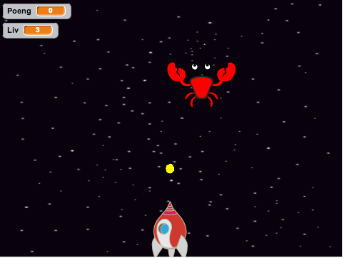

# Informasjon til veiledere

I våre kodeklubbmøter i Deichmanske på Majorstuen merker vi at barna ofte bare blir nesten ferdige med et spill før timen er over. Derfor er ideen bak Krabbeangrep! at skjelettet til spillet står ferdig før barna selv remikser det for å legge til ekstra funksjonalitet.

# Forberedelser

Krabbeangrep! bruker bare ressurser som er inkludert i
Scratch-platformen, samt prosjektet Krabbeangrep! som barna blir
guidet til å laste inn og starte en remiks av i Steg 1. Prosjektet
krever som sådann ingen spesielle forberedelser.

Her er likevel noen generelle ting som kan være verdt å huske på:

+ Scratch er tilgjengelig på nettsiden <http://scratch.mit.edu/>. Velg
  `Programmering` eller `Prøv Det` for å begynne å programmere.
+ Alle elevene bør ha sin egen bruker i Scratch-nettverket. Uten en
  slik bruker er det mye vanskeligere å lagre spillene og programmene
  man lager. For å opprette en ny bruker, klikk `Bli Scratch-bruker`
  og følg instruksene på skjermen.
+ For å skifte språk til norsk:
  + På de vanlige nettsidene til Scratch finnes en nedtrekksmeny for
    å velge språk helt nederst på skjermen.
  + Inne i Scratch-editoren kan man trykke på jordkloden øverst til
    venstre for å endre språket som brukes.

# Læringsmål

I Krabbeangrep fokuserer vi på:

+ Lære hvordan alle figurene i et spill kan synkroniseres og styres med meldinger.
+ Lære å sette pris på hvor lurt det er å ha et hovedobjekt (scenen) som tar for seg viktige avgjørelser i spillflyten. Et aller første møte med en slags MVC-idé.
+ Lære hvordan et ‘spill’ kan gjøres til et skikkelig spill der man kan spille flere ganger og ikke være avhengige av å klikke det grønne flagget hele tiden.
+ Leke med forskjellige ting som vanskelighetsgrad, lyder og annet pynt.
