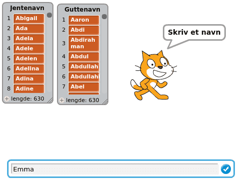

# Introduksjon {.intro}

Her skal me sjå korleis me kan bruke namnelister frå
[Statistisk Sentralbyrå](http://www.ssb.no/navn) i Scratch. Kanskje katten
klarar å finne skilnaden på jente- og gutenamn?



# Steg 1: Statistisk Sentralbyrå sine namnelister {.activity}

*La oss sjå på namnelistene til Statistisk Sentralbyrå. Desse viser kor mange
i Noreg som får kva namn, både i dag og tidlegare.*

## Sjekkliste {.check}

- [ ] Gå til namnesidene hjå Statistisk Sentralbyrå:
  [ssb.no/navn](http://www.ssb.no/navn). Klikk litt rundt for å bli kjent
  med kva data som er tilgjengelege. Prøv å søke på ditt eige namn og sjå på
  **Historisk utvikling (graf)**.

    Du kan prøve andre namn. Sjå på grafen over historisk utvikling for namnet
    **Sonja**. Det har to veldig tydelege toppar, ein på 1920-talet og ein
    til på 1960-talet. Kan du forklare dette?

- [ ] Me vil hente ut lister med alle jente- og gutenamna. Desse finn me ved
  å klikke på fana **Tabeller**. På denne sida finn du mellom anna to tabellar
  som heiter **Jentenamn, alfabetisk** og **Guttenavn, alfabetisk** (med
  årstal). Last ned desse to tabellane anten i **Excel**- eller **CSV**-format.

- [ ] Åpne filane du akkurat lasta ned i Excel eller eit tilsvarande
  reknearkprogram.

    Her er me berre interessert i sjølve namnelistene, ikkje alle tala som
    seier noko om kvart namn. Du kan difor slette alle kolonnene med tal.

- [ ] Legg inn begge listene i det same reknearket, og gi dei overskrifter.
  Då ser det omlag slik ut:

    

- [ ] Dette er viktig! Lagre reknearket som CSV. Du gjer dette ved å velje
  **Lagre som** eller **Eksporter** frå menyen, og så vel du formatet **CSV**.
  Gi fila di eit namn du vil kjenne att, til dømes `namnelister.csv`.

- [ ] Gå til verktøyet for å [lese data inn i Scratch](../data/data_nn.html).
  Trykk på knappen **Last opp datafil**, og vel CSV-filen du akkurat laga.
  No blir det lasta ned eit Scratch-prosjekt på datamaskina di, sannsynlegvis
  ei fil som heiter `data.sb2` i `Nedlastingar`-mappa di.

# Steg 2: Hent namnelistene inn i Scratch {.activity}

*No kan me lese namnelistene inn i Scratch.*

## Sjekkliste {.check}

- [ ] Start eit nytt Scratchprosjekt.

- [ ] Vel **Fil** i menyen og klikk på **Last opp fra maskinen**. Vel fila som
  vart lasta ned i førre steg.

- [ ] Klikk **OK**. No blir namnelistene lasta inn. Det skal sjå omlag slik ut:

    

- [ ] Namnelistene er døme på noko me rett og slett kallar **lister** i Scratch.
  Dei blir programmert ved hjelp av klossar som ligg i `Data`{.blockdata}-
  kategorien. På same måte som for variablar kan du ta bort listene frå
  scena ved å fjerne avhukinga, høgreklikke på den eller bruke klossen
  `gøym lista [ v]`{.b}.

## Data i Scratch {.tip}

Vanlegvis må ein skrive inn alle slike data i lister sjølv for å bruke dei i
Scratch. Ved hjelp av [dataverktøyet](../data/data_nn.html) kan du lese inn
mykje data som du eller nokon andre allereie har laga.

Har du idear til andre data du vil lese inn på same måte?

# Steg 3: Bruk namnelistene {.activity}

*No skal me skrive eit lite program som brukar namnelistene. Målet er å få
katten vår til å sjå skilnaden på jente- og gutenamn.*

## Sjekkliste {.check}

- [ ] Me startar med å la katten spørje om eit namn. Til dette kan me bruke
  `spør [Skriv eit namn] og vent`{.b}-klossen.

- [ ] For at katten skal kunne hugse namnet me gir den vil me bruke ein
  variabel. Klikk på `Data`{.blockdata} og så `Lag ein variabel`. Kall
  variabelen `(Namn)`{.b}.

- [ ] No kan me ta vare på svaret i `(Namn)`{.b}-variabelen.

  ```blocks
  spør [Skriv eit namn] og vent
  set [Namn v] til (svar)
  ```

- [ ] Om du ser på klossane som finst i `Data`{.blockdata}-kategorien er det
  ein som seier `<[Gutenamn v] inneheld [thing]?>`{.b}. Denne klossen kan
  me bruke for å finne ut om eit namn finst i jentenamnlista eller gutenamnlista
  (eller begge eller ingen av dei).

- [ ] Lag ein sjekk for om `(Namn)`{.b} er eit jentenamn:

  ```blocks
  spør [Skriv eit namn] og vent
  set [Namn v] til (svar)
  viss <[Jentenamn v] inneheld (Namn)?>
      sei (set saman (Namn) [ er eit jentenamn]) i (2) sekund
  slutt
  ```

## Test prosjektet {.flag}

__Klikk på koden din.__

- [ ] Spør katten deg om å skrive inn eit namn?

- [ ] Skriv inn eit jentenamn, til dømes `Emma`. Seier katten at `Emma er eit
  jentenamn`?

- [ ] Kva skjer om du skriv inn eit gutenamn? Eller eit ord som ikkje er
  eit namn?

## Sjekkliste {.check}

- [ ] Lag ein sjekk for om `(Namn)`{.b} er eit gutenamn. Prøv å lage denne
  sjølv. Du kan gjere det på akkurat same måte som for jentenamn. Legg den nye
  viss-testen under den du allereie har.

- [ ] Legg til ei `gjenta for alltid`{.b}-løkke rundt heile koden din. Det gjer at
  katten stadig vil spørje deg om nye namn.

- [ ] Legg ein `når @greenFlag vert trykt på`{.b}-kloss på toppen av koden din,
  slik at du kan starte programmet ved å klikke på det grøne flagget.

## Prøv sjølv {.challenge}

- [ ] Dette er eit veldig enkelt døme på kva ein kan gjere med namnelistene.
  Eit problem med dette er at katten ikkje finn dobbeltnamn. Har du idear til
  korleis du kan bruke namnelistene på ein endå meir spanande måte?

- [ ] Kjenner du til andre datasett som du har lyst til å jobbe med i Scratch?
  Bruk [dataverktøyet](../data/data_nn.html) for å lese inn dataane.
