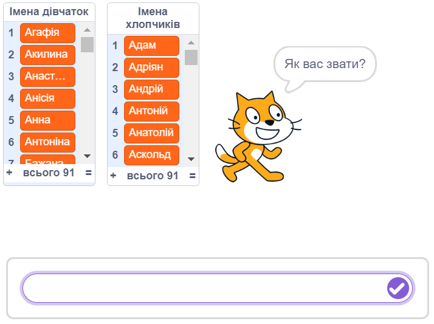
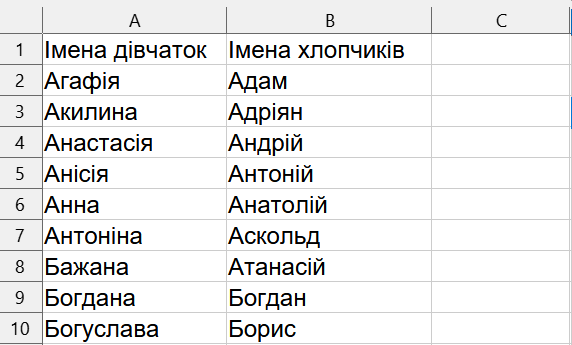
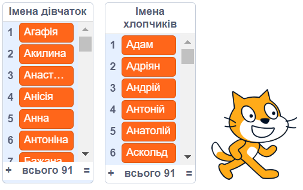

# Вступ {.intro}

Давайте подивимося, як можна використовувати [списки імен](https://docs.google.com/spreadsheets/d/1RlKtvPeGG5bcNv9uiWwC6nC0mB9HJwDltoQRlZR9adM/edit?usp=sharing) у Scratch. Можливо, кіт зможе відрізнити імена дівчаток від імен хлопчиків?




# Крок 1: Списки імен {.activity}

*Погляньмо на списки імен.*

## Контрольний список {.check}

- [ ] Ми хочемо отримати списки з усіма іменами дівчаток та хлопчиків. Їх можна знайти, натиснувши [сюди](https://docs.google.com/spreadsheets/d/1RlKtvPeGG5bcNv9uiWwC6nC0mB9HJwDltoQRlZR9adM/edit?gid=0#gid=0). На цій сторінці ви   побачите **таблицю**, яка містить «**Імена дівчаток** в алфавітному порядку» та «**Імена хлопчиків** в алфавітному порядку». Завантажте цю таблицю у форматі **Excel** або **CSV**.

- [ ] Відкрийте щойно завантажені файли в Excel або подібній програмі для роботи з електронними таблицями.

- [ ] Це буде виглядати приблизно так:

    

- [ ] Це важливо! Збережіть таблицю у форматі CSV. Для цього виберіть **Зберегти як** або **Експортувати** в меню, а потім виберіть формат CSV. Дайте файлу ім'я, яке ви впізнаєте, наприклад, `списки_імен.csv`.

# Крок 2: Перенесіть списки імен до Scratch {.activity}

*Тепер ми можемо читати списки імен у Scratch.*

## Контрольний список {.check}

- [ ] Почніть новий Scratch-проєкт.

- [ ] Створіть новий список, перейшовши на вкладку `Змінні`{.blockdata} і натиснувши кнопку `Створити список`.

- [ ] Дайте ім'я списку **Імена дівчаток**.

- [ ] Клацнути правою кнопкою миші у вікні  `Імена дівчаток` і вибрати пункт `імпорт`. Виберіть CSV-файл, який ви щойно           створили та виберіть 1 стовпчик.

- [ ] Створіть ще один список: `Імена хлопчиків`

- [ ] Клацнути правою кнопкою миші у вікні  `Імена хлопчиків` і вибрати пункт `імпорт`. Виберіть CSV-файл  та виберіть 2          стовпчик.

    

- [ ] Списки імен є прикладами того, що у Scratch просто називається списками. Вони програмуються за допомогою цеглинок,       розташованих у категорії `Змінні`{.blockdata} Як і у випадку зі змінними, ви можете видалити списки зі Сцени, знявши з них позначку, клацнувши правою кнопкою миші або скориставшись блоком `сховати список [Імена дівчаток v]`{.b}.

# Крок 3: Використовуйте списки імен {.activity}

*Зараз ми напишемо невелику програму, яка використовує списки імен. Можливо, ми зможемо навчити нашого кота розпізнавати різницю між іменами дівчаток та хлопчиків?*

## Контрольний список {.check}

- [ ] Ми починаємо з того, що дозволяємо коту попросити ім'я. Для цього ми можемо використати блок `запитати
  [ Як вас звати?] і чекати`{.b}.

- [ ] Для того, щоб кіт запам'ятав ім'я, яке ми йому скажемо, ми використаємо змінну. Клацніть на `Змінні`{.blockdata} а       потім `Створити змінну`. Назвіть змінну `(Ім'я)`{.b}.

- [ ] Тепер ми можемо зберегти відповідь у змінну `(Ім'я)`{.b}.

  ```blocks
  запитати [Як вас звати?] і чекати
  надати [Ім'я v] значення (відповідь)
  ```

- [ ] Якщо ви подивитеся на цеглинки, які зараз знаходяться в категорії `Змінні`{.blockdata}, є одна, яка каже
    
- [ ] <[Імена дівчаток v] містить (щось)?>

- [ ] Ми можемо використовувати цей блок, щоб дізнатися, чи є ім'я в списку імен дівчаток або хлопчиків (або в обох            списках, або в жодному з них).

- [ ] Зробіть перевірку `(Ім'я)`{.b} дівчини:

  ```blocks
  запитати [Як вас звати?] і чекати
  надати [Ім'я v] значення (відповідь)
  якщо <[Імена дівчаток v] містить (Ім'я)?> то
      говорити (з'єднати (І'мя) [ це і'мя дівчинки]) (2) сек
  slutt
  ```

## Перевірте проєкт {.flag}

__Натисніть на зелений прапорець.__

- [ ] Ваш кіт просить вас ввести ім'я?

- [ ] Введіть ім’я дівчини, наприклад `Анна`. Кіт каже, що `Анна це ім’я дівчинки`?

- [ ] Що станеться, якщо ви введете ім'я хлопчика? Або слово, яке не є ім'ям?

## Контрольний список {.check}

- [ ] Зробіть перевірку `(Ім'я)`{.b} хлопчика. Спробуйте створити його самостійно. Ви можете зробити це так само, як і для    дівочих імен. Додайте новий якщо-блок під тим, що вже є.

- [ ] Додайте  цикл `завжди`{.b} навколо всього коду. Таким чином, кіт буде постійно запитувати у вас нові імена.

- [ ] Також додайте блок `коли grønt flagg натиснуто`{.b}  поверх вашого коду, щоб ви могли запустити програму, натиснувши    на зелений прапорець.

## Спробуйте самі. {.challenge}

- [ ] Це дуже простий приклад того, що можна зробити зі списками імен (і він має деякі проблеми: наприклад, кіт не може       знайти подвійні імена, такі як `Марта-Марія`). Чи є у вас ідеї, як використовувати списки імен ще цікавіше?

- [ ] Чи знаєте ви інші набори даних, з якими хотіли б попрацювати у Scratch?
