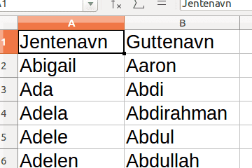

# Вступ {.intro}

Давайте подивимося, як можна використовувати [списки імен](https://docs.google.com/spreadsheets/d/1RlKtvPeGG5bcNv9uiWwC6nC0mB9HJwDltoQRlZR9adM/edit?usp=sharing) у Scratch. Можливо, кіт зможе відрізнити імена дівчаток від імен хлопчиків?


# Крок 1: Списки імен {.activity}

*Погляньмо на списки імен.*

## Контрольний список {.check}

- [ ] Ми хочемо отримати списки з усіма іменами дівчаток та хлопчиків. Їх можна знайти, натиснувши [сюди](https://docs.google.com/spreadsheets/d/1RlKtvPeGG5bcNv9uiWwC6nC0mB9HJwDltoQRlZR9adM/edit?gid=0#gid=0). На цій сторінці ви   побачите **таблицю**, яка містить «**Імена дівчаток** в алфавітному порядку» та «**Імена хлопчиків** в алфавітному порядку». Завантажте цю таблицю у форматі **Excel** або **CSV**.

- [ ] Відкрийте щойно завантажені файли в Excel або подібній програмі для роботи з електронними таблицями.

    Vi er her bare interessert i selve navnelistene, ikke alle tallene som sier
    noe om hvor mange som fikk hvert navn. Du kan derfor slette alle kolonnene
    som inneholder tall.

- [ ] Legg begge listene inn i det samme regnearket, og gi dem beskrivende
  overskrifter. Dette vil se ut omtrent som dette:

    

- [ ] Dette er viktig! Lagre regnearket som CSV. Du gjør dette ved å velge
  **Lagre som** eller **Eksporter** fra menyen og deretter velge formatet
  **CSV**. Gi filen din et navn du vil kjenne igjen, for eksempel
  `navnelister.csv`.

- [ ] Gå til verktøyet for å [lese data inn i Scratch](../data/data.html). Trykk
  på knappen **Last opp datafil**, og velg CSV-filen du nettopp laget. Dette vil
  laste ned et Scratchprosjekt på datamaskinen din, sannsynligvis en fil som
  heter `data.sb2` i `Nedlastinger`-katalogen din.


# Steg 2: Hent navnelistene inn i Scratch {.activity}

*Vi kan nå lese navnelistene inn i Scratch.*

## Sjekkliste {.check}

- [ ] Start et nytt Scratchprosjekt.

- [ ] Velg **Fil** i menyen og klikk på **Last opp fra maskinen**. Velg filen
  som ble lastet ned i forrige steg, sannsynligvis heter den `data.sb2` og
  ligger i katalogen `Nedlastinger`.

- [ ] Klikk **OK**. Navnelistene vil nå lastes inn. Det skal se omtrent slik ut:

    

- [ ] Navnelistene er eksempler på noe som rett og slett kalles **lister** i
  Scratch. De programmeres ved hjelp av klosser som ligger i
  `Data`{.blockdata}-kategorien. Som for variabler kan du ta listene vekk fra
  Scenen ved å fjerne avhukingen, høyreklikke på den eller bruke klossen `skjul
  liste [ v]`{.b}.

## Data i Scratch {.tip}

Vanligvis må man skrive inn alle dataene i lister selv, om man vil bruke dem i
Scratch. Ved hjelp av [dataverktøyet](../data/data.html) kan du lese inn
kjempemasse data som du eller noen andre allerede har laget.

Har du noen ideer til andre data du vil lese inn på samme måte?


# Steg 3: Bruk navnelistene {.activity}

*Vi skal nå skrive et lite program som bruker navnelistene. Kanskje vi kan få
katten vår til å se forskjellen på jente- og guttenavn?*

## Sjekkliste {.check}

- [ ] Vi begynner med å la katten spørre om et navn. Til dette kan vi bruke `spør
  [Skriv et navn] og vent`{.b}-klossen.

- [ ] For at katten skal kunne huske navnet vi forteller den vil vi bruke en
  variabel. Klikk på `Data`{.blockdata} og deretter `Lag en variabel`. Kall
  variabelen `(Navn)`{.b}.

- [ ] Vi kan nå ta vare på svaret i `(Navn)`{.b}-variabelen.

  ```blocks
  spør [skriv et navn] og vent
  sett [Navn v] til (svar)
  ```

- [ ] Om du ser på klossene som nå finnes i `Data`{.blockdata}-kategorien er det en
  som sier `<[Guttenavn v] inneholder [thing]?>`{.b}. Denne klossen kan vi bruke
  for å finne ut om et navn finnes i jentenavnlisten eller guttenavnlisten
  (eller begge eller ingen av dem).

- [ ] Lag en sjekk for om `(Navn)`{.b} er et jentenavn:

  ```blocks
  spør [skriv et navn] og vent
  sett [Navn v] til (svar)
  hvis <[Jentenavn v] inneholder (Navn)?>
      si (sett sammen (Navn) [ er et jentenavn]) i (2) sekunder
  slutt
  ```

## Test prosjektet {.flag}

__Klikk på koden din.__

- [ ] Spør katten deg om å skrive inn et navn?

- [ ] Skriv inn et jentenavn, for eksempel `Emma`. Sier katten at `Emma er et
  jentenavn`?

- [ ] Hva skjer om du skriver inn et guttenavn? Eller et ord som ikke er et navn?

## Sjekkliste {.check}

- [ ] Lag en sjekk for om `(Navn)`{.b} er et guttenavn. Prøv å lag denne selv. Du
  kan gjøre det på akkurat samme måte som for jentenavn. Legg den nye
  hvis-testen under den du allerede har.

- [ ] Legg til en `gjenta for alltid`{.b}-løkke rundt hele koden din. På den måten vil
  katten stadig spørre deg om nye navn.

- [ ] Legg også en `når grønt flagg klikkes`{.b}-kloss på toppen av koden din, slik
  at du kan starte programmet ved å klikke på det grønne flagget.

## Prøv selv {.challenge}

- [ ] Dette er et veldig enkelt eksempel på hva man kan gjøre med navnelistene (og
  det har noen problemer: for eksempel finner ikke katten dobbeltnavn
  som `Geir Arne`). Har du noen ideer til hvordan du kan bruke navnelistene på
  en enda mer spennende måte?

- [ ] Kjenner du til andre datasett som du har lyst til å jobbe med i Scratch? Bruk
  [dataverktøyet](../data/data.html) for å lese inn dataene.
