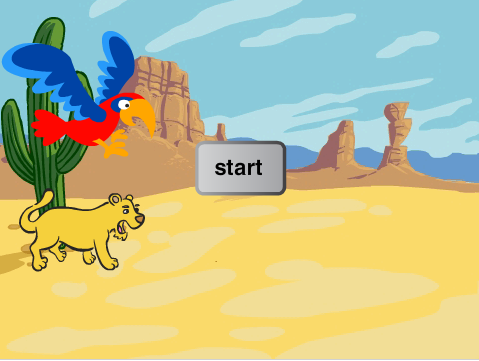

# Introduksjon {.intro}

Dette er et spill for to, der en papegøye og en løvinne kjemper om å
komme først gjennom ørkenen. Hver spiller må trykke en tast så fort og
ofte som mulig for å flytte figuren sin, og den som kommer først til
kanten av skjermen vinner.



# Steg 1: Lag en scene og legg til figurer {.activity}

*Vi begynner med å få på plass bakgrunnen og figurene.*

## Sjekkliste {.check}

+ Klikk på Scene og velg en ferdig bakgrunn,
  . Velg
  `Natur/desert`.

+ Fjern katten ved å høyreklikke på figuren og velg `slett`.

+ Legg til en ny figur ved å trykke på
  . Velg
  `Dyr/Lionness`.

+ Legg så til enda en ny figur: velg `Dyr/Parrot`. Krymp figuren slik
  at den er omtrent like stor som løvinnen ved å bruke
  .

# Steg 2: La løvinnen og papegøyen bevege seg {.activity}

*Vi vil at figurene skal bevege seg når du trykker på en knapp.*

## Sjekkliste {.check}

+ Velg først løvefiguren og få den til å `gå 4 steg`{.blockmotion} når
  du trykker `L` tasten.

  ```blocks
  når [l v] trykkes
  gå (4) steg
  ```

+ Velg så papegøyefiguren og la den `gå 4 steg`{.blockmotion} når du
  trykker `A` tasten.

  ```blocks
  når [a v] trykkes
  gå (4) steg
  ```

## Test prosjektet {.flag}

__Klikk på det grønne flagget.__

+ Beveger løvinnen og papegøyen seg over skjermen når du trykker på
  `A` og `L` tastene?

# Steg 3: Start kappløpet {.activity}

*Nå må vi kjøre i gang kappløpet og kåre en vinner. Vi begynner med å
 lage startknapp.*

## Sjekkliste {.check}

+ Legg til en ny figur. Velg `Ting/Button3`. Flytt den til midten av
  scenen.

+ Klikk på `Drakter`-fanen og verktøyet `T` for å legge til
  tekst. Trykk på venstre kant av knappen for å legge til et tekstfelt
  og skriv inn teksten `Start`. Du kan flytte på teksten ved å trykke
  en gang på den, og endre innhold ved å dobbeltklikke.

+ Legg nå til et skript som viser figuren når spillet starter:

  ```blocks
  når grønt flagg klikkes
  vis
  ```

+ I tillegg vil vi at knappen først teller ned fra 3, sier `LØP!` og
  deretter blir skjult når den klikkes. Dette ordner du med følgende
  skript:

  ```blocks
  når denne figuren klikkes
  si [3] i (1) sekunder
  si [2] i (1) sekunder
  si [1] i (1) sekunder
  si [LØP!] i (1) sekunder
  skjul
  ```

## Test prosjektet {.flag}

__Klikk på det grønne flagget, og deretter på startknappen.__

+ Teller knappen ned?

+ Sier den `LØP!`?

+ Blir den borte?

Vi ønsker at figurene bare beveger seg etter at kappløpet er startet
og vi ønsker å vite når kappløpet er over.

## Sjekkliste {.check}

+ For å vite når kappløpet har startet og sluttet lager vi en variabel
  med navnet `kappløp`{.blockdata}. Variabelen skal være tilgjengelig
  `for alle figurer`. Fjern avhukingen foran variabelen, slik at den
  ikke vises på scenen.

+ Sett `kappløp`{.blockdata} til 0 når spillet startes ved å forandre
  `når grønt flagg klikkes`{.blockevents}-skriptet slik:

  ```blocks
  når grønt flagg klikkes
  vis
  sett [kappløp v] til [0]
  ```

+ Når nedtellingen er ferdig og løpet begynner, forandrer vi
  `kappløp`{.blockdata}-verdien til 1. Dette gjør du ved å legge til
  klossen `Sett kappløp til 1`{.blockdata} under `si 1 i 1
  sekunder`{.blocklooks} i skriptet som starter med `når denne figuren
  klikkes`{.blockevents}.

+ Nå må vi lage en regel som sier at figurene bare får lov til å
  bevege seg etter at løpet har startet – det vil si når
  `kappløp`{.blockdata} har verdien 1. Klikk først på papegøyen. Så
  endrer du:

  ```blocks
  når [a v] trykkes
  hvis <(kappløp) = [1]>
      gå (4) steg
  slutt
  ```
+ Gjenta det samme for løvinnen.

## Test prosjektet {.flag}

__Klikk på det grønne flagget.__

+ Kan løvinnen og papegøyen bare flytte seg når nedtellingen er
  ferdig?

# Steg 4: Avslutte kappløpet {.activity}

*Nå vil vi finne ut hvem som vinner kappløpet, og i tillegg gjøre
 klart for en ny runde.*

## Sjekkliste {.check}

+ Legg til en kloss i papegøyens skript som sier `sett kappløp til
  0`{.blockdata} hvis figuren berører kanten av skjermen:

  ```blocks
  når [a v] trykkes
  hvis <(kappløp) = [1]>
      gå (4) steg
      hvis <berører [kant v]?>
          sett [kappløp v] til [0]
      slutt
  slutt
  ```

+ Spill så inn en lyd som skal spilles av hvis papegøyen vinner.

  Trykk på `Lyder`-fanen og deretter mikrofon-ikonet og spill inn en
  morsom trudelutt! Opptaket starter når du har klikket på rundingen
  slik at den blir rød. Klikk stopp (firkanten) når du er ferdig, og
  gi lyden et navn – for eksempel `Polly`. Noen nettlesere kan
  spørre om tillatelse til å spille inn lyd. Hvis du ikke ønsker
  dette, bruk lydene som følger med figurene.

+ Deretter legger du til klossene som spiller lyden og lar papegøyen
  fortelle at den vant:

  ```blocks
  når [a v] trykkes
  hvis <(kappløp) = [1]>
      gå (4) steg
      hvis <berører [kant v]?>
          sett [kappløp v] til [0]
          spill lyden [Polly v]
          si [Polly vinner!] i (3) sekunder
      slutt
  slutt
  ```

+ Gjør tilsvarende for løvinnen.

## Test prosjektet {.flag}

__Klikk på det grønne flagget.__

+ Kan du trykke på startknappen og deretter bevege dyrene med tastene
  `A` og `L`?

+ Kommer riktig vinnerlyd og melding opp på skjermen?

# Steg 5: Nullstill spillet {.activity}

*Når kappløpet er over må vi fortelle de andre figurene at spillet er
 over og nullstille spillet, slik at er klart for en ny runde.*

## Sjekkliste {.check}

+ Klikk på papegøyefiguren og legg til en kloss som sender melding
  `Avslutt` etter at figuren sier den har vunnet.

  ```blocks
  når [a v] trykkes
  hvis <(kappløp) = [1]>
      gå (4) steg
      hvis <berører [kant v]?>
          sett [kappløp v] til [0]
          spill lyden [Polly v]
          si [Polly vinner! v] i (3) sekunder
          send melding [Avslutt v]
      slutt
  slutt
  ```

+ Vi trenger nå et nytt skript som lytter etter denne
  avslutningsmeldingen og flytter papegøyen tilbake til start.

  ```blocks
  når jeg mottar [Avslutt v]
  sett x til (-170)
  ```

+ Gjør det samme for løvinnen. Test forskjellige `x`-verdier for å
  være sikker på at løvinnen og papegøyen starter fra samme sted.

+ For at figurene skal stå på startstreken når kappløpet starter den
  aller første gangen må vi også legge til følgende klosser på begge
  figurene:

  ```blocks
  når grønt flagg klikkes
  sett x til (-170)
  ```

+ For at spillerne skal kunne klikke i gang nye runder må vi passe på
  at start-knappen kommer tilbake etter hver avsluttet runde. Klikk på
  startknapp-figuren og legg til et skript som viser knappen når
  avslutningsmeldingen blir mottatt.

  ```blocks
  når jeg mottar [Avslutt v]
  vis
  ```

## Test prosjektet {.flag}

__Klikk på det grønne flagget.__

+ Kan du spille mot en venn? En av dere styrer papegøyen ved å trykke
  `A`, og den andre løvinnen ved å trykke `L`.

## Lagre prosjektet {.save}

Spillet er ferdig! Hvis du vil kan du velge `Legg ut` slik at venner
og familie også kan spille det.

Nedenfor er det noen forslag og ideer til hvordan du kan utvide
spillet og gjøre det enda mer interessant.

## Utfordring 1: Legg til en rakett! {.challenge}

+ __Legg til en rakett__ som kan brukes én gang per kappløp og som
  flytter papegøyen eller løvinnen __30 steg på en gang.__

+ __Legg til en ny drakt__ med ild som kommer ut bak figurene. La
  denne aktiveres når raketten avfyres.

+ __Lag en lyd__ som figuren kan gi fra seg når raketten avfyres.

Nedenfor er et forslag til hvordan et rakett-skript kan se ut. Du må
legge til noen lyder og variabler på egen hånd.

```blocks
når [q v] trykkes
hvis <<(kappløp) = [1]> og <(rakett_brukt) = [0]>>
    bytt drakt til [parrot-rakett v]
    sett [rakett_brukt v] til [1]
    gå (30) steg
    spill lyden [motorcycle passing v]
    hvis <berører [kant v]?>
        sett [kappløp v] til [0]
        spill lyden [Polly v]
        si [Polly vinner! v] i (3) sekunder
        send melding [Avslutt v]
    slutt
    bytt drakt til [parrot-a v]
slutt
```

## Test prosjektet {.flag}

__Klikk på det grønne flagget.__

+ Fungerer raketten slik du hadde planlagt?

+ Hva skjer om man forsøker å bruke raketten to ganger?

+ Hva skjer om man bruker raketten for å komme til mål?

## Utfordring 2: Bruk egendefinerte klosser for å forenkle skriptet ditt {.challenge}

Koden som brukes til å sjekke om kappløpet er over brukes nå to steder
for hver figur; når figuren beveger seg normalt og når den beveger seg
med rakett.  Vi kan forenkle skriptet vårt ved å bruke en egendefinert
kloss. Dette er en samling kode som brukes flere steder. Det er nesten
som at vi lager vår egen Scratch-kodekloss!

+ Velg papegøyens skript.

+ Velg `Flere klosser`{.blockmoreblocks}-paletten og klikk så på `Lag
  en kloss`-knappen.

+ Kall klossen din `ferdig` og trykk OK.

+ Du vil nå få en `definer ferdig`{.blockmoreblocks}-kloss i
  skriptvinduet ditt. Flytt den litt for seg selv.

+ Løsriv hele `hvis`{.blockcontrol}`berører
  kant?`{.blocksensing}-klossen og dra den til `definer
  ferdig`{.blockmoreblocks}-klossen.

+ Kan du dra `ferdig`{.blockmoreblocks}-klossen fra paletten og bruke
  den på samme måte som andre kodeklosser?

+ Slett den andre `hvis`{.blockcontrol}`berører
  kant?`{.blocksensing}-klossen fra skriptet ditt og erstatt også den
  med en `ferdig`{.blockmoreblocks}-kloss.

  ```blocks
  definer ferdig
  hvis <berører [kant v]?>
      sett [kappløp v] til [0]
      spill lyden [Polly v]
      si [Polly vinner! v] i (3) sekunder
      send melding [Avslutt v]

  når [a v] trykkes
  hvis <(kappløp) = [1]>
      gå (4) steg
      ferdig

  når [q v] trykkes
  hvis <<(kappløp) = [1]> og <(rakett_brukt) = [0]>>
      bytt drakt til [parrot-rakett v]
      sett [rakett_brukt v] til [1]
      gå (30) steg
      spill lyden [motorcycle passing v]
      ferdig
      bytt drakt til [parrot-a v]
  ```

+ Gjør dette koden din enklere å lese? Kan du lage en tilsvarende
  egendefinert kloss for løvinnen?

## Test prosjektet {.flag}

__Klikk på det grønne flagget.__

* Virker spillet fortsatt slik det skal?

* Er spillet ferdig når papegøyen eller løvinnen kommer til kanten av
  skjermen?

## Lagre prosjektet {.save}

Veldig bra! Nå er du ferdig og kan kose deg med spillet du har laget!
