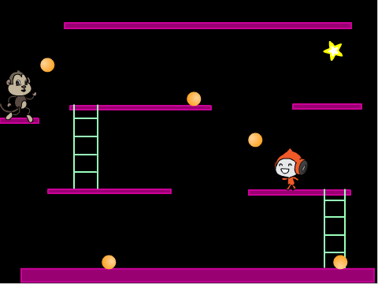
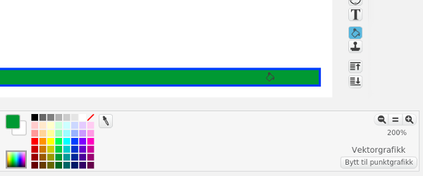
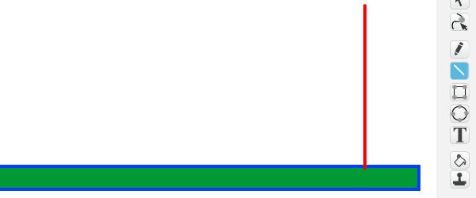
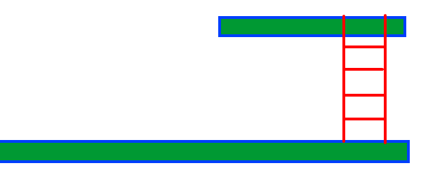

# Introduksjon {.intro}

Donkey Kong var det første virkelig plattform-spillet da det ble gitt
ut i 1981. I tillegg til Donkey Kong var det også her vi første gang
ble kjent med Super Mario (som het Jumpman den gang). I spillet styrer
vi Super Mario mens han prøver å redde kjæresten sin fra Donkey Kong,
og må passe seg for tønner og ildkuler mens han hopper mellom
plattformer.



# Oversikt over prosjektet {.activity}

*Mesteparten av kodingen av Donkey Kong skal du gjøre selv. Underveis
 vil du lære hvordan du lager et enkelt plattform-spill i Scratch.*

## Plan {.check}

+ Hvordan styre en plattform-helt som kan hoppe?

+ Plattformer og stiger

+ Donkey Kong og rullende ildkuler

+ .. og andre utfordringer

# Steg 1: En hoppende helt {.activity}

*Den viktigste delen av et godt plattform-spill er å ha en helt man
 kan styre rundt og hoppe fra plattform til plattform med.*

I denne delen skal vi konsentrere oss om hvordan vi kan styre
heltefiguren, og spesielt hvordan vi får den til å hoppe og falle på
en troverdig måte.

## Sjekkliste {.check}

+ Start et nytt prosjekt.

+ For å kunne teste at heltefiguren oppfører seg som vi vil trenger vi
  en enkel plattform (vi skal tegne flere plattformer senere). Tegn en
  ny bakgrunn. Velg å tegne med `Vektorgrafikk`. Tegn en smal, lang
  boks nederst på skjermen. Fyll den med en farge forskjellig fra
  linjefargen.

  

+ Velg eller lag deg en figur du ønsker å bruke som den hoppende
  helten du skal styre. Om du ikke bruker Scratch-katten så slett
  denne. Kall figuren `Jumpman`. Sannsynligvis vil vi gjøre figuren
  mindre slik at vi får plass til flere plattformer på skjermen. Dette
  kan du gjøre med kode som kun kjører i det du starter spillet, for
  eksempel:

  ```blocks
  når grønt flagg klikkes
  sett størrelse til (40) %
  begrens rotasjon [vend sideveis v]
  ```

  Vi har også lagt til en kloss som passer på at `Jumpman` bare snur
  seg mot høyre eller venstre.

+ Vi trenger to variabler som vi skal bruke til å kontrollere
  bevegelsen til `Jumpman`. Lag to variabler, `(fartX)`{.b} og
  `(fartY)`{.b}. Pass på at begge gjelder kun _for denne figuren_.

+ I hovedløkken som styrer `Jumpman` vil vi først endre litt på disse
  `fart`{.blockdata}-variablene, og til slutt flytte selve figuren
  basert på dem.

  Dersom ingenting påvirker figuren vår vil vi at `(fartX)`{.b} skal
  gå mot 0 (farten bremses), mens vi vil at `(fartY)`{.b} skal bli et
  stadig større negativt tall (figuren faller). Men om figuren står på
  plattformen skal `(fartY)`{.b} være 0 (figuren står i ro). Dette kan
  vi kode omtrent som følger:

  ```blocks
  når jeg mottar [nytt spill v]
  gå til x: (-150) y: (-100)
  for alltid  // hovedløkken
      sett [fartX v] til ((0.8) * (fartX))  // farten bremses
      endre [fartY v] med (-0.5)  // gravitasjon, figuren faller
      hvis <berører fargen [#0000ff]>  // figuren står på plattformen
          sett [fartY v] til [0]
      slutt
      endre x med (fartX)  // flytt selve figuren
      endre y med (fartY)
  slutt
  ```

+ Om du prøver spillet ditt så langt (husk å legge til et skript på
  bakgrunnen som sender en `nytt spill`-melding når det grønne flagget
  klikkes), vil du se at figuren din faller ned til plattformen. Men
  du kan ikke kontrollere den.

+ For å styre `Jumpman` legger vi flere `hvis`{.blockcontrol}-tester
  inn i hovedløkken. For eksempel kan du få figuren til å bevege seg
  mot venstre ved å legge til dette rett før `endre x med
  (fartX)`{.b}:

  ```blocks
  hvis <tast [pil venstre v] trykket?>
      pek i retning (-90 v)
      sett [fartX v] til [-5]
      neste drakt
  slutt
  ```

  Lag også en tilsvarende blokk for å flytte figuren mot høyre.

+ Vi vil også at `Jumpman` hopper når vi trykker på `pil opp`-tasten.
  Her må vi være litt forsiktig, siden vi bare vil at figuren kan
  hoppe hvis den står på en plattform (ikke når den allerede
  hopper). En enkel måte å få til dette på er å legge `pil opp`-testen
  inne i testen for om figuren står på plattformen:

  ```blocks
  hvis <berører fargen [#0000ff]>  // gammel kode: figuren står på plattformen
      sett [fartY v] til [0]
      hvis <tast [pil opp v] trykket?>  // ny kode: figuren hopper
          sett [fartY v] til [5]
      slutt
  slutt
  ```

Vi har nå et bra utgangspunkt for et plattformspill. Nemlig en figur
som vi kan styre rundt, og som kan hoppe når vi vil det. Lek litt med
`Jumpman` og tallene vi har brukt i `sett [fartX v] til []`{.b}- og
`sett [fartY v] til []`{.b}-klossene slik at du får en bevegelse du
synes virker naturlig.

+ Du har kanskje oppdaget at av og til faller `Jumpman` delvis
  _gjennom_ plattformen? Hvis ikke, prøv å slipp ham fra toppen av
  skjermen. Den følgende testen fikser dette ganske greit:

  ```blocks
  hvis <berører fargen [#009900]>
      endre y med (2)
  slutt
  ```

  Dette var også grunnen til at vi fylte plattformen med en annen
  farge enn linjefargen.

# Steg 2: Plattformer og stiger {.activity}

*Nå har vi en figur som kan springe og hoppe rundt på skjermen. La oss
 lage flere plattformer den kan leke seg på.*

Mens vi tegner flere plattformer er det viktig at vi bruker
`Vektorgrafikk` fordi dette gjør det lett å flytte plattformene rundt
etter at vi har tegnet dem.

## Sjekkliste {.activity}

+ Før vi tegner flere plattformer skal vi lage stiger, som vil gjøre
  det enklere for helten vår å klatre opp eller ned. Som for
  plattformer skal vi kjenne igjen stiger ved hjelp av fargen. For å
  gjøre litt enkel testing, tegn først en strek rett opp fra
  plattformen (vi skal tegne en finere stige senere) i en ny farge:

  

  Bruke __linje__-verktøyet og hold inne `shift`-knappen mens du
  tegner for å få en helt rett linje.

+ Hvordan skal helten vår klatre i en stige? Først og fremst vil han
  ikke falle nedover (på samme måte som når han står på en
  plattform). I tillegg vil vi kunne klatre opp og ned i stigen. Legg
  til denne testen på `Jumpman`:

  ```blocks
  hvis <berører fargen [#ff0000]?>
      sett [fartY v] til [0]
      hvis <tast [pil opp v] trykket?>
          endre y med (3)
      slutt
  slutt
  ```

  Med denne koden kan vi klatre opp stigen. Hvordan kommer vi oss ned
  igjen? Kan du legge til en `hvis <tast [pil ned v]
  trykket?>`{.b}-test til slik at vi også kan klatre ned stigen?

+ Tegn flere plattformer og stiger. Test underveis at det er mulig for
  `Jumpman` å klatre eller hoppe mellom plattformene, men samtidig at
  han ikke klarer å hoppe mellom to plattformer når det ikke er
  meningen at det skal gå an.

+ Når du er fornøyd med hvordan brettet ser ut kan du også tegne
  stigene litt finere. Om du vil kan du også vente med dette til etter
  at du har programmert Donkey Kong i neste steg.

  

# Steg 3: Donkey Kong og rullende ildkuler {.activity}

*På tide med litt utfordringer! Nå skal vi programmere Donkey Kong til
 å kaste rullende ildkuler mot oss.*

## Sjekkliste {.check}

+ Lag en `Donkey Kong`-figur, og plasser den på en passende
  plattform. Denne vil ikke bevege seg i dette spillet, slik at den
  eneste koden vi egentlig trenger er for å kaste ildkuler. Vi skal
  lage denne koden snart.

+ Lag også en ny `Ildkule`-figur. Dette kan være en sirkel du farger
  oransje, eller du kan prøve å tegne noe mer avansert. La figuren
  `skjules`{.blocklooks} når det grønne flagget klikkes.

+ Nå skal vi skrive koden på Donkey Kong. Den blir ganske enkel. Etter
  at `Donkey Kong` mottar `nytt spill` kan du la han gå inn i en `for
  alltid`{.blockcontrol}-løkke hvor han `lager klon av
  Ildkule`{.blockcontrol} og deretter `venter 3
  sekunder`{.blockcontrol}.

+ Men nå må vi programmere hvordan ildkulene skal oppføre seg. Vi vil
  holde styr på hvordan de beveger seg ved hjelp av `(fartX)`{.b} og
  `(fartY)`{.b} på samme måte som for `Jumpman`. Lag derfor disse to
  variablene også på `Ildkule`. Husk at de skal gjelde kun _for denne
  figuren_.

+ Først bestemmer vi hvilken fart kula har når `Donkey Kong` kaster
  den. Dette gjør vi ved å sette `fart`{.blockdata}-variablene, for
  eksempel på denne måten:

  ```blocks
  når jeg starter som klon
  gå til [Donkey Kong v]
  sett [fartX v] til [3]
  sett [fartY v] til (tilfeldig tall fra (0) til (5))
  vis
  ```

+ Videre bestemmer vi hvordan kulene oppfører seg ved å lage en
  hovedløkke på omtrent samme måte som for `Jumpman`.

  Legg en `gjenta til <(y-posisjon) < [-170]>`{.b}-kloss nederst i
  `når jeg starter som klon`{.b}-skriptet, og fyll denne med kode som
  lar kulen falle, merker at ildkulen ligger på plattformen, og
  flytter selve figuren.

+ Legg også til kode som gjør at ildkulene snur, `sett [fartX v] til
  ((-1) * (fartX))`{.b}, når de `berører kant`{.blocksensing}, og kode
  som sender en melding, `fanget Jumpman`, når de `berører
  Jumpman`{.blocksensing}.

+ Lag kode på `Jumpman` som mottar `fanget Jumpman`, og som kanskje
  `spiller en lyd`{.blocksound}.

+ Til slutt, lag en skatt som Jumpman skal redde. Dette blir en ny
  figur som kan stå i ro til den `berører Jumpman` og deretter sende
  en melding `fant skatten`. Skriv kode som svarer på denne meldingen
  på passende måte.

# Steg 4: Videreutvikling av spillet {.activity}

*Du har nå laget en enkel variant av Donkey Kong. Men prøv å gjøre
 spillet morsommere ved å videreutvikle det. Du bestemmer selv hvordan
 du vil jobbe videre, men nedenfor er noen ideer som kanskje kan være
 til inspirasjon?*

## Ideer til videreutvikling {.check}

+ Legg gjerne til flere animasjoner og lyder. For eksempel kan Donkey
  Kong gjøre en kastebevegelse når han kaster ildkuler.

+ Lag en forside og meny. Om du lager en forside som forteller litt om
  hvordan man spiller spillet ditt blir det enklere for andre å spille
  det også!

+ Vi har laget ett brett, men du kan enkelt tegne flere bakgrunner med
  andre plattformer og hindringer. Prøv å lag flere brett hvor man
  kommer videre til neste nivå etter at man har funnet skatten.

+ For å gi spillerene litt mer motivasjon kan det være lurt å telle
  poeng og liv. Til dette trenger du to nye variabler, `(poeng)`{.b}
  og `(liv)`{.b}. For å telle liv kan du bruke `fanget
  Jumpman`-meldingen. Før du teller poeng må du tenke på hva du vil at
  spillerene skal få poeng for?

+ Du kan legge til en tidsbegrensning om du vil gjøre spillet mer
  utfordrende. Til dette bruker du en variabel `(tid)`{.b} som du
  `endrer`{.blockdata} og deretter `venter 1 sekund`{.blockcontrol}.

