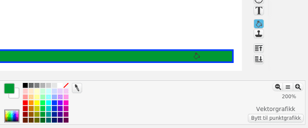
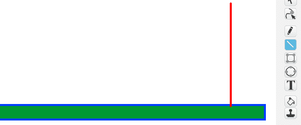

# Introduksjon {.intro}

Donkey Kong var det fyrste verkelege plattform-spelet då det kom ut i 1981. I
tillegg til Donkey Kong var dette fyrste gongen me vart kjent med Jumpman, som
for dei fleste er betre kjent som Super-Mario. I spelet styrer me Super-Mario
medan han prøvar å redde kjærasten din frå Donkey Kong, og må passe seg for
tønner og ildkuler når han hoppar mellom plattformer.


# Oversikt over prosjektet {.activity}

*Du skal gjere det meste av kodinga sjølv. Undervegs lærer du korleis du
lagar eit enkelt plattform-spel i Scratch.*

## Plan {.check}

- [ ] Korleis kan me styre ein plattform-helt som kan hoppe?

- [ ] Plattformer og stigar

- [ ] Donkey Kong og rullande ildkuler

- [ ] ... og andre utfordringar

# Steg 1: Ein hoppande helt {.activity}

*Den viktigaste delen av eit godt plattform-spel er å ha ein helt som kan
bli styrt og som kan hoppe frå plattform til plattform.*

I denne delen skal me konsentrere oss om korleis me kan styre heltefiguren,
og særskilt korleis me får den til å hoppe og falle på ein truverdig måte.

## Sjekkliste {.check}

- [ ] Start eit nytt prosjekt.

- [ ] For å kunne teste at heltefiguren oppfører seg som me vil treng me
  ei enkel plattform (me skal teikne fleire plattformer seinare). Teikn ein
  ny bakgrunn. Vel å teikne med `Vektorgrafikk`. Teikn ein smal, lang
  boks nedst på skjermen. Fyll den med ei farge som er ulik farga på linja.

  

- [ ] Vel eller lag ein figur du vil bruke som den hoppande helten du skal
  styre. Om du ikkje brukar Scratch-katten må du slette den. Kall figuren
  `Jumpman`. Sannsynlegvis ynskjer me å gjere figuren mindre slik at me får
  plass til fleire plattformer på skjermen. Det kan du gjere med kode som
  køyrer i det du startar spelet, til dømes:

  ```blocks
  når @greenFlag vert trykt på
  set storleik til (40) %
  avgrens rotering til [venstre-høgre v]
  ```

  Me har lagt til ein kloss som passar på at Jumpman berre snur seg mot
  høgre eller venstre.

- [ ] Me treng to variablar me skal bruke til å kontrollere korleis Jumpman
  rører på seg. Lag to variablar `(fartX)`{.b} og `(fartY)`{.b}. Pass på at
  begge berre gjeld _for denne figuren_.

- [ ] I hovudløkka som styrer Jumpman vil me fyrst endre på
  `fart`{.blockdata}-variablane, og så flytte sjølve figuren basert på dei.

  Viss ingenting påverkar figuren vår vil me at `(fartX)`{.b} skal
  gå mot 0 (bremsar farta), medan me vil at `(fartY)`{.b} skal bli eit
  stadig større negativt tal (figuren fell). Men om figuren står på plattforma
  skal `(fartY)`{.b} vere 0 (figuren står i ro). Dette kan me kode slik:

  ```blocks
  når eg får meldinga [Nytt spel v]
  gå til x: (-150) y: (-100)
  gjenta for alltid  // hovudløkka
      set [fartX v] til ((0.8) * (fartX))  // farta bremsast
      endra [fartY v] med (-0.5)  // gravitasjon, figuren fell
      viss <rører fargen [#0000ff]>  // figuren står på plattforma
          set [fartY v] til [0]
      slutt
      endra x med (fartX)  // flytt sjølve figuren
      endra y med (fartY)
  slutt
  ```

- [ ] Om du prøver spelet ditt så langt (hugs å leggje til eit skript på
  bakgrunnen som sender ei `Nytt spel`-melding når du klikkar på det grøne
  flagget), vil du sjå at figuren din fell ned til plattforma. Men du kan
  ikkje kontrollere den.

- [ ] For å styre Jumpman legger me fleire `viss`{.blockcontrol}-testar
  inn i hovudløkka. Til dømes kan du få figuren til å gå mot venstre ved å
  leggje til dette rett før `endra x med (fartX)`{.b}:

  ```blocks
  viss <tasten [pil venstre v] er trykt?>
      peik i retning (-90 v)
      set [fartX v] til [-5]
      neste drakt
  slutt
  ```

  Lag ei tilsvarande blokk for å flytte figuren mot høgre.

- [ ] Me vil at Jumpman hoppar når me trykkar `pil opp`-tasten. Me må vere
  litt forsiktige, sidan me berre vil at figuren skal hoppe viss den står på
  ei plattform (ikkje når den allereie er i lufta). Ein enkel måte å få til
  dette er å leggje `pil opp`-testen inne i testen for om figuren står på
  plattforma:

  ```blocks
  viss <rører fargen [#0000ff]>  // gamal kode: figuren står på plattforma
      set [fartY v] til [0]
      viss <tasten [pil opp v] er trykt?>  // ny kode: figuren hoppar
          set [fartY v] til [5]
      slutt
  slutt
  ```

No har me eit godt utgangspunkt for eit plattformspel. Me har ein figur som
me kan styre rundt og som kan hoppe når me vil det. Leik litt med Jumpman
og tala me har brukt i `set [fartX v] til []`{.b}- og
`set [fartY v] til []`{.b}-klossane slik at du får ei rørsle du synest
verkar naturleg.

- [ ] Har du oppdaga at av og til fell Jumpman _gjennom_ plattforma? Viss ikkje
  kan du prøve å sleppe han frå toppen av skjermen. Denne testen fiksar det:

  ```blocks
  viss <rører fargen [#009900]>
      endra y med (2)
  slutt
  ```

  Det var også grunnen til at du skulle fulle plattforma med ei anna farge
  enn linjefarga.

# Steg 2: Plattformer og stigar {.activity}

*No har me ein figur som kan springe og hoppe rundt på skjermen. La oss
 lage fleire plattformer den kan leike seg på.*

Når me teiknar fleire plattformar må me passe på å bruke `Vektorgrafikk`
fordi det gjer det lett å flytte plattformane rundt etterpå.

## Sjekkliste {.activity}

- [ ] Før me teiknar fleire plattformer skal me lage stiger, slik at helten
  vår kan klatre opp eller ned. Som for plattformar skal me bruke farga til å
  kjenner att stigen. Start med å teikne ein enkel strek rett opp frå plattforma
  (me skal lage ein finare stige seinare) i ei ny farge.

  

  Bruk __linje__-verktøyet og hald inne `shift`-knappen når du teiknar for
  å få ei heilt rett linje.

- [ ] Korleis skal helten vår klatre i ein stige. Fyrst og fremst vil han
  ikkje falle nedover (på same måte som når han står på ei plattform). I
  tillegg vil me at han skal kunne klatre opp og ned i stigen. Legg til dette
  i testen på Jumpman:

  ```blocks
  viss <rører fargen [#ff0000]?>
      set [fartY v] til [0]
      viss <tasten [pil opp v] er trykt?>
          endra y med (3)
      slutt
  slutt
  ```

  Med denne koden kan me klatre opp stigen. Korleis kjem me oss ned att? Kan
  du leggje til en `viss <tasten [pil ned v] er trykt?>`{.b}-test til slik at me
  kan klatre ned stigen att?

- [ ] Teikn fleire plattformer og stigar. Test undervegs at det er mogleg for
  Jumpman å klatre eller hoppe mellom plattformene, men samstundes at han ikkje
  klarar å hoppe mellom to plattformer som det ikkje er meininga at han skal
  kunne klare.

- [ ] Når du er fornøgd med korleis brettet ser ut kan du teikne stigane litt
  finare. Om du vil kan du også vente med dette til etter at du har
  programmert Donkey Kong i neste steg.

  

# Steg 3: Donkey Kong og rullande ildkuler {.activity}

*På tide med ei utfordring! No skal me programmere Donkey Kong til å kaste
rullande ildkuler mot oss.*

## Sjekkliste {.check}

- [ ] Lag ein `Donkey Kong`-figur, og plasser den på ei passande
  plattform. Denne vil ikkje bevege seg i dette spelet, slik at den
  einaste koden me eigentleg treng er for å kaste ildkuler. Me skal
  lage denne koden snart.

- [ ] Lag ein ny `Ildkule`-figur. Det kan vere ein sirkel du fargar oransje,
  eller du kan teikne noko meir avansert. La figuren `gøymast`{.blocklooks}
  når du klikkar på det grøne flagget.

- [ ] No skal me skrive koden på Donkey Kong. Den blir ganske enkel. Etter
  at `Donkey Kong` mottek `Nytt spel` kan du la han gå inn i ei `gjenta for
  alltid`{.blockcontrol}-løkke der han `lagar klon av
  Ildkule`{.blockcontrol} og så `ventar 3 sekund`{.blockcontrol}.

- [ ] No må me programmere korleis ildkulene skal oppføre seg. Me vil halde
  styr på korleis dei beveger seg ved hjelp av `(fartX)`{.b} og `(fartY)`{.b}
  på same måte som for Jumpman. Lag desse to variablane på ildkulefiguren, og
  pass på at dei berre gjeld _for denne figuren_.

- [ ] Fyrst bestemmer me kva fart kula har når `Donkey Kong` kastar
  den. Dette gjer me ved å setje `fart`{.blockdata}-variablane, til dømes slik:

  ```blocks
  når eg startar som klon
  gå til [Donkey Kong v]
  set [fartX v] til [3]
  set [fartY v] til (tilfeldig tal frå (0) til (5))
  vis
  ```

- [ ] Vidare bestemmer me korleis kulene oppfører seg ved å lage ei hovudløkke
  på omlag same måte som for Jumpman.

  Legg ein `gjenta til <(y-posisjon) < [-170]>`{.b}-kloss nedst i
  `når eg startar som klon`{.b}-skriptet, og fyll den med kode som let
  kula falle, merkar at ildkula ligger på plattforma, og flyttar sjølve figuren.

- [ ] Legg til kode som gjer at ildkulene snur, `set [fartX v] til
  ((-1) * (fartX))`{.b}, når dei `rører kant`{.blocksensing}, og kode
  som sender ei melding, `fanga Jumpman`, når dei `rører
  Jumpman`{.blocksensing}.

- [ ] Lag kode på Jumpman som mottek `fanga Jumpman`, og som kanskje
  `speler ein lyd`{.blocksound}.

- [ ] Til slutt kan du lage ein skatt Jumpman skal redde. Det blir ein ny figur
  som skal stå i ro til den `rører Jumpman` og så sender ei melding
  `fann skatten`. Skriv kode som svarar på denne meldinga på ein passande måte.

# Steg 4: Vidareutvikling av spelet {.activity}

*du er ferdig med å lage ein enkel variant av Donkey Kong. Prøv å gjere spelet
meir morosamt ved å vidareutvikle det. Du bestemmer sjølv korleis du vil jobbe
vidare, men nedanfor er nokre idear som kanskje er til inspirasjon.*

## Idear til vidareutvikling {.check}

- [ ] Du kan gjerne leggje til fleire animasjonar og lydar. Til dømes kan
  Donkey Kong gjere ei kasterørsle når han kastar ildkuler.

- [ ] Lag ei framside og ein meny. Om du lagar ei framside som forklarar
  korleis ein kan spele, så blir det enklare for andre å prøve spelet ditt!

- [ ] Me har laga eitt brett, men du kan enkelt teikne fleire bakgrunnar med
  andre plattformer og hindringar. Prøv å lage fleire brett der ein kjem vidare
  til neste nivå etter å ha funne skatten.

- [ ] For å gi spelarane litt meir motivasjon kan du telle poeng og liv. Då
  treng du to nye variablar, `(poeng)`{.b} og `(liv)`{.b}. For å telle liv kan
  du bruke `fanga Jumpman`-meldinga. Før du teller poeng må du tenke på kva
  du vil at spelarane skal få poeng for.

- [ ] Du kan leggje til ei tidsavgrensing om du vil gjere spelet meir
  utfordrande. Til det brukar du ein variabel `(tid)`{.b} som du
  `endrar`{.blockdata} og så `ventar 1 sekund`{.blockcontrol}.
