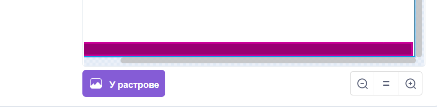

# Вступ {.intro}

Donkey Kong була першою по-справжньому платформенною грою, коли вийшла у 1981 році. Окрім Donkey Kong, саме в ній ми вперше познайомилися з Супер Маріо (тоді він називався Jumpman). У грі ми керуємо Супер Маріо, який намагається врятувати свою дівчину від Donkey Kong, і повинен остерігатися бочок і вогняних куль, стрибаючи між платформами.


# Огляд проєкту {.activity}

*Більшу частину коду для Donkey Kong ви будете писати самостійно. Попутно ви навчитеся створювати просту платформну гру на Scratch.*

## План {.check}

- [ ] Як керувати героєм-платформою, який вміє стрибати?

- [ ] Платформи та сходи

- [ ] Donkey Kong та кочення вогняних куль

- [ ] ... та інші виклики


# Крок 1: Герой-стрибун {.activity}

*Найважливішою частиною хорошої платформної гри є наявність героя, яким ви можете керувати та стрибати з платформи на платформу.*

У цьому розділі ми зосередимося на тому, як керувати персонажем-героєм, зокрема, як змусити його стрибати і падати у правдоподібний спосіб.

## Контрольний список {.check}

- [ ] Розпочати новий проєкт.

- [ ] Щоб перевірити, що герой поводиться так, як ми хочемо, нам знадобиться проста платформа (пізніше ми намалюємо більше платформ). Намалюйте нове тло. Виберіть для малювання `векторну графіку`. Намалюйте вузьку довгу рамку внизу екрана. Заповніть його кольором, відмінним від кольору лінії.

  

- [ ] Виберіть або створіть персонажа, якого ви хочете використовувати як стрибучого героя, яким ви керуватимете. Якщо ви не використовуєте кота Scratch, видаліть його. Назвіть персонажа `Стрибун`. Ми, ймовірно, зменшимо фігуру, щоб на екрані можна було розмістити більше платформ. Ви можете зробити це за допомогою коду, який запускається лише під час запуску гри, наприклад:

  ```blocks
  коли grønt flagg натиснуто
  задати розмір (40)
  стиль обериання [зліва-направо v]
  ```

  Ми також додали блок, щоб переконатися, що `Стрибун` повертає тільки вправо або вліво.

- [ ] Нам потрібні дві змінні, які ми використовуватимемо для керування рухом
  `Стрибуна`. Створіть дві змінні, `(швидкістьX)`{.b} і `(швидкістьY)`{.b}. Переконайтеся, що обидва стосуються _тільки цього спрайту_.

- [ ] У головному циклі, який керує `Стрибуном`, ми спочатку трохи модифікуємо ці змінні
  `швидкості`{.blockdata}, а потім на їх основі переміщуємо саму фігуру.

  Якщо ніщо не впливає на нашу фігуру, ми цього хочемо `(швидкістьX)`{.b} має прямувати до 0 (швидкість сповільнюється), тоді як `(швидкістьY)`{.b} має ставати дедалі більш негативним числом (цифра зменшується). Але якщо фігура стоїть на платформі,  `(швидкістьY)`{.b} має бути 0 (фігура перебуває у стані спокою). Ми можемо закодувати це приблизно так:

  ```blocks
  коли я отримую [нова гра v]
  перемістити в x: (-150) y: (-100)
  завжди  // головний цикл
      надати [швидкістьX v] значення ((0.8) * (швидкістьX))  // швидкість сповільнюється
      змінити [швидкістьY v] на (-0.5)  // гравітація, фігура падає
      якщо <торкається кольору [#cc0099]> то // фігура стоїть на платформі
          надати [швидкістьY v] значення [0]
      slutt
      змінити x на (швидкістьX)  // перемістити саму фігуру
      змінити y на (швидкістьY)
  slutt
  ```

- [ ] Якщо ви спробуєте свою гру (не забудьте додати скрипт до фону, який надсилає повідомлення `нова гра` при натисканні на зелений прапорець), ви побачите, що ваш персонаж падає на платформу. Але ви не можете ним керувати.

- [ ] For å styre `Jumpman` legger vi flere `hvis`{.blockcontrol}-tester inn i
  hovedløkken. For eksempel kan du få figuren til å bevege seg mot venstre ved å
  legge til dette rett før `endre x med (fartX)`{.b}:

  ```blocks
  hvis <tast [pil venstre v] trykket?>
      pek i retning (-90 v)
      sett [fartX v] til [-5]
      neste drakt
  slutt
  ```

  Lag også en tilsvarende blokk for å flytte figuren mot høyre.

- [ ] Vi vil også at `Jumpman` hopper når vi trykker på `pil opp`-tasten. Her må
  vi være litt forsiktig, siden vi bare vil at figuren kan hoppe hvis den står
  på en plattform (ikke når den allerede hopper). En enkel måte å få til dette
  på er å legge `pil opp`-testen inne i testen for om figuren står på
  plattformen:

  ```blocks
  hvis <berører fargen [#0000ff]>  // gammel kode: figuren står på plattformen
      sett [fartY v] til [0]
      hvis <tast [pil opp v] trykket?>  // ny kode: figuren hopper
          sett [fartY v] til [5]
      slutt
  slutt
  ```

Vi har nå et bra utgangspunkt for et plattformspill. Nemlig en figur som vi kan
styre rundt, og som kan hoppe når vi vil det. Lek litt med `Jumpman` og tallene
vi har brukt i `sett [fartX v] til []`{.b}- og `sett [fartY v] til
[]`{.b}-klossene slik at du får en bevegelse du synes virker naturlig.

- [ ] Du har kanskje oppdaget at av og til faller `Jumpman` delvis _gjennom_
  plattformen? Hvis ikke, prøv å slipp ham fra toppen av skjermen. Den følgende
  testen fikser dette ganske greit:

  ```blocks
  hvis <berører fargen [#009900]>
      endre y med (2)
  slutt
  ```

  Dette var også grunnen til at vi fylte plattformen med en annen farge enn
  linjefargen.


# Steg 2: Plattformer og stiger {.activity}

*Nå har vi en figur som kan springe og hoppe rundt på skjermen. La oss lage
 flere plattformer den kan leke seg på.*

Mens vi tegner flere plattformer er det viktig at vi bruker `Vektorgrafikk`
fordi dette gjør det lett å flytte plattformene rundt etter at vi har tegnet
dem.

## Sjekkliste {.activity}

- [ ] Før vi tegner flere plattformer skal vi lage stiger, som vil gjøre det
  enklere for helten vår å klatre opp eller ned. Som for plattformer skal vi
  kjenne igjen stiger ved hjelp av fargen. For å gjøre litt enkel testing, tegn
  først en strek rett opp fra plattformen (vi skal tegne en finere stige senere)
  i en ny farge:

  

  Bruke __linje__-verktøyet og hold inne `shift`-knappen mens du
  tegner for å få en helt rett linje.

- [ ] Hvordan skal helten vår klatre i en stige? Først og fremst vil han ikke
  falle nedover (på samme måte som når han står på en plattform). I tillegg vil
  vi kunne klatre opp og ned i stigen. Legg til denne testen på `Jumpman`:

  ```blocks
  hvis <berører fargen [#ff0000]?>
      sett [fartY v] til [0]
      hvis <tast [pil opp v] trykket?>
          endre y med (3)
      slutt
  slutt
  ```

  Med denne koden kan vi klatre opp stigen. Hvordan kommer vi oss ned igjen? Kan
  du legge til en `hvis <tast [pil ned v] trykket?>`{.b}-test til slik at vi
  også kan klatre ned stigen?

- [ ] Tegn flere plattformer og stiger. Test underveis at det er mulig for
  `Jumpman` å klatre eller hoppe mellom plattformene, men samtidig at han ikke
  klarer å hoppe mellom to plattformer når det ikke er meningen at det skal gå
  an.

- [ ] Når du er fornøyd med hvordan brettet ser ut kan du også tegne stigene
  litt finere. Om du vil kan du også vente med dette til etter at du har
  programmert Donkey Kong i neste steg.

  


# Steg 3: Donkey Kong og rullende ildkuler {.activity}

*På tide med litt utfordringer! Nå skal vi programmere Donkey Kong til å kaste
 rullende ildkuler mot oss.*

## Sjekkliste {.check}

- [ ] Lag en `Donkey Kong`-figur, og plasser den på en passende plattform. Denne
  vil ikke bevege seg i dette spillet, slik at den eneste koden vi egentlig
  trenger er for å kaste ildkuler. Vi skal lage denne koden snart.

- [ ] Lag også en ny `Ildkule`-figur. Dette kan være en sirkel du farger
  oransje, eller du kan prøve å tegne noe mer avansert. La figuren
  `skjules`{.blocklooks} når det grønne flagget klikkes.

- [ ] Nå skal vi skrive koden på Donkey Kong. Den blir ganske enkel. Etter at
  `Donkey Kong` mottar `nytt spill` kan du la han gå inn i en `gjenta for
  alltid`{.blockcontrol}-løkke hvor han `lager klon av Ildkule`{.blockcontrol}
  og deretter `venter 3 sekunder`{.blockcontrol}.

- [ ] Men nå må vi programmere hvordan ildkulene skal oppføre seg. Vi vil holde
  styr på hvordan de beveger seg ved hjelp av `(fartX)`{.b} og `(fartY)`{.b} på
  samme måte som for `Jumpman`. Lag derfor disse to variablene også på
  `Ildkule`. Husk at de skal gjelde kun _for denne figuren_.

- [ ] Først bestemmer vi hvilken fart kula har når `Donkey Kong` kaster den.
  Dette gjør vi ved å sette `fart`{.blockdata}-variablene, for eksempel på denne
  måten:

  ```blocks
  når jeg starter som klon
  gå til [Donkey Kong v]
  sett [fartX v] til [3]
  sett [fartY v] til (tilfeldig tall fra (0) til (5))
  vis
  ```

- [ ] Videre bestemmer vi hvordan kulene oppfører seg ved å lage en hovedløkke
  på omtrent samme måte som for `Jumpman`.

  Legg en `gjenta til <(y-posisjon) < [-170]>`{.b}-kloss nederst i `når jeg
  starter som klon`{.b}-skriptet, og fyll denne med kode som lar kulen falle,
  merker at ildkulen ligger på plattformen, og flytter selve figuren.

- [ ] Legg også til kode som gjør at ildkulene snur, `sett [fartX v] til ((-1) *
  (fartX))`{.b}, når de `berører kant`{.blocksensing}, og kode som sender en
  melding, `fanget Jumpman`, når de `berører Jumpman`{.blocksensing}.

- [ ] Lag kode på `Jumpman` som mottar `fanget Jumpman`, og som kanskje `spiller
  en lyd`{.blocksound}.

- [ ] Til slutt, lag en skatt som Jumpman skal redde. Dette blir en ny figur som
  kan stå i ro til den `berører Jumpman` og deretter sende en melding `fant
  skatten`. Skriv kode som svarer på denne meldingen på passende måte.


# Steg 4: Videreutvikling av spillet {.activity}

*Du har nå laget en enkel variant av Donkey Kong. Men prøv å gjøre spillet
 morsommere ved å videreutvikle det. Du bestemmer selv hvordan du vil jobbe
 videre, men nedenfor er noen ideer som kanskje kan være til inspirasjon?*

## Ideer til videreutvikling {.check}

- [ ] Legg gjerne til flere animasjoner og lyder. For eksempel kan Donkey Kong
  gjøre en kastebevegelse når han kaster ildkuler.

- [ ] Lag en forside og meny. Om du lager en forside som forteller litt om
  hvordan man spiller spillet ditt blir det enklere for andre å spille det også!

- [ ] Vi har laget ett brett, men du kan enkelt tegne flere bakgrunner med andre
  plattformer og hindringer. Prøv å lag flere brett hvor man kommer videre til
  neste nivå etter at man har funnet skatten.

- [ ] For å gi spillerene litt mer motivasjon kan det være lurt å telle poeng og
  liv. Til dette trenger du to nye variabler, `(poeng)`{.b} og `(liv)`{.b}. For
  å telle liv kan du bruke `fanget Jumpman`-meldingen. Før du teller poeng må du
  tenke på hva du vil at spillerene skal få poeng for?

- [ ] Du kan legge til en tidsbegrensning om du vil gjøre spillet mer
  utfordrende. Til dette bruker du en variabel `(tid)`{.b} som du
  `endrer`{.blockdata} og deretter `venter 1 sekund`{.blockcontrol}.

