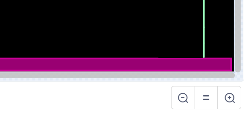

# Вступ {.intro}

Donkey Kong була першою по-справжньому платформенною грою, коли вийшла у 1981 році. Окрім Donkey Kong, саме в ній ми вперше познайомилися з Супер Маріо (тоді він називався Jumpman). У грі ми керуємо Супер Маріо, який намагається врятувати свою дівчину від Donkey Kong, і повинен остерігатися бочок і вогняних куль, стрибаючи між платформами.


# Огляд проєкту {.activity}

*Більшу частину коду для Donkey Kong ви будете писати самостійно. Попутно ви навчитеся створювати просту платформну гру на Scratch.*

## План {.check}

- [ ] Як керувати героєм-платформою, який вміє стрибати?

- [ ] Платформи та сходи

- [ ] Donkey Kong та кочення вогняних куль

- [ ] ... та інші виклики


# Крок 1: Герой-стрибун {.activity}

*Найважливішою частиною хорошої платформної гри є наявність героя, яким ви можете керувати та стрибати з платформи на платформу.*

У цьому розділі ми зосередимося на тому, як керувати персонажем-героєм, зокрема, як змусити його стрибати і падати у правдоподібний спосіб.

## Контрольний список {.check}

- [ ] Розпочати новий проєкт.

- [ ] Щоб перевірити, що герой поводиться так, як ми хочемо, нам знадобиться проста платформа (пізніше ми намалюємо більше платформ). Намалюйте нове тло. Виберіть для малювання `векторну графіку`. Намалюйте вузьку довгу рамку внизу екрана. Заповніть його кольором, відмінним від кольору лінії.

  

- [ ] Виберіть або створіть персонажа, якого ви хочете використовувати як стрибучого героя, яким ви керуватимете. Якщо ви не використовуєте кота Scratch, видаліть його. Назвіть персонажа `Стрибун`. Ми, ймовірно, зменшимо фігуру, щоб на екрані можна було розмістити більше платформ. Ви можете зробити це за допомогою коду, який запускається лише під час запуску гри, наприклад:

  ```blocks
  коли grønt flagg натиснуто
  задати розмір (40)
  стиль обериання [зліва-направо v]
  ```

  Ми також додали блок, щоб переконатися, що `Стрибун` повертає тільки вправо або вліво.

- [ ] Нам потрібні дві змінні, які ми використовуватимемо для керування рухом
  `Стрибуна`. Створіть дві змінні, `(швидкістьX)`{.b} і `(швидкістьY)`{.b}. Переконайтеся, що обидва стосуються _тільки цього спрайту_.

- [ ] У головному циклі, який керує `Стрибуном`, ми спочатку трохи модифікуємо ці змінні
  `швидкості`{.blockdata}, а потім на їх основі переміщуємо саму фігуру.

  Якщо ніщо не впливає на нашу фігуру, ми цього хочемо `(швидкістьX)`{.b} має прямувати до 0 (швидкість сповільнюється), тоді як `(швидкістьY)`{.b} має ставати дедалі більш негативним числом (цифра зменшується). Але якщо фігура стоїть на платформі,  `(швидкістьY)`{.b} має бути 0 (фігура перебуває у стані спокою). Ми можемо закодувати це приблизно так:

  ```blocks
  коли я отримую [нова гра v]
  перемістити в x: (-150) y: (-100)
  завжди  // головний цикл
      надати [швидкістьX v] значення ((0.8) * (швидкістьX))  // швидкість сповільнюється
      змінити [швидкістьY v] на (-0.5)  // гравітація, фігура падає
      якщо <торкається кольору [#cc0099]> то // фігура стоїть на платформі
          надати [швидкістьY v] значення [0]
      slutt
      змінити x на (швидкістьX)  // перемістити саму фігуру
      змінити y на (швидкістьY)
  slutt
  ```

- [ ] Якщо ви спробуєте свою гру (не забудьте додати скрипт до фону, який надсилає повідомлення `нова гра` при натисканні на зелений прапорець), ви побачите, що ваш персонаж падає на платформу. Але ви не можете ним керувати.

- [ ] Щоб керувати `Стрибуном`, ми додаємо кілька тестів `якщо`{.blockcontrol} до основного циклу. Наприклад, ви можете змусити персонажа рухатися ліворуч, додавши це безпосередньо перед
 `змінити x на (швидкістьX)`{.b}:

  ```blocks
  якщо <клавішу [стрілка вгору v] натиснуто?> то
      повернути в напрямку (-90 v)
      надати [швидкістьX v] значення [-5]
      наступний образ
  slutt
  ```

  Також створіть відповідний блок, щоб перемістити фігуру вправо.

- [ ] Ми також хочемо, щоб `Стрибун` стрибав, коли ми натискаємо клавішу зі `стрілка вгору`. Тут потрібно бути трохи обережними, оскільки ми хочемо, щоб персонаж стрибав лише тоді, коли він стоїть на платформі (а не тоді, коли він вже стрибає). Простий спосіб досягти цього - додати тест зі  `стрілкою вгору` всередину тесту, який перевіряє, чи стоїть персонаж на платформі:

  ```blocks
  якщо <торкається кольору [#cc0099]> то // старий код: персонаж стоїть на платформі
      надати [швидкістьY v] значення [0]
      якщо <клавішу [стрілка вгору v] натиснуто?> то  // новий код: персонаж стрибає
          надати [швидкістьY v] значення [5]
      slutt
  slutt
  ```

Тепер у нас є хороша відправна точка для платформної гри. А саме, персонаж, яким ми можемо керувати і який може стрибати, коли захочемо. Пограйте з `Стрибуном` і числами, які ми використовували в блоках `надати [швидкістьX v] значення []`{.b}- і `надати [швидкістьY v] значення[]`{.b} так, щоб ви отримали рух, який буде природним для вас.

- [ ] Можливо, ви помітили, що іноді `Стрибун` частково падає _через_
  платформу? Якщо ні, спробуйте кинути його з верхньої частини екрана. Наступний тест виправляє це досить плавно:

  ```blocks
  якщо <торкається кольору [#990072]> то
      змінити y на (2)
  slutt
  ```

  Це також стало причиною того, що ми зафарбували платформу кольором, відмінним від кольору лінії.

# Крок 2: Платформи та драбини {.activity}

*Тепер у нас є персонаж, який може бігати і стрибати по екрану. Давайте створимо більше платформ, на яких він зможе грати.*

Під час малювання декількох платформ важливо використовувати `векторну графіку`
оскільки це дозволяє легко переміщати платформи після того, як ми їх намалювали.

## Контрольний список {.activity}

- [ ] Перш ніж намалювати більше платформ, ми створимо драбини, які полегшать нашому герою підйом і спуск. Як і у випадку з платформами, ми розпізнаватимемо драбини за кольором. Щоб провести простий тест, спочатку намалюйте лінію, що йде прямо вгору від платформи (драбину ми намалюємо пізніше) новим кольором:

  

  Використовуйте інструмент __лінія__ і утримуйте клавішу `shift` під час малювання, щоб отримати ідеально пряму лінію.  

- [ ] Як наш герой підніматиметься по драбині? Перш за все, він не впаде вниз (так само, як коли стоїть на платформі). Крім того, ми зможемо підніматися і спускатися по драбині. Додайте цей тест до `Стрибуна`:

  ```blocks
  якщо <торкається кольору [#99ffcc]?> то
      надати [швидкістьY v] значення [0]
      якщо <клавішу [стрілка вгору v] натиснуто?>
          змінити y на (3)
      slutt
  slutt
  ```

  За допомогою цього коду ми можемо піднятися по сходах. А як спуститися назад? Чи можете ви додати 
 `якщо <клавішу [стрілка вниз v] натиснуто?> то`{.b} тест, щоб ми також могли спуститися вниз по сходах?

- [ ] Намалюйте кілька платформ і сходів. Перевірте, чи може
  `Стрибун` стрибати або перестрибувати між платформами, а також чи не може він перестрибувати між двома платформами, коли йому це не потрібно.

- [ ] Після того, як ви задоволені тим, як виглядає дошка, ви можете промальовувати сходи трохи тонше. Якщо хочете, можете зачекати, поки не запрограмуєте Donkey Kong на наступному кроці.

  


# Крок 3: Donkey Kong та вогняні кулі {.activity}

*Час для деяких викликів! Тепер ми запрограмуємо Donkey Kong кидати в нас вогняні кулі, що котяться.*

## Контрольний список {.check}

- [ ] Створіть персонажа `Donkey Kong` і розмістіть його на відповідній платформі. У цій грі він не буде рухатися, тому єдиний код, який нам потрібен, - це код для кидання вогняних кульок. Ми створимо цей код найближчим часом.

- [ ] Також створіть нову фігуру `Вогняна куля`. Це може бути коло, яке ви можете зафарбувати помаранчевим кольором, або ви можете спробувати намалювати щось більш складне. Нехай фігура буде
  `схована`{.blocklooks} при натисканні на зелений прапорець.

- [ ] Тепер ми напишемо код для Donkey Kong. Це буде досить просто. Після того, як
  `Donkey Kong` отримає `нова гра`, ви можете дозволити йому піти у `завжди`{.blockcontrol} цикл повторення, де він `створе клон з вогняної кулі`{.blockcontrol}, а потім `чекає 3 секунди`{.blockcontrol}.

- [ ] Але тепер нам потрібно запрограмувати, як повинні поводитися вогняні кулі. Ми будемо відстежувати, як вони рухаються, використовуючи
 `(швидкістьX)`{.b} і `(швидкістьY)`{.b} так само, як і для `Стрибуна`. Тому створіть ці дві змінні також на
  `Вогнянії кулі`. Пам'ятайте, що вони повинні стосуватися  _тільки для цього спрайту_.

- [ ] Спочатку визначимо, яку швидкість має м'яч, коли його кидає `Donkey Kong` Ми робимо це, задаючи змінним  `швидкість`{.blockdata}, наприклад, таким чином: 

  ```blocks
  коли я починаю як клон
  перейти до [Donkey Kong v]
  надати [швидкістьX v] значення [3]
  надати [швидкістьY v] значення (випадкове від (0) до (5))
  показати
  ```

- [ ] Далі ми визначаємо поведінку кульок, створюючи основний цикл так само, як і для `Стрибуна`.

  Додайте `повторити до <(значення y) < [-170]>`{.b} у нижній частині `коли я починаю як клон`{.b} і заповніть його кодом, який кидає кульку, розпізнає, що вогняна куля знаходиться на платформі, і переміщує саму фігуру.


- [ ] Також додайте код, який змушує вогняні кулі обертатися, `надати [швидкістьX v] значення ((-1) *
  (швидкістьX))`{.b}, коли вони `торкаються межі`{.blocksensing}, і код, який надсилає повідомлення, коли вони `торкаються Стрибкна`{.blocksensing}.

- [ ] Створіть код на `Стрибун`, який отримує `Стрибуна вражено` і може `відтворювати звук`{.blocksound}.

- [ ] Нарешті, створіть скарб, який повинен врятувати Стрибун. Це буде новий персонаж, який може стояти на місці, поки не `торкається Стрибуна` а потім надішле повідомлення про `знахідку скарбу`. Напишіть код, який відповідним чином реагує на це повідомлення.


# Крок 4: Подальший розвиток гри {.activity}

*Ви створили просту версію Donkey Kong. Але спробуйте зробити гру ще цікавішою, розвиваючи її далі. Вам вирішувати, як ви хочете діяти далі, але нижче наведено кілька ідей, які можуть вас надихнути.*

## Ідеї для подальшого розвитку {.check}

- [ ] Не соромтеся додавати більше анімації та звуків. Наприклад, Donkey Kong може робити кидковий рух, коли кидає вогняні кулі.

- [ ] Створіть головну сторінку та меню. Якщо ви створите домашню сторінку, яка пояснює, як грати у вашу гру, іншим буде легше в неї грати!

- [ ] Ми створили одну дошку, але ви можете легко створити більше фонів з іншими платформами та перешкодами. Спробуйте створити кілька дощок, на яких ви зможете перейти на наступний рівень після того, як знайдете скарб.

- [ ] Щоб дати гравцям трохи більше мотивації, можливо, було б гарною ідеєю рахувати очки та життя. Для цього вам знадобляться дві нові змінні, `(очки)`{.b} і `(життя)`{.b}. Щоб підрахувати життя, ви можете скористатися повідомленням `Стрибуна вражено`. Перш ніж рахувати очки, потрібно подумати, за що ви хочете, щоб гравці отримували очки?

- [ ] Ви можете додати обмеження часу, якщо хочете зробити гру більш складною. Для цього використовуйте змінну `(час)`{.b}, яку ви `змінюєте`{.blockdata}, а потім `чекаєте 1 секунду`{.blockcontrol}.

