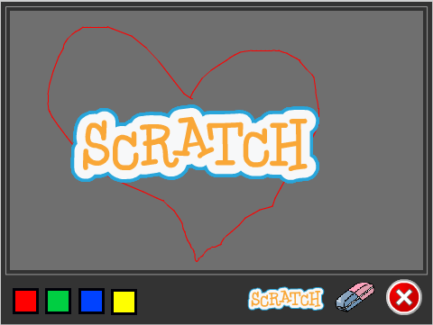
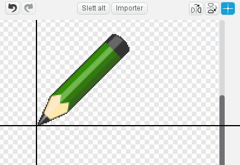

# Introduksjon {.intro}

I dette prosjektet lager vi et tegneprogram slik at du etterpå kan
lage din egen kunst. Du kan tegne med forskjellige farger, bruke
viskelær, lage stempler og mye mer!



# Forberedelser: Last ned bildefiler {.activity}

Denne første delen kan du godt få hjelp fra en voksen til å gjøre!

## Sjekkliste {.check}

+ Last ned zip-filen
  [tegneprogram_bildefiler.zip](tegneprogram_bildefiler.zip) og legg
  den på skrivebordet på datamaskinen din eller en annen plass du
  finner igjen.

+ Pakk ut zip-filen ved å høyreklikke på den og velge `Extract All`,
  `Pakk ut filer` eller noe lignende.

# Steg 1: Dra og tegn! {.activity}

*Vi starter med å lage en blyant som tegner når du drar den rundt på
 scenen.*

## Sjekkliste {.check}

+ Start et nytt Scratch-prosjekt. Slett katten ved å høyreklikke på
  den og velge `slett`.

+ Klikk på `Scene` og deretter på `Bakgrunner`-fanen. Klikk
   for å laste opp
  bakgrunnen som heter `frame.png` i katalogen du hentet under
  forberedelsene.

+ Klikk  ved siden av
  `Ny figur`-teksten. Velg filen `green-pencil.png` som ligger i den
  nedlastede katalogen. Kall den nye figuren `Blyant`.

+ Bytt til `Drakter`-fanen og velg senterpunkt for figuren ved hjelp
  av . Flytt
  korset slik at det markerer blyantspissen. Da vil spissen tegne og
  ikke midten av blyanten.

  

+ Få blyanten til å følge musepekeren rundt på scenen ved å bruke `for
  alltid`{.blockcontrol}- og `gå til
  musepeker`{.blockmotion}-klossene.

  ```blocks
  når grønt flagg klikkes
  for alltid
      gå til [musepeker v]
  slutt
  ```

Nå vil vi bruke denne blyantfiguren som en ordentlig blyant. Om du ser
under `Penn`{.blockpen}-kategorien kan du se mange slags
tegnefunksjoner. De vi er interessert i nå er `penn på`{.blockpen} og
`penn av`{.blockpen}.

+ Vi vil bruke museknappen til å kontrollere blyanten - når
  museknappen er nede tegner blyanten og når museknappen er oppe
  tegner den ikke. Vi kan gjøre dette ved å bruke enn `hvis
  ellers`{.blockcontrol}- og en `museknappen er
  nede?`{.blocksensing}-kloss. Utvid skriptet som følger.

  ```blocks
  når grønt flagg klikkes
  for alltid
      gå til [musepeker v]
      hvis <museknappen er nede?>
          penn på
      ellers
          penn av
      slutt
  slutt
  ```

## Test prosjektet ditt {.flag}

__Klikk på det grønne flagget.__

+ Følger blyanten musa rundt?

+ Hva skjer om du holder museknappen nede og flytter på musa? Ikke bry
  deg om fargen enda.

## Sjekkliste {.check}

+ Etterhvert vil skjermen bli ganske full av rabbel. Vi kan bruke
  `slett`{.blockpen}-klossen til å fjerne dette.

  ```blocks
  når grønt flagg klikkes
  slett
  for alltid
      gå til [musepeker v]
      hvis <museknappen er nede?>
          penn på
      ellers
          penn av
      slutt
  slutt
  ```

## Test prosjektet ditt {.flag}

__Klikk på det grønne flagget.__

+ Forsvinner tegningene dine når du klikker på det grønne flagget?

# Steg 2: Rydde opp {.activity}

*I stedet for å måtte starte og stoppe prosjektet for å slette tavla
 kan vi lage en knapp som sletter alt i stedet.*

Vi kan fortsatt bruke `slett`{.blockpen}-klossen.

## Sjekkliste {.check}

+ Lag en ny figur fra ressurskatalogen du lastet ned i begynnelsen av
  prosjektet. Velg `cancel-button.png`.

+ Bytt navn på figuren til `Slett`.

+ Flytt figuren til nederste høyre hjørne av scenen.

+ Gi slette-figuren dette skriptet:

  ```blocks
  når denne figuren klikkes
  slett
  ```

## Test prosjektet ditt {.flag}

__Klikk på det grønne flagget.__

+ Fjerner sletteknappen alle tegningene dine?

# Steg 3: Bytte farge {.activity}

*Til nå har vi bare kunnet tegne blå streker. Vi kan bruke andre farger
også!*

Vi legger til noen figurer på bunnen av skjermen. Figurene vil se ut
som fargede knapper. Når vi klikker på en knapp endres blyantfargen
til den fargen knappen har. For å vise at vi har byttet farge skal vi
gjøre det slik at blyanten også skifter farge.

## Sjekkliste {.check}

+ Lag en ny figur ved å laste opp `red-selector.gif`.

+ Gi figuren navnet `Rød` og flytt den ned i venstre hjørne av
  skjermen.

+ Gi den et skript som sender meldingen `Rød`.

  ```blocks
  når denne figuren klikkes
  send melding [Rød v]
  ```

  Dette er alt denne figuren gjør. Det vanskelige arbeidet gjøres av
  blyanten.

+ Klikk på blyanten, og deretter på
  `Drakter`{.blocklightgrey}-fanen. Importer drakten
  `red-pencil.png`. Sett midtpunktet til blyantspissen for denne
  drakten også.

+ Legg til et nytt skript. Når blyanten får meldingen `Rød`, skal den
  forandre drakt til `red-pencil`. Og så skal den selvsagt også
  begynne å tegne rødt. Slik bygger du skriptet:

  ```blocks
  når jeg mottar [Rød v]
  bytt drakt til [red-pencil v]
  velg pennfarge [#FF0000]
  ```

  For å velge fargen i `velg pennfarge`{.blockpen}-klossen kan du
  først klikke i fargeruten på klossen, og deretter på den røde
  knappen du lagde på scenen tidligere.

## Test prosjektet ditt {.flag}

__Klikk på det grønne flagget.__

+ Begynn å tegne en strek.

+ Bytt til rødt, og se om fargen forandres.

+ Kommer streken fra blyantspissen nå også?

## Sjekkliste {.check}

+ Gjenta punktene over for å lage blå, gule og grønne knapper og
  blyanter.

## Test prosjektet ditt {.flag}

__Klikk på det grønne flagget.__

+ Fungerer alle knappene?

+ Skifter de til en annen farge på blyanten?

+ Tegner de med riktig farge?

+ Tegner alle figurene fra tuppen av blyanten?

# Steg 4: Bare tegne på tavla {.activity}

*Du har sikkert lagt merke til at man kan tegne over hele scenen, og
 det blir jo litt rotete. Skal vi begrense skriblingen til bare den
 lysegrå tavla må vi sette grenser for hvor blyanten kan gå.*

Du husker kanskje at Scratch definerer punkter på scenen ved hjelp av
`x`- og `y`-koordinater. Når du flytter musepekeren rundt omkring vil
du se disse verdiene nedenfor det høyre hjørnet av scenen.

For å finne ut hvor grensene for tavla går kan vi begynne nede i det
venstre hjørnet. Da står det `x`: *-230* og `y`: *120*. Flytter vi
pekeren rett bort til det høyre hjørnet ser vi at `y` er uforandret,
mens `x` har blitt til *230*. Da vet vi at `x`-koordinatene går fra
*-230* til *230*. `y`-koordinatene finner vi ved å flytte pekeren opp
til toppen av tavla. Da kan vi lese av at `y`-koordinatene går fra
*-120* til *170*.

Disse verdiene kan vi bruke inne i en `hvis`{.blockcontrol}-kloss, og
si at når musepekeren er utenfor tavlas `x`- og `y`-koordinater, så
virker ikke blyanten.

## Sjekkliste {.check}

+ Legg til testene som sier at blyanten bare får følge musepekeren
  hvis `y` er større enn *-120* og mindre enn *170* og `x` er større
  enn *-230* og mindre enn *230*.  For å få plass til alle testene må
  du først legge inn en `_ og _`{.blockoperators}-kloss, og deretter
  legge til to nye `_ og _`{.blockoperators}-klosser inni denne.

  ```blocks
  når grønt flagg klikkes
  slett
  for alltid
      hvis <<<(mus x) > [-230]> og <(mus x) < [230]>> og <<(mus y) > [-120]> og <(mus y) < [170]>>>
          gå til [musepeker v]
          hvis <museknappen er nede?>
              penn på
          ellers
              penn av
          slutt
      slutt
  slutt
  ```

+ Siden vi ikke kan tegne utenfor tavla, er det like greit at blyanten
  bare blir borte når musepekeren går utenfor tavla. For å gjøre dette
  må vi erstatte `hvis`{.blockcontrol}-klossen ovenfor med en `hvis -
  ellers`{.blockcontrol}-kloss. Reglene blir nå: __Hvis__ musepekeren
  er innenfor tavlas `x`- og `y`-koordinater følger blyanten pekeren,
  __ellers__ skjules blyanten.

  ```blocks
  når grønt flagg klikkes
  slett
  for alltid
      hvis <<<(mus x) > [-230]> og <(mus x) < [230]>> og <<(mus y) > [-120]> og <(mus y) < [170]>>>
          gå til [musepeker v]
          vis
          hvis <museknappen er nede?>
              penn på
          ellers
              penn av
          slutt
      ellers
          skjul
          penn av
      slutt
  slutt
  ```

  Fordi blyanten vil skjules når pekeren går utenfor tavla, må vi få
  den til å vises igjen når den kommer innenfor. Pass derfor på at
  du får lagt inn en `vis`{.blocklooks}-kommando innenfor
  `hvis`{.blockcontrol}-klossen.

  Vi har også lagt på en `penn av`{.blockpen}-kloss når blyanten er
  utenfor tavla, for at den ikke skal tegne en strek akkurat i det
  den kommer tilbake inn på tavla.

## Test prosjektet ditt {.flag}

__Klikk på det grønne flagget.__

+ Kan du fremdeles tegne på tavla?

+ Kan du tegne utenfor tavla?

+ Hva skjer med blyanten når musepekeren går ut og inn av tavla?

# Steg 5: Viskelær {.activity}

*Nå kan vi tegne hva vi vil. Men hva om vi trenger et viskelær?*

Hmm… da kan vi jo bare få blyanten til å tegne med samme farge som
tavla!  Og så gir vi blyanten en viskelærdrakt!

## Sjekkliste {.check}

+ Last opp en figur fra fil. Velg filen `eraser.png` fra katalogen du
  lastet ned i starten. Kall figuren `Viskelær`.

+ Gjør figuren litt mindre med krympeknappen,
  , og deretter drar du den ned i
  høyre hjørne, ved siden av slett-knappen.

+ Gi viskelær-figuren et skript som sender meldingen `Visk`.

  ```blocks
  når denne figuren klikkes
  send melding [Visk v]
  ```

+ For å få blyanten til å viske må du legge til viskelæret også som en
  drakt på denne. Klikk blyantfiguren. Gå til `Drakter`-fanen og
  importer `eraser.png` igjen. Husk å sette senterpunktet til
  viskelæret foran.

+ Blyanten svarer på `Visk`-meldingen med å bytte pennfarge til grå
  (bruk fargevelgeren for å velge bakgrunnsfargen til tavla).

  ```blocks
  når jeg mottar [Visk v]
  bytt drakt til [eraser v]
  velg pennfarge [#606060]
  ```

## Test prosjektet ditt {.flag}

__Klikk på det grønne flagget.__

+ Klarer viskelæret å viske?

+ Fungerer det helt ut til kantene av tavla?

+ Går det greit å veksle mellom blyant og viskelær?

# Steg 6: Stempel {.activity}

*Nå skal vi lage et stempel som kan lage små avtrykk på tavla.*

## Sjekkliste {.check}

+ Legg til en ny figur med valgfritt utseende og kall den
  `Stempel`. Vi valgte Scratch-logoen fra `Ting`-mappen i
  biblioteket. Krymp figuren og plasser den nederst på skjermen ved
  siden av de andre verktøyene.  Når figuren klikkes skal den sende
  meldingen `Stempel`.

  ```blocks
  når denne figuren klikkes
  send melding [Stempel v]
  ```

+ Legg til en ny drakt for blyantfiguren. Det skal være samme drakt
  som du nettopp ga stempelet.

+ Velg blyanten og lag en variabel. Kall variabelen
  `stempelmodus`{.blockdata} og la den gjelde `For denne figuren`.
  Fjern avhukingen foran variabelen slik at den ikke vises på scenen.
  Oppgaven til denne variabelen er å holde styr på om vi skal tegne
  eller stemple.

+ Legg til et skript for blyanten som responderer på
  `Stempel`-meldingen.  Skriptet skal skifte drakt til den samme
  drakten du valgte for stempelet.  Deretter skal det sette verdien
  til `stempelmodus`{.blockdata} lik `på`.

  ```blocks
  når jeg mottar [Stempel v]
  bytt drakt til [scratch logo v]
  sett [stempelmodus v] til [på]
  ```

+ Forandre de andre skriptene som er knyttet til fargevelgerne og
  viskelæret slik at de setter `stempelmodus`{.blockdata} lik
  `av`. For eksempel blir viskelærskriptet slik:

  ```blocks
  når jeg mottar [Visk v]
  bytt drakt til [eraser v]
  velg pennfarge [#606060]
  sett [stempelmodus v] til [av]
  ```

+ Til slutt må vi sjekke variabelen inne i
  `hvis`{.blockcontrol}`museknappen er nede?`{.blocksensing} for å se
  om vi skal tegne eller stemple. Hvis `stempelmodus`{.blockdata} er
  satt til `på` skal vi stemple, hvis ikke skal vi bruke den
  eksisterende `penn på`{.blockpen}-klossen.

  ```blocks
  når grønt flagg klikkes
  slett
  for alltid
      hvis <<<(mus x) > [-230]> og <(mus x) < [230]>> og <<(mus y) > [-120]> og <(mus y) < [170]>>>
          gå til [musepeker v]
          vis
          hvis <museknappen er nede?>
              hvis <(stempelmodus) = [på]>
                  stemple avtrykk
              ellers
                  penn på
              slutt
          ellers
              penn av
          slutt
      ellers
          skjul
          penn av
      slutt
  slutt
  ```

## Test prosjektet ditt {.flag}

__Klikk på det grønne flagget.__

+ Klarer du å stemple avtrykk?

+ Hva skjer når du skifter tilbake til en av blyantene?

## Lagre prosjektet {.save}

__Veldig bra jobba! Du er nå ferdig med programmet.__

Du kan også prøve disse utfordringene!

## Utfordring 1: Regnbueblyant {.challenge}

I denne utfordringen skal du legge til en blyant som kan forandrer
farge mens du tegner. Kult, ikke sant?

Først må du legge til regnbue-knappen og regnbue-drakten:

+ Legg til regnbue-knappen som figur. Du finner den i katalogen du
  lastet ned i starten. Den heter `rainbow-selector.gif`. Kall den
  `Regnbue` og sett den ved siden av de andre knappene nederst til
  venstre.  Figuren skal sende meldingen `Regnbue` når den klikkes.

+ Legg til regnbue-blyanten fra filen `rainbow-pencil.png` som en ny
  drakt til blyanten.  Husk å justere senterpunktet.

+ Nå må du lage et skript som får pennfargen til å skifte mange ganger
  i sekundet. Vi fant ut at å endre fargen med 5 hvert 0.05 sekunder
  fungerer fint, men du bør prøve ut egne verdier også.

__Hint:__ Du har sikkert fått ting til å forandre seg med jevne
mellomrom i tidligere prosjekter, for eksempel tid eller poeng. I
dette tilfellet kan du gjøre nesten det samme, men passe på at det er
pennfarge som endrer seg.

Klossen som endrer pennfargen må legges inn i en løkke. Men du trenger
også noe å kontrollere løkken med, slik at den bare endrer farge når
regnbueblyanten er valgt.

__Hint:__ Du kan gjøre dette på en måte som ligner på hvordan
`stempelmodus`{.blockdata} styrer når stempelet skal skrues av og
på. Prøv å lage en variabel som du kaller `regnbuemodus`{.blockdata}.
La denne skrues på når regnbueblyanten klikkes, og av når de andre
fargene velges.

## Test prosjektet ditt {.flag}

__Klikk på det grønne flagget.__

+ Virker regnbueblyanten?

+ Hva skjer når du skifter tilbake til en av de andre blyantene?

## Utfordring 2: Snarveier {.challenge}

Nå skal du prøve deg på å lage snarveier på tastaturet. Det betyr at
man i stedet for å klikke på knappene på skjermen kan bruke tastene
for å bytte farge, stemple og viske ut.

Du kan bruke `hvis`{.blockcontrol}`tast _ trykket?`{.blocksensing} for
å benytte tastaturet.  For hver tast du legger til trenger du en ny
`hvis`{.blockcontrol}`tast _ trykket?`{.blocksensing}-kloss som sender
de samme meldingene som verktøy-valgene gjør når de klikkes.  Legg til
skriptene på scenen.

Vi har brukt disse snarveiene:

Rød blyant - `r`, Grønn blyant - `g`, Blå blyant - `b`, Gul blyant -
`y`, Regnbue blyant - `w`, Stempel - `s`, Visk - `v`, Slett alt - `a`

## Test prosjektet ditt {.flag}

__Klikk på det grønne flagget.__

+ Virker alle snarveiene?

+ Virker knappene på skjermen fremdeles også?

## Utfordring 3: Større og mindre {.challenge}

En annen funksjon som tegneprogrammer gjerne har er å forandre
størrelsen på blyantstreken. Prøv å se om du får til dette.

Det er en ting som gjør dette vanskelig. Noen ganger trenger vi å
endre størrelsen på blyantstreken og noen ganger trenger vi å forandre
størrelsen på drakten.  Det er avhengig av om du bruker blyanten eller
stemplet.

+ Lag to nye figurer ved å importere `bigger-selector.gif` og
  `smaller-selctor.gif` fra katalogen med ressurser.  Kall figurene
  `Større` og `Mindre`.

+ La figurene sende ut meldingene `Større` og `Mindre`.

+ Blyanten kan svare på meldingen ved å enten `endre
  pennebredde`{.blockpen} med 1 eller `endre størrelse`{.blocklooks}
  med 10, avhengig av verdien på `stempelmodus`.

  __Hint:__ Du kan bruke noen av `endre`-klossene under
  `Penn`{.blockpen} eller `Utseende`{.blocklooks}. For å forminske
  setter du bare et minustegn foran tallet.

  __Hint:__ For å holde styr på om det er blyantstreken eller
  stempelet som skal endres må du bruke en `hvis -
  ellers`{.blockcontrol}-kloss.

+ Glem ikke å lage snarveier for disse funksjonene også. For eksempel
  `pil opp` for større og `pil ned` for mindre.

+ Har du lagt merke til at også blyantfiguren blir større når du
  forstørrer stempelet?  For å unngå dette kan vi sette størrelsen til
  100% hver gang en ny farge klikkes.

+ For å gjøre det enda mer avansert kan du få stempelet til å huske
  størrelsen sin fra gang til gang. Den enkleste måten å gjøre dette
  på er å opprette en ny variabel som du kaller
  `stempelstørrelse`{.blockdata}. Denne må oppdateres hver gang
  størrelsen på stempelet endres. Når man skifter fra blyant til
  stempel settes så størrelsen fra denne variabelen.

## Test prosjektet ditt {.flag}

__Klikk på det grønne flagget.__

+ Fungerer forstørrelsesknappen?

+ Fungerer forminskingsknappen?

+ Hva skjer om du bytter til stempelet, endrer størrelsen og så
  forandrer tilbake til blyanten?

## Lagre prosjektet {.save}

__Veldig, veldig bra! Nå kan du tegne akkurat det du vil!__

Ikke glem å del spillet ditt med venner og familie ved å trykke på
`Legg ut` i menyen!
