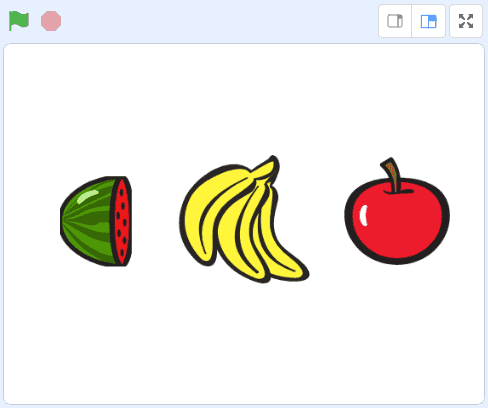

# Om oppgaven {.activity}

Dette er et enkelt spill der tre figurer bytter drakter. Spilleren må stoppe dem
når de alle viser det samme bildet (tilsvarende en enarmet banditt-maskin).

## Oppgaven passer til: {.check}

 __Fag__: Programmering, matematikk

__Anbefalte trinn__: 3.-10. trinn

__Tema__: Løkker, spill.

__Tidsbruk__: Dobbelttime eller mer.

## Kompetansemål {.challenge}

- [ ]  __Matematikk, 5. trinn__: diskutere tilfeldighet og sannsynlighet i spill
       og praktiske situasjoner og knytte det til brøk

- [ ] __Matematikk, 7. trinn__: representere og bruke brøk, desimaltall og
      prosent på ulike måter og utforske de matematiske sammenhengene mellom
      disse representasjonsformene

- [ ]  __Programmering, 10. trinn__: bruke grunnleggende prinsipper i
       programmering, slik som variabler, løkker, vilkår og funksjoner, og
       reflektere over bruken av disse

- [ ]  __Programmering, 10. trinn__: planlegge og skape et digitalt produkt og
       vurdere dette med tanke på brukervennlighet

## Forslag til læringsmål {.challenge}

- [ ] Elevene kan bruke løkker til å få noe til å skje, og en variabel til å
      stoppe gjentakelsen på ønsket tidspunkt.

- [ ] Elevene kan gjenskape et kjent produkt fra samfunnslivet ved egen kode.

- [ ] Elevene kan lage et program som tar input fra brukeren på passende måte.

- [ ] Elevene kan lage en funksjon som bytter utseende på en figur etter ønsket
      mønster.

- [ ] Elevene kan samtale om sjansespill og sannsynlighet, og vurdere
      vinnersjansen ut fra ulike forutsetninger i spillet.

## Forslag til vurderingskriterier {.challenge}

- [ ] Eleven viser middels måloppnåelse ved å fullføre oppgaven.

- [ ] Eleven viser høy måloppnåelse ved å videreutvikle egen kode basert på
      oppgaven, for eksempel ved å gjøre en eller flere av variasjonene
      nedenfor.

## Forutsetninger og utstyr {.challenge}

- [ ]  __Forutsetninger__: Elevene bør være komfortable med Scratch.

- [ ] __Utstyr__: Datamaskiner med Scratch installert. Eventuelt kan elevene
      bruke Scratch i nettleseren dersom de har en bruker (eller registrerer
      seg) på [scratch.mit.edu/](http://scratch.mit.edu/){target=_blank}.
      Elevene kan gjerne jobbe to og to sammen.

## Fremgangsmåte

[Klikk her for å se
oppgaveteksten.](../enarmet_banditt/enarmet_banditt.html){target=_blank}

_Vi har dessverre ikke noen tips, erfaringer eller utfordringer tilknyttet denne
oppgaven enda._

## Variasjoner {.challenge}

- [ ]  Elevene kan lage en teller som viser poengsummen til spilleren. Denne kan
       gi plusspoeng for hver gang spilleren får tre like drakter, og minuspoeng
       for tap eller som innsats.

- [ ]  Elevene kan legge inn lydklipp som passer til en slik spillemaskin.

## Eksterne ressurser {.challenge}

- [ ] Foreløpig ingen eksterne ressurser ...
