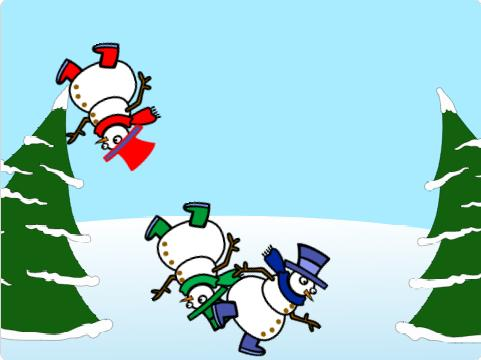

# Introduksjon {.intro}

I denne oppgaven skal du forsøke å reparere og forbedre koden som allerede er laget i et program i Scratch. Målet er å få de tre snømennene til å flytte seg fritt rundt på skjermen uten å havne "på hodet", at en snømann smelter når du klikker på den, og til slutt legge til en tidsfrist på 10 sekunder for å smelte alle snømennene.



## Forsøk å løse denne oppgaven uten å lese oppgaveteksten! {.challenge}
Når du har fullført instruksjonene i steg 1, har du egentlig fått alt du trenger for å løse oppgaven.
Dersom du er en erfaren koder, kan du jo prøve å løse oppgaven uten å lese videre! Finn frem en notatblokk og en blyant, og notér, tegn og skriv pseudokode for deg selv eller sammen med en medelev. Målene for det du skal få til, finner du på prosjektsiden. Trykk "Se prosjektsiden" øverst på skjermen.
#

## {.tip}
Det kan være tungvint å lage lignende algoritmer til hver enkelt figur i Scratch. Derfor er det smart å gjøre koden mer eller mindre ferdig i én figur først, og så kopiere koden over til de andre figurene. Bare dra den algoritmen du vil kopiere bort til figuroversikten under scena, og slipp den over den figuren du vil kopiere til. Da trenger du bare å gjøre noen små justeringer på koden, i stedet for å skrive den på nytt for hver figur.
#


# Steg 1: Remiks {.activity}

Før vi begynner, må du trykke på lenken under og lage en remiks av prosjektet. Husk å lese hele sjekklista først, sånn at du vet hva du skal gjøre.

## Sjekkliste {.check}

- [ ] [Åpne prosjektet](https://scratch.mit.edu/projects/448963560/){target=_blank}

- [ ] Trykk "Remiks". Dersom du ikke har Scratch-bruker eller ikke er logget inn, holder det å trykke "Se inni" og begynne å redigere koden. Merk at du da må trykke "Fil - Lagre på datamaskin" om du vil ta vare på prosjektet ditt.

- [ ] Gi prosjektet et nytt navn. Ikke oppgi personlig informasjon i prosjektnavnet!

## Test prosjektet {.flag}

**Klikk på det grønne flagget.** 

- [ ] Hva skjer?

- [ ] Forsøk å trykke på snømennene mens de suser rundt. Smelter de?

- [ ] Forstår du hvorfor dette skjer?

# Steg 2: Fiks koden {.activity}


## Sjekkliste {.check}

- [ ] Du oppdaget kanskje at den grønne snømannen smeltet helt bort. Det gir oss et hint om at den har en nokså godt fungerende algoritme for smeltingen. Se om du finner den riktige algoritmen, og kopier den over til de to andre snømennene. Trykk og dra koden bort til figurene i figurvinduet nederst til høyre. Du må gjøre et par små justeringer i algoritmen, men det finner du ut av selv ved å studere de andre algoritmene og prøve deg frem!

- [ ] La oss forsøke å fikse problemet med at snømennene havner opp ned på scena når du går rundt. Under `Bevegelse`{.blockmotion} finner du denne blokken:

```blocks
begrens rotasjon [vend sideveis v]
```

- [ ] Finn ut hvor du kan sette inn denne blokken for å få snømennene til å slutte å "på på hodet"

- [ ] Rydd opp i koden til snømennene. Er det algoritmer du ikke lenger trenger å ha der? Slett dem!

## Test prosjektet {.flag}

**Klikk på det grønne flagget.**


- [ ] Holder alle snømennene seg på beina når de går rundt på skjermen nå?
- [ ] Forsvinner snømennene når du trykker på dem?

**Dersom koden ikke fungerer som forventet når du er kommet hit, må du gå tilbake og rette opp i feilene før du fortsetter.** 

## Snakk med noen {.protip}
To hoder tenker bedre enn ett. Snakk med de du har rundt deg - hva har de gjort? Lurer dere på de samme tingene? Kan dere snakke sammen og prøve å finne en løsning sammen?
#

# Steg 3: Legg til en nedtelling {.activity}

I den siste utfordringen i oppgaven, skal du lage en kloke som teller ned fra 10 til 0. I løpet av den tiden må du ha trykket på alle tre figurene og fått dem til å smelte, ellers taper du spillet!

## Sjekkliste {.check}

- [ ] Lag en `variabel`{.blockdata} du kaller `tid`{.blockdata}. La den gjelde for alle figurer.
- [ ] Pass på at du har huket av for at tidsvariabelen vises på scena:


- [ ] Trykk deg inn på bakgrunnen for å lage nedtellingsalgoritmen til spillet
- [ ] Opprett en algoritme som ser slik ut:

```blocks
Når grønt flagg klikkes
sett [tid v] til (10)
gjenta (10) ganger
vent (1) sekunder
endre [tid v] med (-1)
end
stopp [alle v]

```

## Test prosjektet {.flag}

**Klikk på det grønne flagget.** 

- [ ] Ser du at tiden går nedover fra 10 til 0?

- [ ] Hva skjer når tidsvariabelen blir 0? Kan du forklare det - enten ved å skrive det ned eller å snakke med noen?

- [ ] Kan du komme på andre/bedre måter å stoppe spillet på?

## Utfordring {.challenge}
Vi har nå fikset koden og lagt til litt ny funksjonalitet. Kan du videreutvikle dette konseptet til å bli et mer avansert spill? 
Forslag til videreutvikling:
- [ ] Lag flere snømenn med ulike størrelser og ulik fart. Et tips er å bruke `lag klon av meg`{.blockcontrol} og `Når jeg starter som klon`{.blockcontrol}, og tildele klonene litt ulike egenskaper, som `tilfeldig`{.blockoperators} `størrelse`{.blocklooks} og `tilfeldig`{.blockoperators} `fart`{.blockmotion}. Sørg for at det `for alltid`{.blockcontrol} skapes nye kloner.
- [ ] Lag et poengsystem (hint: lag en `variabel`{.blockdata}) som gir deg poeng for hver smeltede snømann. Hvor mange poeng klarer du å samle på 10 sekunder?
- [ ] Legg til en velkomstskjerm som vises før spillet starter, og en "Game Over"-skjerm som vises når tiden er ute.
- [ ] Hvem klarer å lage det kuleste spillet? 
#

Husk å lagre spillet/programmet ditt. Når du er ferdig kan du klikke på "Legg
ut"-knappen. Da vil det bli lagt ut på Scratch-hjemmesiden din slik at du enkelt
kan dele det med familien og vennene dine. Pass på at du ikke deler personlig innhold som navn, telefonnummer eller andre