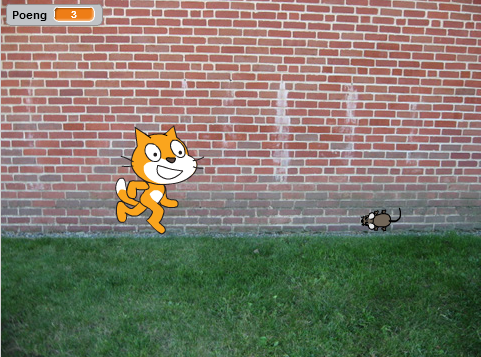
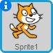
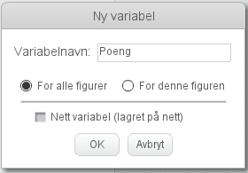

# Introduksjon {.intro}

Vi skal lage et spill hvor katten Felix skal fange musa Herbert. Du
styrer Herbert med musepekeren og skal prøve å unngå å bli tatt av
Felix. Jo lenger du unngår ham jo flere poeng får du, men blir du
tatt, går poengsummen din ned.



# Steg 1: Felix følger musepekeren {.activity}

*Vi ønsker at katten Felix skal følge etter musepekeren.*

## Sjekkliste {.check}

+ Start et nytt prosjekt.

+ Trykk på `i`{.blockmotion} i hjørnet av  og
  bytt navn på figuren til `Felix`.

+ Sørg for at Felix kun ser til høyre og venstre ved å sette
  rotasjonsmåte til
  .

+ Klikk på scenen ved siden av Felix i vinduet for figurer. Velg fanen
  `Bakgrunner` og trykk på
   for å
  importere en ferdig bakgrunn. Velg den bakgrunnen du vil.

+ Klikk på Felix, velg `Skript`-fanen og lag dette
  skriptet:

  ```blocks
  når grønt flagg klikkes
  for alltid
      pek mot [musepeker v]
      gå (10) steg
      neste drakt
      trommeslag (3 v) som varer (0.25) takter
  slutt
  ```

## Test prosjektet {.flag}

__Klikk på det grønne flagget.__

+ Følger Felix musepekeren?

+ Ser det ut som han går når han beveger seg?

+ Beveger han seg med riktig hastighet?

+ Klikk det røde stopp-symbolet for at Felix skal slutte å følge etter
  musepekeren.

## Lagre prosjektet {.save}

Scratch lagrer alle prosjektene dine automatisk med jevne mellomrom.
Det kan likevel være lurt å lagre manuelt innimellom.

+ I filmenyen, velg `Lagre nå`.

# Steg 2: Felix jager Herbert {.activity}

*Nå ønsker vi at Felix skal jage musa Herbert i stedet for musepekeren.*

## Sjekkliste {.check}

+ Lag en ny figur ved å trykke på
  
  og velg figuren `Dyr/Mouse1`.

+ Bytt navn på figuren til `Herbert`.

+ Gjør Herbert mindre enn Felix ved å trykke på
   (øverst mot midten av vinduet). Prøv
  seks klikk.

+ Gi Herbert dette skriptet:

  ```blocks
  når grønt flagg klikkes
  for alltid
      gå til [musepeker v]
      pek mot [Felix v]
  slutt
  ```

## Test prosjektet {.flag}

__Klikk på det grønne flagget.__

+ Flytter Herbert seg med musepekeren?

+ Jager Felix Herbert?

# Steg 3: Felix sier når han har fanget Herbert {.activity}

*Vi vil at Felix skal vite når han har fanget Herbert og fortelle det
 til oss.*

## Sjekkliste {.check}

+ Endre skriptet til Felix til dette:

  ```blocks
  når grønt flagg klikkes
  for alltid
      pek mot [musepeker v]
      gå (10) steg
      neste drakt
      trommeslag (3 v) som varer (0.25) takter
      hvis <berører [Herbert v]?>
          si [Tok deg!] i (1) sekunder
      slutt
  slutt
  ```

## Test prosjektet {.flag}

__Klikk på det grønne flagget.__

+ Sier Felix fra når han har fanget Herbert?

# Steg 4: Herbert blir et spøkelse når han fanges {.activity}

*I tillegg til at Felix sier noe, vil vi nå at Herbert blir forvandlet
 til et spøkelse når han fanges.*

## Sjekkliste {.check}

+ Endre skriptet til Felix slik at det sender en melding og lager en
  lyd når han fanger Herbert:

  ```blocks
  når grønt flagg klikkes
  for alltid
      pek mot [musepeker v]
      gå (10) steg
      neste drakt
      trommeslag (3 v) som varer (0.25) takter
      hvis <berører [Herbert v]?>
          send melding [Fanget! v]
          trommeslag (1 v) som varer (0.25) takter
          si [Tok deg!] i (1) sekunder
          vent (1) sekunder
      slutt
  slutt
  ```

+ Velg Herbert og gå til `Drakter`-fanen.

+ Hent en ny drakt ved å trykke på
  
  og velg `Fantasi/ghost2-a`

+ Gjør drakten mindre ved å velge  og
  trykke seks ganger på spøkelsesdrakten.

+ Endre navnene på Herberts drakter slik at musedrakten heter
  `levende` og spøkelsesdrakten heter `død`.

+ Gå til `Skript`-fanen, og lag et nytt skript for
  Herbert for å gjøre ham om til et spøkelse. Ikke slett det gamle
  skriptet:

  ```blocks
  når jeg mottar [Fanget! v]
  bytt drakt til [død v]
  vent (0.5) sekunder
  bytt drakt til [levende v]
  ```

## Test prosjektet {.flag}

__Klikk på det grønne flagget.__

+ Forvandles Herbert til et spøkelse når han fanges?

+ Spiller Felix de riktige lydene til riktig tid?

+ Står Felix stille lenge nok til at Herbert kommer seg unna?

# Steg 5: Telle poeng {.activity}

*La oss legge til en poengsum slik at vi kan se hvor flink man er til
 å holde Herbert i live. Vi begynner med poengsummen null og øker den
 med en for hvert sekund. Hvis Felix fanger Herbert, minker vi
 poengsummen med ti.*

## Sjekkliste {.check}

+ På `Skript`-fanen under kategorien `Data`{.blockdata}, lag en ny
  variabel. Kall variabelen for `Poeng`, og la den gjelde for alle
  figurer.

  

  Legg merke til at `Poeng `{}` 0 `{.blockdata}` ` dukket opp øverst til
  venstre i spillet ditt.

+ Klikk på `Scene` til venstre på skjermen, ved siden av
  `Figurer`. Lag disse to skriptene på scenen:

  ```blocks
  når grønt flagg klikkes
  sett [Poeng v] til [0]
  for alltid
      vent (1) sekunder
      endre [Poeng v] med (1)
  slutt

  når jeg mottar [Fanget! v]
  endre [Poeng v] med (-10)
  ```

## Test prosjektet {.flag}

__Klikk på det grønne flagget.__

+ Øker poengsummen med en hvert sekund?

+ Går poengsummen ned med ti når Herbert blir fanget?

+ Hva skjer om Herbert fanges før du har ti poeng?

+ Går poengsummen tilbake til null når du starter spillet på nytt?

## Lagre prosjektet {.save}

*Du er ferdig. Godt gjort. Nå kan du spille spillet!*

Du kan dele spillet med familie og venner ved å trykke `Legg ut` på
menylinjen.
