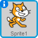

<!-- This is a croatian translation of Felix and Herbert, originally
written by Code Club UK. -->

# Uvod {.intro}

Zajedno ćemo napraviti igru u kojoj mačak Felix ganja miša
Herberta. Ti češ kontrolirati Herberta sa tvojim kompjuter mišem i
pokušati da izbjegneš Felixa. Što duže uspiješ da izbjegneš Felixa to
ćeš više bodova dobiti. Ali pazi, gubiš bodove kad te Felix uhvati.


# Korak 1: Felix ganja kompjuter miša {.activity}

## Spisak {.check}

+ Započni novi projekt.

+ Pritisni na `i`{.blockmotion} u kutu od  i
  nazovi figuru `Felix`.

+ Stavi «stil rotiranja» da bude
  . Felix če se onda
  kretati samo lijevo i desno.

+ Pritisni na pozornicu
   lijevo od
  Felixa. Izaberi pozadinu i zatim pritisni OK.

+ Pritisni na Felixa, odaberi karticu `Skripte` i programiraj program
  ispod:

  ```blocks
      kada je ⚑ kliknut
      ponavljaj
          okreni se k [strelice misa v]
          idi (10) koraka
          sljedeći kostim
          bubnjaj po (3 v) (0.25) puta
      end
    ```

## Probaj program {.flag}

__Pritisni zelenu zastavu.__

+ Prati li Felix tvog kompjuter miša?

+ Izgledali da Felix hoda kada se kreče?

+ Kreče li se Felix u točnoj brzini?

+ Pritisni crveni stop simbol da zaustaviš program.

## Spasi projekt {.save}

Scratch spašava sve tvoje projekte automatski. Ali je ipak mudro da po
nekad spasiš tvoj projekt.

+ Pritisni `Datoteka` i `Spremi`.

# Korak 2: Felix ganja Herberta {.activity}

*Želimo da Felix slijedi Herberta umjesto kompjuter miša.*

## Spisak {.check}

+ Dodaj novu figuru, pritisni
  
  iznad Felixa. Izaberi kategoriju `Životinje` i `Mouse1`
  (miš). Pritisni OK.
  
+ Nazovi novu figuru `Herbert`.

+ Smanji Herberta tako da bude manji od Felixa. Pritisni
   na vrhu stranice 6 puta.

+ Pritisni na Herberta, odaberi karticu `Skripte` i programiraj
  program ispod:

  ```blocks
      kada je ⚑ kliknut
      ponavljaj
          idi do [strelice misa v]
          okreni se k [Felix v]
      end
    ```

## Probaj program {.flag}

__Pritisni zelenu zastavu.__

+ Kreče li se Herbert zajedno sa kompjuter mišem?

+ Ganja li Felix Herberta?

# Korak 3: Felix nam treba javiti da je uhvatio Herberta {.activity}

## Spisak {.check}

+ Promjeni `Skripte` od Felixa tako da bude isti kao program ispod:

  ```blocks
      kada je ⚑ kliknut
      ponavljaj
          okreni se k [strelice misa v]
          idi (10) koraka
          sljedeći kostim
          bubnjaj po (3 v) (0.25) puta
          ako (dodiruje [Herbert v]?) onda
              govori [Uhvatio sam te!] (1) sekundi
          end
      end
    ```

## Probaj program {.flag}

__Pritisni zelenu zastavu.__

+ Javi li nam Felix kada uhvati Herberta?

# Korak 4: Herbert se pretvara u duha kada ga Felix uhvati {.activity}

## Spisak {.check}

+ Promjeni `Skripte` od Felixa tako da program pošalje poruku da je
  Herbert uhvačen:

    ```blocks
      kada je ⚑ kliknut
      ponavljaj
          okreni se k [strelice misa v]
          idi (10) koraka
          sljedeći kostim
          bubnjaj po (3 v) (0.25) puta
          ako (dodiruje [Herbert v]?) onda
              pošalji [Uhvatio v]
              govori [Uhvatio sam te!] (1) sekundi
              čekaj (1) sekundi
          end
      end
    ```

+ Izaberi Herberta i pritisni `Kostimi` pored `Skripte`.

+ Pritisni na  i izaberi
  kategoriju `Mašta` pa onda kostim `ghost2a` (duh).

+ Smanji malo veličinu, pritisni 6 puta na .

+ Promjeni imena Herbertovih kostima. Miš kostim nazovi `Živ` a duh
  kostim `Duh`.

+ Pritisni na `Skripte` i dodaj ovaj program. Zadrži stari program.

  ```blocks
      kada primim [Uhvatio v]
      promijeni kostim u [Duh v]
      čekaj (5) sekundi
      promijeni kostim u [Živ v]
  ```

## Probaj program {.flag}

__Pritisni zelenu zastavu.__

+ Da li se pretvori Herbert u duha kada ga Felix uhvati?

+ Čuješ li zvukove na točnim mjestima?

+ Stoji li Felix dovoljno dugo tako da Herbert uspije da pobjegne?


# Korak 5: Bodovi {.activity}

*Želimo da saberemo bodove da bi vidjeli ko najbolje čuva Herberta od
 Felixa. Počinjemo sa 0 bodova i dodajemo bod svake sekunde. Kada
 Felix uhvati Herberta smjanujemo bodove za 10.*

## Spisak {.check}

+ Pritisni na `Skripte` i pod `Podaci`{.blockdata} pritisni na
  `Napravi varijablu`. Nazovi varijablu `Bodovi` i izaberi da bodovi
  važe za sve likove (figure). Pritisni OK.

  

  Bodovi če se sada pojaviti gore lijevo na tvojoj igrici.

+ Pritisni na `Pozornica` lijevo od Felixa. Izaberi `Skripte` i dodaj
  ova dva programa:

  ```blocks
      kada je ⚑ kliknut
      postavi [Bodovi v] na [0]
      ponavljaj
          čekaj (1) sekundi
          promijeni [Bodovi v] za (1)
      end

      kada primim [Uhvatio v]
      promijeni [Bodovi v] za (-10)
  ```

## Probaj program {.flag}

__Pritisni zelenu zastavu.__

+ Mjenjaju li se bodovi svake sekunde?

+ Smanjuju li se bodovi za 10 kada Felix uhvati Herberta?

+ Što se desi kada Felix uhvati Herberta prije nego što dobiješ 10 bodova?

+ Kada pokreneš igricu na novo, vrate li se bodovi na 0?


## Spasi projekt {.save}

*To je to! Bravo, sada možeš igrati svoju igricu.*

Podjeli igricu sa svojom porodicom i prijateljima. Pritisni na
`Dijeli` gore desno na ektranu.

