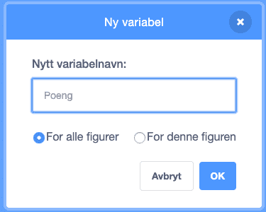

# Kynning {.intro}

Við munum búa til tölvuleik þar sem kötturinn Felix ætlar að elta músina
Herbert. Þú stýrir Herbert með músarbendlinum og átt að reyna lifa af eins lengi
og hægt er. Því lengra sem þú heldur út, því fleiri stig færðu.


# Skref 1: Felix eltir músarbendilinn {.activity}

*Við viljum að Felix elti músarbendilinn.*

## Gátlisti {.check}

- [ ] Hefja nýtt verkefni.

- [ ] Smelltu á köttinn niðri til hægri og kallaðu hann `Felix`.

  

- [ ] Settu snúningsgerð vinstri-hægri þannig að Felix horfi alltaf til vinstri
  eða hægri: `snúningsgerð verður [vinstri-hægri v]`{.b}.

- [ ] Smelltu á  neðst til hægri
  til að velja bakgrunn. Veldu eitthvað viðeigandi.

- [ ] Smelltu á Felix, veldu `Kóði`-flipann og gerðu þetta örforrit:

  ```blocks
  þegar smellt er á @greenFlag
  endalaust
      stefna í átt að [músarbendill v]
      fara (10) skref
      næsti búningur
  end
  ```

## Prófaðu verkefnið {.flag}

__Smelltu á græna fánann.__

- [ ] Fylgir Felix músarbendlinum?

- [ ] Virðist hann labba þegar hann hreyfir sig?

- [ ] Fer hann á réttum hraða?

- [ ] Smelltu á rauða stopp takkann þannig að Felix stoppi.

## Vistaðu verkefnið {.save}

Ef þú ert með Scratch-reikning geturðu vistað verkefnin þín. Scratch gerir þetta
sjálfkrafa en þú getur líka gert það.

- [ ] Undir `Skrá`, veldu `Vista núna`.

Ef þig vantar reikning geturðu því miður ekki vistað.


# Skref 2: Felix eltir Herbert {.activity}

*Nú viljum við að Felix elti músina Herbert í staðinn fyrir músarbendilinn.*

## Gátlisti {.check}

- [ ] Settu inn nýjan karakter með því að smella á  og veldu músina `Dyr/Mouse1`.

- [ ] Breyttu nafni karaktersins í `Herbert`.

- [ ] Láttu Herbert vera minni en Felix með því að velja `Stærð` reitinn og
  setja inn minni tölu, til dæmis 30.

- [ ] Settu þetta örforrit fyrir Herbert:

  ```blocks
  þegar smellt er á @greenFlag
  endalaust
      fara til [músarbendill v]
      stefna í átt að [Felix v]
  end
  ```

## Prófaðu verkefnið {.flag}

__Smelltu á græna fánann.__

- [ ] Færir Herbert sig með músarbendlinum?

- [ ] Eltir Felix Herbert?


# Skref 3: Felix segir að hann hafi náð Herbert {.activity}

*Við viljum að Felix segi okkur þegar hann nær Herbert.*

## Gátlisti {.check}

- [ ] Breyttu örforriti Felix í það sem er hér fyrir neðan:

  ```blocks
  þegar smellt er á @greenFlag
  endalaust
      stefna í átt að [músarbendill v]
      fara (10) skref
      næsti búningur
      ef <snertir [Herbert v]> þá
          segðu [Náði þér!] í (1) sekúndur
      end
  end
  ```

## Prófaðu verkefnið {.flag}

__Smelltu á græna fánann.__

- [ ] Segir Felix að hann hafi náð Herbert?


# Skref 4: Herbert deyr {.activity}

*Við viljum að Herbert breytist í draug þegar Felix nær honum og hann deyr*

## Gátlisti {.check}

- [ ] Breyttu örforriti Felix þannig að það sendi skilaboð og geri hljóð þegar
  hann nær Herbert:

  ```blocks
  þegar smellt er á @greenFlag
  endalaust
      stefna í átt að [músarbendill v]
      fara (10) skref
      næsti búningur
      ef <snertir [Herbert v]?> þá
          senda [Náð! v]
		  spila hljóð [Meow]
          segðu [Náði þér!] í (1) sekúndur
          bíða í (1) sekúndur
      end
  end
  ```

- [ ] Veldu Herbert og smelltu á `Búningar` flipann.

- [ ] Sæktu nýjan búning úr safni með því að smella á  og veldu `Fantasy/Ghost`

- [ ] Breyttu nöfnunum þannig að músarbúningurinn heiti
  `lifandi` og draugabúningurinn heiti `dauður`.

- [ ] Smelltu á `Kóði` flipann og búðu til nýtt örforrit fyrir Herbert þannig að
  hann geti breyst í draug. Ekki eyða gamla örforritinu.

  ```blocks
  þegar ég fæ sent [Náð! v]
  breyttu í búning [dauður v]
  bíða í (0.5) sekúndur
  breyttu í búning [lifandi v]
  ```

## Prófaðu verkefnið {.flag}

__Smelltu á græna fánann.__

- [ ] Breytist Herbert í draug þegar Felix nær honum?

- [ ] Kemur hljóð frá Felix á réttum tíma?

- [ ] Bíður Felix í nógu langan tíma þannig að Herbert nái að flýja?


# Skref 5: Telja stig {.activity}

*Við bætum við stigum þannig að þú getir séð hve lengi Herbert lifir. Við byrjum
 á núlli en síðan bætist við eitt stig á hverri sekúndu. Ef Felix nær Herbert
 töpum við tíu stigum.*

## Gátlisti {.check}

- [ ] Undir `Breytur`{.blockdata} geturðu smiðað nýja breytu. Kallaðu hana `Stig`
  og láttu hana gilda fyrir alla karaktera.

  

  Sérðu að `Stig 0` birtist uppi til vinstri?

- [ ] Smelltu á `Bakgrunninn` til hægri á skjánum, við hliðina á karakterunum.
  Bættu örforritunum við sem eru hér fyrir neðan:

  ```blocks
  þegar smellt er á @greenFlag
  láttu [Stig v] verða [0]
  endalaust
      bíða í (1) sekúndur
      breyttu [Stig v] um (1)
  end

  þegar ég fæ sent [Náð! v]
  breyttu [Stig v] um (-10)
  ```

## Prófaðu verkefnið {.flag}

__Smelltu á græna fánann.__

- [ ] Bætist við eitt stig á hverri sekúndu?

- [ ] Fækkar stigunum um tíu þegar Herbert deyr?

- [ ] Hvað gerist ef Felix nær Herbert áður en þú færð tíu stig?

- [ ] Færðu 0 stig þegar þú byrjar aftur?

## Vistaðu verkefnið {.save}

*Leikurinn er tilbúinn. Vel gert! Nú geturðu spilað!*

Ef þú forritaðir leikinn með Scratch-reikningnum þínum geturðu deilt honum með
öðrum þegar þú smellir á `Deila` efst á skjánum.
