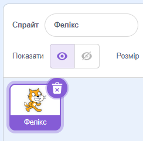
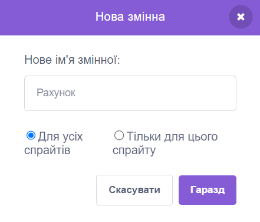

# Вступ {.intro}

Ми будемо створювати гру, де кіт Фелікс повинен схопити мишу Герберта. Ви керуватимете Гербертом за допомогою мишки та спробуєте уникнути захоплення Феліксом. Чим довше ви уникнете його, тим більше балів ви отримаєте, але якщо вас спіймали, ваша сума балів зменшиться.


# Крок 1: Фелікс слідує за курсором {.activity}

*Ми хочемо, щоб кіт Фелікс слідував за курсором.*

## Контрольний список {.check}

- [ ] Розпочніть новий проєкт.

- [ ] Натисніть на фігурку кота внизу правої частини екрана та змініть ім’я фігури на  `Фелікс`.

  

- [ ] Переконайтеся, що Фелікс дивиться лише праворуч і ліворуч, встановивши режим обертання зліва-направо.

  .

- [ ] Натисніть на
   у нижньому правому куті екрана, щоб встановити фон. Виберіть потрібний фон.

- [ ] Натисніть на Фелікс, виберіть вкладку `Код` і створіть цей сценарій:

  ```blocks
  коли grønt flagg натиснуто
  завжди
      слідувати за [вказівник v]
      перемістити на (10) кроків
      наступний образ
  slutt
  ```

## Перевірте проєкт {.flag}

__Натисніть на зелений прапорець.__

- [ ] Чи стежить Фелікс за вказівником миші?

- [ ] Коли він рухається, здається, що він ходить?

- [ ] Він рухається з правильною швидкістю?

- [ ] Натисніть на червоний символ зупинки, щоб Фелікс перестав слідувати за курсором миші.

## Збережіть проєкт {.save}

Якщо ви увійшли у свій обліковий запис Scratch, усі ваші проекти автоматично зберігаються з певною періодичністю. Однак все одно корисно зберігати їх вручну час від часу.

- [ ] У меню «Файл» виберіть `Зберегти негайно`.

Якщо у вас немає облікового запису і ви не можете зберігати проекти, просто перейдіть до кроку 2.


# Крок 2: Фелікс переслідує Герберта {.activity}

*Тепер ми хочемо, щоб Фелікс ганявся за мишкою Гербертом замість вказівника миші.*

## Контрольний список {.check}

- [ ] Створіть новий спрайт, натиснувши на кнопку
  
  і виберіть фігурку `Тварини/Mouse1`.

- [ ] Перейменуйте фігуру на `Герберт`.

- [ ] Зробіть Герберта меншим за Фелікса, вибравши поле `Розмір` прямо над фігурою та введіть менше число. Спробуйте змінити число з 100 на 30.


- [ ] Дайте Герберту цей скрипт:

  ```blocks
  коли grønt flagg натиснуто
  завжди
      перейти до [вказівник v]
      слідувати [Фелікс v]
  slutt
  ```

## Перевірте проєкт {.flag}

__Натисніть на зелений прапорець.__

- [ ] Герберт рухається разом із вказівником миші?

- [ ] Фелікс женеться за Гербертом?


# Крок 3: Фелікс каже, коли він спіймав Герберта {.activity}

*Ми хочемо, щоб Фелікс знав, коли він спіймав Герберта, і сказав нам.*

## Контрольний список {.check}

- [ ] Змініть сценарій Фелікса на такий:

  ```blocks
  коли grønt flagg натиснуто
  завжди
      слідувати за [вказівник v]
      перемістити на (10) крок
      наступний образ
      якщо <торкається [Герберт v]? то>
          говорити [Попався!] (1) сек
      slutt
  slutt
  ```

## Перевірте проєкт {.flag}

__Натисніть на зелений прапорець.__

- [ ] Чи розповідає Фелікс, коли він спіймав Герберта?


# Крок 4: Герберт стає привидом, коли його схопили {.activity}

*На додаток до того, що Фелікс щось говорить, ми тепер хочемо, щоб Герберт перетворився на привида, коли його схоплять.*

## Контрольний список {.check}

- [ ] Змініть сценарій Фелікса так, щоб він надсилав повідомлення та видавав звук, коли він ловить Герберта:

  ```blocks
  коли grønt flagg натиснуто
  завжди
      слідувати за [вказівник v]
      перемістити на (10) кроків
      наступний образ
      якщо <торкається [Герберт v]? то>
          оповістити [Упіймав! v]
		  відтворити звук [Няв]
          говорити [Попався!] (1) сек
          чекати (1) секунду
      slutt
  slutt
  ```

- [ ] Виберіть Герберт і перейдіть на вкладку `Образи`.

- [ ] Отримайте новий костюм, натиснувши
  
  і виберіть `Фантазії/Ghost`

- [ ] Змініть назви костюмів Герберта, щоб костюм миші називався `живий` а костюм привида `мертвий`.

- [ ] Перейдіть на вкладку Код  і створіть новий сценарій для Герберта, щоб перетворити його на привида. Не видаляйте старий скрипт:

  ```blocks
  коли я отримую [Упіймав! v]
  змінити образ на [мертвий v]
  чекати (0.5) секунд
  змінити образ на  [живий v]
  ```

## Перевірте проєкт {.flag}

__Натисніть на зелений прапорець.__

- [ ] Чи перетворюється Герберт на привида, коли його ловлять?

- [ ] Чи вмикає Фелікс свій звук у потрібний момент?

- [ ] Чи стоїть Фелікс на місці достатньо довго, щоб Герберт зміг втекти?


# Крок 5: Підрахуйте бали {.activity}

*Давайте додамо бали, щоб побачити, наскільки добре вам вдається тримати Герберта живим. Починаємо з нуля і збільшуємо його на одиницю за кожну секунду. Якщо Фелікс спіймає Герберта, ми зменшуємо рахунок на десять.*

## Контрольний список {.check}

- [ ] На вкладці `Код` у розділі `Змінні`{.blockdata}, створіть нову змінну. Назвіть змінну `Рахунок`, і застосуйте її до всіх фігур.

  

 Зверніть увагу, що `Рахунок 0` з’явився у верхньому лівому куті гри.

- [ ] Клацніть `Сцена` в крайньому правому куті екрана, поруч зі списком персонажів Фелікса і Герберта. Створіть ці два сценарії на сцені:

  ```blocks
  коли grønt flagg натиснуто
  надати [Рахунок v] значення [0]
  завжди
      чекати (1) секунд
      змінити [Рахунок v] на (1)
  slutt

  коли я отримую [Упіймав! v]
  змінити [Рахунок v] на (-10)
  ```

## Перевірте проєкт {.flag}

__Натисніть на зелений прапорець.__

- [ ] Чи збільшується рахунок на одиницю щосекунди?

- [ ] Чи зменшується кількість очок на десять, коли Герберта спіймають?

- [ ] Що станеться, якщо Герберта спіймають до того, як у вас буде десять очок?

- [ ] Чи обнуляється рахунок при перезапуску гри?

## Збережіть проєкт {.save}

*Все готово. Молодець. Тепер ви можете грати у гру!*

Якщо ви увійшли в систему під своїм обліковим записом Scratch, ви можете поділитися грою з родиною та друзями, натиснувши кнопку  `Поділитись в рядку меню`.
