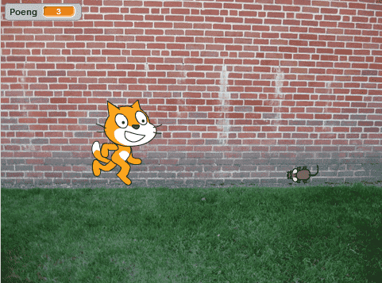

# Вступ {.intro}

Ми будемо створювати гру, де кіт Фелікс повинен схопити мишу Герберта. Ви керуватимете Гербертом за допомогою мишки та спробуєте уникнути захоплення Феліксом. Чим довше ви уникнете його, тим більше балів ви отримаєте, але якщо вас спіймали, ваша сума балів зменшиться.




# Крок 1: Фелікс слідує за курсором {.activity}

*Ми хочемо, щоб кіт Фелікс слідував за курсором.*

## Контрольний список {.check}

- [ ] Розпочніть новий проєкт.

- [ ] Натисніть на фігурку кота внизу правої частини екрана та змініть ім’я фігури на  `Фелікс`.

  

- [ ] Переконайтеся, що Фелікс дивиться лише праворуч і ліворуч, встановивши режим обертання зліва-направо.

  .

- [ ] Натисніть на
   у нижньому правому куті екрана, щоб встановити фон. Виберіть потрібний фон.

- [ ] Натисніть на Фелікс, виберіть вкладку `Код` і створіть цей сценарій:

  ```blocks
  коли grønt flagg натиснуто
  завжди
      слідувати за [вказівник v]
      перемістити на (10) кроків
      наступний образ
  slutt
  ```

## Перевірте проєкт {.flag}

__Натисніть на зелений прапорець.__

- [ ] Чи стежить Фелікс за вказівником миші?

- [ ] Коли він рухається, здається, що він ходить?

- [ ] Він рухається з правильною швидкістю?

- [ ] Натисніть на червоний символ зупинки, щоб Фелікс перестав слідувати за курсором миші.

## Збережіть проєкт {.save}

Якщо ви увійшли у свій обліковий запис Scratch, усі ваші проекти автоматично зберігаються з певною періодичністю. Однак все одно корисно зберігати їх вручну час від часу.

- [ ] У меню «Файл» виберіть `Зберегти негайно`.

Якщо у вас немає облікового запису і ви не можете зберігати проекти, просто перейдіть до кроку 2.


# Крок 2: Фелікс переслідує Герберта {.activity}

*Тепер ми хочемо, щоб Фелікс ганявся за мишкою Гербертом замість вказівника миші.*

## Контрольний список {.check}

- [ ] Створіть новий спрайт, натиснувши на кнопку
  
  і виберіть фігурку `Тварини/Mouse1`.

- [ ] Перейменуйте фігуру на `Герберт`.

- [ ] Зробіть Герберта меншим за Фелікса, вибравши поле `Розмір` прямо над фігурою та введіть менше число. Спробуйте змінити число з 100 на 30.


- [ ] Дайте Герберту цей скрипт:

  ```blocks
  коли grønt flagg натиснуто
  завжди
      перейти до [вказівник v]
      слідувати [Фелікс v]
  slutt
  ```

## Перевірте проєкт {.flag}

__Натисніть на зелений прапорець.__

- [ ] Герберт рухається разом із вказівником миші?

- [ ] Фелікс женеться за Гербертом?


# Крок 3: Фелікс каже, коли він спіймав Герберта {.activity}

*Ми хочемо, щоб Фелікс знав, коли він спіймав Герберта, і сказав нам.*

## Контрольний список {.check}

- [ ] Змініть сценарій Фелікса на такий:

  ```blocks
  коли grønt flagg натиснуто
  завжди
      слідувати за [вказівник v]
      перемістити на (10) крок
      наступний образ
      якщо <торкається [Герберт v]? то>
          si [Tok deg!] i (1) sekunder
      slutt
  slutt
  ```

## Test prosjektet {.flag}

__Klikk på det grønne flagget.__

- [ ] Sier Felix fra når han har fanget Herbert?


# Steg 4: Herbert blir et spøkelse når han fanges {.activity}

*I tillegg til at Felix sier noe, vil vi nå at Herbert blir forvandlet
 til et spøkelse når han fanges.*

## Sjekkliste {.check}

- [ ] Endre skriptet til Felix slik at det sender en melding og lager en
  lyd når han fanger Herbert:

  ```blocks
  når grønt flagg klikkes
  gjenta for alltid
      pek mot [musepeker v]
      gå (10) steg
      neste drakt
      hvis <berører [Herbert v]?>
          send melding [Fanget! v]
		  start lyden [Mjau]
          si [Tok deg!] i (1) sekunder
          vent (1) sekunder
      slutt
  slutt
  ```

- [ ] Velg Herbert og gå til `Drakter`-fanen.

- [ ] Hent en ny drakt ved å trykke på
  
  og velg `Fantasi/Ghost`

- [ ] Endre navnene på Herberts drakter slik at musedrakten heter
  `levende` og spøkelsesdrakten heter `død`.

- [ ] Gå til `Kode`-fanen, og lag et nytt skript for
  Herbert for å gjøre ham om til et spøkelse. Ikke slett det gamle
  skriptet:

  ```blocks
  når jeg mottar [Fanget! v]
  bytt drakt til [død v]
  vent (0.5) sekunder
  bytt drakt til [levende v]
  ```

## Test prosjektet {.flag}

__Klikk på det grønne flagget.__

- [ ] Forvandles Herbert til et spøkelse når han fanges?

- [ ] Spiller Felix lyden sin til riktig tid?

- [ ] Står Felix stille lenge nok til at Herbert kommer seg unna?


# Steg 5: Telle poeng {.activity}

*La oss legge til en poengsum slik at vi kan se hvor flink man er til
 å holde Herbert i live. Vi begynner med poengsummen null og øker den
 med en for hvert sekund. Hvis Felix fanger Herbert, minker vi
 poengsummen med ti.*

## Sjekkliste {.check}

- [ ] På `Kode`-fanen under kategorien `Variabler`{.blockdata}, lag en ny
  variabel. Kall variabelen for `Poeng`, og la den gjelde for alle
  figurer.

  

  Legg merke til at `Poeng 0` dukket opp øverst til venstre i spillet
  ditt.

- [ ] Klikk på `Scene` helt til høyre på skjermen, ved siden av
  lista over figurene Felix og Herbert. Lag disse to skriptene på scenen:

  ```blocks
  når grønt flagg klikkes
  sett [Poeng v] til [0]
  gjenta for alltid
      vent (1) sekunder
      endre [Poeng v] med (1)
  slutt

  når jeg mottar [Fanget! v]
  endre [Poeng v] med (-10)
  ```

## Test prosjektet {.flag}

__Klikk på det grønne flagget.__

- [ ] Øker poengsummen med en hvert sekund?

- [ ] Går poengsummen ned med ti når Herbert blir fanget?

- [ ] Hva skjer om Herbert fanges før du har ti poeng?

- [ ] Går poengsummen tilbake til null når du starter spillet på nytt?

## Lagre prosjektet {.save}

*Du er ferdig. Godt gjort. Nå kan du spille spillet!*

Hvis du er logget inn med din scratchbruker kan du dele spillet med familie og venner ved å trykke `Legg ut` på
menylinjen.
