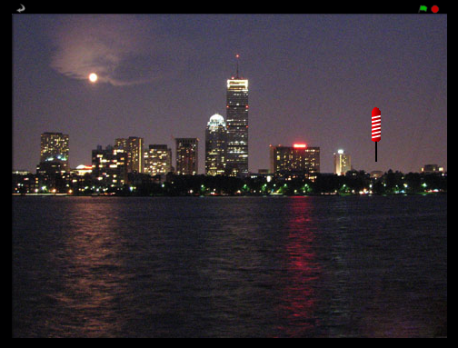

# Introduksjon {.intro}

I dette prosjektet skal vi skyte opp fyrverkeri over en by.



# Forberedelser: Last ned bildefiler {.activity}

Denne første delen kan du godt få hjelp fra en voksen til å gjøre!

## Sjekkliste {.check}

+ Last ned zip-filen
  [fyrverkeri_lydogbilder.zip](fyrverkeri_lydogbilder.zip) og legg
  den på skrivebordet på datamaskinen din eller en annen plass du
  finner igjen.

+ Pakk ut zip-filen ved å høyreklikke på den og velge `Extract All`,
  `Pakk ut filer` eller noe lignende.

# Steg 1: Lag en rakett som flyr mot musepekeren {.activity}

*Vi starter med å importere forskjellige bilder vi skal bruke i
 spillet*

## Sjekkliste {.check}

+ Lag et nytt Scratch-prosjekt. Fjern katten ved å høyreklikke på den
  og velge `slett`.

+ Bytt bakgrunnsbilde til for eksempel `utendørs/city-with-water`.

+ Klikk på *Ny figur: Last opp figur fra fil*,
  , for å
  legge til en rakett-figur i prosjektet, `fyrverkeri_lydogbilder/rocket.png`.

+ Vi vil at raketten skal skjules når du klikker på det grønne
  flagget.

  ```blocks
  når grønt flagg klikkes
  skjul
  ```

Nå vil vi gjerne at raketten skal bevege seg mot musepekeren når du
trykker på mellomromstasten.

+ Legg til en kloss `når mellomrom trykkes`{.blockevents}. Deretter
  lager vi to klosser som gjør raketten synlig og lar den bevege seg
  mot musepekeren.

  ```blocks
  når [mellomrom v] trykkes
  vis
  gli (1) sekunder til x: (mus x) y: (mus y)
  ```

## Test prosjektet {.flag}

__Klikk på det grønne flagget.__

+ Plasser musepekeren over scenen og trykk mellomromstasten.

+ Ser du raketten som beveger seg mot musepekeren?

+ Hva skjer hvis du flytter på musepekeren og trykker mellomromstasten
  igjen?

## Sjekkliste {.check}

Fyrverkeri pleier ikke å fly fra side til side, så du bør gjøre det
slik at raketten alltid flyr mot musepekeren fra bunnen av skjermen.

+ Før du fyrer opp raketten: bruk klossen `gå til`{.blockmotion} for å
  få raketten til å flytte seg til bunnen av skjermen, men slik at den
  er samme sted horisontalt.

  ```blocks
  når grønt flagg klikkes
  skjul

  når [mellomrom v] trykkes
  gå til x: (mus x) y: (-200)
  vis
  gli (1) sekunder til x: (mus x) y: (mus y)
  ```

## Test prosjektet {.flag}

__Klikk på det grønne flagget.__

+ Trykk mellomromstasten.

+ Flyr raketten mot musepekeren fra bunnen av skjermen?

+ Hva skjer hvis du flytter på musa og trykker mellomromstasten igjen?

## Sjekkliste {.check}

+ Endelig, prøv å få til det samme ved å bruke museknappen i stedet
  for mellomromstasten. For å gjøre dette kan vi pakke skriptet vårt
  inn i `for alltid`{.blockcontrol}- og `hvis museknappen er
  nede`{.blockcontrol}-klosser.

+ Flytt skriptet fra `når mellomrom trykkes`{.blockevents} til `når
  grønt flagg klikkes`{.blockevents}, slik at det blir seende slik ut:

  ```blocks
  når grønt flagg klikkes
  skjul
  for alltid
      hvis <museknappen er nede?>
          gå til x: (mus x) y: (-200)
          vis
          gli (1) sekunder til x: (mus x) y: (mus y)
      slutt
  slutt
  ```

## Test prosjektet {.flag}

__Klikk på det grønne flagget.__

+ Klikk musknappen over scenen. Klikk igjen et annet sted.

+ Kommer det raketter flyvende?

## Utfordringer {.try}

+ Prøv å få noen raketter til å bevege seg litt saktere eller fortere
  enn andre.

+ Prøv å endre måten raketten flyr mot musepekeren på: få den for
  eksempel til å bue seg litt.

# Steg 2: Få raketten til å eksplodere {.activity}

*Nå skal vi få raketten til å eksplodere med et digert smell!*

## Sjekkliste {.check}

+ Første steg for å få raketten til å eksplodere er å spille av en
  bang-lyd før den begynner å bevege seg, og deretter gjemme seg når
  den når musepekeren. For å importere en lyd gå til fanen
  `Lyder`{.blocklightgrey} og klikk på *Last opp lyd fra fil*,
  . Last opp
  lyden `fyrverkeri_lydogbilder/bang.wav`.

  ```blocks
  når grønt flagg klikkes
  skjul
  for alltid
      hvis <museknappen er nede?>
          gå til x: (mus x) y: (-200)
          spill lyden [bang v]
          vis
          gli (1) sekunder til x: (mus x) y: (mus y)
          skjul
      slutt
  slutt
  ```

+ Neste steg er å få raketten til å sende en melding til resten av
  spillet når den eksploderer. Vi skal lytte etter meldingen
  senere. Lag en ny melding som heter `Eksploder`.

  ```blocks
  når grønt flagg klikkes
  skjul
  for alltid
      hvis <museknappen er nede?>
          gå til x: (mus x) y: (-200)
          spill lyden [bang v]
          vis
          gli (1) sekunder til x: (mus x) y: (mus y)
          skjul
          send melding [Eksploder v]
      slutt
  slutt
  ```

## Test prosjektet {.flag}

__Klikk på det grønne flagget.__

+ Sørg for at raketten spiller av lyden og gjemmer seg når den når
  musepekeren.

+ Prøv å endre tallet i `gli`{.blockmotion}-klossen slik at raketten
  skjules akkurat samtidig som det smeller.

## Sjekkliste {.check}

+ Last opp en ny figur fra fil, `fyrverkeri_lydogbilder/firework1.png`.

+ Når denne figuren får meldingen `Eksploder` passer vi på at den er
  gjemt, flytter den til raketten ved bruk av klossen `gå
  til`{.blockmotion}, viser den og skjuler den igjen 1 sekund senere.

  ```blocks
  når jeg mottar [Eksploder v]
  skjul
  gå til x: ([x-posisjon v] av [rocket v]) y: ([y-posisjon v] av [rocket v])
  vis
  vent (1) sekunder
  skjul
  ```

## Test prosjektet {.flag}

__Klikk på det grønne flagget.__

+ Blir raketten erstattet av et eksplosjonsbilde når den eksploderer?

+ Hva skjer hvis du holder musknappen nede mens du beveger på musa?
  (Ikke bekymre deg, vi skal fikse det senere.)

# Steg 3: Gjør hver eksplosjon unik {.activity}

*Nå skal vi lage litt variasjon slik at ikke alle eksplosjonene ser
 helt like ut.*

## Sjekkliste {.check}

+ Vi kan gjøre hver eksplosjon unik ved å bruke klossen `sett
  fargeeffekt`{.blocklooks} og velge en tilfeldig farge før
  eksplosjonen vises.

  ```blocks
  når jeg mottar [Eksploder v]
  skjul
  sett [farge v] effekt til (tilfeldig tall fra (1) til (200))
  gå til x: ([x-posisjon v] av [rocket v]) y: ([y-posisjon v] av [rocket v])
  vis
  vent (1) sekunder
  skjul
  ```

+ Legg til forskjellige bilder av eksplosjoner som drakter ved å velge
  `Drakter`{.blocklightgrey}-fanen til `firework1`. Ved å klikke *Last
  opp drakt fra fil*,
  , kan du
  legge til `firework2.png`, `firework3.png` og `firework4.png` fra
  `fyrverkeri_lydogbilder`.

+ Klarer du å få eksplosjonene til å bruke forskjellige drakter?
  (Hint: Du kan for eksempel bruke `neste drakt`{.blocklooks} et
  passende sted i skriptet til Firework1.)

## Test prosjektet {.flag}

__Klikk på det grønne flagget.__

+ Har hver eksplosjon en forskjellig farge?

+ Ser hver eksplosjon forskjellig ut?

## Sjekkliste {.check}

+ Til slutt, gjør eksplosjonen større etter at raketten eksploderer! I
  stedet for å vente i 1 sekund sett størrelsen til figuren til 5% før
  den vises, og etter at den blir synlig øk størrelsen med 5 tjue
  ganger ved bruk av klossen `gjenta`{.blockcontrol}.

  ```blocks
  når jeg mottar [Eksploder v]
  skjul
  neste drakt
  sett [farge v] effekt til (tilfeldig tall fra (1) til (200))
  gå til x: ([x-posisjon v] av [rocket v]) y: ([y-posisjon v] av [rocket v])
  sett størrelse til (5) %
  vis
  gjenta (20) ganger
      endre størrelse med (5)
  slutt
  vent (1) sekunder
  skjul
  ```

## Test prosjektet {.flag}

__Klikk på det grønne flagget.__

+ Sprer eksplosjonen seg ut fra midten av raketten?

+ Vokser eksplosjonen gradvis?

## Utfordringer {.try}

Prøv å gjøre hver eksplosjon enda mer unik: endre størrelsen og
veksthastigheten for eksplosjonen.

# Steg 4: Fiks "send melding"-feilen {.activity}

Husker du at vi tidligere hadde et problem med å holde museknappen
nede?

Dette problemet oppstår fordi når raketten sender sin melding om
eksplosjonen, gjentar den `hvis`{.blockcontrol}-løkken med en
gang. Dermed blir det sendt en eksplosjonsmelding før den forrige er
ferdig med animasjonen.

I programmeringsverden kaller vi denne type problemer for *bugs*,
fordi man i gamle dager (da datamaskiner var mye større) kunne ha
problemer med at innsekter ble fanget inne i datamaskinene og ødela
programmer.

## Sjekkliste {.check}

+ For å fikse dette kan du erstatte klossen `send melding`{.blockevents}
  med `send melding og vent`{.blockevents}. Da vil ikke løkken gjentas
  før den forrige eksplosjonen er ferdig. Gå tilbake til `rocket` og
  endre skriptet:

  ```blocks
  når grønt flagg klikkes
  skjul
  for alltid
      hvis <museknappen er nede?>
          gå til x: (mus x) y: (-200)
          spill lyden [bang v]
          vis
          gli (1.5) sekunder til x: (mus x) y: (mus y)
          skjul
          send melding [Eksploder v] og vent
      slutt
  slutt
  ```

## Test prosjektet {.flag}

__Klikk på det grønne flagget.__

+ Får du eksplosjonen til å dukke opp på riktig sted og til riktig
  tid?

## Lagre prosjektet {.save}

__Gratulerer, du er ferdig! Nå kan du kose deg med spillet!__

Ikke glem å dele spillet ditt med alle dine venner og familien! Klikk
på `Legg ut` i menylinjen.
