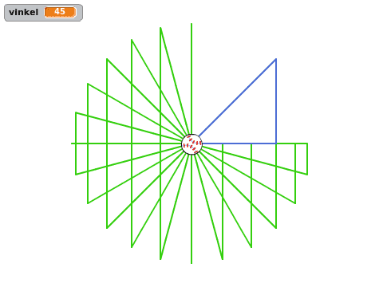

# Informasjon til veiledere {.intro}

Flagg viser hvordan man kan bruke kloner til å animere et flagg. I animasjonen
bruker _sinus_ og _cosinus_ for enkle sirkelbevegelser. Disse funksjonene blir
raskt introdusert og elevene får muligheten til å eksperimentere litt med dem.


# Bakgrunn {.activity}

Flagg ble opprinnelig skrevet av Sverre Oskar Konestabo som et bidrag til
programmeringskonkurransen som ble avholdt for barn som deltok på Kodeklubben
Blindern våren 2016.

# Forberedelser {.activity}

+ __Antatt tidbruk__: 1.5 - 2 timer for hele prosjektet.

+ __Nødvendige forkunnskaper__: God kjennskap til Scratch. Elevene bør ha gjort
  flere prosjekter på Introduksjon- og Nybegynner-nivå før de starter med Flagg.

Benytt gjerne anledningen til å snakke om
[forskjellige måter å kode sirkelbevegelse i Scratch](#tema-sirkelbevegelser).

# Typiske utfordringer {.activity}

Nedenfor er en liste over utfordringer vi har opplevd at noen elever
kommer borti.

+ Det er viktig at variablene, spesielt `(sentrumX)`{.b} og `(sentrumY)`{.b},
  gjelder kun _for denne figuren_. Hvis variablene er felles for alle figurer
  vil ikke klonene kunne ha forskjellige sentrum de roterer rundt. I stedet vil
  klonene være mer eller mindre stablet over hverandre.

+ Dimensjonene på flagget er litt feil. I følge
  [flaggloven](https://lovdata.no/dokument/NL/lov/1898-12-10-1) skal forholdet
  mellom flaggets bredde og lengde være 16 til 22, mens i oppgaven tegnes
  flagget 14 til 19. Dette er på grunn av en begrensning i Scratch hvor det kun
  er mulig å lage 300 kloner av en figur, mens 16 ganger 22 ville krevd 352
  kloner.

# Variasjoner {.activity}

Hovedpoengene i denne oppgaven er å gi elevene litt kjennskap til funksjonene
_sinus_ og _cosinus_, samt vise hvordan man kan bruke mange kloner sammen for å
skape en større animasjon. La gjerne elevene eksperimentere underveis, for
eksempel ved å

+ Endre på tallene underveis. Spesielt tallene i de forskjellige `vend høyre ()
  grader`{.b}-klossene kan ha en stor effekt.

+ Tegne sine egne flagg. Slik sirklene legges ut starter man nederst i venstre
  hjørne og går oppover og etterhvert mot høyre når man bruker den lange teksten
  (`rrrrrhbbhrrrrrrrrrrhbbhrrrrr...`) for å beskrive fargene i flagget.


# Tema: Sirkelbevegelser {.activity}

Det er flere måter å få figurer til å utføre sirkelbevegelser i Scratch. I denne
presentasjonen viser vi flere av dem, og ser på begrensninger til de enkleste,
og viser hvorfor _sinus_ og _cosinus_ gir oss ekstra muligheter.

I dette prosjektet introduserer vi _sinus_ og _cosinus_ som forholdet mellom
sider i en trekant, og holder stort sett fokus på at effekten av å bruke disse
funksjonene er at figurene våre kan gå i sirkel. Andre del av presentasjonen
nedenfor er ment å illustrere dette visuelt.

## Presentasjon {.check}

+ Start et nytt Scratchprosjekt ved å klikke `Programmering` fra
  hovedsiden, eller `Ny` i `Fil`-menyen.

Vi vil først se på enkle sirkelbevegelser som barna sannsynligvis allerede er
kjent med. Spør gjerne barna hvordan de vil kode en figur som beveger seg i
sirkel før du viser dem eksemplene under.

+ Det enkleste er nok å gi en figur denne koden:

  ```blocks
  for alltid
      gå (10) steg
      vend høyre (5) grader
  slutt
  ```

  Her er det ikke veldig farlig akkurat hva tallene er. Eksperimenter gjerne med
  verdiene for å se hvordan det påvirker sirkelbevegelsen.

+ En annen måte å få en figur til å gå i sirkel på er vist frem i
  [Soloball-oppgaven](../soloball/soloball.html).

  Stopp det forrige skriptet, og dra figuren tilbake omtrent midt på
  skjermen. Klikk på `Drakter`-fanen, og dra figuren i drakteditoren (vinduet
  til høyre på skjermen) litt vekk fra sentrum. Gå tilbake til `Skript`-fanen og
  forenkle skriptet:

  ```blocks
  for alltid
      vend høyre (5) grader
  slutt
  ```

  Igjen skal figuren gå i sirkel! Hvordan endrer man størrelsen på sirkelen i
  dette eksempelet? (_Flytter figuren i drakteditoren._)

Spør barna om de ser noen begrensninger i denne måten å programmere på?
Spesielt spør hvordan man kan få figuren til å se i spesielle retninger mens den
beveger seg i sirkel? _Siden vi bruker retningen til figuren i sirkelbevegelsen
kan vi ikke samtidig få den til å se i en gitt annen retning._

+ Lag en ny figur (fordi den forrige figuren er flyttet vekk fra sentrum).

+ Lag en variabel, `(vinkel)`{.b}. I denne presentasjonen er det ikke viktig om
  den gjelder for alle eller kun denne figuren.

+ Skriv denne koden:

  ```blocks
  sett [vinkel v] til [45]
  gå til x: (0) y: (0)
  penn på
  sett x til ((150) * ([cos v] av (vinkel))
  sett y til ((150) * ([sin v] av (vinkel))
  gå til x: (0) y: (0)
  penn av
  ```

  Dette vil tegne en rettvinklet trekant hvor den ene vinkelen er 45 grader.

+ Legg gjerne inn `vent (3) sekunder`{.b}-klosser etter de to `sett x til
  ()`{.b}- og `sett y til ()`{.b}-klossene for å vise hva henholdsvis `[cos v]
  av (vinkel)`{.b} og `[sin v] av (vinkel)`{.b} tilsvarer.

+ Tegn trekanter med forskjellige vinkler (ved å endre på tallet i `sett
  [vinkel v] til []`{.b}-klossen). Vis gjerne hva som skjer om `(vinkel)`{.b} er
  0, 90, større enn 90, eller til og med negativ.

Om du trenger å slette noen av trekantene som har blitt tegnet kan du bruke
`slett`{.b}-klossen.

+ Når du har tegnet en del trekanter kan du spørre om noen av barna ser at du
  har begynt å tegne en sirkel? _De ytterste hjørnene i trekantene vil
  etterhvert danne en sirkel fordi den skrå streken, hypotenusen, er like lang i
  alle trekantene._

  

+ For å vise frem at trekantene virkelig danner en sirkel kan du bruke en
  `gjenta`{.blockcontrol}-løkke på denne måten:

  ```blocks
  sett [vinkel v] til [0]
  gå til x: (0) y: (0)
  penn på
  gjenta (72) ganger
      sett x til ((150) * ([cos v] av (vinkel))
      sett y til ((150) * ([sin v] av (vinkel))
      gå til x: (0) y: (0)
      endre [vinkel v] med (5)
  slutt
  penn av
  ```
