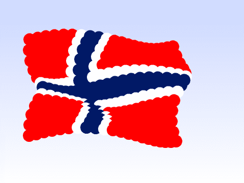

# Om oppgaven {.activity}

Flagg viser hvordan man kan bruke kloner til å animere et flagg. I animasjonen
bruker _sinus_ og _cosinus_ for enkle sirkelbevegelser. Disse funksjonene blir
raskt introdusert og elevene får muligheten til å eksperimentere litt med dem.
Flagg ble opprinnelig skrevet av Sverre Oskar Konestabo som et bidrag til
programmeringskonkurransen som ble avholdt for barn som deltok på Kodeklubben
Blindern våren 2016.

## Oppgaven passer til: {.check}

 __Fag__: Kunst og håndtverk, matematikk, programmering

__Anbefalte trinn__: 3.-10. trinn.

__Tema__: Løkker, sirkler, forminskning, koordinatsystem.

__Tidsbruk__: Dobbelttime eller mer.

## Kompetansemål {.challenge}

- [ ] __Kunst og håndtverk, 2. trinn__: eksperimentere med form, farge, rytme og
      kontrast

- [ ] __Kunst og håndtverk, 4. trinn__: tolke former og symboler fra ulike
      kulturer og bruke disse i visuelle uttrykk

- [ ] __Kunst og håndtverk, 7. trinn__: bruke programmering til å skape
      interaktivitet og visuelle uttrykk

- [ ] __Kunst og håndtverk, 10. trinn__: visualisere form ved hjelp av
      frihåndstegninger, arbeidstegninger, modeller og digitale verktøy

- [ ] __Matematikk, 4. trinn__: utforske, beskrive og sammenligne egenskaper
      ved to- og tredimensjonale figurer ved å bruke vinkler, kanter og hjørner

- [ ] __Matematikk, 6. trinn__: bruke variabler, løkker, vilkår og funksjoner i
      programmering til å utforske geometriske figurer og mønster

- [ ] __Programmering, 10. trinn__: bruke grunnleggende prinsipper i
      programmering, slik som variabler, løkker, vilkår og funksjoner, og
      reflektere over bruken av disse

## Forslag til læringsmål {.challenge}

- [ ] Elevene kan tegne sirkler med bestemte farger i bildebehandlingsprogram.

- [ ] Elevene kan bruke forminsking og forstørring av sirkler for å gi illusjon
      av bevegelse.

- [ ] Elevene kan sette sammen flere sirkler til å utgjøre et helt bilde.

- [ ] Elevene kan plassere figurer i bestemte posisjoner i et koordinatsystem.

- [ ] Elevene kan bruke kode til å klone figurer, og til å få dem til å endres i fellesskap.

## Forslag til vurderingskriterier {.challenge}

- [ ] Eleven viser middels måloppnåelse ved å fullføre oppgaven.

- [ ] Eleven viser høy måloppnåelse ved å videreutvikle egen kode basert på
      oppgaven, for eksempel ved å gjøre en eller flere av variasjonene
      nedenfor.

## Forutsetninger og utstyr {.challenge}

- [ ] __Forutsetninger__: Elevene må ha god kunnskap i Scratch. De bør ha gjort
  flere prosjekter på introduksjons- og nybegynnernivå før de starter med denne
  oppgaven. I prosjektet brukes _sinus_ og _cosinus_, som vanligvis ikke
  introduseres for elevene før mot slutten av videregående. Det kan være lurt å
  prate litt om disse funksjonene med elevene.

- [ ] __Utstyr__: Datamaskiner med Scratch installert. Eventuelt kan elevene
  bruke Scratch i nettleseren dersom de har en bruker (eller registrerer seg) på
  [scratch.mit.edu/](http://scratch.mit.edu/){target=_blank}. Elevene kan gjerne
  jobbe to og to sammen.

## Fremgangsmåte

[Klikk her for å se oppgaveteksten.](../flagg/flagg.html){target=_blank}

# Steg 1: Gå i sirkel {.activity}

- [ ] Det er mange måter å lage sirkelbevegelser i Scratch, men flere av disse
  har begrensninger. Derfor bruker vi _sinus_ og _cosinus_. Som nevnt over blir
  ikke disse introdusert for elevene på nivået du sannsynligvis underviser,
  derfor introduseres funksjonene på en enkel måte: som forholdet mellom sider i
  en trekant. Fokus holdes stort sett på at effekten av å bruke disse
  funksjonene er at figurene våre kan gå i sirkel.

# Steg 2: Flytt sirkelen {.activity}

- [ ] Det er viktig at variablene, spesielt `(sentrumX)`{.b} og
  `(sentrumY)`{.b}, gjelder kun _for denne figuren_. Hvis variablene er felles
  for alle figurer vil ikke klonene kunne ha forskjellige sentrum de roterer
  rundt. I stedet vil klonene være mer eller mindre stablet over hverandre.

# Steg 5: Det norske flagget {.activity}

- [ ] Det norske flagget har en bestemt rød- og blåfarge. I RGB-systemet er det
      nærmeste vi kommer `#ED2939` og `#002664`.

- [ ] Dimensjonene på flagget er litt feil. I følge
  [flaggloven](https://lovdata.no/dokument/NL/lov/1898-12-10-1) skal forholdet
  mellom flaggets bredde og lengde være 16 til 22, mens i oppgaven tegnes
  flagget 14 til 19. Dette er på grunn av en begrensning i Scratch hvor det kun
  er mulig å lage 300 kloner av en figur, mens 16 ganger 22 ville krevd 352
  kloner.

## Variasjoner {.challenge}

- [ ] Elevene kan prøve å endre på tallene underveis, og se hvordan dette
      påvirker animasjonen. Spesielt tallene i de forskjellige `vend høyre ()
      grader`{.b}-klossene kan ha en stor effekt.

- [ ] Elevene kan tegne sine egne flagg. Slik sirklene legges ut starter man
      nederst i venstre hjørne og går oppover og etterhvert mot høyre når man
      bruker den lange teksten (`rrrrrhbbhrrrrrrrrrrhbbhrrrrr...`) for å
      beskrive fargene i flagget.

## Eksterne ressurser {.challenge}

- [ ] Foreløpig ingen eksterne ressurser...
