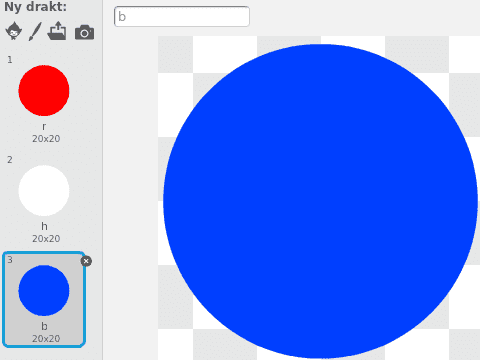

# Introduksjon {.intro}

I denne oppgåva ser me nærare på korleis me kan lage mønstre og animasjonar ved
hjelp av litt matematikk. Det me skal gjere er å teikne eit flagg som vaiar i
vinden.


# Steg 1: Gå i sirkel {.activity}

Tidlegare har me sett fleire måtar me kan få figurar til å gå i sirkel på. Til
dømes i [Soloball](../soloball/soloball.html) der me flytta figuren vekk frå
sentrum og brukte `peik mot [musepeikar v]`{.b} for å flytte figuren i sirkel.

Her skal me bruke to matematiske funksjonar, _sinus_ og _cosinus_ for å ha meir
kontroll over korleis sirkelrørsla skjer. Du kjenner kanskje ikkje desse endå,
men det er ikkje så farleg. Enkelt forklart hjelper dei oss å finne ut kor lange
sidene i ein rettvinkla trekant er i forhold til kvarandre. I figuren under
fortel _cosinus_, `cos(vinkel)` oss kor lang den vassrette streken er i forhold
til den skrå streken.


No skal me bruke dette til å teikne sirklar!

## Sjekkliste {.check}

- [ ] Start eit nytt prosjekt.

- [ ] Skriv dette skriptet på kattefiguren:

  ```blocks
  når @greenFlag vert trykt på
  avgrens rotering til [ikkje roter v]
  gjenta for alltid
      set x til ((100) * ([cos v] av (retning)))
      set y til ((100) * ([sin v] av (retning)))
      snu @turnLeft (5) gradar
  slutt
  ```

## Test prosjektet {.flag}

__Klikk på det grøne flagget.__

- [ ] Kva skjer? Forstår du kvifor kattefiguren flyttar seg rundt i ein sirkel?

  Talet `100` fortel kor stor sirkelen skal vere (det er lengda av den skrå
  streken i figuren over). Prøv å endre talet (begge stadene) for å sjå kva som
  skjer.

- [ ] Kva skjer dersom du brukar ulike tal dei to stadene det står `100`?

- [ ] Korleis forandrar rørsla til katten seg dersom du forandrar talet `5` i
  `snu @turnLeft (5) gradar`{.b}? Prøv òg kva som skjer om du brukar eit
  negativt tal!

## Retning på sirkelrørsla {.tip}

Har du lagt merke til at katten flyttar seg i motsatt retning av korleis pila i
`snu @turnLeft (5) gradar`{.b}-klossen peikar? Det er fordi Scratch måler vinklar
i motsatt retning av det som er vanleg i matematikken.

# Steg 2: Flytt sirkelen {.activity}

Til no har me berre teikna ein sirkel midt på skjermen. No skal me flytte den!

## Sjekkliste {.check}

- [ ] Sidan me allereie flyttar figuren langs ein sirkel kan me ikkje bruke `gå
  til x: () y: ()`{.b}-klossar for å flytte heile sirkelen. I staden brukar me
  variablar. Lag to variablar som heiter `(sentrumX)`{.b} og `(sentrumY)`{.b}
  som berre gjeld _for denne figuren_.

- [ ] No kan me flytte sirkelen over ved å endre `(sentrumX)`{.b}- og
  `(sentrumY)`{.b}-variablane:

  ```blocks
  når @greenFlag vert trykt på
  avgrens rotering til [ikkje roter v]
  set [sentrumX v] til [-100]
  set [sentrumY v] til [50]
  gjenta for alltid
      set x til ((sentrumX) + ((100) * ([cos v] av (retning)))
      set y til ((sentrumY) + ((100) * ([sin v] av (retning)))
      snu @turnLeft (5) gradar
  slutt
  ```

## Test prosjektet {.flag}

__Klikk på det grøne flagget.__

- [ ] Flyttar sirkelen seg til det nye sentrumet?

## Prøv sjølv {.challenge}

- [ ] Legg til ein ny variabel `(radius)`{.b} som berre gjeld _for denne
  figuren_. Kan du bruke den til å styre kor stor sirkelen er? Det tyder at
  `radius`{.b} skal seie kor lang den skrå streken i figuren i starten av
  oppgåva skal vere.

  Du treng ein `set [radius v] til []`{.b}-kloss i tillegg til å bruke
  `(radius)`{.b} to stader i koden din.

# Steg 3: Dansande diskar {.activity}

No skal me prøve å få mange figurar til å gå i sirkel samstundes.

## Sjekkliste {.check}

- [ ] Teikne ei ny drakt på figuren din. Bruk vektorgrafikk og lag ein raud fylt
  sirkel (ein fylt sirkel kallast ein disk). Den kan vere ganske liten, til
  dømes `20 x 20` pikslar.

  

- [ ] Me kan lage mange raude diskar ved å klone den me laga i førre punkt. Del
  koden din i to delar, og endre den slik:

  ```blocks
  når @greenFlag vert trykt på
  gjenta (99) gongar
      set [sentrumX v] til (tilfeldig tal frå (-150) til (150))
      set [sentrumY v] til (tilfeldig tal frå (-100) til (100))
      set [radius v] til [50]
      lag klon av [meg v]
  slutt

  når eg startar som klon
  gjeta for alltid
      set x til ((sentrumX) + ((radius) * ([cos v] av (retning)))
      set y til ((sentrumY) + ((radius) * ([sin v] av (retning)))
      snu @turnLeft (5) gradar
  slutt
  ```

- [ ] Om du køyrer programmet dinn no skal du sjå 99 diskar som "dansar" og ein
  som står i ro på skjermen. Det ser  kanskje litt kaotisk ut!

  Kaoset kjem av at Scratch brukar litt tid på å starte kvar klon. Me kan få
  orden på det ved å få dei til å starte samstundes:

  Bytt `når eg startar som klon`{.b} med `når eg får meldinga [dans v]`{.b}, og
  legg til ein `send meldinga [dans v]`{.b}-kloss etter `gjenta (99)
  gongar`{.b}-løkka.

  Om du køyrer programmet ditt att ser du at alle diskane "dansar" i takt. Kva
  likar du best?

# Steg 4: Flagrande flagg {.activity}

No skal me få denne kaotiske dansen til å bli noko som liknar på eit flagrande
flagg.

## Sjekkliste {.check}

- [ ] I førre steg klona me diskar til tilfeldige stader. No skal me leggje dei
  ut på ein bestemt måte for å etterlikne eit flagg. Skriv om skriptet som legg
  ut diskane slik:

  ```blocks
  når @greenFlag vert trykt på
  vis
  set [radius v] til [25]
  set [sentrumX v] til [-160]
  gjenta (19) gongar
      set [sentrumY v] til [-100]
      gjenta (14) gongar
          lag klon av [meg v]
          endra [sentrumY v] med (16)
      slutt
      endra [sentrumX v] med (16)
  slutt
  send meldinga [flagre v]
  gøym
  ```

- [ ] No kan `flagre`-skriptet vere det same du brukte til å lage "dansen"
  tidlegare.

  ```blocks
  når eg får meldinga [flagre v]
  gjenta for alltid
      set x til ((sentrumX) + ((radius) * ([cos v] av (retning)))
      set y til ((sentrumY) + ((radius) * ([sin v] av (retning)))
      snu @turnLeft (5) gradar
  slutt
  ```

- [ ] Køyr programmet ditt. No skal du sjå eit flagg som består av mange raude
  diskar som består av mange raude diskar som beveger seg i sirkel. Men no kan
  me la dei raude diskane bevege seg litt i utakt!

  Legg til klossen `snu @turnRight (1) gradar`{.b} etter `lag klon av
  [meg v]`{.b}-klossen, og prøv programmet ditt att. Kva har skjedd?


# Steg 5: Det norske flagget {.activity}

No skal me teikne flagget med ulike fargar.

## Sjekkliste {.check}

- [ ] Teikne to nye drakter, begge som kopiar av den raude disken. Den fyrste
  skal vere kvit og den andre skal vere blå. Gi figurane namna `r`, `k` og `b`
  slik at namnet er den fyrste bokstaven i farga på disken: `r`aud, `k`vit og
  `b`lå.

  

- [ ] No skal me bruke ein ny variabel `(flagg)`{.b} for å beskrive fargane i
  flagget. Lag variabelen _for alle figurar_ og legg til koden

  ```blocks
  når @greenFlag vert trykt på
  set [flagg v] til [rrrrrkbbkrrrrr]
  ```

  Bokstavane `rrrrrkbbkrrrrr` beskriv at me vil ha fem raude diskar, ein kvit,
  to blå, ein kvit og fem raude diskar.

- [ ] For å kunne bruke den nye `(flagg)`{.b}-variabelen må kvar disk vite kva
  nummer den har. Lag ein ny variabel `(nummer)`{.b} som berre gjeld _for denne
  figuren_.

- [ ] Legg til `set [nummer v] til [1]`{.b} rett under `vis`{.b} og `endra
  [nummer v] med (1)`{.b} rett under `lag klon av [meg v]`{.b}-klossen.

- [ ] Til slutt skal me endre drakt på diskane. Legg til

  ```blocks
  byt drakt til (bokstav (nummer) i (flagg))
  ```

  øvst i `gjenta for alltid`{.blockcontrol}-løkka i `flagre`-skriptet.

- [ ] Køyr programmet ditt. Den venstre delen av flagget ditt skal ha fått
  fargane til det norske flagget. For å farge heilt flagget må me gi mange
  fleire bokstavar til `(flagg)`{.b}-variabelen. Heile det norske flagget har
  bokstavane

  ```
  rrrrrkbbkrrrrrrrrrrkbbkrrrrrrrrrrkbbkrrrrrrrrrrkbbkrrrrrrrrrrkbbkrrrrr
  kkkkkkbbkkkkkkbbbbbbbbbbbbbbbbbbbbbbbbbbbbkkkkkkbbkkkkkkrrrrrkbbkrrrrr
  rrrrrkbbkrrrrrrrrrrkbbkrrrrrrrrrrkbbkrrrrrrrrrrkbbkrrrrrrrrrrkbbkrrrrr
  rrrrrkbbkrrrrrrrrrrkbbkrrrrrrrrrrkbbkrrrrrrrrrrkbbkrrrrr
  ```

- [ ] Ein enklare måte å teikne flagg på er å seie at me vil at mønsteret skal
  gjenta seg sjølv. Då treng me ikkje å skrive ein bokstav for kvar disk. Til
  det kan me bruke `() mod ()`{.b}-klossen.

  Bytt `(bokstav (nummer) i (flagg))`{.b} med `(bokstav ((nummer) mod (lengda
  til (flagg))) i (flagg))`{.b} i `byt drakt til [ v]`{.b}-klossen. Om du prøver
  programmet att ser du at flaggmønsteret blir gjenteke. Prøv å sette
  `(flagg)`{.b} til `rkb` for å sjå det.

## Prøv sjølv {.challenge}

- [ ] Teikne dine eigne flagg. Om du treng fleire fargar kan du berre lage
  fleire drakter. Pass på at kvar drakt har ein bokstav eller eit tal som namn.

- [ ] Du kan leike litt med tala for å endre på animasjonen. Prøv med `snu
  @turnRight (25) gradar`{.b} i klossen etter `lag klon av [meg v]`{.b}.

- [ ] Du kan endre korleis flagget ser ut undervegs. Til dømes kan du bruke ein
  `når [ v] vert trykt`{.b}-kloss for å endre verdien av `(flagg)`{.b} basert på
  kva tastar som blir trykka. Då vil fargene i flagget oppdatere seg.
