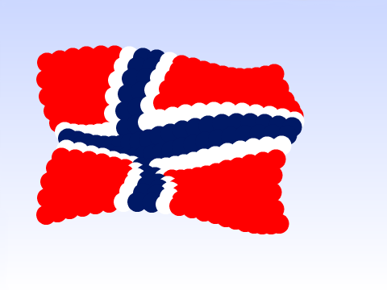
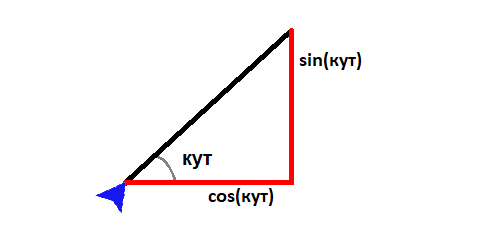
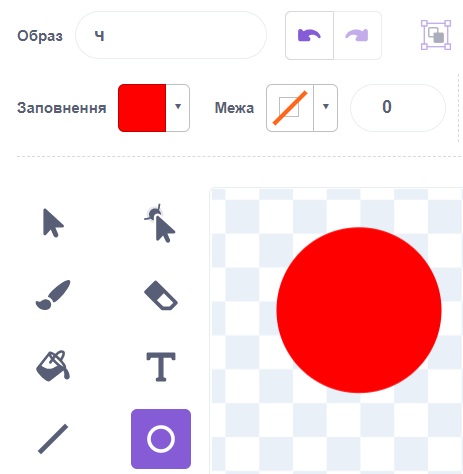
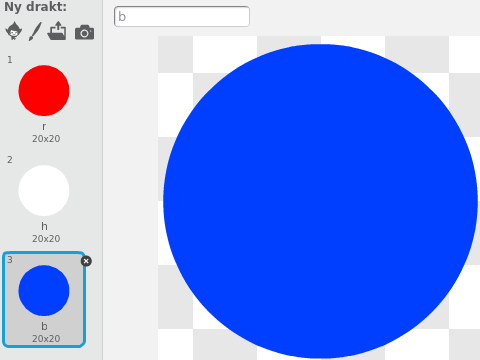

# Вступ {.intro}

У цьому завданні ми розглянемо, як за допомогою математики можна створювати захоплюючі візерунки та анімації. Зокрема, ми намалюємо прапор, який ніби розвівається на вітрі.




# Крок 1: Пройдіться по колу {.activity}

Раніше ми вже бачили кілька способів, як змусити фігури рухатися по колу. Ми відсунули фігуру від центру і використали `слідувати за [вказівник v]`{.b} для переміщення фігури по колу.

У цьому завданні ми будемо використовувати дві функції, синус і косинус, щоб краще контролювати, як відбувається круговий рух. Можливо, ви ще не чули про синус і косинус? Це числа, які показують, якою є довжина сторін прямокутного трикутника відносно одна до одної. На прикладі нижче, косинус, `cos(кут)`, показує, якою є довжина горизонтальної лінії відносно похилої лінії.



Давайте подивимося, як ми можемо використовувати це для малювання кіл!

## Контрольний список {.check}

- [ ] Розпочати новий проект.

- [ ] Напишіть наступний сценарій для персонажа кота:

  ```blocks
  коли @greenFlag натиснуто
  стиль обертання [не обертати v]
  завжди
      задати x ((100) * ([cos v] з (напрям)))
      задати y ((100) * ([sin v] з (напрям)))
      поворот @turnLeft на (5) градусів
  slutt
  ```

## Перевірте проєкт {.flag}

__Натисніть на зелений прапорець.__

- [ ] Що відбувається? Ви розумієте, чому фігурка кота рухається по колу?

  Число `100` показує, якого розміру має бути коло (це довжина похилої лінії на малюнку вище). Спробуйте змінити число (в     обох місцях) і подивіться, що станеться.

- [ ] Що станеться, якщо замість `100` використати різні числа в цих двох місцях?

- [ ] Як зміниться рух кота, якщо змінити число 5 у
  `поворот @turnLeft на (5) градусів`{.b}? Не соромтеся пробувати і з від'ємними числами!

## Напрямок кругового руху {.tip}

Ви можете помітити, що кіт рухається в напрямку, протилежному напрямку стрілки на `поворот @turnLeft на (5) градусів`{.b} Це тому, що Scratch вимірює кути у протилежному напрямку від того, що прийнято в математиці (і який ми намалювали вище).

# Крок 2: Перемістіть коло {.activity}

Поки що ми просто намалювали коло в центрі екрана. Спробуймо його перемістити!

## Контрольний список {.check}

- [ ] Оскільки ми вже рухаємо фігуру по колу, ми не можемо використовувати блок `перемістити в x: () y: ()`{.b} для переміщення всього кола. Замість цього ми будемо використовувати змінні. Створіть дві змінні з іменами `(центрX)`{.b} та `(центрY)`{.b} і яка застосовується _Тільки для цього спрайту_.

- [ ] Тепер ми можемо перемістити коло, встановивши змінні `(центрX)`{.b} та
  `(центрY)`{.b}:

  ```blocks
  коли @greenFlag натиснуто
  стиль обертання [не обертати v]
  надати [центрX v] значення [-100]
  надати [центрY v] значення [50]
  завжди
      задати x ((центрX) + ((100) * ([cos v] з (напрям)))
      задати y ((центрY) + ((100) * ([sin v] з (напрям)))
      поворот @turnLeft на (5) градусів
  slutt
  ```

## Перевірте проєкт {.flag}

__Натисніть на зелений прапорець.__

- [ ] Чи рухається коло до нового центру?

## Спробуйте самі. {.challenge}

- [ ] Додайте нову змінну, `(радіус)`{.b}, яка також застосовується _Тільки для цього спрайту_.
  Чи можна за допомогою цього контролювати розмір кола?
  Тобто, `(радіус)`{.b} повинен показувати довжину похилої лінії на малюнку який був на початку завдання.

  Вам потрібен блок `надати [радіус v] значення []`{.b} на додаток до використання
  `(радіус)`{.b} у двох місцях вашого коду.


# Крок 3: Танцювальні диски {.activity}

Тепер ми спробуємо змусити багато фігур обертатися по колу одночасно.

## Контрольний список {.check}

- [ ] Намалюйте новий костюм для свого персонажа. За допомогою векторної графіки намалюйте коло (диск), заповнене червоним    кольором. Він може бути досить маленьким, наприклад, `20 x 20` пікселів.

  

- [ ] Vi kan lage mange røde disker ved å klone denne ene disken. Del koden din
  i to deler, og endre den på denne måten:

  ```blocks
  når @greenFlag klikkes
  gjenta (99) ganger
      sett [sentrumX v] til (tilfeldig tall fra (-150) til (150))
      sett [sentrumY v] til (tilfeldig tall fra (-100) til (100))
      sett [radius v] til [50]
      lag klon av [meg v]
  slutt

  når jeg starter som klon
  gjenta for alltid
      sett x til ((sentrumX) + ((radius) * ([cos v] av (retning)))
      sett y til ((sentrumY) + ((radius) * ([sin v] av (retning)))
      snu @turnLeft (5) grader
  slutt
  ```

- [ ] Om du kjører programmet ditt nå vil du se 99 disker som danser (og 1 som står
  i ro) rundt på skjermen i et herlig kaos!

  Kaoset kommer faktisk av at Scratch bruker litt tid på å starte hver klon. Vi
  kan lage en mindre kaotisk dans på denne måten:

  Bytt `når jeg starter som klon`{.b} med `når jeg mottar [dans v]`{.b}, og legg
  til en `send melding [dans v]`{.b}-kloss etter `gjenta (99)
  ganger`{.b}-løkken.

  Om du kjører programmet ditt igjen vil du se at alle diskene danser i takt.
  Hva liker du best?


# Steg 4: Flagrende flagg {.activity}

Vi skal nå se hvordan vi kan gjøre om denne kaotiske dansen til noe som ligner
på et flagrende flagg.

## Sjekkliste {.check}

- [ ] I forrige steg klonet vi disker til tilfeldige steder. Nå skal vi legge
  dem ut litt mer organisert. Skriv om skriptet som legger ut diskene dine slik:

  ```blocks
  når @greenFlag klikkes
  vis
  sett [radius v] til [25]
  sett [sentrumX v] til [-160]
  gjenta (19) ganger
      sett [sentrumY v] til [-100]
      gjenta (14) ganger
          lag klon av [meg v]
          endre [sentrumY v] med (16)
      slutt
      endre [sentrumX v] med (16)
  slutt
  send melding [flagre v]
  skjul
  ```

- [ ] La så `flagre`-skriptet være det samme som du brukte til å danse tidligere:

  ```blocks
  når jeg mottar [flagre v]
  gjenta for alltid
      sett x til ((sentrumX) + ((radius) * ([cos v] av (retning)))
      sett y til ((sentrumY) + ((radius) * ([sin v] av (retning)))
      snu @turnLeft (5) grader
  slutt
  ```

- [ ] Kjør programmet ditt. Du vil nå se et flagg bestående av mange røde disker
  som beveger seg i sirkel. Men nå kommer det morsomme: Vi kan la de røde
  diskene bevege seg litt i utakt!

  Legg til klossen `snu @turnRight (1) grader`{.b} etter `lag klon av [meg
  v]`{.b}-klossen, og prøv programmet ditt igjen. Hva har skjedd?


# Steg 5: Det norske flagget {.activity}

Nå skal vi se hvordan vi kan tegne flagget i forskjellige farger.

## Sjekkliste {.check}

- [ ] Tegn først to nye drakter, begge kopier av den røde disken. Den første
  skal være en hvit disk mens den andre skal være en blå disk. Gi de tre
  diskfigurene dine navnene `r`, `h` og `b` slik at navnet er første bokstaven i
  fargen på disken: `r`ød, `h`vit og `b`lå.

  

- [ ] Vi skal nå bruke en ny variabel `(flagg)`{.b} som beskriver fargene i
  flagget. Lag variabelen _for alle figurer_ og legg deretter til koden:

  ```blocks
  når @greenFlag klikkes
  sett [flagg v] til [rrrrrhbbhrrrrr]
  ```

  Bokstavene `rrrrrhbbhrrrrr` beskriver at vi først vil ha 5 røde disker,
  deretter 1 hvit, 2 blå, 1 hvit og 5 røde disker.

- [ ] For å kunne bruke den nye `(flagg)`{.b}-variabelen må også hver disk vite
  hvilket nummer den har. Lag en ny variabel `(nummer)`{.b} som gjelder kun _for
  denne figuren_.

- [ ] Legg til `sett [nummer v] til [1]`{.b} rett under `vis`{.b} og `endre
  [nummer v] med (1)`{.b} rett under `lag klon av [meg v]`{.b}-klossen.

- [ ] Til slutt skal vi endre drakt på diskene. Legg til

  ```blocks
  bytt drakt til (bokstav (nummer) i (flagg))
  ```

  øverst i `gjenta for alltid`{.blockcontrol}-løkken i `flagre`-skriptet.

- [ ] Kjør programmet ditt. Den venstre delen av flagget ditt skal nå ha fått
  fargene til det norske flagget. For å fargelegge hele flagget må vi gi mange
  flere bokstaver til `(flagg)`{.b}-variabelen. Hele det norske flagget vil ha
  bokstavene

  ```
  rrrrrhbbhrrrrrrrrrrhbbhrrrrrrrrrrhbbhrrrrrrrrrrhbbhrrrrrrrrrrhbbhrrrrr
  hhhhhhbbhhhhhhbbbbbbbbbbbbbbbbbbbbbbbbbbbbhhhhhhbbhhhhhhrrrrrhbbhrrrrr
  rrrrrhbbhrrrrrrrrrrhbbhrrrrrrrrrrhbbhrrrrrrrrrrhbbhrrrrrrrrrrhbbhrrrrr
  rrrrrhbbhrrrrrrrrrrhbbhrrrrrrrrrrhbbhrrrrrrrrrrhbbhrrrrr
  ```

- [ ] En enklere måte å tegne flagg på er å si at vi vil at mønsteret skal
  gjenta seg selv. Da trenger vi ikke skrive en bokstav for hver disk. Til dette
  kan vi bruke `() mod ()`{.b}-klossen.

  Bytt `(bokstav (nummer) i (flagg))`{.b} med `(bokstav ((nummer) mod (lengden
  av (flagg))) i (flagg))`{.b} i `bytt drakt til [ v]`{.b}-klossen. Om du prøver
  programmet igjen vil du se at flaggmønsteret gjentas (sett for eksempel
  `(flagg)`{.b} til `rhb` for å se dette).

## Prøv selv {.challenge}

- [ ] Tegn egne flagg. Om du trenger flere farger er det bare å lage flere
  drakter. Pass på at hver drakt har en bokstav eller tall som navn.

- [ ] Du kan også leke litt med de forskjellige tallene for en litt annerledes
  animasjon. Prøv for eksempel med `snu @turnRight (25) grader`{.b} i klossen etter
  `lag klon av [meg v]`{.b}.

- [ ] Du kan endre utseendet på flagget underveis. For eksempel om du bruker en
  `når [ v] trykkes`{.b}-kloss kan du endre verdien av `(flagg)`{.b} basert på
  hvilke taster som trykkes. Fargene i flagget vil da også oppdatere seg.
