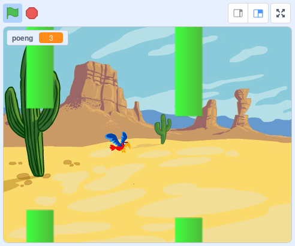

# Om oppgaven {.activity}

Nå skal vi lage vår egen versjon av spillet __Flappy Bird__. Du styrer fuglen
__Flakse__ ved å trykke på mellomromtasten for å flakse med vingene. Du må holde
Flakse flyvende og prøve å styre mellom rørene!

## Oppgaven passer til: {.check}

 __Fag__: Kunst og håndtverk, matematikk, naturfag.

__Anbefalte trinn__: 3.-10. trinn.

__Tema__: Spill, gravitasjon, variabler

__Tidsbruk__: Dobbelttime eller mer.

## Kompetansemål {.challenge}

- [ ] __Kunst og håndtverk, 7. trinn__: tegne form, flate og rom ved hjelp av
      virkemidler som kontraster, skygge, proporsjoner og perspektiv

- [ ] __Kunst og håndtverk, 7. trinn__: bruke programmering til å skape
      interaktivitet og visuelle uttrykk

- [ ] __Matematikk, 4. trinn__: eksperimentere med og forklare plasseringer i
      koordinatsystemet

- [ ] __Matematikk fordypning, 10. trinn__: diskutere, planlegge, lage og vurdere
      spilldesign og egne spill

- [ ] __Naturfag, 10. trinn__: bruke og lage modeller for å forutsi eller beskrive
      naturfaglige prosesser og systemer og gjøre rede for modellenes styrker
      og begrensinger

## Forslag til læringsmål {.challenge}

- [ ] Elevene kan bygge et spill ved hjelp av enkle geometriske grunnformer som
      dekorative formelementer.

- [ ] Elevene kan tegne enkle figurer ved hjelp av vektorgrafikk.

- [ ] Elevene kan bruke koordinatsystemet til å plassere og kontrollere en
      figur.

- [ ] Elevene kan kontrollere avstanden mellom elementer i et koordinatsystem
      ved å bruke variabler.

- [ ] Elevene kan forklare hvordan tyngdekraften fungerer, og at alle objekter
      påvirkes av denne.

- [ ] Elevene kan bruke variabler for å telle poeng.

- [ ] Elevene kan bruke kode for å gjenbruke figurer med samme oppførsel.

## Forslag til vurderingskriterier {.challenge}

- [ ] Eleven viser middels måloppnåelse ved å fullføre oppgaven.

- [ ] Eleven viser høy måloppnåelse ved å videreutvikle egen kode basert på
      oppgaven, for eksempel ved å gjøre en eller flere av variasjonene
      nedenfor.

## Forutsetninger og utstyr {.challenge}

- [ ]  __Forutsetninger__: Elevene bør være komfortable med Scratch.

- [ ] __Utstyr__: Datamaskiner med Scratch installert. Eventuelt kan elevene
      bruke Scratch i nettleseren dersom de har en bruker (eller registrerer
      seg) på [scratch.mit.edu/](http://scratch.mit.edu/){target=_blank}.
      Elevene kan gjerne jobbe to og to sammen.

## Fremgangsmåte

[Klikk her for å se
oppgaveteksten.](../flaksefugl/flaksefugl.html){target=_blank} _Vi har dessverre
ikke noen tips, erfaringer eller utfordringer tilknyttet denne oppgaven enda._

## Variasjoner {.challenge}

- [ ] Legg til tyngdekraft i spillet.

- [ ] Juster koden slik at Flakse faller ut av skjermen når spillet er over.

- [ ] Legg til rekorder, slik at elevene kan spille mot hverandre og sammenligne
      resultater.

## Eksterne ressurser {.challenge}

- [ ] Her er en
      [Youtube-video](https://www.youtube.com/watch?v%3DfQoJZuBwrkU){target=_blank}
      av Flappy Bird, som spillet er basert på.
