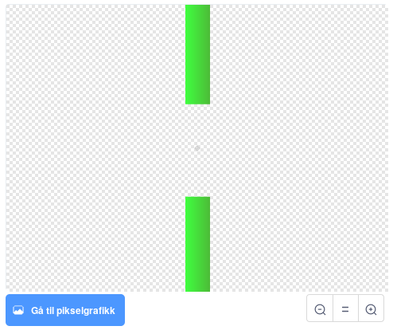

# Introduksjon {.intro}

Me skal lage vår eigen versjon av spelet __Flappy Bird__. Du styrar fuglen
__Flakse__ ved å trykke mellomromtasten for å flakse med vengjene. Du må halde
Flakse flygande og prøve å styre mellom røra.


# Steg 1: Få Flakse til å dette {.activity}

*Me startar enkelt, med å introdusere Flakse og få han til å dette.*

## Sjekkliste {.check}

- [ ] Start eit nytt Scratch-prosjekt. Slett katten ved å klikke på søppelkassen.

- [ ] Byt ut bakgrunnen med eit landskap. `Desert` er eit bra val.

- [ ] Legg til Flakse-figuren. Du treng ein figur med drakter for vengjer opp
  og vengjer ned. Til dømes kan du bruke `Parrot`.

- [ ] Byt namn på figuren til `Flakse`.

- [ ] Gi Flakse det følgjande skriptet:

  ```blocks
  når @greenFlag vert trykt på
  gå til x: (-50) y: (0)
  for alltid
      endra y med (-3)
  slutt
  ```

## Test prosjektet {.flag}

__Klikk det grøne flagget.__

- [ ] Startar Flakse midt på skjermen og beveger seg nedover?

# Steg 2: Få Flakse til å flyge {.activity}

*No vil me at Flakse skal flyge oppover når du trykkar mellomrom.*

## Sjekkliste {.check}

- [ ] Klikk på `Drakter` og gi dei to draktene namna `Venger opp` og
  `Venger ned`.

- [ ] Gå tilbake til `Skript` og legg til dette skriptet:

  ```blocks
  Når [mellomrom v] vert trykt
  byt drakt til [Venger ned v]
  gjenta (10) gongar
      endra y med (6)
  slutt
  byt drakt til [Venger opp v]
  gjenta (10) gongar
      endra y med (6)
  slutt
  ```

## Test prosjektet {.flag}

__Klikk det grøne flagget.__

- [ ] Klarar du å kontrollere Flakse med mellomromtasten?

- [ ] La du merke til at om du trykkar mellomrom fleire gonger raskt etter
  kvarandre, så flaksar Flakse nokre gonger berre ein gong? Det er det neste
  me skal fikse.

# Steg 3: Gjer kontrollen betre {.activity}

*Me vil at Flakse skal reagere kvar einaste gong me trykkar mellomrom. Men når
me trykkar mellomrom startar to løkker etter kvarandre. Viss me trykkar
mellomrom att før desse to løkkene er ferdige, så skjer det ikkje noko. For å
løyse problemet lagar me ein variabel som teller kor mange flaks Flakse skal
gjere.*

## Sjekkliste {.check}

- [ ] Lag ein ny variabel og kall den `flaks`{.blockdata}. Vel at den berre
  skal gjelde `For denne figuren`. Klikk `OK`. Skjul variabelen ved å ta bort
  avhukinga framfor variabelen.

- [ ] Me skal gjere om på skriptet som startar med `når mellomrom
  vert trykt`{.blockevents}. Dra i `byt drakt til Venger
  ned`{.blocklooks}-klossen slik at den og klossane under losnar. Legg desse
  klossane til sides. Me skal bruke dei att veldig snart.

- [ ] Lag eit nytt skript. Legg merke til at klossane du la til sides kan bli
  brukt inne i `gjenta til flaks = 0`{.blockcontrol}-løkka:

  ```blocks
  når @greenFlag vert trykt på
  set [flaks v] til [0]
  byt drakt til [Venger opp v]
  for alltid
      gjenta til <(flaks) = [0]>
          endra [flaks v] med (-1)
          byt drakt til [Venger ned v]
          gjenta (10) gongar
              endra y med (6)
          slutt
          byt drakt til [Venger opp v]
          gjenta (10) gongar
              endra y med (6)
          slutt
      slutt
  slutt
  ```

- [ ] Til slutt må du leggje det følgande skriptet på `når mellomrom
  vert trykt`{.blockevents}-klossen som vart til overs tidlegare:

  ```blocks
  når [mellomrom v] vert trykt
  endra [flaks v] med (1)
  ```

- [ ] No skal det vere tre ulike skript på Flakse.

## Test prosjektet {.flag}

__Klikk det grøne flagget.__

- [ ] Flaksar Flakse ein gong for kvar gong du har trykka mellomromtasten?

# Steg 4: Legg til røyra {.activity}

*Me vil leggje til hindringar Flakse kan flyge forbi.*

## Sjekkliste {.check}

- [ ] Legg til ein ny figur ved å klikke på *Teikn*-knappen,
  .

- [ ] Viss det står `Punktgrafikk` nede til høgre, må du klikke på `Byt til
  vektorgrafikk`-knappen.

- [ ] Klikk på `Zoom -` slik at du kan sjå heile teikneområdet.

- [ ] Klikk på `Rektangel`, vel ei farge ved å klikke på `Fyll`-knappen
  øvst til venstre.

- [ ] Klikk og dra to boksar, ein frå toppen og ein frå botnen, i midten av
  teikneområdet. Det skal sjå omlag slik ut:

  

- [ ] Du kan skuggeleggje røyra ved å klikke på `Fyll farge` og velje ein av
  skuggemetodane nede til venstre. Vel to variantar av same farge, ein for
  framgrunnen og ein for bakgrunnen. Når du klikkar på ein firkant med
  fylleverktøyet får du ein fin effekt.

- [ ] Gi den nye figuren namnet `Røyr`.

# Steg 5: Få røyra til å bevege seg {.activity}

*No skal me få røyra til å flytte seg og gjere høgda tilfeldig, slik at me får
ei hinderløype for Flakse.*

## Sjekkliste {.check}

- [ ] Klikk på `Røyr`-figuren og vel `Skript`.

- [ ] Legg til desse to skripta:

  ```blocks
  når @greenFlag vert trykt på
  gøym
  set storleik til (200)%
  for alltid
      lag klon av [meg v]
      vent (2) sekund
  slutt

  når eg startar som klon
  gå til x: (240) y: (tilfeldig tal frå (-80) til (80))
  vis
  gjenta (120) gongar
      endra x med (-4)
  slutt
  slett denne klonen
  ```

## Test prosjektet {.flag}

__Klikk det grøne flagget.__

- [ ] Kjem det mange røyr flygande mot Flakse?

- [ ] Har røyra opningar Flakse kan flyge gjennom?

- [ ] Viss du synest det er vanskeleg å flyge Flakse gjennom opningane kan du
  til dømes endre på opninga mellom røyra med teikneverktyet. Ein annan
  moglegheit er å lage Flakse mindre.

# Steg 6: Finn ut om Flakse krasjar med røyra {.activity}

*For at spelet skal bli vanskeleg må spelaren styre Flakse gjennom åpningane
mellom røyra utan å kome borti verken røyr eller kanten av skjermen. Me skal
leggje til nokre klossar som merkar om Flakse krasjar.*

## Sjekkliste {.check}

- [ ] Me legg til ein lyd som me kan spele av når Flakse krasjar. Klikk på
  `Flakse`-figuren og så på `Lydar`.

- [ ] Klikk på `Vel lyd frå biblioteket`.

- [ ] Vel ein krasjelyd for `Flakse`. `Screech` er ein kul lyd.

- [ ] Klikk deg tilbake til `Skript`-fana.

- [ ] Legg til dette skriptet på Flakse:

  ```blocks
  når @greenFlag vert trykt på
  vent til <<rører [kant v]?> eller <rører [Røyr v]?>>
  start lyden [screech v]
  sei [Du tapte!]
  send meldinga [Tap v]
  stopp [andre skript i figuren v] :: control
  ```

- [ ] Så må du klikke på `Røyr`-figuren og leggje til dette skriptet:

  ```blocks
  når eg får meldinga [Tap v]
  stopp [andre skript i figuren v] :: control
  ```

## Test prosjektet {.flag}

__Klikk det grøne flagget.__

- [ ] Stoppar spelet viss Flakse kjem borti eit røyr eller kanten av brettet?

# Steg 7: Legg til poeng {.activity}

*Spelaren skal få eitt poeng kvar gong Flakse flyg gjennom ei røyropning.*

## Sjekkliste {.check}

- [ ] Me legg til ein lyd som kan spelast kvar gong Flakse får poeng. Klikk
  på `Røyr`-figuren og legg til ein lyd. `Bird` er eit lurt val.

- [ ] Gå tilbake til `Skript`-fana.

- [ ] Lag ein ny variabel som skal gjelde `For alle figurer`. Kall den
  `poeng`{.blockdata}.

- [ ] Legg til eit skript som set poenga til 0 når det grøne flagget
  blir klikka. Dette klarar du sjølv!

- [ ] Legg til dette skriptet på `Røyr`:

  ```blocks
  når eg startar som klon
  vent til <(x-posisjon) < ([x-posisjon v] av [Flakse v])>
  endra [poeng v] med (1)
  start lyden [bird v]
  ```

## Test prosjektet {.flag}

__Klikk det grøne flagget.__

- [ ] Får du poeng når Flakse flyg gjennom ei opning mellom røyra?

- [ ] Korleis kan du gjere spelet lettare eller vanskelegare?

## Lagre prosjektet ditt {.save}

Supert, du har laga din eigen enkle versjon av Flappy Bird-spelet!

Her er nokre fleire ting du kan prøve:

## Utfordring 1: Legg til tyngdekraft {.challenge}

Når noko dett på grunn av tyngdekrafta aukar farta jo lengre fallet varar.
Me skal prøve å etterlikne denne måten å dette på.

- [ ] Legg til ein ny variabel for `Flakse` som heiter `løft`{.blockdata}.
  Variabelen skal gjelde for `For denne figuren`.

- [ ] Endre skriptet som styrer korleis Flakse dett:

  ```blocks
  når @greenFlag vert trykt på
  set [løft v] til [0]
  gå til x: (-50) y: (0)
  for alltid
      endra y med (løft)
      endra [løft v] med (-0.2)
  slutt
  ```

- [ ] Det neste steget er å endre flakseskriptet:

  ```blocks
  når @greenFlag vert trykt på
  set [flaks v] til [0]
  byt drakt til [Venger opp v]
  for alltid
      gjenta til <(flaks) = [0]>
          endra [flaks v] med (-1)
          byt drakt til [Venger ned v]
          endra [løft v] med (4)
          vent (0.1) sekund
          byt drakt til [Venger opp v]
          vent (0.1) sekund
      slutt
  slutt
  ```

## Test prosjektet {.flag}

__Klikk det grøne flagget.__

- [ ] Fell Flakse fortare jo lengre han dett?

## Utfordring 2: Fall ut av skjermen {.challenge}

Når spelaren tapar vil me at Flakse skal dette ned og ut av skjermen.

- [ ] Bytt ut `send meldinga Tap`{.blockevents}-klossen med `send
  meldinga Fall`{.blockevents} i skriptet som merkar når Flakse
  krasjar i kanten eller i eit røyr. Slett `stopp`{.blockcontrol}-klossen på
  slutten av skriptet.

- [ ] Legg til desse nye skripta på `Flakse`-figuren:

  ```blocks
  når eg får meldinga [Fall v]
  for alltid
      snu @turnRight (5) gradar
  slutt

  når eg får meldinga [Fall v]
  gjenta til <(y-posisjon) < [-180]>
      endra y med (løft)
      endra [løft v] med (-0.2)
  slutt
  gøym
  send meldinga [Tap v]
  stopp [andre skript i figuren v] :: control
  ```

- [ ] Du må leggje til ein `vis`{.blocklooks}-kloss og setje retninga for
  Flakse når spelet startar på nytt.

## Test prosjektet {.flag}

__Klikk det grøne flagget.__

- [ ] Fell Flakse ut av skjermen når han treff eit røyr?

- [ ] Flyg Flakse riktig veg når spelet startar att?

## Test prosjektet {.flag}

__Klikk det grøne flagget.__

- [ ] Oppdaterer rekorden seg kvar gong du set ein ny rekord?

## Lagre prosjektet ditt {.save}

__Gratulerer, du er ferdig med spelet! Kva er rekorden din?__

Ikkje gløym å dele spelet med venene dine. Trykk på `Legg ut` for at andre
skal få prøve!
