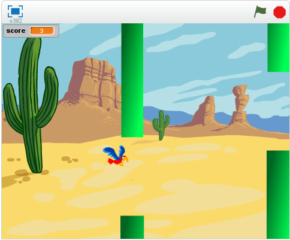
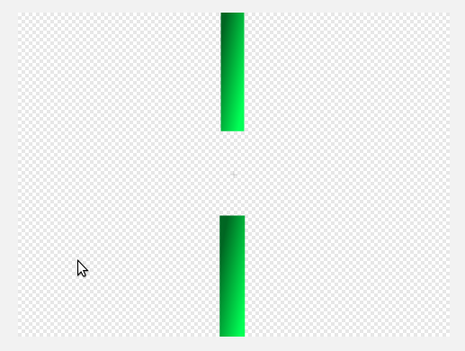

# Introduksjon {.intro}

Nå skal vi lage vår egen versjon av spillet __Flappy Bird__. Du styrer
fuglen __Flakse__ ved å trykke på mellomromtasten for å flakse med
vingene. Du må holde Flakse flyvende og prøve å styre mellom rørene!



# Steg 1: Få Flakse til å falle {.activity}

*Vi begynner enkelt, ved å introdusere Flakse og få ham til å falle.*

## Sjekkliste {.check}

+ Start et nytt Scratch-prosjekt. Slett katten ved å høyreklikke den
  og velge `Slett`. Alternativt kan du klikke på saksen i topplinjen,
  og deretter på katten.

+ Bytt ut bakgrunnen med et landskap. `Desert` er et bra valg.

+ Legg til Flakse-figuren. Du trenger en figur med drakter for vinger
  opp og vinger ned. `Parrot` er et bra forslag.

+ Bytt navn på figuren til `Flakse`.

+ Gi Flakse dette skriptet:

  ```blocks
  når grønt flagg klikkes
  gå til x: (-50) y: (0)
  for alltid
      endre y med (-3)
  slutt
  ```

## Test prosjektet {.flag}

__Klikk det grønne flagget.__

+ Starter Flakse midt på skjermen og faller mot bunnen?

# Steg 2: Få Flakse til å fly {.activity}

*Nå vil vi at Flakse skal fly oppover når du trykker mellomromtasten.*

## Sjekkliste {.check}

+ Klikk på `Drakter` og gi de to draktene navnene `Vinger opp` og
  `Vinger ned`.

+ Gå tilbake til `Skript` og legg til dette skriptet:

  ```blocks
  Når [mellomrom v] trykkes
  bytt drakt til [Vinger ned v]
  gjenta (10) ganger
      endre y med (6)
  slutt
  bytt drakt til [Vinger opp v]
  gjenta (10) ganger
      endre y med (6)
  slutt
  ```

## Test prosjektet {.flag}

__Klikk det grønne flagget.__

+ Klarer du å kontrollere Flakse med mellomromtasten?

+ La du merke til at om du trykker mellomrom flere ganger raskt
  etterhverandre så flakser Flakse av og til bare en gang? Det er det
  neste vi skal fikse.

# Steg 3: Gjør kontrollen bedre {.activity}

*Vi vil at Flakse skal reagere hver gang vi trykker mellomrom. Men når
 vi trykker mellomrom så starter to løkker etter hverandre. Hvis vi
 trykker mellomrom før disse to løkkene er ferdig så skjer det ikke
 noe. For å løse dette problemet skal vi bruke en variabel til å telle
 hvor mange flaks vi trenger å gjøre.*

## Sjekkliste {.check}

+ Lag en ny variabel og kall den `flaks`{.blockdata}. Velg at den bare
  skal gjelde `For denne figuren`. Klikk `OK`. Skjul variabelen ved å
  ta vekk avhukingen foran variabelen.

+ Vi skal nå gjøre om på skriptet som starter med `når mellomrom
  trykkes`{.blockevents}. Dra i `bytt drakt til Vinger
  ned`{.blocklooks}-klossen slik at den og klossene under løsner. Legg
  disse klossene til siden. Vi skal bruke dem igjen straks.

+ Lag et nytt skript. Legg merke til at klossene du nettopp la til
  siden kan brukes igjen inne i `gjenta til flaks =
  0`{.blockcontrol}-løkken:

  ```blocks
  når grønt flagg klikkes
  sett [flaks v] til [0]
  bytt drakt til [Vinger opp v]
  for alltid
      gjenta til <(flaks) = [0]>
          endre [flaks v] med (-1)
          bytt drakt til [Vinger ned v]
          gjenta (10) ganger
              endre y med (6)
          slutt
          bytt drakt til [Vinger opp v]
          gjenta (10) ganger
              endre y med (6)
          slutt
      slutt
  slutt
  ```

+ Til slutt, legg følgende skript på `når mellomrom
  trykkes`{.blockevents}-klossen som ble til overs tidligere:

  ```blocks
  når [mellomrom v] trykkes
  endre [flaks v] med (1)
  ```

+ Du skal nå ha tre forskjellige skript på Flakse.

## Test prosjektet {.flag}

__Klikk det grønne flagget.__

+ Flakser Flakse en gang for hver gang du trykker mellomromtasten?

# Steg 4: Legg til rørene {.activity}

*Vi vil legge til noen hindringer som Flakse kan fly igjennom.*

## Sjekkliste {.check}

+ Legg til en ny figur ved å klikke på *Tegn ny figur*-knappen,
  .

+ Hvis det står `Punktgrafikk` nede til høyre, klikk på `Bytt til
  vektorgrafikk`-knappen.

+ Klikk på `Zoom -` så du kan se hele tegneområdet.

+ Klikk på `Rektangel`, velg en farge og klikk på `Fylt
  rektangel`-knappen nederst til venstre.

+ Klikk og dra to bokser, en fra toppen og en fra bunnen i midten av
  tegneflaten. Det skal se omtrent sånn ut:

  

+ Du kan skyggelegge rørene ved å klikke på `Fyll farge` og klikke på
  en av skyggemetodene i firkantene nede til venstre. Velg to
  varianter av samme farge: en for forgrunnen og en for bakgrunnen.
  Når du klikker på en firkant med fylleverktøyet får du en fin
  effekt.

+ Gi den nye figuren navnet `Rør`.

# Steg 5: Få rørene til å bevege seg{.activity}

*Nå skal vi få rørene til å flytte seg og gjøre høyden tilfeldig slik
 at vi får en hinderløype til Flakse.*

## Sjekkliste {.check}

+ Klikk på `Rør`-figuren og velg `Skript`.

+ Legg til disse to skriptene:

  ```blocks
  når grønt flagg klikkes
  skjul
  sett størrelse til (200)%
  for alltid
      lag klon av [meg v]
      vent (2) sekunder
  slutt

  når jeg starter som klon
  gå til x: (240) y: (tilfeldig tall fra (-80) til (80))
  vis
  gjenta (120) ganger
      endre x med (-4)
  slutt
  slett denne klonen
  ```

## Test prosjektet {.flag}

__Klikk det grønne flagget.__

+ Kommer det mange rør flygende mot Flakse?

+ Har rørene åpninger til å fly gjennom?

+ Om du synes det er vanskelig å fly Flakse gjennom åpningene kan du
  for eksempel endre på åpningen mellom rørene med tegneverktøyet. En
  annen mulighet er å lage Flakse mindre.

# Steg 6: Finn ut om Flakse kræsjer med rørene {.activity}

*For at spillet skal bli vanskelig må spilleren styre Flakse gjennom
 åpningene mellom rørene uten å komme borti hverken rør eller kanten
 av skjermen. Vi skal legge til noen klosser som merker om Flakse
 kræsjer.*

## Sjekkliste {.check}

+ Vi legger til en lyd som vi kan spille når Flakse kræsjer. Klikk på
  `Flakse`-figuren og så på `Lyder`.

+ Klikk på `Velg lyd fra biblioteket`.

+ Velg en kræsjelyd for `Flakse`.  `Screech` er en kul lyd.

+ Klikk deg tilbake til `Skript`-fanen.

+ Legg til dette skriptet på Flakse:

  ```blocks
  når grønt flagg klikkes
  vent til <<berører [kant v]?> eller <berører [Rør v]?>>
  spill lyden [screech v]
  si [Du tapte!]
  send melding [Tap v]
  stopp [andre skript i figuren v] :: control
  ```

+ Klikk så på `Rør`-figuren og legg til dette skriptet:

  ```blocks
  når jeg mottar [Tap v]
  stopp [andre skript i figuren v] :: control
  ```

## Test prosjektet {.flag}

__Klikk det grønne flagget.__

+ Stopper spillet hvis Flakse kommer borti et rør eller kanten av
  brettet?

# Steg 7: Legg til poeng {.activity}

*Spilleren skal score ett poeng hver gang Flakse flyr gjennom en
 røråpning.*

## Sjekkliste {.check}

+ Vi legger til en lyd hver gang Flakse scorer ett poeng. Klikk på
  `Rør`-figuren og legg til en lyd. `Bird` er et lurt valg.

+ Gå tilbake til `Skript`-fanen.

+ Lag en ny variabel som skal gjelde `For alle figurer`. Kall den
  `poeng`{.blockdata}.

+ Legg til et skript som setter poengene til 0 når det grønne flagget
  klikkes. Dette klarer du selv!

+ Legg så til dette skriptet på `Rør`:

  ```blocks
  når jeg starter som klon
  vent til <(x-posisjon) < ([x-posisjon v] av [Flakse v])>
  endre [poeng v] med (1)
  spill lyden [bird v]
  ```

## Test prosjektet {.flag}

__Klikk det grønne flagget.__

+ Scorer du poeng når Flakse flyr forbi en åpning mellom rørene?

+ Hvordan kan du lage dette spillet lettere eller vanskeligere?

## Lagre prosjektet ditt {.save}

Supert, du har laget ferdig din egen enkle versjon av Flappy
Bird-spillet.

Her er noen flere ting du kan prøve:

## Utfordring 1: Legg til tyngdekraft {.challenge}

Når noe faller på grunn av tyngdekraft øker farten jo lenger fallet
varer. Vi skal prøve å etterligne denne måten å falle på.

+ Legg til en ny variabel for `Flakse` som heter `løft`{.blockdata}.
  Variablen skal gjelde for `For denne figuren`.

+ Endre Flakses falleskript:

  ```blocks
  når grønt flagg klikkes
  sett [løft v] til [0]
  gå til x: (-50) y: (0)
  for alltid
      endre y med (løft)
      endre [løft v] med (-0.2)
  slutt
  ```

+ Deretter må vi endre Flakses flakseskript:

  ```blocks
  når grønt flagg klikkes
  sett [flaks v] til [0]
  bytt drakt til [Vinger opp v]
  for alltid
      gjenta til <(flaks) = [0]>
          endre [flaks v] med (-1)
          bytt drakt til [Vinger ned v]
          endre [løft v] med (4)
          vent (0.1) sekunder
          bytt drakt til [Vinger opp v]
          vent (0.1) sekunder
      slutt
  slutt
  ```

## Test prosjektet {.flag}

__Klikk det grønne flagget.__

+ Faller Flakse fortere jo lenger han detter?

## Utfordring 2: Fall ut av skjermen {.challenge}

Når spilleren taper vil vi at Flakse faller ned og ut av skjermen.

+ Bytt ut `send meldingen Tap`{.blockevents}-klossen med `send
  meldingen Fall`{.blockevents} i skriptet som merker når Flakse
  kræsjer i kanten eller i et rør. Slett
  `stopp`{.blockcontrol}-klossen på slutten av skriptet.

+ Legg til disse nye skriptene på `Flakse`-figuren:

  ```blocks
  når jeg mottar [Fall v]
  for alltid
      vend høyre (5) grader
  slutt

  når jeg mottar [Fall v]
  gjenta til <(y-posisjon) < [-180]>
      endre y med (løft)
      endre [løft v] med (-0.2)
  slutt
  skjul
  send melding [Tap v]
  stopp [andre skript i figuren v] :: control
  ```

+ Du må også legge til en `vis`{.blocklooks}-kloss samt sette Flakses
  retning når spillet starter på nytt.

## Test prosjektet {.flag}

__Klikk det grønne flagget.__

+ Faller Flakse ut av skjermen når han treffer et rør?

+ Flyr Flakse riktig vei når spillet starter igjen?

## Utfordring 3: Legg til rekorder {.challenge}

+ Lag en ny variabel og merk av `Nett variabel (lagret på
  nett)`-boksen. Kall variabelen `Rekord`{.blockdata}.

+ Når spillet er ferdig må vi sjekke om det er en ny rekord. Det gjør
  vi ved å endre `Tap`-skriptet på `Rør` slik:

  ```blocks
  når jeg mottar [Tap v]
  hvis <(poeng) > (Rekord)>
      sett [Rekord v] til (poeng)
  slutt
  stopp [andre skript i figuren v] :: control
  ```

## Nettvariabler {.protip}

Nettvariabler gir deg muligheten til å huske ting mellom forskjellige
brukere og forskjellige kjøringer av spillet ditt (i motsetning til
vanlige variabler hvor verdiene blir nullstilt hver gang du trykker
det grønne flagget). Dette er nøyaktig det vi trenger for å huske hva
rekorden i spillet er.

Nettvariabler er fortsatt litt eksperimentelle, og for tiden får ikke
nye brukere av Scratch lov til å lage slike variabler. Hvis du ikke
får lov til å lage en slik variabel må du hoppe over den siste
utfordringen.

## Test prosjektet {.flag}

__Klikk det grønne flagget.__

+ Oppdaterer rekorden seg hver gang du setter ny rekord?

## Lagre prosjektet ditt {.save}

__Gratulerer, du er ferdig med spillet! Hva er rekorden din?__

Ikke glem å dele spillet med vennene dine. Trykk på `Legg ut` for at
andre skal få prøve!
