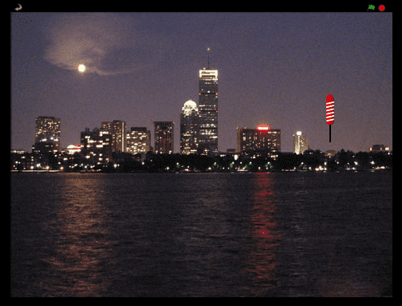

# Introduksjon {.intro}

У цьому проєкті ми запустимо феєрверк над містом.




# Підготовка: Завантаж файли зображень {.activity}

Цю першу частину ви можете виконати з допомогою дорослих!

## Sjekkliste {.check}

- [ ] Завантажте zip-файл fyrverkeri_lydogbilder.zip  і помістіть його на робочий стіл вашого комп’ютера або в інше місце, 
     де ви його зможете знайти пізніше.

- [ ]  Розпакуйте zip-файл, клацнувши по ньому правою кнопкою миші і вибравши `Екстрактувати все` або `Розпакувати файли` або щось подібне.

# Крок 1: Створити феєрверк, що летить до курсора миші {.activity}

*Ми почнемо з імпорту різних зображень, які ми будемо використовувати в грі.*

## Контрольний список {.check}

- [ ] Створіть новий проєкт у Scratch. Видаліть кота, клацнувши по ньому правою кнопкою миші і вибравши `вилучити`.

- [ ] Змініть фон на, наприклад, `Поза приміщенням/city-with-water`. 

- [ ] Натисніть *"Обрати персонаж: Завантажити персонаж"*, , 
  щоб додати фігуру феєверку до проекту `fyrverkeri_lydogbilder/rocket.png`.

- [ ] Ми хочемо, щоб феєрверк зник, коли ви натиснете на зелений прапорець.

  ```blocks
  коли @greenFlag натиснуто
  сховати
  ```

Тепер ми зробимо так, щоб феєрверк рухався до курсора миші, коли ви натискаєте клавішу пробіл.

- [ ] Додайте блок `коли клавішу пропуск натиснуто`{.blockevents}. Потім створіть два блоки, 
  які зроблять феєрверк видимим і дозволять йому рухатися до курсора миші.

  ```blocks
  коли клавішу [пропуск v] натиснуто
  показати
  ковзати (1) сек до x: (мишка x) y: (мишка y)
  ```

## Тестування проєкту {.flag}

__Натисніть на зелений прапорець.__

- [ ] Розмістіть курсор миші над сценою і натисніть клавішу пробіл.

- [ ] Ви бачите феєрверк, який рухається до курсора миші?

- [ ] Що відбувається, якщо ви перемістите курсор миші і знову натиснете клавішу пробіл?


## Контрольний список {.check}

Феєрверки зазвичай не літають з боку в бік, тому ви повинні зробити так,
 щоб ваш завжди летів до курсору миші знизу екрана.

- [ ] Перед тим, як запустити феєрверк, використовуйте блок `перейти в` щоб 
  він перемістився до нижньої частини екрану, але при цьому залишався на
  тому ж горизонтальному місці.

  ```blocks
   коли @greenFlag натиснуто
  сховати

   коли клавішу [пропуск v] натиснуто
  перемістити в x: (мишка x) y: (-200)
  показати
  ковзати (1) сек до x: (мишка x) y: (мишка y)
  ```

## Тестування проєкту {.flag}

__Натисніть на зелений прапорець.__

- [ ] Натисніть клавішу пробіл.

- [ ] Чи летить феєрверк до курсора миші знизу екрану?

- [ ] Що відбувається, якщо ви перемістите курсор миші 
  і знову натиснете клавішу пробіл?

## Контрольний список {.check}

- [ ] Нарешті, спробуйте досягти того ж самого, використовуючи кнопку 
  миші замість клавіші пробіл. Для цього ми можемо помістити наш скрипт 
  в блоки `повторювати завжди`{.blockcontrol} та `якщо мишку натиснуто то`{.blockcontrol}.

- [ ] Перемістіть скрипт з `коли клавішу пропуск натиснуто`{.blockevents} до 
   `коли зелений прапорець натиснуто`{.blockevents}, щоб він виглядав так:

  ```blocks
  коли @greenFlag натиснуто
  сховати
  завжди
     якщо <мишку натиснуто?> то
         перемістити в x: (мишка x) y: (-200)
         показати
         ковзати (1) сек до x: (мишка x) y: (мишка y)
      кінець
  кінець
  ```

## Тестування проєкту {.flag}

__Натисніть на зелений прапорець.__

- [ ] Натисніть кнопку миші над тлом (фоновою картинкою). 
  Натисніть знову в іншому місці.

- [ ] Чи летять феєрверки?

## Виклик {.challenge}

- [ ] Спробуйте зробити так, щоб деякі феєрверки рухалися трохи повільніше або швидше за інші.

- [ ] Спробуйте змінити спосіб, яким феєрверк летить до курсора миші: 
  наприклад, зробіть його політ дугою.


# Крок 2: Повідомлення іншим елементам {.activity}

*Тепер ми змусимо феєрверк спрацювати!!*

## Контрольний список {.check}

- [ ] Наступний крок - змусити феєрверк надіслати повідомлення решті елементів, 
  коли він спрацює. Ми будемо використовувати це повідомлення пізніше. 
 Створіть нове повідомлення з назвою  `Салют`.


  ```blocks
  коли @greenFlag натиснуто
  сховати
  завжди
     якщо <мишку натиснуто?> то
         перемістити в x: (мишка x) y: (-200)
         показати
         ковзати (1) сек до x: (мишка x) y: (мишка y)
		 сховати
		 оповістити [Салют v]
      кінець
  кінець
  ```

## Тестування проєкту {.flag}

__Натисніть на зелений прапорець.__

- [ ] Спробуйте змінити число в блоці `ковзати`{.blockmotion} , 
щоб феєрверк зник одночасно зі спрацюванням.

## Контрольний список {.check}

- [ ] Завантажте нову фігуру з файлу `fyrverkeri_lydogbilder/firework1.png`.

- [ ] Коли ця фігура отримує повідомлення `Салют` переконайтесь, що вона зникає,
 переміщуємо її до феєрверку за допомогою блоку  `перемістити в`{.blockmotion}, а тоді показуємо через 1 чи 3 секунди

  ```blocks
  коли я отримую [Салют v]
  сховати
  перемістити в x: ([значення х v] з [rocket v]) y: ([значення y v] av [rocket v])
  показати
  чекати (3) секунд
  сховати
  ```

## Тестування проєкту {.flag}

__Натисніть на зелений прапорець.__

- [ ] Чи замінюється феєрверк зображенням салюту, коли вона вибухає?

- [ ] Що відбувається, якщо ви тримаєте кнопку миші, рухаючи курсор? 
  (Знайшли якусь помилку? Не хвилюйтеся, ми виправимо це пізніше.)


# Крок 3: Зробіть кожен салют унікальним {.activity}

*Тепер ми додамо трохи різноманітності, щоб всі салюти виглядали по різному.*

## Sjekkliste {.check}

- [ ] Ми можемо зробити кожен салют унікальним, використовуючи блок `встановити ефект колір`{.blocklooks} і
 вибираючи випадковий колір перед тим, як салют з'явиться.

  ```blocks
  коли я отримую [Салют v]
  сховати
  встановити ефект [колір v] в (випадкове від (1) до (200))
  перемістити в x: ([значення x v] av [rocket v]) y: ([значення y v] з [rocket v])
  показати
  чекати (3) секунд
  сховати
  ```

- [ ] Додайте різні зображення салютів як образи, вибравши вкладку `Образи`{.blocklightgrey} для `firework1`. 
  Натиснувши *Обрати образ*, , ви можете додати `firework2.png`, 
  `firework3.png` та `firework4.png` із  `fyrverkeri_lydogbilder`.

- [ ] Можете зробити так, щоб салюти використовували різні образи? 
     (Підказка: Ви можете натиснути на останній завантажений образ).

## Тестування проєкту {.flag}

__Натисніть на зелений прапорець.__

- [ ] Чи має кожен салют інший колір?

- [ ] Чи виглядає кожен салют по-різному?

## Контрольний список {.check}

- [ ]  Наостанок збільшіть розмір салютів після того, як феєрверк спрацює! 
 Замість того, щоб лише чекати 1 секунду, встановіть розмір фігури на 5% перед тим, 
 як вона з'явиться, і після того, як вона стане видимою, 
 збільшіть розмір на 25 разів, використовуючи блок `повторити`{.blockcontrol}.

  ```blocks
  коли я отримую [салют v]
  сховати
  наступний образ
  встановити ефект [колір v] в (випадково від (1) до (200))
  перемістити в x: ([значення x v] av [rocket v]) y: ([значення y v] з [rocket v])
  задати розмір (5)
  показати
  повторити (20) 
      змінити колір на (5)
  кінець
  чекати (1) секунд
  сховати
  ```

## Тестування проєкту {.flag}

__Натисніть на зелений прапорець.__

- [ ] Чи починається салют з центру ракети?

- [ ] Чи збільшується салют поступово?

## Виклик {.challenge}

Спробуйте зробити кожен салют ще більш унікальним: змініть розмір і швидкість зростання салюту.

# Крок 4: Виправлення помилки "надіслати повідомлення"{.activity}

Чи пам’ятаєте ви, що раніше у нас була проблема з триманням кнопки миші натиснутою?


Ця проблема виникає тому, що коли феєрверк надсилає своє повідомлення про спрацювання, 
вона одразу ж повторює цикл із блоку `якщо`{.blockcontrol}. Таким чином, повідомлення про спрацювання 
надсилається до того, як попереднє повідомлення про анімацію завершено.

У світі програмування ми називаємо такі проблеми *багами* (bugs з англійської “жук”),
тому що в старі часи (коли комп'ютери були набагато більшими) могли виникати проблеми через те, 
що комахи застрягали всередині комп'ютерів і таким чином псували програми.

## Контрольний список {.check}

- [ ] Щоб виправити це, ви можете замінити блок `оповістити`{.blockevents} на `оповістити і чекати`{.blockevents}.
 Тоді цикл не повторюватиметься, доки попередній салют не завершиться. 
 Поверніться до `феєрверку` і змініть скрипт:

  ```blocks
   коли @greenFlag натиснуто
  сховати
  завжди
     якщо <мишку натиснуто?> то
         перемістити в x: (мишка x) y: (-200)
         показати
         ковзати (1) сек до x: (мишка x) y: (мишка y)
		 сховати
		 оповістити [Салют v] і чекати
      кінець
  кінець
  ```

## Тестування проєкту {.flag}

__Натисніть на зелений прапорець.__

- [ ] Чи з'являється салют у потрібному місці і в потрібний час?

## Збереження проєкту {.save}

__Вітаю, ви закінчили! Тепер ви можете насолоджуватися грою!__

Не забудьте поділитися своєю грою з усіма своїми друзями та родиною! Натисніть на  `Зберегти негайно` у меню.

Ліцензія: [Code Club World Limited Terms of Service](https://github.com/CodeClub/scratch-curriculum/blob/master/LICENSE.md)
