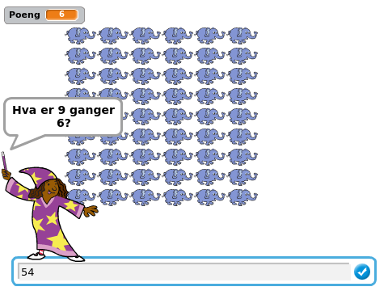
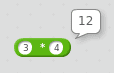
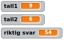
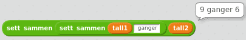
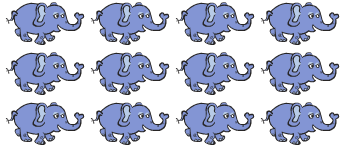

# Introduksjon {.intro}

I dag skal vi lage et nyttig spill, nemlig et spill som hjelper oss å
lære andre ting. Vi skal få hjelp til å lære gangetabellen!



# Steg 1: Læremesteren {.activity}

Vi skal etterhvert lage et spill hvor vi får tilfeldige spørsmål fra
gangetabellen. Etter at vi svarer får vi vite om vi klarte å svare
riktig, og vi vil også få litt hjelp fra tegninger på skjermen. Men
først introduserer vi `Læremester` som skal hjelpe oss med
gangetabellen.

## Sjekkliste {.check}

+ Start et nytt prosjekt og slett kattefiguren.

+ Legg til en ny figur ved å klikke på
  . Velg
  en av _Wizard_-figurene nesten nederst i `Mennesker`-kategorien.
  Kall figuren `Læremester`.

+ Vi skal nå bruke `tilfeldig tall`{.blockoperators}-klosser slik at
  `Læremester` kan spørre oss om tilfeldige gangestykker. Skriv dette
  skriptet:

  ```blocks
  når grønt flagg klikkes
  si (tilfeldig tall fra (2) til (10)) i (2) sekunder
  si [ganger] i (2) sekunder
  si (tilfeldig tall fra (2) til (10)) i (2) sekunder
  ```

## Test prosjektet {.flag}

__Klikk på det grønne flagget.__

+ Stiller `Læremester` deg et gangestykke?

+ Vi skal etterhvert se hvordan vi kan få `Læremester` til å si hele
  teksten, i stedet for bare et ord om gangen.

+ Foreløpig kan du ikke svare `Læremester` (ihvertfall ikke med
  datamaskinen, prøv gjerne å regne ut svaret og si det til dem som
  sitter ved siden av deg).

# Steg 2: Datamaskinen er en kalkulator {.activity}

Du har kanskje ikke tenkt på det, men datamaskinen er en veldig flink
kalkulator. Det engelske ordet _computer_ betyr til og med
_regnemaskin_. Vi skal nå se på hvordan vi får Scratch til å gange
sammen tall.

## Sjekkliste {.check}

+ For å få Scratch til å regne bruker vi
  `Operatorer`{.blockoperators}-klosser. Prøv for eksempel å dra
  gangeklossen - med `*`{.blockoperators}-tegnet - til skriptområdet
  på høyresiden. Skriv inn to tall og klikk på klossen. Scratch
  regner da ut svaret på gangestykket.

  

+ Vi vil nå kombinere gangeklossen med `tilfeldig
  tall`{.blockoperators}-klossen, men for å få dette til trenger vi en
  måte å huske de tilfeldige tallene: **Variabler**.  Gå til
  `Data`{.blockdata}-kategorien og lag tre nye variabler:
  `tall1`{.blockdata}, `tall2`{.blockdata}, og `riktig
  svar`{.blockdata}. La de gjelde for alle figurer.

+ Skriv nå et **helt nytt skript** (la det ligge ved siden av det
  skriptet du skrev i forrige steg).

  ```blocks
  når jeg mottar [Nytt spørsmål v]
  sett [tall1 v] til (tilfeldig tall fra (2) til (10))
  sett [tall2 v] til (tilfeldig tall fra (2) til (10))
  sett [riktig svar v] til ((tall1) * (tall2))
  ```

+ Prøv å klikke på skriptet for å teste det (siden det ikke
  starter med et grønt flagg kan vi ikke teste det på den vanlige
  måten). Om du ser på variablene på scenen skal de endre seg hver
  gang du klikker på skriptet. Er `riktig svar`{.blockdata} rett?

  

# Steg 3: Et skikkelig spørsmål {.activity}

La oss se om vi kan sette sammen disse tallene til et skikkelig spørsmål.

## Sjekkliste {.check}

+ Lag en ny variabel, `spørsmål`{.blockdata}. Også denne skal gjelde
  for alle figurer.

+ Klossen `sett sammen`{.blockoperators} kan brukes for å sette sammen
  flere tall og ord. Vi skal nå bruke to `sett
  sammen`{.blockoperators}-klosser på denne måten:

  ```blocks
  sett sammen (sett sammen [] []) []
  ```

  Dette gir oss plass til tre tall eller ord. Her kan vi putte inn
  `tall1`{.blockdata}, teksten ` ganger ` og
  `tall2`{.blockdata}. Pass på at du har
  mellomrom før og etter `ganger`, det ser best ut da. Om du klikker på den første `sett
  sammen`{.blockoperators}-klossen vil du se hvordan den ferdige
  teksten blir.

  

+ Legg denne klossen til nederst i `Nytt spørsmål`-skriptet:

  ```blocks
  når jeg mottar [Nytt spørsmål v]
  sett [tall1 v] til (tilfeldig tall fra (2) til (10))
  sett [tall2 v] til (tilfeldig tall fra (2) til (10))
  sett [riktig svar v] til ((tall1) * (tall2))
  sett [spørsmål v] til (sett sammen (sett sammen (tall1) [ ganger ]) (tall2))
  ```

+ Nå skal vi få `Læremester` til å stille oss spørsmålet vi har
  satt sammen. **Bytt ut** det første skriptet (med det grønne
  flagget) du skrev med dette:

  ```blocks
  når grønt flagg klikkes
  send melding [Nytt spørsmål v] og vent
  spør (spørsmål) og vent
  ```

## Test prosjektet {.flag}

__Klikk på det grønne flagget.__

+ Stiller `Læremester` deg et skikkelig spørsmål, for eksempel `9
  ganger 6`?

+ Er spørsmålene forskjellige hver gang?

+ Om du vil ha en liten utfordring kan du prøve å bruke flere `sett
  sammen`{.blockoperators}-klosser slik at spørsmålet blir for
  eksempel `Hva er 9 ganger 6?`.

# Steg 4: Er svaret riktig da? {.activity}

Nå som vi kan svare på spørsmål vil vi også vite om vi svarer riktig.

## Sjekkliste {.check}

+ Du ser kanskje at `riktig svar`{.blockdata} vises på scenen? Da blir
  det jo ikke særlig vanskelig! Ta bort alle variablene fra scenen ved
  å gå til `Data`-kategorien og fjern haken foran hver variabel.

+ Nå skal vi bruke en `hvis ellers`{.blockcontrol}-kloss for å gjøre
  forskjellige ting ettersom du svarer riktig eller feil på
  gangestykkene. **Utvid** det ene skriptet ditt på denne måten:

  ```blocks
  når grønt flagg klikkes
  send melding [Nytt spørsmål v] og vent
  spør (spørsmål) og vent
  hvis <(svar) = (riktig svar)>
      si [Ja, så flink du er!] i (2) sekunder
  ellers
      si [Nei, det ble visst feil.] i (2) sekunder
  slutt
  ```

  Klossen `svar`{.blocksensing} husker svaret du skriver når
  `Læremester` spør om gangestykket.

## Test prosjektet {.flag}

__Klikk på det grønne flagget.__

+ Hva skjer om du svarer riktig?

+ Klikk det grønne flagget igjen for å få en ny oppgave. Hva skjer om
  du ikke svarer riktig?

# Steg 5: Flere gangestykker {.activity}

I stedet for å måtte trykke det grønne flagget hele tiden, kan vi be
`Læremester` om å stille oss flere spørsmål!

## Sjekkliste {.check}

+ Vi bruker først en `gjenta`{.blockcontrol}-kloss slik at vi kan få
  flere oppgaver. Legg merke til at vi også sender en `Nytt
  spørsmål`{.blockevents}-melding hvis svaret er riktig. Hvis svaret
  er feil stiller vi det samme spørsmålet en gang til.

  ```blocks
  når grønt flagg klikkes
  send melding [Nytt spørsmål v] og vent
  gjenta (10) ganger
      spør (spørsmål) og vent
      hvis <(svar) = (riktig svar)>
          si [Ja, så flink du er!] i (2) sekunder
          send melding [Nytt spørsmål v] og vent
      ellers
          si [Nei, det ble visst feil.] i (2) sekunder
      slutt
  slutt
  ```

+ Vi kan også telle poeng hver gang du svarer riktig. For å gjøre
  dette trenger vi en ny variabel, `Poeng`{.blockdata}. Denne skal
  gjelde for alle figurer, og denne lar vi være på scenen slik at vi
  ser den.

+ Legg til en kloss i skriptet som setter `Poeng`{.blockdata} til `0`
  rett etter at det grønne flagget klikkes.

+ Legg også til en kloss som endrer `Poeng`{.blockdata} med `1` hvis
  `svar`{.blocksensing} er riktig.

## Test prosjektet {.flag}

__Klikk på det grønne flagget.__

+ Får du flere oppgaver uten at du må trykke på det grønne flagget?

+ Får du et poeng hver gang du svarer riktig?

+ Klarer du 10 poeng?

# Steg 6: Litt hjelp kanskje ... {.activity}

Til slutt skal vi se på hvordan `Læremester` kan gi oss litt hjelp med
gangestykkene. En måte å tenke på gangestykker er at vi har mange ting
som vi plasserer i et rutenett. For eksempel kan vi tenke på **3
ganger 4** som **3** rader med **4** elefanter i hver som dette:



Hvis vi ikke husker hvor mye 3 ganger 4 er, kan vi da telle elefanter
og finne ut at svaret er **12**.

## Sjekkliste {.check}

+ Legg til en ny figur som vi kan få litt hjelp fra. Du kan velge
  hvilken figur du vil, men vi har brukt `Dyr/Elephant`. Gi figuren
  navnet `Hjelper`.

+ For å tegne et rutenett med Hjelpere bruker vi to
  `gjenta`{.blockcontrol}-klosser i tillegg til `stemple
  avtrykk`{.blockpen} som tegner Hjelperne på skjermen. Skriv dette
  skriptet på `Hjelper`-figuren:

  ```blocks
  når jeg mottar [Tegn hjelper v]
  slett
  sett størrelse til (20)%
  vis
  sett y til (140)
  gjenta (tall1) ganger
      sett x til (-140)
      gjenta (tall2) ganger
          stemple avtrykk
          endre x med (40)
      slutt
      endre y med (-25)
  slutt
  skjul
  ```

  Om du har brukt en annen figur som `Hjelper` kan det hende du må
  bruke noen andre tall i dette skriptet. Prøv i så fall først å
  forandre på `sett størrelse til 20%`{.blocklooks}-klossen.

+ Nå skal vi tegne dette rutenettet hver gang vi lager et nytt
  spørsmål. Klikk på `Læremester`, og legg til en kloss nederst i
  `Nytt spørsmål`-skriptet:

  ```blocks
  når jeg mottar [Nytt spørsmål v]
  sett [tall1 v] til (tilfeldig tall fra (2) til (10))
  sett [tall2 v] til (tilfeldig tall fra (2) til (10))
  sett [riktig svar v] til ((tall1) * (tall2))
  sett [spørsmål v] til (sett sammen (sett sammen (tall1) [ ganger ]) (tall2))
  send melding [Tegn hjelper v]
  ```

## Test prosjektet {.flag}

__Klikk på det grønne flagget.__

+ Tegnes det et rutenett av hjelpere til hver oppgave?

## Flere utfordringer {.challenge}

+ Du kan forandre hvor vanskelige gangestykkene er ved å forandre
  tallene i `tilfeldig tall`{.blockoperators}-klossene.

+ Om du gir `Hjelper` flere drakter kan du bruke en `neste
  drakt`{.blocklooks}-kloss i `Tegn hjelper`-skriptet for å få litt
  variasjon i hjelperfigurene. Om du gjør dette er det enklest om
  draktene er omtrent like store.

+ Kanskje `Læremester` kan gi litt mer hjelp når man svarer feil?
  Klarer du få henne til å si `Nei, det riktige svaret er større`
  eller `Nei, det riktige svaret er mindre`?

+ `Læremester` kan mye rart! Kanskje hun kan lære bort andre ting enn
  gangestykker?
