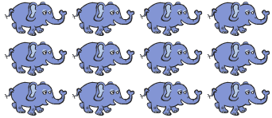

# Вступ {.intro}

Сьогодні ми створимо корисну гру, а саме гру, яка допоможе нам вивчити щось цікаве. Ми будемо використовувати цю гру для вивчення таблиці множення!


# Крок 1: Вчитель {.activity}

Ми поступово створимо гру, де отримаємо випадкові запитання з таблиці множення. Після того, як ми відповімо на запитання, 
то дізнаємось, чи відповіли правильно, і отримаємо трохи допомоги від малюнків на екрані. 
Але спершу представимо `Учителя` який допоможе нам із таблицею множення.

## Контрольний список {.check}

- [ ]  Почніть новий проект і видаліть фігуру кота.

- [ ] Додайте нову фігуру, натиснувши . Виберіть одну з фігур __Чарівників__, 
  що знаходяться майже внизу категорії `Люди`. Назвіть фігуру `Учитель`. 

- [ ] Ми будемо використовувати блоки `випадкове від`{.blockoperators} (маємо на увазі випадкове число), 
      щоб `Вчитель` міг запитати нас про випадкові приклади множення. 
     Напишіть наступний скрипт:
 
  ```blocks
  коли @greenFlag натиснуто
  говорити (випадкове від (2) до (10)) i (2) сек
  говорити [помножити] (2) сек
  говорити (випадкове від (2) до (10)) i (2) сек
  ```

## Тестування проєкту {.flag}

__Натисніть на зелений прапорець.__

- [ ]  Чи задає `Вчитель` вам приклад множення?

- [ ]  Далі ми побачимо, як змусити `Вчителя` говорити весь текст, замість одного слова за раз.

- [ ] Поки що ви не можете відповісти `Вчителю` (принаймні не за допомогою комп’ютера, 
спробуйте обчислити відповідь і сказати її тим, хто сидить поруч із вами). 

# Крок 2: Комп'ютер - це калькулятор {.activity}

Ви, можливо, не думали про це, але комп’ютер – це дуже хороший калькулятор. Англійське слово _computer_ (комп’ютер) 
означає _обчислювальна машина_. Тепер ми подивимось, як змусити Scratch множити числа.

## Контрольний список {.check}

- [ ] Щоб змусити Scratch рахувати, ми використовуємо блоки  `Оператори`{.blockoperators}. Спробуйте, наприклад, перетягнути блок множення 
  (з символом `*`{.blockoperators}) у область скриптів справа. Введіть два числа і натисніть на блок. 
   Scratch обчислить завдання з множення і видасть відповідь.
 
  

- [ ] Тепер ми хочемо поєднати блок множення з блоком `випадкових чисел`{.blockoperators}, але для цього нам потрібен спосіб запам'ятовувати випадкові числа: **змінні**. 
   Перейдіть до категорії `Дані`{.blockdata} та створіть три нові змінні: 
   `Число 1`{.blockdata} , `Число 2`{.blockdata} та `правильна відповідь`{.blockdata}. Виберіть параметр, що вони стосуються всіх фігур.

- [ ] Тепер напишіть **новий скрипт** (нехай він знаходиться поруч із скриптом, який ви написали на попередньому кроці).

  ```blocks
  коли я отримую [Нове запитання v]
  надати [Число 1 v] значення (випадкове від (2) до (10))
  надати [Число 2 v] значення (випадкове від (2) до (10))
  надати [Вірна відповідь v] значення ((Число 1) * (Число 2))
  ```

- [ ] Спробуйте натиснути на скрипт, щоб перевірити його (оскільки він не починається із зеленого прапорця, 
      ми не можемо перевірити його звичайним способом). Якщо ви подивитесь на змінні у полі з права, 
	  вони повинні змінюватися кожного разу, коли ви натискаєте на скрипт. Чи `правильна відповідь`{.blockdata} вірна?

  


# Крок 3: Створіть повноцінне запитання {.activity}

Давайте подивимось, чи можемо ми скласти ці числа так, щоб у нас вийшло повноцінне запитання. 

## Контрольний список {.check}

- [ ] Створіть нову змінну, `запитання`{.blockdata}. Також ця змінна повинна стосуватись усіх фігур.

- [ ] Блок `з'єднати`{.blockoperators} можна використовувати для поєднання кількох чисел і слів. \
  Ми будемо використовувати два блоки `з'єднати`{.blockoperators} таким чином, як на малюнку:

  ```blocks
  з'єднати (з'єднати [] []) []
  ```

  Це дасть нам місце для трьох чисел або слів. Сюди ми можемо вставити `Число 1`{.blockdata}, текст `множити` та `Число 2`{.blockdata}. 
  Переконайтеся, що у вас є пробіли до і після слова `множити`, тому що так текст виглядає краще. 
  Якщо ви натиснете на перший блок `з'єднати`{.blockoperators}, ви побачите, як виглядає готовий текст.

  

- [ ] Додайте цей блок внизу скрипту `Нове запитання`:

  ```blocks
   коли я отримую [Нове запитання v]
  надати [Число 1 v] значення (випадкове від (2) до (10))
  надати [Число 2 v] значення (випадкове від (2) до (10))
  надати [Вірна відповідь v] значення ((Число 1) * (Число 2))
  надати [Запитання v] значення ( з'єднати (з'єднати [Число 1] [ помножити на ]) [Число 2])
  ```

- [ ] Тепер ми змусимо `Вчителя` задати нам питання, яке ми склали. **Замініть** перший скрипт (з зеленим прапорцем), який ви написали, на цей:

  ```blocks
  коли @greenFlag натиснуто
  оповістити [Нове запитання] і чекати
  запитати (Запитання) і чекати
  ```

## Тестування проєкту {.flag}

__Натисніть на зелений прапорець.__

- [ ] Чи задає `Вчитель` вам запитання, наприклад, `9 помножити на 6`?

- [ ] Чи отримуєте ви різні запитання кожного разу?

- [ ] Якщо ви хочете спробувати ускладнити завдання, спробуйте використовувати більше блоків `з'єднати`{.blockoperators},
      щоб питання було, наприклад, `Що є 9 множити на 6?`.

# Крок 4: Чи правильна ваша відповідь? {.activity}

Тепер, коли ми можемо відповідати на питання, ми також хочемо перевірити, чи відповідаємо правильно.

## Контрольний список {.check}

- [ ] Ви, можливо, бачите, що `Вірна відповідь`{.blockdata} відображається у полі з права? То ж знаючи вірну відповідь,  
      вам легко відповісти на запитання! Пропонуємо вам видалити всі змінні із поля з права, перейшовши до категорії 
	  `Дані` і знявши прапорець перед кожною змінною.

- [ ] Тепер ми будемо використовувати блок `якщо інакше`{.blockcontrol}, щоб робити різні речі залежно від того,
      чи правильно ви відповідаєте на приклади множення. **Розширте** один зі своїх скриптів таким чином:

  ```blocks
  коли @greenFlag натиснуто
  оповістити [Нове запитання] і чекати
  запитати (Запитання) і чекати
  якщо <(відповідь) = (Вірна відповідь)>
      говорити [Ти молодець!] (2) сек
	  оповістити [Нове запитання] і чекати
  інакше
      говорити [Ні, це напевно буде помилка.] (2) сек
  slutt
  ```
  Блок `відповідь`{.blocksensing} запам'ятовує відповідь, яку ви вводите, коли `Вчитель` запитує про приклад множення.

## Тестування проекту {.flag}

__Натисніть на зелений прапорець__

- [ ] Що станеться, якщо ви відповісте правильно?

- [ ] Натисніть знову на зелений прапорець, щоб отримати нове завдання. Що станеться, якщо ви не відповісте правильно?

# Крок 5: Додайте більше прикладів множення! {.activity}

Замість того, щоб постійно натискати зелений прапорець, ми можемо попросити `Вчителя` задати нам більше питань!

## Контрольний список {.check}

- [ ] Спершу використаємо блок `повторити`{.blockcontrol}, щоб отримати більше завдань.
  Зверніть увагу, що ми також надсилаємо повідомлення `Нове запитання`{.blockevents}, 
  якщо відповідь правильна. Якщо відповідь неправильна, ставимо те ж саме питання знову.

 ```blocks
 коли @greenFlag натиснуто
  оповістити [Нове запитання] і чекати
  повторити (10)
      запитати (Запитання) і чекати
      якщо <(відповідь) = (Вірна відповідь)>
           говорити [Ти молодець!] (2) сек
	       оповістити [Нове запитання] і чекати
      інакше
           говорити [Ні, це напевно буде помилка.] (2) сек
      slutt
  slutt
 ```

- [ ] Ми також можемо рахувати бали кожного разу, коли ви відповідаєте правильно. 
      Для цього нам потрібна нова змінна `Бали`{.blockdata}. 
      Ця змінна повинна стосуватись усіх фігур і буде відображатися у полі з права, 
	  щоб ми могли її бачити та, відповідно, бачити скільки балів ми набирали.

- [ ] Додайте блок у скрипт, який встановлює `Бали`{.blockdata} на `0` одразу після натискання зеленого прапорця.

- [ ] Додайте також блок, який змінює `Бали`{.blockdata} на `1` , якщо відповідь `вірна`{.blocksensing}.

## Тестування проєкту {.flag}

__Натисніть на зелений прапорець__

- [ ] Чи отримуєте ви більше запитань без необхідності натискати зелений прапорець?

- [ ] Чи отримуєте ви 1 бал кожного разу, коли відповідаєте вірно?

- [ ] Чи зможете ви набрати 10 балів?


# Крок 6: Додамо підказку {.activity}

Під кінець, ми розглянемо, як `Вчитель` може надати нам підказку для множення. 
Один із способів як можна думати про приклади множення - уявити їх як багато речей, розміщених у сітці. 
Наприклад, ми можемо уявити **3 помножити на 4** як **3** ряди з **4** слонами в кожному ось так:



Якщо ми не пам’ятаємо, скільки буде 3 помножити на 4, ми можемо порахувати слонів і дізнатися, що вірна відповідь буде **12**.

## Контрольний спиок {.check}

- [ ] Додайте нову фігуру, від якої ми можемо отримати підказку. 
      Ви можете вибрати будь-яку фігуру, яку хочете, але ми використовували `Тварини/Слон`. 
	  Назвіть фігуру `Помічник`.

- [ ] Щоб намалювати сітку з Помічниками, використаємо два блоки `повторити`{.blockcontrol} разом із блоком `штамп`{.blockpen}, 
     який малює Помічників на екрані. Блок `штамп`{.blockpen} у Scratch 3 переміщено до додаткових функцій. 
	 Ви знайдете його, натиснувши `Додати розширення` внизу зліва і додавши додаткову функцію `Олівець`. 
	 Напишіть цей скрипт для фігури `Помічника`:

  ```blocks
  коли я отримую [Намалюй помічника v]
  очистити все
  задати розмір (20)
  показати
  задати у (140)
  повторити (Число 1)
      задати x (-140)
        повторити (Число 2)
          штамп
          змінити x на (40)
      slutt
      змінити y на (-25)
  slutt
  сховати
  ```

  Якщо ви використовували іншу фігуру як `Помічника`, можливо, вам доведеться використовувати інші числа в цьому скрипті. 
  Спробуйте спочатку змінити блок `встановити розмір на 20%`{.blocklooks}.

- [ ] Тепер ми будемо малювати цю сітку кожного разу, коли створюємо нове питання. 
     Натисніть на `Вчителя` і додайте блок `Нове запитання` у нижній частині скрипта:

  ```blocks
  коли я отримую [Нове запитання v]
  надати [Число 1 v] значення (випадкове від (2) до (10))
  надати [Число 2 v] значення (випадкове від (2) до (10))
  надати [Вірна відповідь v] значення ((Число 1) * (Число 2))
  надати [запитання v] значення (з'єднатии (з'єднати (Число 1) [ помножити на ]) (Число 2))
  оповістити [Намалювати помічника v]
  ```

## Тестування проєкту {.flag}

__Натисніть на зелений прапорець.__

- [ ] Чи малюється сітка з помічників для кожного завдання?

## Виклик {.challenge}

- [ ] Ви можете змінити складність прикладів множення, змінивши числа у блоках `випадкових чисел`{.blockoperators}.

- [ ] Якщо ви додасте кілька образів `Помічнику`, ви можете використовувати блок `наступний спрайт`{.blocklooks} у скрипті `Намалюй помічника`,
      щоб отримати різні фігури Помічників. Якщо ви вирішите це зробити то краще, щоб костюми були приблизно однакового розміру.

- [ ] Можливо, `Вчитель` може надати підказку, коли ви відповідаєте неправильно? 
      Чи зможете ви змусити її сказати: `Ні, правильна відповідь більша` або `Ні, правильна відповідь менша.`

- [ ] `Вчитель` знає багато! Можливо, вона може навчити вас іншим речам, окрім прикладів множення?

Ліцензія [CC BY-SA 4.0](https://creativecommons.org/licenses/by-sa/4.0/deed)
