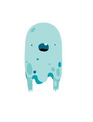

# Introduksjon {.intro}

Her skal me sjå på korleis me kan lage ulike animasjonar med Halloween-tema.
Desse kan me dele med venene våre gjennom Scratch, eller kanskje endå meir
morosamt: projisere dei på ei gardin, eit laken eller ein vegg på Halloween.


# Steg 1: Fyrste animasjon {.activity}

*Me skal starte med å la eit skummelt spøkelse flyge fram og tilbake over
skjermen.*

## Sjekkliste {.check}

- [ ] Start eit nytt prosjekt. Slett kattefiguren, til dømes ved å klikke på
   i menylinja øvst på skjermen og så på katten.

- [ ] Vel ein ny figur ved å klikke
  . Finn
  eit skummelt spøkelse! Me har brukt `Fantasi/Bat`.

- [ ] Trykk på `i`{.blockmotion} øvst til venstre på den nye
  spøkelsesfiguren din. Gi den namnet `Spøkelse`.

  

- [ ] Me skal lage eit enkelt skript for å få spøkelset til å flyge over
  skjermen. Set saman ein `gjenta`{.blockcontrol}- og ein
  `gå`{.blockmotion}-kloss på denne måten:

  ```blocks
  gjenta (200) gongar
      gå (5) steg
  slutt
  ```

- [ ] Klikk på skriptet ditt for å starte animasjonen. Flyttar spøkelset
  ditt på seg? Ser du eit problem?

- [ ] Spøkelset ser ut som om det set seg fast når det kjem til kanten! Det kan
  me fikse med ein `viss ved kant, sprett`{.blockmotion}-kloss:

  ```blocks
  gjenta (200) gongar
      gå (5) steg
      viss ved kant, sprett
  slutt
  ```

- [ ] Klikk på skriptet ditt att. Virkar det betre no?

- [ ] Hmm... Spøkelset flyg opp ned. Det ser litt rart ut. Me kan seie at
  spøkelset berre skal snu seg sidelengs med ein `bruk
  roteringstypen`{.blockmotion}-kloss. Denne legg me heilt fyrst i skriptet på
  denne måten:

  ```blocks
  bruk roteringstypen [vend sidevegs v]
  gjenta (200) gongar
      gå (5) steg
      viss ved kant, sprett
  slutt
  ```

- [ ] Det kjem til å sjå skumlare ut dersom bakgrunnen er svart! Klikk på
  `Scene` heilt til venstre på skjermen, og så på
  `Bakgrunnar`{.blocklightgrey}-fana nesten øvst på skjermen.

- [ ] Klikk på målingsspannet, ,
  og så på den kvite bakgrunnen for å måle den svart.

- [ ] Gi bakgrunnen namnet `Svart`.


# Steg 2: Ein ny animasjon {.activity}

*Som vår andre animasjon skal me få ein flaggermus til å flyge mot oss.*


## Sjekkliste {.check}

- [ ] Lag ein ny figur ved å klikke . Me har brukt `Fantasi/Ghoul`.
  Endre namnet på figuren til `Flaggermus`.

- [ ] For at det skal sjå ut som flaggermusen kjem flygande mot oss vil me at den
  skal starte veldig liten og bli større. Lag dette skriptet:

  ```blocks
  set storleik til (0) %
  gjenta (100) gongar
      endra storleik med (4)
  slutt
  ```

- [ ] Trykk på skriptet for å sjå om det virkar.

- [ ] Eit lite problem er at spøkelset framleis er på skjermen. Me vil skjule
  spøkelset når det ikkje er i rørsle. Klikk på spøkelset og legg til ein
  `vis`{.blocklooks}- og en `gøym`{.blocklooks}-kloss i skriptet:

  ```blocks
  bruk roteringstypen [vend sidevegs v]
  vis
  gjenta (200) gongar
      gå (5) steg
      viss ved kant, sprett
  slutt
  gøym
  ```

- [ ] Klikk på skriptet for spøkelset. Bli spøkelset skjult når det er ferdig
  med å fly fram og attende?

- [ ] Me kan gjere det same med flaggermusen sitt skript. Klikk på flaggermus-figuren og
  endre skriptet til

  ```blocks
  set storleik til (0) %
  vis
  gjenta (100) gongar
      endra storleik med (4)
  slutt
  gøym
  ```

- [ ] For å få litt variasjon vil me at flaggermusen skal animerast over ein skummel
  skog. Klikk på   heilt til venstre på skjermen,
  og vel bakgrunnen  `Utendørs/forest`. Gi bakgrunnen namnet `Skog`.


# Steg 3: Bytte bakgrunnar {.activity}

*No skal me få bakgrunnen til å bytte når me startar ein animasjon.*

## Sjekkliste {.check}

Viss me vil vise spøkelsesanimasjonen på svart bakgrunn må me fyrst klikke
`Scene`, så `Bakgrunner`-fana og velje den svarte bakgrunnen. Så må me klikke på
spøkelsesfiguren, `Skript`-fana og til slutt på sjølve skriptet. Dette er veldig
tungvint! I staden skal me bruke meldingar.

Meldingar gjer det enkelt å få fleire ting til å skje samstundes. No skal me
lage meldinga `Animer spøkelse`. Denne meldinga skal både hjelpe til med å bytte
bakgrunnen og å starte spøkelsesanimasjonen.

- [ ] Klikk på `Scene` og lag dette skriptet:

  ```blocks
  når eg får meldinga [Animer spøkelse v]
  byt bakgrunn til [Svart v]
  ```

- [ ] Klikk på spøkelsesfiguren og endre skriptet ved å leggje til ein kloss
  på toppen:

  ```blocks
  når eg får meldinga [Animer spøkelse v]
  bruk roteringstypen [vend sidevegs v]
  vis
  gjenta (200) gongar
      gå (5) steg
      viss ved kant, sprett
  slutt
  gøym
  ```

- [ ] No ventar skripta på meldinga. For å teste kan me dra klossen

  ```blocks
  send meldinga [Animer spøkelse v]
  ```

  ut ved sidan av det store skriptet til spøkelset.

- [ ] Send meldinga ved å klikke på `send melding`{.blockevents}-klossen.
  Blir spøkelset animert over ein svart bakgrunn?

- [ ] No skal me gjere det same for flaggermusen. Legg til eit nytt skript på scena:

  ```blocks
  når eg får meldinga [Animer flaggermus v]
  byt bakgrunn til [Skog v]
  ```

- [ ] Klikk på flaggermusfiguren og endre skriptet slik

  ```blocks
  når eg får meldinga [Animer flaggermus v]
  set storleik til (0) %
  vis
  gjenta (100) gongar
      endra storleik med (4)
  slutt
  gøym
  ```

- [ ] Legg til klossen

  ```blocks
  send meldinga [Animer flaggermus v]
  ```

  for å teste at animasjonen fungerer.

- [ ] Send meldingane som animerer spøkelset og flaggermusen. Startar animasjonane
  når du klikkar på meldingane? Blir bakgrunnane bytta riktig?


# Steg 4: Kople saman animasjonane {.activity}

*Me vil kople saman animasjonane slik at dei blir vist etter kvarandre heilt
 automatisk, om att og om att.*

## Sjekkliste {.check}

- [ ] Me startar med å lage ei `gjenta for alltid`{.blockcontrol}-løkke på
  scena som sender meldingane

  ```blocks
  gjenta for alltid
      send meldinga [Animer spøkelse v] og vent
      send meldinga [Animer flaggermus v] og vent
  slutt
  ```

- [ ] Klikk på skriptet for å teste det. Trykk den raude stopp-sirkelen for å
  stoppe animasjonen. Blir animasjonane vist etter kvarandre i ei evig løkke?

- [ ] Det ser betre ut viss me legg til ei kort pause mellom animasjonane. Legg
  til eit par `vent`{.blockcontrol}-klossar i skriptet.

  ```blocks
  gjenta for alltid
      send meldinga [Animer spøkelse v] og vent
      vent (1) sekund
      send meldinga [Animer flaggermus v] og vent
      vent (1) sekund
  slutt
  ```

- [ ] For å gjere det enklare å starte animasjonen legg me til ein kloss som
  gjer at animasjonen startar når me klikkar det grøne flagget øvst på skjermen.

  ```blocks
  når @greenFlag vert trykt på
  gjenta for alltid
      send meldinga [Animer spøkelse v] og vent
      vent (1) sekund
      send meldinga [Animer flaggermus v] og vent
      vent (1) sekund
  slutt
  ```

- [ ] Me kan bruke _grønt flagg_-klossar på figurane for å vere sikre på at dei
  startar animasjonen på rett måte. Legg til dette skriptet på spøkelset:

  ```blocks
  når @greenFlag vert trykt på
  gøym
  gå til x: (0) y:(0)
  ```

- [ ] Legg til eit tilsvarande skript på flaggermusen:

  ```blocks
  når @greenFlag vert trykt på
  gøym
  gå til x: (0) y:(0)
  ```

## Test prosjektet {.flag}

__Klikk på det grøne flagget.__

- [ ] Blir begge animasjonane vist etter kvarandre? Dukkar figurane opp når dei
  skal?

- [ ] Du kan gjerne gjere endringar i animasjonane slik at dei ser betre ut.
  Kanskje du vil bytte figurar eller bakgrunn? Korleis får du figurane til å
  bevege seg raskare? Eller meir tilfeldig? Prøv deg fram!


# Steg 5: Teikne dine eigne figurar {.activity}

*No vil me lage ein tredje animasjon der me har laga figuren sjølv.*

## Sjekkliste {.check}

- [ ] Lag ein ny figur ved å trykke på 
  ved sidan av `Ny figur`. Du kan teikne akkurat kva du vil. Her har me teikna
  eit graskar med utsjånad du kanskje kjenner att frå teiknefilmar eller
  teikneserier.

  

- [ ] Lag ei kopi av drakta du akkurat teikna ved å høgreklikke på miniatyren
  under `Ny drakt`-overskrifta og vel `lag ein kopi`.

  

- [ ] Endre litt på den kopierte drakta, slik at du får to drakter som er
  ganske, men ikkje heilt, like. No skal me animere figuren ved å bytte mellom
  dei to draktene.

- [ ] Klikk på `Skript`{.blocklightgrey}-fana og legg på dette skriptet:

  ```blocks
  når eg får meldinga [Animer graskar v]
  vis
  gjenta (50) gongar
      neste drakt
      vent (tilfeldig tal frå (0.1) til (0.3)) sekund
  slutt
  gøym
  ```

  Du kan godt bytte ut meldinga `Animer graskar` med noko som passar for
  figuren din. Klikk på skriptet (eller send ei melding) for å teste
  animasjonen. Ser det bra ut?

- [ ] Du kan sette startposisjonen for den nye figuren:

  ```blocks
  når @greenFlag vert trykt på
  gøym
  gå til x: (0) y: (0)
  ```

- [ ] Så går du til scena og legg til eit skript som byttar til riktig bakgrunn
  for den siste animasjonen. Her har me brukt den svarte bakgrunnen att.

  ```blocks
  når eg får meldinga [Animer graskar v]
  byt bakgrunn til [Svart v]
  ```

- [ ] Til slutt legg me til den siste animasjonen i hovudløkka som viser
  animasjonane:

  ```blocks
  når @greenFlag vert trykt på
  gjenta for alltid
      send meldinga [Animer spøkelse v] og vent
      vent (1) sekund
      send meldinga [Animer flaggermus v] og vent
      vent (1) sekund
      send meldinga [Animer graskar v] og vent
      vent (1) sekund
  slutt
  ```


# Steg 6: Endå fleire animasjonar? {.activity}

### Prøv sjølv {.challenge}

No har me sett nokre døme på korleis me kan lage skumle Halloween-animasjonar.
Prøv å bruke liknande teknikkar for å lage dine eigne animasjonar!

## Legg ut prosjektet {.save}

Når du er fornøgd med animasjonane dine kan du dele det med familie og vener ved
å trykke `Legg ut`.


# Projiser animasjonene {.activity}

*Heilt til slutt kan du bruke dette steget for å lære korleis du kan skremme
 nabolaget med dei skumle animasjonane dine.*

Det enklaste er å sette skjermen i vindauget. Klikk firkanten for
fullskjermvisning øvst til venstre under Scratch-logoen. Viss du får låne ein
projektor til Halloween kan du vise animasjonen utandørs, på ei gardin, eit
laken eller ein vegg, slik som på biletet heilt i starten. I begge tilfella er
det litt dumt at Scratch viser animasjonen med ei kvit ramme på skjermen. For å
gjere det betre kan du følge tipsa under.

## Sjekkliste {.check}

- [ ] Lag ei fil som viser animasjonen din i eit større vindauge med svart
  bakgrunn. For å få det til brukar me litt HTML-kode. Dette er språket som
  brukast til å lage nettsider, og du kan lære meir om det ved å velje
  Web-oppgåvene her.

  Last ned fila [projiser.html](projiser.html). Etter at du har fått til denne
  adressa kan du velje `Fil > lagre som`, eller noko som liknar, i menyen til
  nettlesaren din. Legg fila ein stad du finn ho att.

- [ ] Åpne fila i Notisblokk eller eit tilsvarande program. Du skal sjå ein
  tekst som ser slik ut:

  ```html
  <html>
  <head>
  <title>Halloweenimasjon</title>
  </head>

  <body bgcolor="#000000">
  <div style="overflow-y: hidden; height: 890px; margin-left: auto; margin-right: auto; width: 1180px;" id="applet">
  <iframe
    style="margin-top:-56px; margin-left: -10px"
    allowtransparency="true"
    width="1200"
    height="960"
    src="http://scratch.mit.edu/projects/embed/30923784/?autostart=true"
    frameborder="0"
    scrolling="no"
    seamless="seamless"
    allowfullscreen=""></iframe>
  </div>
  </body>
  </html>
  ```

- [ ] Gøymt inne i teksten står det eit Scratch-prosjektnummer. I dette
  tilfellet er det `30923784`. Du må bytte dette nummeret med prosjektnummeret
  ditt.

### Prosjektnummer {.protip}

For å finne prosjektnummeret ditt kan du sjå i adressefeltet i nettlesaren din
medan du jobbar med prosjektet. som ein del av adressa kan du sjå eit 8-sifra
tal. Dette er prosjektnummeret ditt.

## Sjekkliste {.check}

- [ ] Bytt `30923784` med prosjektnummeret ditt og lagre fila.

- [ ] I nettlesaren din kan du åpne fila du akkurat endra. Vel `Fil > åpne fil`,
  eller noko som liknar, i nettlesaren din. Vel den rette fila.

- [ ] No skal animasjonen din dukke opp med svart bakgrunn.

- [ ] Kople datamaskina di til ein projektor og vis animasjonen din på ein
  passande stad.
