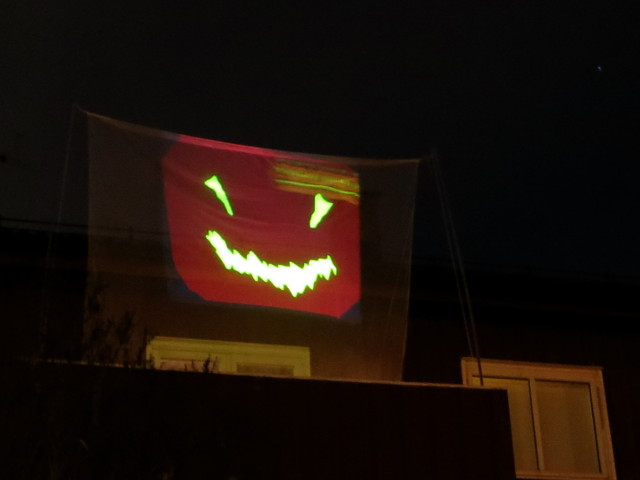
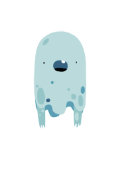
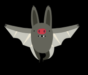
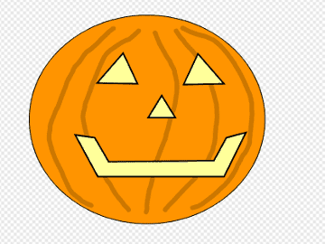
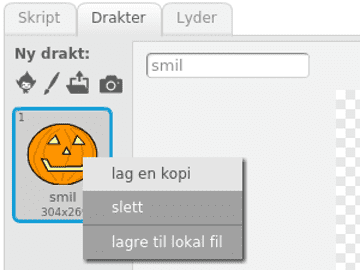

# Вступ {.intro}

Тут ми розглянемо, як можна створювати різні анімації на тему Хелловіну. 
Ми можемо поділитися ними з друзями за допомогою Scratch, або ж зробити ще цікавіше: Ми можемо спроектувати їх на штору, простирадло або стіну під час Хелловіну.




# Крок 1: Початкова анімація {.activity}

*Ми починаємо з того, що дозволяємо страшному привиду літати туди-сюди по екрану.*

## Контрольний список {.check}

- [ ] Почніть новий проект. Видаліть символ кота, наприклад, клацнувши правою кнопкою миші на ньому і вибравши пункт `вилучити`.

- [ ] Виберіть нового персонажа, натиснувши
  . Знайдіть щось страшне, наприклад, привида! Ми використовували `Фантазії/Привид`.

- [ ] Торкніться поля імені над своєю фігурою. Назвіть його `Привид`.

  

- [ ] Тепер ми створимо простий скрипт, який змусить привида літати по екрану.  Створіть `повторити`{.blockcontrol}- та блок
  `перемістити`{.blockmotion}-kloss таким чином:

  ```blocks
  повторити (200) 
      перемістити на (5) кроків
  slutt
  ```

- [ ] Натисніть на свій сценарій, щоб запустити анімацію. Ваш привид рухається? Ви бачите проблему?

- [ ] Привид виглядає так, ніби він застрягає, коли доходить до краю! Ми можемо виправити це за допомогою блоку 
  `якщо на межі, відбити`{.blockmotion}:

  ```blocks
  повторити (200)
      перемістити на (5) кроків
      якщо на межі, відбити
  slutt
  ```

- [ ] Знову натисніть на свій сценарій. Тепер це працює краще?

- [ ] Хм... Привид летить догори ногами... Виглядає трохи дивно. Можна сказати, що привид повинен повертатися тільки в бік з блоком
  `стиль обертання`{.blockmotion}. Ми поставимо це на самому початку сценарію, ось так:

  ```blocks
  стиль обертання [не обертати]
  повторити (200) 
      перемістити на (5) кроків
      якщо на межі, відбити
  slutt
  ```

- [ ] Нарешті, на чорному тлі це виглядає ще страшніше! Натисніть
  `Сцена` у правому нижньому куті екрана, а потім перейдіть на вкладку
  `Тло`{.blocklightgrey} у верхній частині екрана. І тепер натисніть  `У растрове`.

- [ ] Клацніть на відерце з фарбою,
  , а потім на тло, щоб зафарбувати його чорним кольором.

- [ ] Назвемо тло `Чорний`.


# Крок 2: Ще одна анімація {.activity}

*Для нашої другої анімації до нас прилетить кажан.*



## Контрольний список {.check}

- [ ] Створіть нового персонажа, натиснувши
  . Ми використали `Фантазії/Bat`. Змініть ім'я персонажа на `Кажан`.

- [ ] Щоб виглядало так, ніби кажан летить до нас, ми хочемо, щоб він спочатку був дуже маленьким, а потім збільшувався. Створіть цей скрипт.

  ```blocks
  задати розмір (0) %
  повторити (100)
      змінити розмір на (4)
  slutt
  ```

- [ ] Натисніть на скрипт, щоб перевірити, чи він працює.

- [ ] Невелика проблема полягає в тому, що привид також знаходиться на екрані. Було б краще приховати привида, коли він не анімаційний. Клацніть на персонажа-привида і додайте до сценарію блок `показати`{.blocklooks}- і
  `сховати`{.blocklooks}:

  ```blocks
  стиль обертання [не обертати]
  показати
  повторити (200) 
      перемістити на (5) кроків
      якщо на межі, відбити
  slutt
  сховати
  ```

- [ ] Натисніть на сценарій привида. Чи сховається привид після того, як закінчить літати туди-сюди?

- [ ] Те ж саме можна зробити зі скриптом кажана. Натисніть на малюнок кажана і змініть скрипт на

  ```blocks
  задати розмір (0) %
  показати
  повторити (100) 
      зміниити розмір на (4)
  slutt
  сховати
  ```

- [ ] Для більшої різноманітності ми хочемо, щоб кажана було анімовано на моторошному лісовому тлі. Натисніть на
  
  у правому нижньому куті екрана і виберіть тло
  `Поза приміщенням/Woods`. Назвіть тло `Ліс`.

# Крок 3: Змініть тло {.activity}

*Зараз ми розглянемо, як можна легко перемикати фон під час запуску анімації.*

## Контрольний список {.check}

Наприклад, якщо ми хочемо показати анімацію привида на чорному тлі, ми повинні спочатку натиснути `Сцена`, потім вкладку `Тло`та чорний фон. Крім того, нам потрібно натиснути фігуру привида, вкладку `Код` і, нарешті, сам сценарій. Це дуже громіздко! Тепер ми побачимо, як ми можемо використовувати повідомлення, щоб зробити це набагато простіше.

За допомогою повідомлень можна легко зробити кілька речей одночасно. Спочатку ми створимо повідомлення, `Анімація привида`. Ми хочемо, щоб це повідомлення змінювало тло і запускало анімацію привида.

- [ ] Натисніть кнопку 
 `Сцена`і створіть цей сценарій:

  ```blocks
  коли я отримую [Анімація привида v]
  змінити тло на [Чорний v]
  ```

- [ ] Натисніть на персонажа-привида і змініть сценарій, додавши блок зверху:

  ```blocks
  коли я отрисую [Анімація привида v]
  стиль обертання [не обертати v]
  показати
  повторити (200)
      перемістити на  (5) кроків
      якщо на межі, відбити
  slutt
  сховати
  ```

- [ ] Тепер наші скрипти чекають на повідомлення. Для тестування ми можемо перетягнути блок

  ```blocks
  оповістити [Анімація привида v]
  ```
  поруч із великим написом привида. 

- [ ] Надішліть повідомлення, натиснувши на `блок оповістити`{.blockevents}.
 Чи оживляється привид на чорному тлі?

- [ ] Тепер ми зробимо те саме для кажана. Додайте новий сценарій до сцени:

  ```blocks
  коли я отримую [Анімація кажана v]
  змінити тло на [Ліс v]
  ```

- [ ] Натисніть на фігурку кажана та змініть сценарій таким чином

  ```blocks
  коли я отримую [Анімація кажана v]
  задати розмір (0) %
  показати
  повторити (100) 
      змінити розмір на (4)
  slutt
  сховати
  ```

- [ ] Також додайте блок

  ```blocks
  оповістити [Анімація кажана v]
  ```

  щоб перевірити, чи працює анімація.

- [ ] Надішліть повідомлення, які анімують привида та кажана. Чи запускається анімація, коли ви натискаєте на повідомлення? Чи правильно змінюються фони?

# Крок 4: Підключіть анімацію {.activity}

*Тепер давайте подивимося, як ми можемо з'єднати анімації так, щоб вони з'являлися послідовно одна за одною.*

## Контрольний список {.check}

- [ ] Ми починаємо зі створення на сцені `завжди`{.blockcontrol} циклу, який надсилає повідомлення:

  ```blocks
  завжди
      оповістити [Анімація привида v] і чекати
      оповістити [Анімація кажана v] і чекати
  slutt
  ```
- [ ] Натисніть на скрипт, щоб протестувати його. Натисніть червоне коло зупинки, щоб зупинити анімацію. Чи з'являються анімації одна за одною знову і знову?

- [ ] Це буде виглядати трохи краще з невеликою паузою між анімаціями. Додайте в скрипт кілька блоків `чекати`{.blockcontrol}-klosser i skriptet.

  ```blocks
  завжди
      оповістити [Анімація привида v] і чекати
      чекати (1) секуед
      оповістити [Анімація кажана v] і чекати
      чекати (1) секунд
  slutt
  ```

- [ ] Щоб полегшити запуск анімації, ми додали блок, який запускає анімацію при натисканні на зелений прапорець у верхній частині екрана.

  ```blocks
  коли @greenFlag натиснуто
  завжди
      оповістити [Анімація привида v] і чекати
      чекати (1) секунд
      оповістити [Анімація кажана v] і чекати
      чекати (1) секунд
  slutt
  ```

- [ ] Ми також можемо використовувати цеглинки із зеленими прапорцями на персонажах, щоб переконатися, що вони правильно запускають анімацію. Помістіть цей скрипт на привида:

  ```blocks
  коли @greenFlag натиснуто
  сховати
  перемістити в x: (0) y:(0)
  ```

- [ ] Помістіть відповідний скрипт на кажана:

  ```blocks
  коли @greenFlag натиснуто
  сховати
  перемістити в x: (0) y:(0)
  ```

## Перевірте проєкт {.flag}

__Натисніть на зелений прапорець.__

- [ ] Чи виконуються обидві анімації одна за одною? Чи з’являються фігури, коли вони повинні?

- [ ] Не соромтеся змінювати анімацію так, щоб вона виглядала краще.
      Можливо, ви хочете трохи інших персонажів? Як зробити так, щоб персонажі рухалися швидше?
      Можливо, трохи більш випадковими? Спробуйте свої сили!

# Крок 5: Намалюйте власні фігури {.activity}

*Тепер ми створимо третю анімацію, де самостійно намалюємо персонажа*

## Контрольний список {.check}

- [ ] Створіть нову фігуру, навівши вказівник на пункт 
  , і натиснувши кнопку `Малювати`. Ви можете намалювати все, що завгодно. Тут ми намалювали гарбуз у вигляді ліхтарика.

  

- [ ] Створіть копію костюма, який ви щойно намалювали, клацнувши правою кнопкою миші на мініатюрі   `Образи` та вибравши `дублювати`.

  

- [ ] Трохи змініть скопійований костюм так, щоб у вас вийшло два костюми, які досить, але не зовсім, схожі. Тепер ми будемо анімувати персонажа, перемикаючись між двома костюмами.

- [ ] Перейдіть на вкладку 
 `Код`{.blocklightgrey} і додайте цей скрипт:

  ```blocks
  коли я отримую [Анімація гарбуза v]
  показати
  повторити (50) 
      наступний образ
      чекати (випадкове від (0.1) до (0.3)) секунд
  slutt
  сховати
  ```

Не соромтеся замінити назву повідомлення `Анімація гарбуза` на щось, що підходить для вашого персонажа. Натисніть на сценарій (або оповістити), щоб перевірити анімацію. Виглядає добре?

- [ ] Також додайте початкову позицію для цієї фігури:

  ```blocks
  коли @greenFlag натиснуто
  сховати
  перемістити в x: (0) y: (0)
  ```

- [ ] Потім перейдіть до сцени і додайте скрипт, який перемикається на правильний фон для фінальної анімації. Тут ми використали чорний фон.

  ```blocks
  коли я отримую [Анімація гарбуза v]
  змінити тло на [Чорний v]
  ```

- [ ] Нарешті, ми додаємо цю останню анімацію до основного циклу, що показує анімації:

  ```blocks
  коли @greenFlag натиснуто
  завжди
      оповістити [Анімація привида v] і чекати
      чекати (1) секунд
      send melding [Анімація кажана v] і чекати
      чекати (1) секунд
      send melding [Анімація гарбуза v] і чекати
      чекати (1) секунд
  slutt
  ```

# Крок 6: Ще більше анімації? {.activity}

## Спробуйте самі {.challenge}

Ми розглянули кілька прикладів того, як створювати моторошні анімації на Хелловін. Спробуйте використати подібні техніки для створення власної анімації!

## Опублікуйте свій проєкт {.save}

Якщо ви задоволені своєю анімацією, ви можете поділитися нею з родиною та друзями, натиснувши кнопку `Поділитись`.

# Проектуйте анімацію {.activity}

*На завершення ми розглянемо, як можна налякати сусідів своїми моторошними анімаціями на загальний огляд.*

Найпростіший спосіб зробити це - помістити екран у вікно і натиснути квадрат для повноекранного перегляду у верхньому лівому кутку під логотипом Scratch. Але якщо у вас є можливість позичити проектор на Хелловін, ви можете показати анімацію на вулиці, на стіні або на шторі чи простирадлі, як показано на зображенні на початку. У будь-якому випадку, трохи нерозумно, що Scratch показує анімацію з білою рамкою на екрані. Щоб отримати кращий вигляд, ви можете скористатися наведеними нижче порадами.

## Контрольний список {.check}

- [ ] Спочатку ми створюємо файл, який відображає вашу анімацію у великому вікні з чорним фоном.
Ми робимо це за допомогою HTML-коду. HTML - це мова, яка використовується для створення веб-сторінок.

  Завантажте файл [projiser.html](projiser.html). Перейшовши за цією адресою, виберіть у меню браузера `Файл > Зберегти як `, або щось подібне. Збережіть файл там, де ви зможете його знайти.

- [ ] Відкрийте файл у Блокноті або подібній програмі. Ви побачите текст, який виглядає так:

  ```html
  <html>
  <head>
  <title>Halloweenimasjon</title>
  </head>

  <body bgcolor="#000000">
  <div style="overflow-y: hidden; height: 890px; margin-left: auto; margin-right: auto; width: 1180px;" id="applet">
  <iframe
    style="margin-top:-56px; margin-left: -10px"
    allowtransparency="true"
    width="1200"
    height="960"
    src="http://scratch.mit.edu/projects/embed/30923784/?autostart=true"
    frameborder="0"
    scrolling="no"
    seamless="seamless"
    allowfullscreen=""></iframe>
  </div>
  </body>
  </html>
  ```

- [ ] Усередині цього тексту сховано номер проекту Scratch. У цьому випадку це номер `30923784`. Вам потрібно поміняти цей номер на номер вашого проекту.

### Номер проєкту {.protip}
Щоб знайти номер свого проєкту, ви можете дивитися в адресний рядок свого браузера під час роботи над проєктом. У складі адреси ви знайдете 8-значне число. Це і є номер вашого проєкту.

## Контрольний список {.check}

- [ ] Замініть `30923784` на номер вашого проекту і збережіть файл.

- [ ] Тепер ви можете відкрити файл, який ви щойно змінили, у своєму браузері. Виберіть у браузері
  `Файл > Відкрити файл`, або щось подібне. Виберіть потрібний файл.

- [ ] Тепер ви повинні побачити свою анімацію на чорному фоні.

- [ ] Підключіть комп'ютер до проектора і покажіть свою анімацію на білому аркуші, шторі або, можливо, на стіні!
Ліцензія: CC BY-SA 4.0
