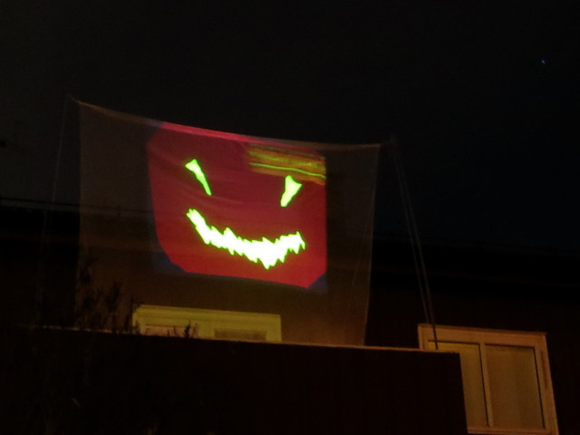
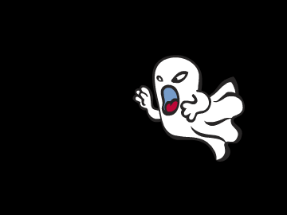
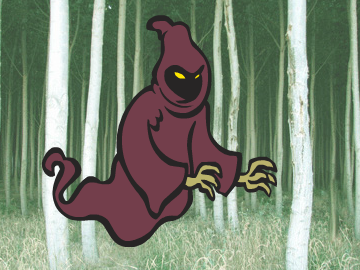
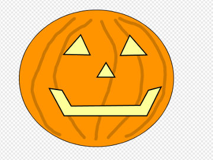
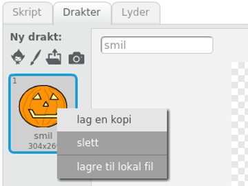

# Introduksjon {.intro}

Vi vil her se på hvordan vi kan lage forskjellige animasjoner med et
Halloween-tema. Disse kan vi enten dele med vennene våre gjennom
Scratch, eller kanskje enda morsommere: Vi kan projisere dem på en
gardin, et laken eller en vegg under Halloween.



# Steg 1: En første animasjon {.activity}

*Vi begynner med å la et skummelt spøkelse fly fram og tilbake over
 skjermen.*

## Sjekkliste {.check}

+ Start et nytt prosjekt. Slett kattefiguren, ved for eksempel å
  klikke på  i menylinjen øverst på
  skjermen, og deretter på katten.

+ Velg en ny figur ved å klikke
  . Finn
  et skummelt spøkelse! Vi har brukt `Fantasi/Ghost2`.

+ Trykk på `i`{.blockmotion} øverst til venstre på den nye
  spøkelsesfiguren din. Gi den navnet `Spøkelse`.

  

+ Nå skal vi lage et enkelt skript som får spøkelset til å fly over
  skjermen. Bygg sammen en `gjenta`{.blockcontrol}- og en
  `gå`{.blockmotion}-kloss på denne måten:

  ```blocks
  gjenta (200) ganger
      gå (5) steg
  slutt
  ```

+ Klikk på skriptet ditt for å starte animasjonen. Flytter spøkelset
  ditt på seg? Ser du et problem?

+ Spøkelset ser ut som om det setter seg fast når det kommer til
  kanten! Dette kan vi fikse med en
  `sprett tilbake`{.blockmotion}-kloss:

  ```blocks
  gjenta (200) ganger
      gå (5) steg
      sprett tilbake ved kanten
  slutt
  ```

+ Klikk på skriptet ditt igjen. Virker det bedre nå?

+ Hmm ... Spøkelset flyr opp-ned ... Det ser litt rart ut. Vi kan si
  at spøkelset bare skal snu seg sidelengs med en
  `begrens rotasjon`{.blockmotion}-kloss. Denne legger vi helt først i
  skriptet på denne måten:

  ```blocks
  begrens rotasjon [vend sideveis v]
  gjenta (200) ganger
      gå (5) steg
      sprett tilbake ved kanten
  slutt
  ```

+ Til slutt, det ser skumlere ut med en svart bakgrunn! Klikk på
  `Scene` helt til venstre på skjermen, og deretter på
  `Bakgrunner`{.blocklightgrey}-fanen nesten øverst på skjermen.

+ Klikk på malingsspannet,
  , og deretter på
  den hvite bakgrunnen for å male denne svart.

+ Gi bakgrunnen navnet `Svart`.

# Steg 2: Enda en animasjon {.activity}

*For vår andre animasjon vil en demon komme flyvende mot oss.*



## Sjekkliste {.check}

+ Lag en ny figur ved å klikke
  . Vi
  har brukt `Fantasi/Ghoul`. Endre navnet på figuren til `Demon`.

+ For at det skal se ut som demonen kommer flyvende mot oss, vil vi at
  den skal starte veldig liten, og deretter bli større. Lag dette
  skriptet.

  ```blocks
  sett størrelse til (0) %
  gjenta (100) ganger
      endre størrelse med (4)
  slutt
  ```

+ Trykk på skriptet for å se om det virker.

+ Et lite problem er at spøkelset også ligger på skjermen. Det vil
  være bedre å skjule spøkelset når det ikke animeres. Klikk på
  spøkelsesfiguren, og legg til en `vis`{.blocklooks}- og en
  `skjul`{.blocklooks}-kloss i skriptet:

  ```blocks
  begrens rotasjon [vend sideveis v]
  vis
  gjenta (200) ganger
      gå (5) steg
      sprett tilbake ved kanten
  slutt
  skjul
  ```

+ Klikk på spøkelset sitt skript. Skjules spøkelset etter at det er
  ferdig med å fly frem og tilbake?

+ Vi kan også gjøre det samme med demonen sitt skript. Klikk på
  demon-figuren, og endre skriptet til

  ```blocks
  sett størrelse til (0) %
  vis
  gjenta (100) ganger
      endre størrelse med (4)
  slutt
  skjul
  ```

+ For å få litt variasjon vil vi at demonen skal animeres over en
  skummel skog-bakgrunn. Klikk på
  
  helt til venstre på skjermen, og velg bakgrunnen
  `Utendørs/forest`. Gi bakgrunnen navnet `Skog`.

# Steg 3: Bytte bakgrunner {.activity}

*Vi vil nå se på hvordan vi lett kan bytte bakgrunn når vi starter en
 animasjon.*

## Sjekkliste {.check}

Hvis vi for eksempel vil vise spøkelsesanimasjonen på svart bakgrunn
må vi først klikke `Scene`, deretter `Bakgrunner`-fanen og den svarte
bakgrunnen. Videre må vi klikke på spøkelsesfiguren, `Skript`-fanen og
til slutt på selve skriptet. Dette er veldig tungvint! Vi vil nå se
hvordan vi kan bruke meldinger for å gjøre dette mye enklere.

Meldinger gjør det lett å få flere ting til å skje samtidig. Vi skal
nå først lage en melding, `Animer spøkelse`. Vi vil at denne meldingen
skal både bytte bakgrunnen og starte spøkelsesanimasjonen.

+ Klikk på `Scene` og lag dette skriptet:

  ```blocks
  når jeg mottar [Animer spøkelse v]
  bytt bakgrunn til [Svart v]
  ```

+ Klikk på spøkelsesfiguren og endre skriptet ved å legge til en kloss
  på toppen:

  ```blocks
  når jeg mottar [Animer spøkelse v]
  begrens rotasjon [vend sideveis v]
  vis
  gjenta (200) ganger
      gå (5) steg
      sprett tilbake ved kanten
  slutt
  skjul
  ```

+ Nå venter skriptene våre på meldingen. For å teste kan vi dra
  klossen

  ```blocks
  send melding [Animer spøkelse v]
  ```

  ut ved siden av det store skriptet til spøkelset.

+ Send meldingen ved å klikke på `send melding`{.blockevents}-klossen.
  Animeres spøkelset over en svart bakgrunn?

+ Vi vil nå gjøre det samme for demonen. Legg til et nytt skript på
  scenen:

  ```blocks
  når jeg mottar [Animer demon v]
  bytt bakgrunn til [Skog v]
  ```

+ Klikk på demonfiguren og endre skriptet slik

  ```blocks
  når jeg mottar [Animer demon v]
  sett størrelse til (0) %
  vis
  gjenta (100) ganger
      endre størrelse med (4)
  slutt
  skjul
  ```

+ Legg også til klossen

  ```blocks
  send melding [Animer demon v]
  ```

  for å teste at animasjonen fungerer.

+ Send meldingene som animerer spøkelset og demonen. Starter
  animasjonene når du klikker på meldingene? Byttes bakgrunnene
  riktig?

# Steg 4: Koble sammen animasjonene {.activity}

*Nå skal vi se hvordan vi kan koble sammen animasjonene slik at de
 vises i sekvens etter hverandre.*

## Sjekkliste {.check}

+ Vi begynner med å lage en `for alltid`{.blockcontrol}-løkke på
  scenen, som sender meldinger:

  ```blocks
  for alltid
      send melding [Animer spøkelse v] og vent
      send melding [Animer demon v] og vent
  slutt
  ```

+ Klikk på skriptet for å teste det. Trykk den røde stopp-sirkelen for
  å stoppe animasjonen. Vises animasjonene etter hverandre i en evig løkke?

+ Det vil se litt bedre ut med en kort pause mellom animasjonene. Legg
  til et par `vent`{.blockcontrol}-klosser i skriptet.

  ```blocks
  for alltid
      send melding [Animer spøkelse v] og vent
      vent (1) sekunder
      send melding [Animer demon v] og vent
      vent (1) sekunder
  slutt
  ```

+ For å gjøre det enklere å starte animasjonen legger vi til en kloss
  som gjør at animasjonen starter når det grønne flagget øverst på
  skjermen klikkes.

  ```blocks
  når grønt flagg klikkes
  for alltid
      send melding [Animer spøkelse v] og vent
      vent (1) sekunder
      send melding [Animer demon v] og vent
      vent (1) sekunder
  slutt
  ```

+ Vi kan også bruke grønt flagg-klosser på figurene for å være sikre
  på at de starter animasjonen på riktig måte. Legg dette skriptet på
  spøkelset:

  ```blocks
  når grønt flagg klikkes
  skjul
  gå til x: (0) y:(0)
  ```

+ Legg et tilsvarende skript på demonen:

  ```blocks
  når grønt flagg klikkes
  skjul
  gå til x: (0) y:(0)
  ```

## Test prosjektet {.flag}

__Klikk på det grønne flagget.__

+ Kjøres begge animasjonene etter hverandre? Dukker figurene opp når de skal?

+ Endre gjerne i animasjonene slik at du synes de ser bedre
  ut. Kanskje du vil ha litt andre figurer? Hvordan kan du få figurene
  til å bevege seg raskere? Kanskje litt mer tilfeldig? Prøv deg frem!

# Steg 5: Tegn egne figurer {.activity}

*Vi vil nå lage en tredje animasjon hvor vi tegner en figur på egen hånd*

## Sjekkliste {.check}

+ Lag en ny figur ved å trykke på
   ved siden av `Ny
  figur`. Du kan tegne hva du vil. Her har vi tegnet et
  Jack-O'-Lantern-gresskar.

  

+ Lag en kopi av drakten du nettopp tegnet ved å høyreklikke på
  miniatyren under `Ny drakt`-overskriften og velg `lag en kopi`.

  

+ Endre litt på den kopierte drakten, slik at du får to drakter som er
  ganske, men ikke helt, like. Vi vil nå animere figuren ved å bytte
  mellom de to draktene.

+ Klikk på `Skript`{.blocklightgrey}-fanen og legg på dette skriptet:

  ```blocks
  når jeg mottar [Animer gresskar v]
  vis
  gjenta (50) ganger
      neste drakt
      vent (tilfeldig tall fra (0.1) til (0.3)) sekunder
  slutt
  skjul
  ```

  Bytt gjerne ut meldingsnavnet `Animer gresskar` med noe som passer
  for din figur. Klikk på skriptet (eller send en melding) for å
  teste animasjonen. Ser det bra ut?

+ Legg også til startposisjonen for den figuren:

  ```blocks
  når grønt flagg klikkes
  skjul
  gå til x: (0) y: (0)
  ```

+ Gå så til scenen og legg på et skript som bytter til riktig bakgrunn
  for den siste animasjonen. Her har vi brukt den svarte bakgrunnen.

  ```blocks
  når jeg mottar [Animer gresskar v]
  bytt bakgrunn til [Svart v]
  ```

+ Til slutt legger vi denne siste animasjonen til i hovedløkken som
  viser animasjonene:

  ```blocks
  når grønt flagg klikkes
  for alltid
      send melding [Animer spøkelse v] og vent
      vent (1) sekunder
      send melding [Animer demon v] og vent
      vent (1) sekunder
      send melding [Animer gresskar v] og vent
      vent (1) sekunder
  slutt
  ```

# Steg 6: Enda flere animasjoner? {.activity}

### Prøv selv {.try}

Vi har nå sett noen eksempler på hvordan vi kan lage skumle
halloween-animasjoner. Prøv å bruk lignende teknikker for å lage dine
egne animasjoner!

## Legg ut prosjektet {.save}

Når du er fornøyd med animasjonene dine kan du dele det med familie og
venner, ved å trykke `Legg ut`.

# Projiser animasjonene {.activity}

*Vi avslutter med å se på hvordan du kan skremme nabolaget med de
 skumle animasjonene dine slik at alle kan se dem.*

Det enkleste er å sette skjermen i vinduet, og klikke på firkanten for
fullskjermvisning øverst til venstre under Scratch-logoen. Men hvis du
kan låne en prosjektør til Halloween kan du vise animasjonen utendørs,
på en vegg eller på et gardin eller laken, slik bildet i begynnelsen
viser. I begge tilfeller er det litt dumt at Scratch viser animasjonen
med en hvit ramme på skjermen. For å få en bedre visning kan du følge
tipsene nedenfor.

## Sjekkliste {.check}

+ Først lager vi en fil som viser animasjonen din i et større vindu
  med svart bakgrunn. Dette gjør vi med litt HTML-kode. HTML er det
  språket som brukes til å lage nettsider.

  Last ned filen [projiser.html](projiser.html).  Etter at du har
  gått til denne adressen kan du velge `Fil > lagre som`, eller noe
  som ligner, i menyen til nettleseren din. Legg filen et sted du
  finner den igjen.

+ Åpne filen i Notepad eller et tilsvarende program. Du vil se en
  tekst som ser slik ut:

  ```html
  <html>
  <head>
  <title>Halloweenimasjon</title>
  </head>

  <body bgcolor="#000000">
  <div style="overflow-y: hidden; height: 890px; margin-left: auto; margin-right: auto; width: 1180px;" id="applet">
  <iframe
    style="margin-top:-56px; margin-left: -10px"
    allowtransparency="true"
    width="1200"
    height="960"
    src="http://scratch.mit.edu/projects/embed/30923784/?autostart=true"
    frameborder="0"
    scrolling="no"
    seamless="seamless"
    allowfullscreen=""></iframe>
  </div>
  </body>
  </html>
  ```

+ Gjemt inne i denne teksten står det et Scratch-prosjektnummer. I
  dette tilfelle er nummeret `30923784`. Du må bytte dette nummeret
  med prosjektnummeret ditt.

### Prosjektnummer {.protip}

For å finne prosjektnummeret ditt kan du se i adressefeltet i
nettleseren din mens du jobber med prosjektet. Som en del av adressen
finner du et 8-sifret tall. Dette er ditt prosjektnummer.

## Sjekkliste {.check}

+ Bytt `30923784` med ditt prosjektnummer og lagre filen.

+ I nettleseren din kan du nå åpne filen du nettopp endret. Velg
  `Fil > åpne fil`, eller noe som ligner, i nettleseren din. Velg den
  riktige filen.

+ Du skal nå se animasjonen din på svart bakgrunn.

+ Koble datamaskinen din til en prosjektør, og vis animasjonen
  din på et hvitt laken, en gardin eller kanskje en vegg!
