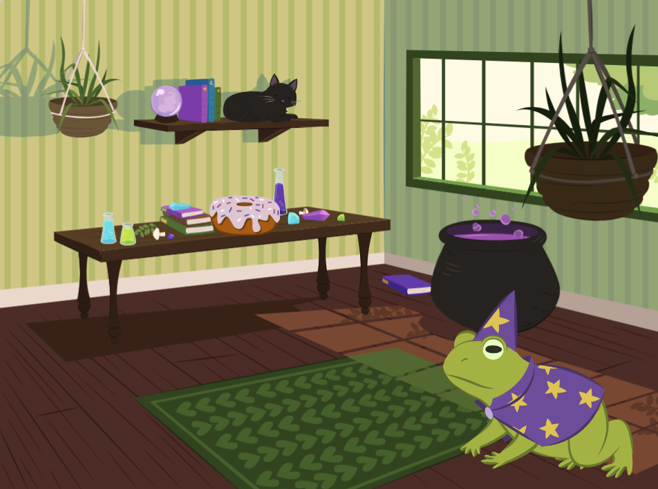
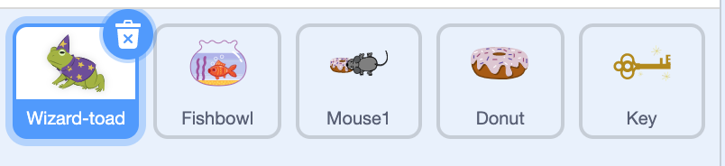
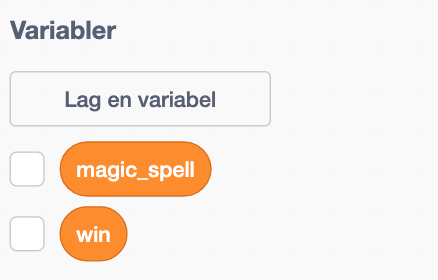
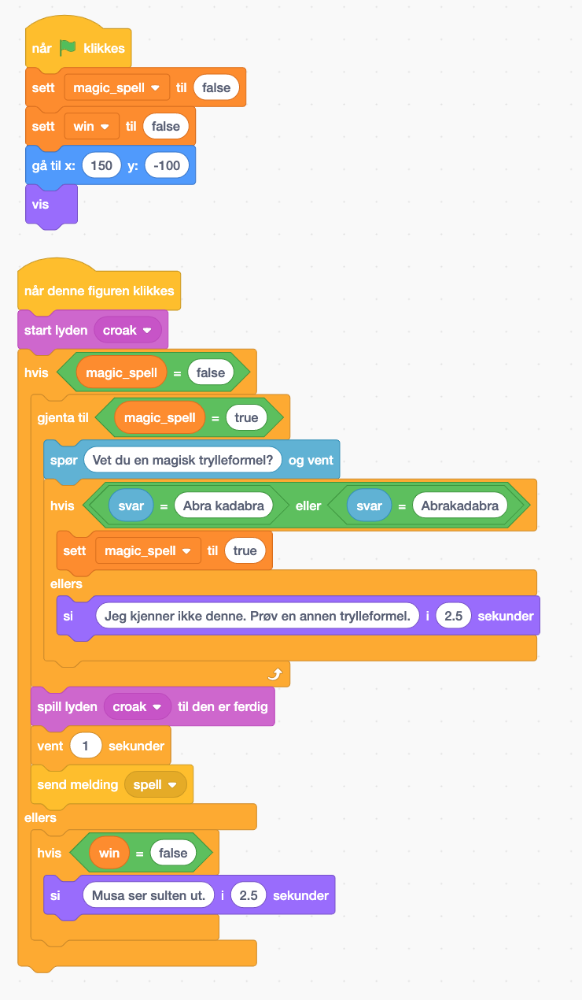
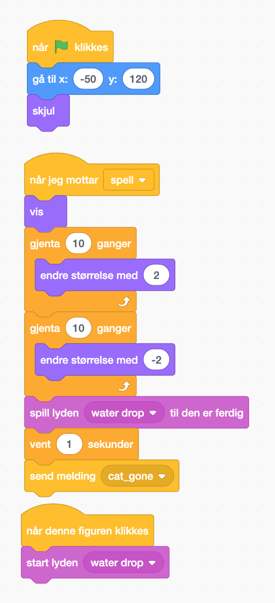
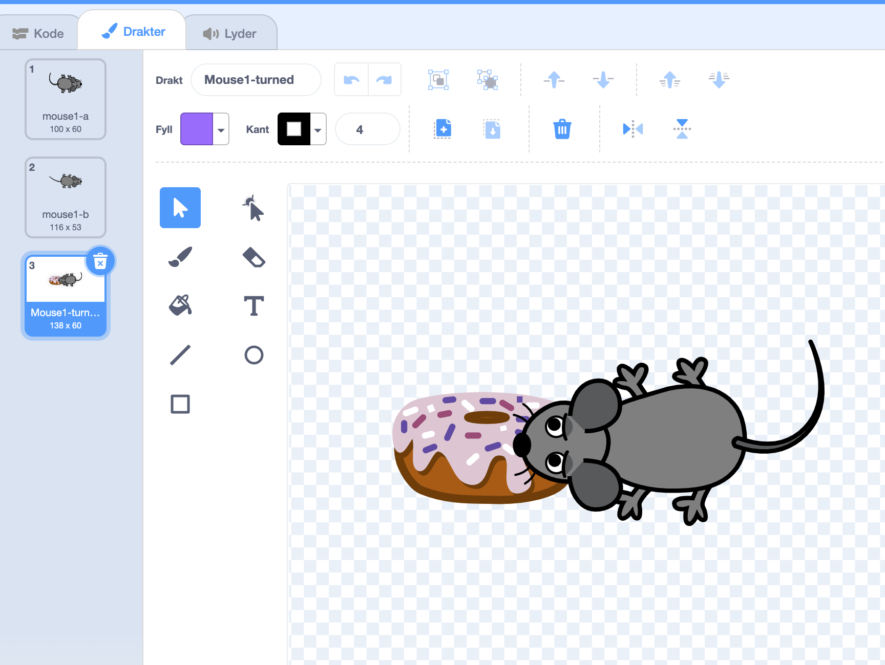
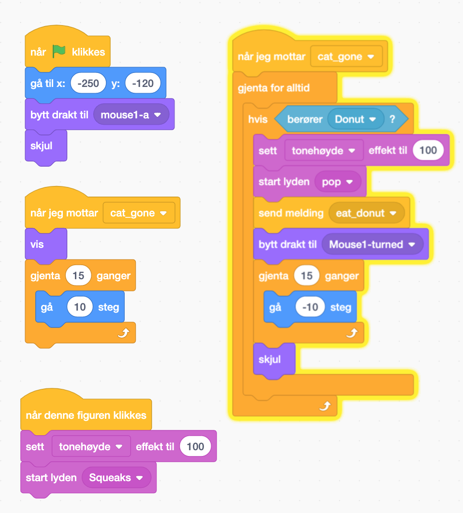
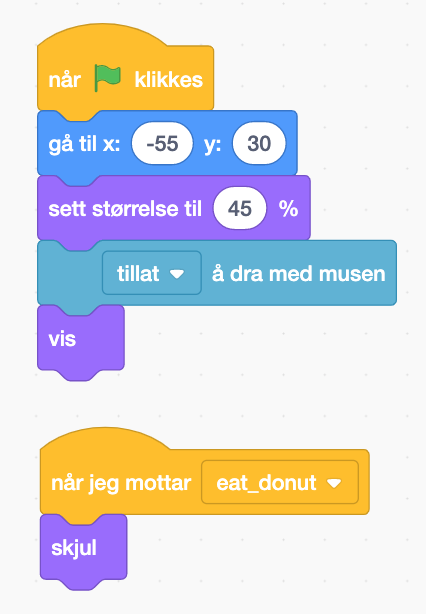
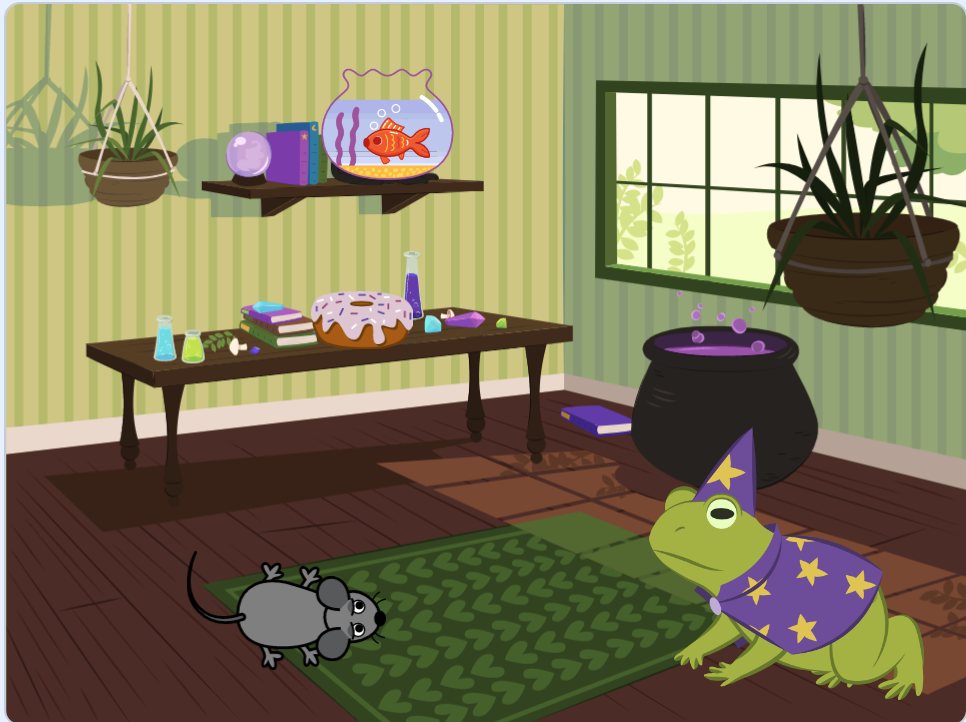
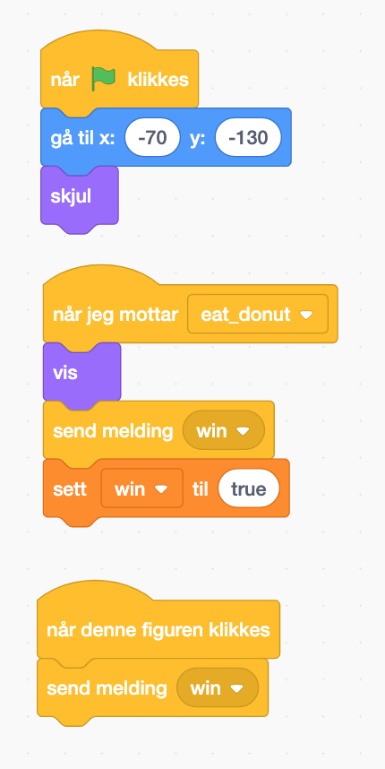

# Вступ {.intro}

Ми зробимо гру "Bтеча", де гравець повинен натискати на об'єкти, щоб вирішувати загадки та знайти ключ.



# Крок 1: Вибір фону та персонажів {.activity}

*Vi velger bakgrunn og alle figurer og setter de på sted.*

## Sjekkliste {.check}

- [ ] Почніть новий проект.

- [ ] Натисніть на фігуру кота внизу праворуч і видаліть її, клацнувши правою кнопкою миші та вибравши "видалити".

- [ ] Змініть фон на "Відьмин дім", натиснувши на    
-кнопку.

- [ ] Щоб додати фігури (спрайти), натисніть на 
    -кнопку.
    - [ ] Виберіть фігуру "Жаба-чаклун".
    - [ ] Виберіть фігуру "Акваріум з рибкою".
    - [ ] Виберіть фігуру "Миша1".
    - [ ] Виберіть фігуру "Пончик".
    - [ ] Виберіть фігуру "Ключ".

    

- [ ] Натисніть на "Жабу-чаклуна", виберіть вкладку "Костюми" і віддзеркаліть фігуру.


- [ ] Klikk på Wizard-Toad, velg `Kode`-fanen og lag dette skriptet:

  ```blocks
  når grønt flagg klikkes
  set størrelse til 120%
  gå til x: 150 y: -100
  vis
  ```
- [ ] Klikk på Fishbowl, velg `Kode`-fanen og lag dette skriptet:

    ```blocks
    når grønt flagg klikkes
    set størrelse til 120%
    gå til x: -50 y: 120
    skjul
    ```
- [ ] Klikk på Mouse1, velg `Kode`-fanen og lag dette skriptet:

    ```blocks
    når grønt flagg klikkes
    gå til x: -250 y: -120
    skjul
    ```

- [ ] Klikk på Donut, velg `Kode`-fanen og lag dette skriptet:

    ```blocks
    når grønt flagg klikkes
    set størrelse til 45%
    gå til x: -55 y: 30
    vis
    tillat å dra med musen
    ```

- [ ] Klikk på Key, velg `Kode`-fanen og lag dette skriptet:

    ```blocks
    når grønt flagg klikkes
    set størrelse til 80%
    gå til x: -70 y: -130
    skjul
    ```

## Test prosjektet {.flag}

__Klikk på det grønne flagget.__

- [ ] Sitter wizard-toad i høyre hjørne av bildet?

- [ ] Sitter donut på bordet?

- [ ] Er alle andere figurer skjult?

## Lagre prosjektet {.save}

Hvis du er pålogget med din egen Scratchbruker lagrer scratch alle prosjektene dine automatisk med jevne mellomrom.
Det kan likevel være lurt å lagre manuelt innimellom.

- [ ] I fil-menyen, velg `Lagre nå`.

Hvis du ikke har bruker kan du ikke lagre, bare fortsett til steg 2.


# Steg 2: Spør om trylleformel {.activity}

*Nå ønsker vi at wizard-toad spør spilleren om trylleformel og spilleren kan skrive in svar.*

## Sjekkliste {.check}

- [ ] Klikk på Wizard-Toad, velg `Kode`-fanen og lag dette skriptet:


## Test prosjektet {.flag}

__Klikk på det grønne flagget.__
__Klikk på wizard-toad.__


- [ ] Spør wizard-toad om trylleformel?

- [ ] Lager wizard-toad lyd hvis du skriver "abrakadabra" eller "abra kadabra"?

- [ ] Reagerer wizard-toad hvis du skriver noe annet?


# Steg 3: Lager nye variabler {.activity}

*Vi vil at wizard-toad skal spørre til vi svarer riktig.*

## Sjekkliste {.check}

- [ ] Klikk på Wizard-Toad, velg `Kode`-fanen. Under kategorien `Variabler`{.blockdata}, lag to nye
  variabel. Kall variabelen for `win` og `magic_spell` og la de gjelde for alle
  figurer.
   

- [ ] Endre skriptet til wizard-toad til dette:

  

## Test prosjektet {.flag}

__Klikk på det grønne flagget.__
__Klikk på wizard-toad.__


- [ ] Spør wizard-toad om trylleformel? Spør den igjen hvis svar er ikke riktig?

- [ ] Lager wizard-toad lyd hvis du skriver "abrakadabra" eller "abra kadabra"?

- [ ] Reagierer wizard-toad hvis du skriver noe annet?


# Steg 4: Katten blir forvandlet {.activity}

*Vi vil at riktig trylleformel utløser en magisk forvandling av katten.*

## Sjekkliste {.check}

- [ ] Klikk på Fishbowl, velg `Kode`-fanen og lag dette skriptet:

  

## Test prosjektet {.flag}

__Klikk på det grønne flagget.__
__Klikk på wizard-toad.__
__Svar "abrakadabra".__

- [ ] Forvandles Katten til Fishbowl?

- [ ] Spiller Fishbowl lyden sin til riktig tid?

- [ ] Spiller Fishbowl lyden når du klikker på Fishbowl?


# Steg 5: Musen kommer og henter donut {.activity}

*Når katten er forvandlet skal musen komme i rommet og hente donut.*

## Sjekkliste {.check}

- [ ] Klikk på Mouse1, velg `Drakter`-fanen og lag en ny speilvend drakt med donut (kopier donut bildet fra donut-drakten). Kall drakten `Mouse1-turned`:
  

- [ ] Klikk på Mouse1, velg `Kode`-fanen og lag dette skriptet:
  

- [ ] Klikk på Donut, velg `Kode`-fanen og lag dette skriptet:



## Test prosjektet {.flag}

__Klikk på det grønne flagget.__
__Klikk på wizard-toad.__
__Svar "abrakadabra".__

- [ ] Kommer mus etter at katten blir forvandlet?

- [ ] Lager mus lyd når du klikker på den?

- [ ] Forlater musen rommet etter at du har rørt den med donuten?

- [ ] Forsvinner donuten etter at musen ta det?



# Steg 6: Finn nøkkelen og vinner {.activity}

*Til slutt skal vi finne nøkkelen og vinne spillet.*

## Sjekkliste {.check}

- [ ] Klikk på Key, velg `Kode`-fanen og lag dette skriptet:
  

## Test prosjektet {.flag}

__Klikk på det grønne flagget.__
__Klikk på wizard-toad.__
__Svar "abrakadabra".__

- [ ] Dukker nøkkelen opp etter at musen spiste donuten?

- [ ] Sier wizard-toad at du har vunnet?


## Lagre prosjektet {.save}

*Du er ferdig. Godt gjort. Nå kan du spille spillet!*

Hvis du er logget inn med din scratchbruker kan du dele spillet med familie og venner ved å trykke `Legg ut` på
menylinjen.
