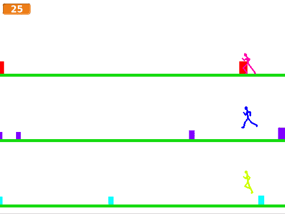

# Om oppgaven {.activity}

Hoppehelt er litt inspirert av musikkspillet Guitar Hero. I Hoppehelt skal man
kontrollere flere helter samtidig mens de hopper over fargede bokser som lager
lyd. Gjennom spillet Hoppehelt vil vi se litt nærmere på hvordan kloner brukes
når man programmerer i Scratch. Vi vil til og med se eksempler på kloner av
kloner!

## Oppgaven passer til: {.check}

 __Fag__: Kunst og håndtverk, matematikk, programmering.

__Anbefalte trinn__: 5.-10. trinn.

__Tema__: Geometriske grunnformer, koordinatsystem, brukerinteraksjon.

__Tidsbruk__: Dobbelttime eller mer.

## Kompetansemål {.challenge}

- [ ] __Kunst og håndtverk, 2. trinn__: eksperimentere med form, farge, rytme og
      kontrast

- [ ] __Kunst og håndtverk, 7. trinn__: bruke programmering til å skape
      interaktivitet og visuelle uttrykk

- [ ] __Matematikk, 3. trinn__: eksperimentere med og forklare plasseringer i
      koordinatsystemet

- [ ] __Matematikk, 10. trinn__: utforske matematiske egenskaper og sammenhenger
      ved å bruke programmering

- [ ] __Musikk, 2. trinn__: leke med musikkens grunnelementer gjennom lyd og
      stemme, lage mønstre og sette sammen mønstrene til enkle improvisasjoner
      og komposisjoner, også med digitale verktøy

- [ ] __Programmering, 10. trinn__: bruke grunnleggende prinsipper i
      programmering, slik som variabler, løkker, vilkår og funksjoner, og
      reflektere over bruken av disse

## Forslag til læringsmål {.challenge}

- [ ] Elevene kan bruke enkle geometriske grunnformer som elementer i et spill.

- [ ] Elevene kan plassere elementer i bestemte posisjoner i et koordinatsystem.

- [ ] Elevene kan flytte elementer i en bestemt retning i et koordinatsystem.

- [ ] Elevene kan sette sammen lyder og lytte etter mønstre i sin egen
      komposisjon.

- [ ] Elevene kan bruke løkker til å gjenta en handling i et spill.

- [ ] Elevene kan lage et spill med kontinuerlig brukerinteraksjon.

## Forslag til vurderingskriterier {.challenge}

- [ ] Eleven viser middels måloppnåelse ved å fullføre oppgaven.

- [ ] Eleven viser høy måloppnåelse ved å videreutvikle egen kode basert på
      oppgaven, for eksempel ved å gjøre en eller flere av variasjonene
      nedenfor.

## Forutsetninger og utstyr {.challenge}

- [ ] __Forutsetninger__: Elevene må ha god kunnskap i Scratch. De bør ha gjort
      flere prosjekter på erfaren-nivået før de begynner med denne oppgaven.

- [ ] __Utstyr__: Datamaskiner med Scratch installert. Eventuelt kan elevene
      bruke Scratch i nettleseren dersom de har en bruker (eller registrerer
      seg) på [scratch.mit.edu/](http://scratch.mit.edu/){target=_blank}.

## Fremgangsmåte

[Klikk her for å se oppgaveteksten.](../hoppehelt/hoppehelt.html){target=_blank}

_Vi har dessverre ikke noen tips, erfaringer eller utfordringer tilknyttet denne
oppgaven enda._

## Variasjoner {.challenge}

- [ ] Elevene kan lage en variabel som teller poeng.

- [ ] Elevene kan lage ulike toner for de ulike heltene.

## Eksterne ressurser {.challenge}

- [ ] Foreløpig ingen eksterne ressurser...
