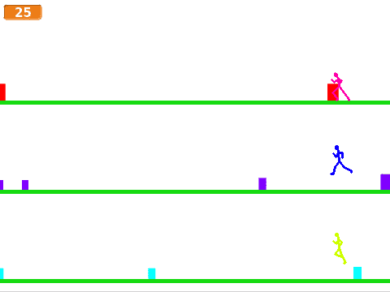

# Om oppgåva {.activity}

I denne oppgåva skal elevane lage eit spel inspirert av musikkspelet Guitar
Hero. Dei skal kontrollere fleire heltar samstundes, som alle hoppar over farga
boksar som lagar lyd.

## Oppgåva passar til: {.check}

__Fag__: Kunst og handverk, matematikk, programmering, musikk.

__Anbefalte trinn__: 3.-10. trinn.

__Tema__: Geometriske grunnformer, koordinatsystem, brukarinteraksjon.

__Tidsbruk__: Dobbelttime eller meir.

## Kompetansemål {.challenge}

- [ ] __Kunst og handverk, 2. trinn__: eksperimentere med form, farge, rytme og
      kontrast

- [ ] __Kunst og handverk, 7. trinn__: bruka programmering til å skape
      interaktivitet og visuelle uttrykk

- [ ] __Matematikk, 3. trinn__: eksperimentere med og forklare plasseringar i
      koordinatsystemet

- [ ] __Matematikk, 10. trinn__: utforske matematiske eigenskapar og samanhengar
      ved å bruke programmering

- [ ] __Musikk, 2. trinn__: leke med grunnelementa til musikken gjennom lyd og
      stemme, lage mønster og setja saman mønstera til enkle improvisasjonar
      og komposisjonar, også med digitale verktøy

- [ ] __Programmering, 10. trinn__: bruke grunnleggande prinsipp i
      programmering, slik som variablar, løkker, vilkår og funksjonar, og
      reflektere over bruken av desse

## Forslag til læringsmål {.challenge}

- [ ] Elevane kan bruke enkle geometriske grunnformer som element i eit spel.

- [ ] Elevane kan plassere element i bestemte posisjonar i eit koordinatsystem.

- [ ] Elevane kan flytte element i ei bestemt retning i eit koordinatsystem.

- [ ] Elevane kan setje saman lydar og lytte etter mønster i sin eigen
  komposisjon.

- [ ] Elevane kan bruke løkker til å gjenta ei handling i eit spel.

- [ ] Elevane kan lage eit spel med kontinuerleg brukarinteraksjon.

## Forslag til vurderingskriterium {.challenge}

- [ ] Eleven syner middels måloppnåing ved å fullføre oppgåva.

- [ ] Eleven syner høg måloppnåing ved å vidareutvikle eigen kode basert på
  oppgåva, til dømes ved å gjere ein eller fleire av variasjonane under.

## Føresetnader og utstyr {.challenge}

- [ ] __Føresetnader__: Elevane må ha god kunnskap i Scratch. Dei bør ha gjort
  fleire prosjekt på erfaren-nivået før dei startar med denne oppgåva.

- [ ] __Utstyr__: Datamaskiner med Scratch installert. Eventuelt kan elevane
  bruke Scratch i nettlesaren viss dei har ein brukar (eller registrerer seg) på
  [scratch.mit.edu/](https://scratch.mit.edu/). Elevane kan gjerne jobbe to og
  to saman.

## Framgangsmåte

Her finn du tips, erfaringar og utfordringar til dei ulike stega i oppgåva.
[Klikk her for å sjå
oppgåveteksten.](../hoppehelt/hoppehelt_nn.html){target=_blank}

_Me har diverre ikkje nokre tips, erfaringar eller utfordringar knytta til denne
oppgåva endå._

## Variasjonar {.challenge}

- [ ] Elevane kan lage ein variabel som tel poeng.

- [ ] Elevane kan lage ulike toner for dei ulike heltane.

## Eksterne ressursar {.challenge}

- [ ] Førebels ingen eksterne ressursar...
