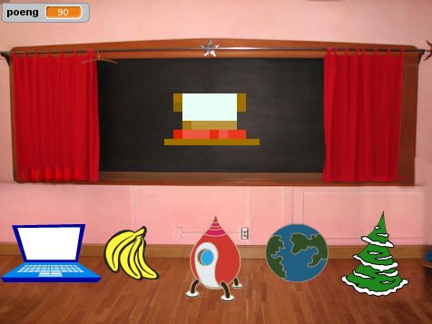

# Вступ {.intro}

На дошці з’являється зображення випадкового предмету. Воно спотворене, тож вам потрібно вгадати, що це, натиснувши на одну з опцій під картинкою. Чим швидше ви впізнаєте зображення, тим більше балів отримаєте.




# Крок 1: Додайте нові предмети {.activity}

*Ми хочемо, щоб на дошці з’являлися різні зображення.*

## Контрольний перелік {.check}

- [ ] Розпочніть новий проєкт Scratch і видаліть фігуру кота.

- [ ] В розділі “Сцена” зайдіть у вкладку “Тло”. Відкрийте бібліотеку з різними варіантами тла, натиснувши на  і виберіть `У приміщенні/Chalkboard`.

- [ ] Оберіть довільний спрайт.

- [ ] Розташуйте спрайт в центрі дошки та змініть його розмір, якщо потрібно.

- [ ] Виберіть ще чотири образи для цього спрайту. Можна обирати будь-які інші спрайти, але додавати їх як образи. Для цього виберіть вкладку `Образи` і натисніть на зображення кота в лівому нижньому куті екрану.

- [ ]  Тепер давайте зробимо так, щоб на дошці з’являвся випадковий предмет. Використовуйте цей скрипт.

  ```blocks
  коли grønt flagg натиснуто
  змінити образ на (випадкове від (1) до (5))
  ```

## Протестуйте свій проєкт {.flag}

__Натисніть на зелений прапорець в Scratch.__

- [ ] Фігура змінюється?

- [ ] Натисніть на прапорець кілька разів. Чи з’являються на дошці зображення спрайту і його нещодавно доданих  образів? Чудово.

Одне і те ж зображення може з’явиться кілька разів поспіль. Це цілком нормально, оскільки кожного разу воно вибирається випадково.


# Крок 2: Спотворюємо зображення {.activity}

*Тепер давайте спотворимо фігуру, що з’явиться на дошці, щоб важче було вгадати, що це таке. Потім ми поступово знову зробимо її зрозумілішою.*

Для того, щоб контролювати ступінь спотворення, ми будемо використовувати змінну `оцінка`{.blockdata} Якщо оцінка висока, зображення буде сильно спотвореним. Зі зменшенням оцінки,  спотворення також буде зменшуватися. Таким чином, оцінка функціонує як своєрідний таймер.

## Контрольний перелік {.check}

- [ ] Оберіть категорію `Змінні`{.blockdata}  в якій створіть змінну з назвою
  `оцінка`{.blockdata}. При створенні, підтвердіть, що змінна застосовується `для всіх спрайтів`.

- [ ] Змініть скрипт наступним чином:

  ```blocks
  коли grønt flagg натиснуто
  змінити образ на (випадкове від (1) до (5))
  надати [оцінка v] значення [110]
  повторити до <(оцінка) = [0]>
      змінити [оцінка v] на (-10)
      встановити ефект [пікселями v] в (оцінка)
      встановити ефект [колір v] в (оцінка)
      чекати (1) секунд
  slutt
  ```

## Протестуйте свій проєкт {.flag}

__Натисніть на зелений прапорець в Scratch.__

- [ ] Чи з’являється випадкове та спотворене зображення?

- [ ] Зображення поступово стає чіткішим?

- [ ] Чи зменшується оцінка, коли зображення стає чіткішим?

- [ ] Чи стає зображення повністю чітким при оцінці 0?

- [ ] Ви отримуєте новий предмет на дошці, коли знову натискаєте зелений прапорець?

## Поекспериментуйте {.challenge}

- [ ] Спробуйте змінити початкове значення оцінки, а також розмір кроку, на який вона змінюється під час проходження кожного циклу. Як це впливає на вигляд зображення? Стає важче чи легше побачити, що зображено на малюнку?

- [ ] Спробуйте різні ефекти з блоку __встановити ефект__. Як вони впливають на зміну зображення?


# Крок 3: Дозвольте гравцю вгадати предмет {.activity}

Отже, наше випадкове зображення поступово стає чіткішим, а оцінка падає. Але як грати в цю гру? Ми додамо варіанти зображень, на які гравець зможе натиснути. Якщо вибір правильний, гру виграно. Якщо натиснути неправильно, зображення зникає і гра продовжується.

Спочатку нам потрібно знати, яка відповідь є правильною.

## Контрольний перелік {.check}

- [ ] Створіть нову змінну та назвіть її `відповідь`{.blockdata}. Переконайтеся, що змінна застосовується для всіх спрайтів. Видаліть галочку, щоб змінну не було видно в полі гри.

- [ ] Змініть скрипт, щоб він відслідковував правильну відповідь. Після того, як програма визначає, який саме образ буде показано, додайте блок, що присвоїть змінній `відповідь`{.blockdata}`його номер:

  ```blocks
  коли grønt flagg натиснуто
  змінити образ на (випадкове від (1) до (5))
  надати [відповідь v] значення (образ [номер v])
  надати [оцінка v] значення [110]
  повторити до <(оцінка) = [0]>
      змінити [оцінка v] на (-10)
      встановити ефект [пікселями v] в (оцінка)
      встановити ефект [колір v] в (оцінка)
      чекати (1) секунд
  slutt
  ```

Тепер додаймо більше зображень, з яких гравець зможе обирати.

- [ ] Назвіть ваш спрайт `питання`.

- [ ] Зробіть копію спрайту, натиснувши на нього правою кнопкою миші. Перетягніть новий спрайт у лівий кут сцени.

- [ ] Змініть назву новоствореного спрайту на `відповідь1`. 

- [ ] Видаліть його скрипт (у вкладці `Код`) і всі його образи, крім першого.

- [ ] Повторіть останні три кроки ще раз (назвіть наступну копію `відповідь2`), помістіть `відповідь2` поруч із `відповідь1`, видаліть скрипт для цього спрайту і всі образи, крім другого.

- [ ] Повторіть ці кроки ще три рази, щоб створити спрайти `відповідь3`, `відповідь4` і `відповідь5`.

  Тепер в ​​нижній частині сцени у вас є п’ять зображень з образами, що може отримати головний спрайт. Жоден спрайт-відповідь не повинен мати скрипту.

- [ ] Тепер нам потрібно змусити фігури реагувати, коли на них натискають. Що саме станеться, залежить від того, правильно чи неправильно натиснув гравець. Додайте такий скрипт до спрайту `відповідь1`:

  ```blocks
  коли спрайт натиснуто
  якщо <(відповідь) = [1] то>
      оповістити [Ти виграв v]
  інакше
      сховати
  slutt
  ```

- [ ] Перетягніть скрипт до інших спрайтів-відповідей, змінюючи `відповідь` на 2, 3, 4 чи 5, відповідно до назви спрайту.

- [ ] Тепер ми створимо скрипт, який сповіщатиме гравця про виграш. Натисніть на спрайт `питання` і додайте цей скрипт:

  ```blocks
  коли я отримую [Ти виграв v]
  говорити (з'єднати [Вітаємо! Твій бал: ] (оцінка))
  ```

## Протестуйте свій проєкт {.flag}

__Натисніть на зелений прапорець в Scratch.__

Під час тестування, правильну відповідь можна побачити на зображенні з назвою `питання` під сценою.

- [ ] Що відбувається, коли ви натискаєте на правильну відповідь?

- [ ] Що відбувається, коли ви натиснете на неправильну відповідь?

- [ ] Що стається з неправильною відповіддю, коли ви починаєте нову гру?

## Контрольний перелік {.check}

Тест показав нам дві проблеми: по-перше, зображення, на які клацнули неправильно, не повертаються, коли починається нова гра. По-друге, рахунок продовжує знижуватися навіть після того, як гравець натиснув на правильну відповідь.

- [ ] Щоб вирішити першу проблему, ми можемо додати наступний скрипт для кожної з п’яти можливих відповідей:

  ```blocks
  коли grønt flagg натиснуто
  показати
  ```

Для вирішення другої проблеми, нам потрібно зупинити цикл `повторити до`{.blockcontrol}, що виконує спрайт `питання`, коли гравець натискає на правильну відповідь. Для цього ми можемо використати нову змінну. Назвемо її `виграш`{.blockdata} , і помістимо в блок `надати значення`{.blockdata} що присвоює їй значення 0, коли гра починається. Також в другу частину коду для спрайту “питання” додамо блок, що присвоює виграшу значення 1, коли гру виграно.
Перегляньте скрипти нижче.

- [ ] Нам потрібно зупинити повтор циклу `повторити до`{.blockcontrol}, коли оцінка стане 0 або `виграш`{.blockdata} дорівнюватиме 1.

- [ ] Нарешті, ми додаємо блок `очистити графічні ефекти`{.blocklooks}, щоб показати неспотворене зображення, коли гравець вгадав його. Сценарії для спрайту `питання` тепер мають виглядати так:

  ```blocks
  коли grønt flagg натиснуто
  змінити образ на (випадкове від (1) до (5))
  надати [відповідь v] значення (образ [номер v])
  надати [оцінка v] значення [110]
  надати [виграш v] значення [0]
  повторити до <<(оцінка) = [0]> або <(виграш) = [1]>>
      змінити [оцінка v] на (-10)
      встановити ефект [пікселями v] в (оцінка)
      встановити ефект [колір v] в (оцінка)
      чекати (1) секунд
  slutt

  коли я отримую [Ти виграв v]
  надати [виграш v] значення [1]
  очистити графічні ефекти
  говорити (з'єднати [Вітаємо! Твій бал:] (оцінка))
  ```

## Збережіть проєкт {.save}

__Вітаю! Ви закінчили створювати гру.__

Але простір для експериментів не закінчується. Спробуйте втілити ідеї, що описані нижче!

## Завдання 1: Зробіть гру простішою чи складнішою {.challenge}

Змініть рівень складності гри.

* Спробуйте змінити час, протягом якого видно спотворене зображення, та швидкість зменшення оцінки.

* Спробуйте змінити спосіб спотворення зображення.

* Оберіть схожі чи більш відмінні зображення.

## Завдання 2: Спотворюйте зображення по-різному {.challenge}

Зараз у грі постійно використовується один і той же алгоритм деформації. Але під час кроку 2 ви, можливо, випробували кілька інших варіантів. Спробуйте відшукати інші способи спотворення зображення, які працюють так же добре, як `колір` та `пікселі`.

Змініть код так, щоб кожна гра використовувала різні спотворення в циклі `повторити до`{.blockcontrol}.

__Підказка:__ спробуйте створити нову змінну з назвою `спотворення`. Присвойте їй  випадкове значення на початку гри. Використовуйте блоки `якщо`{.blockcontrol} і `повторити до`{.blockcontrol}, щоб вибрати спотворення для кожної гри.

## Завдання 3: Створіть кілька раундів кожної гри {.challenge}

Наразі кожна гра не залежить від інших. Спробуйте додати більше раундів, щоб можна було вгадати, наприклад, три предмети та виграти до 300 балів.

__Підказка:__ вам знадобиться додаткова змінна щоб зберігати загальний бал. Вам також потрібно буде створити цикл для кожного раунду.

## Завдання 4: Поступово ускладнюйте гру {.challenge}

Ускладнюйте гру з кожним раундом.

Можливо, кожен раунд має давати різну кількість балів? Чи повинен гравець отримувати додаткові очки за швидке вгадування в найскладніших раундах?

__Підказка:__ як визначити, у якому раунді ви перебуваєте? Як ви можете використовувати цю інформацію, щоб змінити складність гри і отримані бали?

## Завдання 5: Гра до першої помилки {.challenge}

Замість визначеної кількості раундів, гра може тривати аж доки гравець не допустить помилки. Таке правило працюватиме найкраще, якщо складність гри поступово підвищуватиметься. 

## Завдання 6: Адаптуйте гру до рівня майстерності гравця {.challenge}

Замість того, щоб поступово ускладнювати гру, ми можемо адаптувати рівень її складності до рівня майстерності гравця. Якщо гравець вгадує швидко, наступний раунд може бути складнішим. Якщо вони клацають неправильно або вгадують повільно, наступний раунд може бути легшим.

Це працює лише якщо ви не накопичуєте рахунок від раунду до раунду.

## Завдання 7: Зберігайте рекорди {.challenge}

Знайдіть спосіб зберегти найвищий бал. Чи можете ви також зберегти ім’я гравця, щоб показувати, хто здобув рекордну кількість балів?

## Завдання 8: Штрафуйте за неправильну відповідь {.challenge}

Зараз гра дозволяє дуже швидко клацати на всі відповіді, і таким чином швидко знайти правильну. Тому, можливо, варто віднімати бали кожного разу, коли гравець обирає неправильну відповідь.

Чи вдосконалить гру така зміна?

## Збережіть свій проєкт {.save}

__Чудово! Ви закінчили, і тепер можете тішитися власною грою!__

Не забудьте поділитися нею з друзями та родиною, натиснувши кнопку `Опублікувати`!

