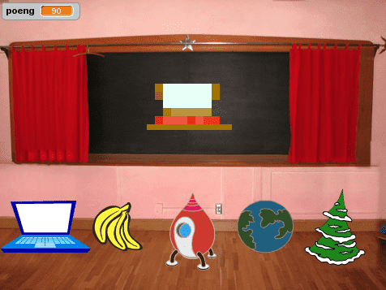

# Вступ {.intro}

На дошці з’являється зображення випадкового предмету. Воно спотворене, тож вам потрібно вгадати, що це, натиснувши на одну з опцій під картинкою. Чим швидше ви впізнаєте зображення, тим більше балів отримаєте.




# Крок 1: Додайте нові предмети {.activity}

*Ми хочемо, щоб на дошці з’являлися різні зображення.*

## Контрольний перелік {.check}

- [ ] Розпочніть новий проект Scratch і видаліть фігуру кота.

- [ ] В розділі “Сцена” зайдіть у вкладку “Тло”. Відкрийте бібліотеку з різними варіантами тла, натиснувши на  і виберіть `У приміщенні/Chalkboard`.

- [ ] Оберіть довільний спрайт.

- [ ] Розташуйте спрайт в центрі дошки та змініть його розмір, якщо потрібно.

- [ ] Виберіть ще чотири образи для цього спрайту. Можна обирати будь-які інші спрайти, але додавати їх як образи. Для цього виберіть вкладку `Образи` і натисніть на зображення кота в лівому нижньому куті екрану.

- [ ]  Тепер давайте зробимо так, щоб на дошці з’являвся випадковий предмет. Використовуйте цей скрипт.

  ```blocks
  коли grønt flagg натиснуто
  змінити образ на (випадкове від (1) до (5))
  ```

## Протестуйте свій проект {.flag}

__Натисніть на зелений прапорець в Scratch.__

- [ ] Фігура змінюється?

- [ ] Натисніть на прапорець кілька разів. Чи з’являються на дошці зображення спрайту і його нещодавно доданих  образів? Чудово.

Одне і те ж зображення може з’явиться кілька разів поспіль. Це цілком нормально, оскільки кожного разу воно вибирається випадково.


# Крок 2: Спотворюємо зображення {.activity}

*Тепер давайте спотворимо фігуру, що з’явиться на дошці, щоб важче було вгадати, що це таке. Потім ми поступово знову зробимо її зрозумілішою.*

Для того, щоб контролювати ступінь спотворення, ми будемо використовувати змінну `оцінка`{.blockdata} Якщо оцінка висока, зображення буде сильно спотвореним. Зі зменшенням оцінки,  спотворення також буде зменшуватися. Таким чином, оцінка функціонує як своєрідний таймер.

## Контрольний перелік {.check}

- [ ] Оберіть категорію `Змінні`{.blockdata}  в якій створіть змінну з назвою
  `оцінка`{.blockdata}. При створенні, підтвердіть, що змінна застосовується `для всіх спрайтів`.

- [ ] Змініть скрипт наступним чином:

  ```blocks
  коли grønt flagg натиснуто
  змінити образ на (випадкове від (1) до (5))
  надати [оцінка v] значення [110]
  повторити до <(оцінка) = [0]>
      змінити [оцінка v] на (-10)
      встановити ефект [пікселями v] в (оцінка)
      встановити ефект [колір v] в (оцінка)
      чекати (1) секунд
  slutt
  ```

## Протестуйте свій проект {.flag}

__Натисніть на зелений прапорець в Scratch.__

- [ ] Чи з’являється випадкове та спотворене зображення?

- [ ] Зображення поступово стає чіткішим?

- [ ] Чи зменшується оцінка, коли зображення стає чіткішим?

- [ ] Чи стає зображення повністю чітким при оцінці 0?

- [ ] Ви отримуєте новий предмет на дошці, коли знову натискаєте зелений прапорець?

## Поекспериментуйте {.challenge}

- [ ] Спробуйте змінити початкове значення оцінки, а також розмір кроку, на який вона змінюється під час проходження кожного циклу. Як це впливає на вигляд зображення? Стає важче чи легше побачити, що зображено на малюнку?

- [ ] Спробуйте різні ефекти з блоку __встановити ефект__. Як вони впливають на зміну зображення?


# Крок 3: Дозвольте гравцю вгадати предмет {.activity}

Отже, наше випадкове зображення поступово стає чіткішим, а оцінка падає. Але як грати в цю гру? Ми додамо варіанти зображень, на які гравець зможе натиснути. Якщо вибір правильний, гру виграно. Якщо натиснути неправильно, зображення зникає і гра продовжується.

Спочатку нам потрібно знати, яка відповідь є правильною.

## Контрольний перелік {.check}

- [ ] Створіть нову змінну та назвіть її `відповідь`{.blockdata}. Переконайтеся, що змінна застосовується для всіх спрайтів. Видаліть галочку, щоб змінну не було видно в полі гри.

- [ ] Змініть скрипт, щоб він відслідковував правильну відповідь. Після того, як програма визначає, який саме образ буде показано, додайте блок, що присвоїть змінній `відповідь`{.blockdata}`його номер:

  ```blocks
  коли grønt flagg натиснуто
  змінити образ на (випадкове від (1) до (5))
  надати [відповідь v] значення (образ [номер v])
  надати [оцінка v] значення [110]
  повторити до <(оцінка) = [0]>
      змінити [оцінка v] на (-10)
      встановити ефект [пікселями v] в (оцінка)
      встановити ефект [колір v] в (оцінка)
      чекати (1) секунд
  slutt
  ```

Тепер додаймо більше зображень, з яких гравець зможе обирати.

- [ ] Gi først figuren din navnet `Spørsmål`.

- [ ] Lag så en kopi av figuren ved å høyreklikke på den. På scenen drar du
  deretter den nye figuren ned i venstre hjørne.

- [ ] Endre denne nye figurens navn til `Svar1`.

- [ ] Slett skriptet til `Svar1` og alle draktene bortsett fra den første.

- [ ] Gjenta de tre siste stegene igjen (kall neste kopi `Svar2`), plasser
  `Svar2` ved siden av `Svar1` og slett alle bortsett fra den andre drakten.

- [ ] Gjenta disse punktene tre ganger til, slik at du har også figurene
  `Svar3`, `Svar4` og `Svar5`.

  Du skal nå ha en rad med fem svar-figurer nederst på scenen, hver viser en
  drakt som hovedfiguren kan ha. Ingen av `Svar`-figurene skal ha skript knyttet
  til seg.

- [ ] Nå må vi få alle figurene til å reagere når de blir klikket på. Hva som
  skal skje avhenger av om spilleren har klikket riktig eller galt. Legg til
  dette skriptet til `Svar1`:

  ```blocks
  når denne figuren klikkes
  hvis <(riktig) = [1]>
      send melding [Vant v]
  ellers
      skjul
  slutt
  ```

- [ ] Dra skriptet over til de andre figurene, slik at alle får hver sin kopi.
  For hver figur, bytt 1 til 2, 3, og så videre.

- [ ] Nå skal vi lage skriptet som gir melding til spilleren når han har vunnet.
  Klikk på `Spørsmål` igjen og legg til dette skriptet:

  ```blocks
  når jeg mottar [Vant v]
  si (sett sammen [Gratulerer! Din poengsum ble ] (poeng))
  ```

## Test prosjektet {.flag}

__Klikk på det grønne flagget.__

Når du tester spillet kan du se på spørsmålsfiguren under scenen for å se hva
riktig svar er. Det fungerer bra for testing.

- [ ] Hva skjer når du klikker på riktig svar?

- [ ] Hva skjer når du klikker på galt svar?

- [ ] Hva skjer med det gale svaret når du starter et nytt spill?

## Sjekkliste {.check}

Denne testen viser oss __to problemer__: Først og fremst, ting som ble klikket
på ved galt svar kommer ikke tilbake når et nytt spill starter. For det andre,
poengsummen fortsetter å gå ned, også etter at man har klikket på riktig svar.

- [ ] For å fikse det første problemet kan vi bare legge til følgende skript for
  hver av de fem svarfigurene:

  ```blocks
  når grønt flagg klikkes
  vis
  ```

For å fikse det andre problemet må vi få stoppet spørsmålfigurens `gjenta
til`{.blockcontrol}-løkke når spilleren klikker på riktig svar. Vi kan bruke en
ny variabel for å gjøre det. Vi vil kalle denne variabelen `vant`{.blockdata} og
legger inn en `sett`{.blockdata}-kloss som gir den verdien `0` når spillet
starter, og en tilsvarende kloss som setter verdien til `1` når spillet vinnes.
Se skriptene nedenfor.

- [ ] Vi må videre stoppe `gjenta til`{.blockcontrol}-løkken når poengsummen har
  blitt `0` eller `vant`{.blockdata} er `1`.

- [ ] Til slutt legger vi også inn en `ta bort grafiske
  effekter`{.blocklooks}-kloss som avslører spørsmålsfiguren når spilleren har
  gjettet riktig. Skriptene på `Spørsmål` skal nå se slik ut:

  ```blocks
  når grønt flagg klikkes
  bytt drakt til (tilfeldig tall fra (1) til (5))
  sett [riktig v] til (drakt nr.)
  sett [poeng v] til [110]
  sett [vant v] til [0]
  gjenta til <<(poeng) = [0]> eller <(vant) = [1]>>
      endre [poeng v] med (-10)
      sett [piksel v] effekt til (poeng)
      sett [farge v] effekt til (poeng)
      vent (1) sekunder
  slutt

  når jeg mottar [Vant v]
  sett [vant v] til [1]
  ta bort grafiske effekter
  si (sett sammen [Gratulerer! Din poengsum ble] (poeng))
  ```

## Lagre prosjektet {.save}

__Gratulerer! Du er nå ferdig med spillet.__

Men det finnes mange flere ting du kan gjøre med spillet. Prøv deg gjerne på
utfordringene nedenfor!

## Utfordring 1: Gjør spillet enklere eller vanskeligere {.challenge}

Endre vanskelighetsgrad for spillet.

* Forsøk å endre hvor lenge bildet vises frem og hvor raskt poengsummen minker.

* Forsøk å endre forvrengingen av bildet.

* Forsøk å gjøre figurene likere hverandre eller mer forskjellig. Husk også å
  forandre svarfigurenes drakter.

## Utfordring 2: Forvreng bildet ulikt fra gang til gang {.challenge}

For øyeblikket bruker spillet samme forvrengingsalgoritme hele tiden. Men i steg
2 prøvde du kanskje ut noen forskjellige alternativer. Prøv nå om du kan finne
noen flere forvrenginger som du synes fungerer like bra som `farge` og
`piksler`.

Endre spillet slik at hvert spill bruker forskjellige forvrengninger i `gjenta
til`{.blockcontrol}-løkken.

__Hint:__ Forsøk å opprette en ny variabel som du kaller `forvrenging`. Sett
denne til en tilfeldig verdi i starten av spillet. Bruk så
`hvis`{.blockcontrol}-klosser i `gjenta til`{.blockcontrol}-løkken for å velge
ut en forvrenging til hvert spill.

## Utfordring 3: La hvert spill ha flere runder {.challenge}

For øyeblikket er hvert spill uavhengig av andre. Prøv om du kan legge til flere
runder slik at man får gjette på for eksempel tre ting og kan vinne inntil 300
poeng.

__Hint:__ Du vil trenge en ekstra variabel for å lagre den totale poengsummen.
Du må også ha en løkke som går rundt for hver runde.

## Utfordring 4: Øk vanskelighetsgraden gradvis {.challenge}

Gjør nå spillet vanskeligere og vanskeligere for hver runde.

Kanskje hver runde også skal gi ulikt antall poeng? Bør spilleren også få ekstra
mange poeng for å gjette kjapt i de vanskeligste rundene?

__Hint:__ Hvordan kan du vite hvilken runde du er i? Hvordan kan du bruke det
til å endre vanskelighetsgraden og poengsummen?

## Utfordring 5: Fortsett til spilleren gjør feil {.challenge}

I stedet for et bestemt antall runder kan du la spillet gå til det blir klikket
på feil svar. Dette fungerer nok best dersom man også øker vanskelighetsgraden
utover i spillet.

## Utfordring 6: Tilpass spillet til hvor flink spilleren er {.challenge}

I stedet for å gjøre det stadig vanskeligere kan vi tilpasse vanskelighetsgraden
til spillernes dyktighet. Hvis de raskt gjetter riktig ting, kan den neste
runden gjøres vanskeligere. Hvis de klikker feil eller gjetter sakte, kan neste
runde gjøres enklere.

Dette fungerer bare hvis du ikke samler opp poengsummen fra runde til runde.

## Utfordring 7: Hold styr på rekorden {.challenge}

Finn en måte å lagre den høyeste poengsummen på. Klarer du også å lagre navnet
til spilleren, og få spillet til å si hvem som har rekorden?

## Utfordring 8: Gi en straff for galt svar {.challenge}

Slik spillet er nå kan man bare klikke som en gal på alle svarene, og dermed
raskt finne riktig svar. Det kan derfor være en god idé å trekke fra poeng hver
gang spilleren klikker på feil figur.

Gjør dette spillet bedre?

## Lagre prosjektet{.save}

__Veldig bra! Nå er du ferdig og kan spille det nye spillet du har laget!__

Ikke glem å dele spillet ditt med venner og familie ved å trykke på `Legg ut` i
menyen!

