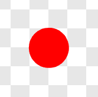

# Introduksjon {.intro}

Kor i all verda? er eit reise- og geografispel der ein raskast mogleg skal flyge
innom reisemål spreidd over heile Europa. I den fyrste delen skal me sjå på
korleis me styrer ein figur rundt omkring på skjermen, og korleis me får ulike
figurar til å reagere på kvarandre.

Seinare skal me utvide kartet me flyg over ved å lage ein bakgrunn som flyttar
seg. Me skal også lage lister som heldt oversikt over alle stadene me kan
besøke.


# Steg 1: Styr eit helikopter {.activity}

*Me startar med å lage eit lite program som gjer at me kan styre eit helikopter
med piltastane.*

## Sjekkliste {.check}

- [ ] Start eit nytt Scratch-prosjekt. Slett kattefiguren, til dømes ved å
  høgreklikke på den og velje `slett`.

- [ ] Legg til ein ny figur ved å klikke  under `Figurar`. Me har brukt
  `Transport/Helicopter`, men du kan gjerne bruke ein annan figur å reise rundt
  med.

- [ ] Klikk `i`{.blockmotion} og skift namn på figuren til `Helikopter`.

- [ ] Klikk på scena til venstre for figurane og lag det følgande skriptet:

  ```blocks
  når @greenFlag vert trykt på
  send meldinga [Nytt spel v]
  ```

  Me skal diskutere kvifor me gjer det i meir detalj seinare. Kort sagt handlar
  det om å gi oss meir fleksibilitet for å starte og slutte spelet seinare.

- [ ] Klikk på helikopteret att. Så klikkar du `Data`{.blockdata} og lagar ein
  variabel som heiter `hastigheit`{.blockdata} og som gjeld for denne figuren.

- [ ] Så bygger me nokre klossar for å bestemme faste eigenskapar for
  helikopteret, til dømes storleiken og hastigheita.

  ```blocks
  når @greenFlag vert trykt på
  gøym
  avgrens rotering til [venstre-høgre v]
  set storleik til (30) %
  set [hastigheit v] til [5]
  ```

  Du kan gjerne eksperimentere med andre verdiar for desse klossane slik at du
  finn dei verdiane du meiner er best for spelet ditt!

- [ ] No skal me lage ein av dei viktigaste delane av spelet, nemleg korleis
  helikopteret flyttar seg rundt. Dette legg me inn i ei løkke som alltid
  køyrer.

  ```blocks
  når eg får meldinga [Nytt spel v]
  gå til x: (0) y: (0)
  vis
  gjenta for alltid
      viss <tasten [pil høgre v] er trykt?>
          peik i retning (90 v)
          gå (hastigheit) steg
      slutt
      viss <tasten [pil venstre v] er trykt?>
          peik i retning (-90 v)
          gå (hastigheit) steg
      slutt
  slutt
  ```

## Test prosjektet {.flag}

__Klikk på det grøne flagget.__

- [ ] Kan du bruke piltastane til å styre helikopteret rundt omkring? Me har
  berre bestemt kva som skal skje når me trykkar `pil høgre` og `pil venstre`.
  Prøv sjølv om du kan legge inn koden for kva som skal skje når du trykkar `pil
  opp` og `pil ned`.

- [ ] Kva gjer klossen `avgrens rotering til venstre-høgre`{.blockmotion}? Prøv
  å endre verdiane i nedtrekksmenyen for å sjå kva som skjer.

# Steg 2: Eit enkelt kart {.activity}

*No skal me leggje inn eit kart som bakgrunn. I denne delen skal me flyge over
det. Seinare skal me lære korleis me får det til å bevege seg.*

## Sjekkliste {.check}

- [ ] Fyrst lastar me ned kartet frå nettet. Åpne lenka
  [europakart.png](europakart.png) i ei ny fane i nettlesaren din. Dette åpnar
  eit bilete av eit europakart. Høgreklikk på biletet og vel `Lagre biletet som`
  eller noko som liknar. Lagre biletet ein stad du finn det att.

- [ ] Vel  under `Ny
  bakgrunn` heilt til venstre på skjermen. Vel fila `europakart.png` du nettopp
  lasta ned.

## Test prosjektet {.flag}

__Klikk på det grøne flagget.__

- [ ] Ser det ut som om helikopteret flyg rundt i Europa? Prøv gjerne å
  eksperimentere meir med eigenskapane til helikopteret: storleik, hastigheit og
  så bortetter.


# Steg 3: Legg til eit reisemål {.activity}

*No skal me gi helikopteret eit mål det kan flyge til.*

## Sjekkliste {.check}

- [ ] Me startar med å teikne ein liten figur som kan markere reisemålet i
  kartet. Vel  under `Figurar`.

- [ ] Vel ei passande farge. Til dømes er raud ei farge som synast godt på
  kartet. Vel sirkelverktøyet og marker den fylte sirkelen (disken) til venstre
  under teiknevindauget.

- [ ] Før du startar å teikne kan du forstørre teikninga ved å trykke på
  forstorleiksglaset nedst til høgre. Noko som `800 %` storleik kan passe bra.
  Hald inne `skift`-knappen medan du dreg ut ein sirkel som er om lag fire ruter
  stor. Sirkelen blir heilt rund når du heldt inne `skift`-knappen.

  

- [ ] Gi den nye figuren namnet `Stad`.

- [ ] Dra denne nye figuren til ein stad på kartet du vil at skal vere
  reisemålet. Her har me brukt `Barcelona`, men du kan velje ein annan stad om
  du vil.

- [ ] No må me vite posisjonen til stad-figuren vår. Denne finn me enklast ved å
  sjå på figurinformasjonen og finne tala som står bak `x` og `y`. Desse tala
  kallast koordinatar. I dømet under er koordinatane `x: -98` og `y: -120`.
  Koordinatane fortel kor på kartet reisemålet vårt er.

  

- [ ] No lagar me litt kode som passar på at reisemålet ligg riktig plassert på
  kartet, og som seier frå viss me finn vegen til Barcelona.

  ```blocks
  når eg får meldinga [Nytt spel v]
  send meldinga [Ny stad v]

  når eg får meldinga [Ny stad v]
  gå til x: (-98) y: (-120)
  vent til <rører [Helikopter v]?>
  sei [Fann Barcelona!] i (2) sekund
  ```

## Test prosjektet {.flag}

__Klikk på det grøne flagget.__

- [ ] Ligg den raude sirkelen der den skal vere?

- [ ] Kva skjer om du styrer helikopteret til den raude sirkelen?

# Steg 4: Skjul reisemålet {.activity}

*Til no er dette spelet veldig enkelt, sidan spelaren berre må flyge til den
raude sirkelen. For å gjere det vanskelegare skal me skjule sirkelen og berre
seie kva by spelaren skal flyge til.*

## Sjekkliste {.check}

- [ ] Ein måte å gi beskjed til spelaren på er ved å bruke variablar. Lag ein ny
  variabel som du kallar `Reis til`{.blockdata}. La denne variabelen gjelde *for
  alle figurar*.

- [ ] Legg merke til at det dukka opp ein boks på kartet, `Reis
  til`{.blocklightgrey}` 0 `{.blockdata}. Flytt denne boksen til ein passande
  stad slik at den er lett å lese.

- [ ] Oppdater skriptet til `Stad` slik at `Reis til`{.blockdata}-variabelen
  blir sett til `Barcelona` rett etter `gå til`{.blockmotion}-klossen.

No vil me skjule den raude sirkelen. La oss fyrst prøve med det enklaste og mest
opplagte:

- [ ] Legg til ein `gøym`{.blocklooks}-kloss etter `når eg får meldinga Nytt
  spel`{.blockevents}.

## Test prosjektet {.flag}

__Klikk på det grøne flagget.__

- [ ] Blir den raude sirkelen borte?

- [ ] Kva skjer viss du reiser til Barcelona?

Hmm... Spelet oppdatar ikkje at me reiser til Barcelona lengre. Problemet er at
sidan me skjuler sirkelen vil den ikkje lengre berøre `Helikopter`. Me må finne
ein annan måte å gjere sirkelen usynleg på.

## Sjekkliste {.check}

- [ ] I staden for å skjule sirkelen heilt vil me gjere den gjennomsiktig. Bytt
  ut `gøym`{.blocklooks}-klossen med ein `set effekt`{.blocklooks}-kloss:

  ```blocks
  når eg får meldinga [Nytt spel v]
  vis
  set [gjennomsiktig v]-effekt til (100)
  send meldinga [Ny stad v]
  ```

## Test prosjektet {.flag}

__Klikk på det grøne flagget.__

- [ ] Er den raude sirkelen framleis borte?

- [ ] Kva skjer viss du flyr til Barcelona no?


# Steg 5: Vis reisemålet att {.activity}

*Det er kult om du kan vise kor reisemålet faktisk er etter at spelaren har
funne det.*

## Sjekkliste {.check}

- [ ] Me skal lage ein liten animasjon når spelaren flyr til Barcelona. Fyrst må
  me vise den raude sirkelen att. Det gjer me ved å setje gjennomsiktig effekt
  til `0` etter at sirkelen har vore borti `Helikopter`.

- [ ] Me kan lage animasjonen med den følgande koden:

  ```blocks
  gjenta (5) gongar
      gjenta (10) gongar
          endra storleik med (10)
      slutt
      gjenta (10) gongar
          endra storleik med (-10)
      slutt
  slutt
  ```

  Kor må denne koden liggje for at du skal sjå animasjonen?

## Test prosjektet {.flag}

__Klikk på det grøne flagget.__

- [ ] Visast den raude sirkelen etter at du har flydd til Barcelona?

- [ ] Animerast sirkelen etter at den er funne?

- [ ] Kva skjer med snakkebobla `Fann Barcelona!`?

## Sjekkliste {.check}

Kanskje det er betre om sirkelen kan seie `Fann Barcelona!` samstundes som me
animerer? For å få det til må me bruke `sei`{.blocklooks}-klossen i staden for
`sei i 2 sekund`{.blocklooks}, fordi den siste får heile skriptet til å vente i
to sekund.

- [ ] Legg til klossen

  ```blocks
  sei [Fann Barcelona!]
  ```

  rett før den ytre `gjenta`{.blockcontrol}-løkka.

- [ ] For at sirkelen skal slutte å seie `Fann Barcelona!` etter at
  animasjonen er slutt må du leggje klossen

  ```blocks
  sei [ ]
  ```

  til slutt i skriptet ditt.


# Neste gong {.activity}

No har me laga ein enkel versjon av spelet vårt. Neste gong skal me sjå korleis
me kan lage eit større kart ved å få bakgrunnen til å flytte på seg. Me skal
også gjere spelet vanskelegare ved å leggje til fleire reisemål.

## Prøv sjølv {.challenge}

- [ ] Tenk over korleis du kan leggje til flere reisemål! Prøv å lage kode som
  gjer det.

- [ ] For å gjere spelet litt meir spanande kan me følgje med på kor lang tid
  spelaren brukar på å finne fram til reisemålet. Sjå om du klarar å lage eit
  skript som gjer det. Eit hint er å lage ein ny variabel, til dømes
  `Tid`{.blockdata}, og eit skript som går i løkke og endrar `Tid`{.blockdata}
  med 1 for så å vente i 1 sekund.
