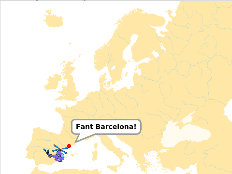
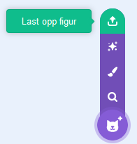
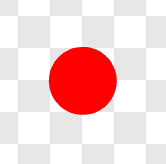
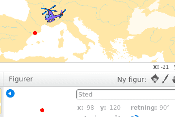

# Вступ {.intro}

Де ж у світі? — це гра про подорожі та географію, де потрібно якнайшвидше відвідати різні місця, розкидані по всій Європі. 
У цьому першому уроці ми розглянемо, як керувати персонажами на екрані і як змусити різних персонажів взаємодіяти між собою.
У наступних уроках ми розширимо карту, над якою ми летимо, створюючи фон, що рухається. 
Ми також розглянемо, як створити списки, які відслідковують всі місця, які ми можемо відвідати.



# Крок 1: Керуй гелікоптером! {.activity}

*Ми почнемо з того, що створимо невелику програму, яка дозволить керувати вертольотом за допомогою клавіш зі стрілками.*

## Котрольний список {.check}

- [ ] Розпочни новий проект у Scratch. Видали спрайт кота, наприклад, клацнувши на нього правою кнопкою миші і вибравши `Видалити`.

- [ ] Спочатку ми завантажимо вертоліт з інтернету. Відкрий посилання [helikopter.png](../bilder/fra-scratch-v2/helikopter.png)
       у новій вкладці вашого браузера. Це відкриє зображення вертольота.
      Клацни на зображення правою кнопкою миші і вибери "Зберегти зображення як" та збережи зображення.
Вибери `Завантажити спрайт з файлу` під спрайтом майже в самому лівому куті екрана.

- [ ] Вибеіть  під `Фігури` в крайній лівій частині екрана.
   Вибери файл helikopter.png, який ти щойно завантажив.

- [ ] Натисни `i`{.blockmotion} та зміни назву спрайта на `Helikopter`.

- [ ] Клацни на сцену ліворуч від спрайтів і створи наступний скрипт:
 
```blocks
коли @greenFlag натиснуто
оповістити [Нова гра v]
```

Ми детальніше обговоримо, чому це робимо, пізніше. Коротко кажучи, це дає нам більше гнучкості щодо того, як ми запускаємо та завершуємо гру.

- [ ] Натисни на вертоліт ще раз. Потім натисни `Дані`{.blockdata} і створи змінну `швидкість`{.blockdata}, яка буде застосовуватися лише до цього спрайту.

- [ ] Далі створимо кілька блоків, у яких задаємо властивості вертольота, які не змінюються під час гри, наприклад, розмір і швидкість.

```blocks
коли @greenFlag натиснуто
сховати
стиль обертання [зліва-направо v]
встановити розмір у (30) 
надати [швидкість v] значення [5]
```

Експериментуй з іншими значеннями для цих блоків, щоб знайти найкращі параметри для своєї гри!

- [ ] Тепер ми створимо одну з найважливіших частин гри, а саме те, як вертоліт буде рухатися. Це ми вкладемо в цикл, який завжди виконується.

```blocks
коли я отримую [Нова гра v]
перемістити в x: (0) y: (0)
показати
завжди
    якщо <клавішу [стрілка вправо v] натиснуто?> то
        поверути в напрямку (90 v)
        перемістити на (швидкість) кроків
    кінець
    якщо <клавішу [стрілка ліворуч v] натиснуто?> то
        повернути в напрямку (-90 v)
        перемістити на (швидкість) кроків
    кінець
кінець
```

## Тестування проєкту {.flag}

__Натисни на зелений прапорець.__

- [ ] Чи можеш ти керувати вертольотом за допомогою стрілок? Ми запрограмували лише `стрілку вправо` і `стрілку вліво`. Спробуй додати код для `стрілки вгору` та `стрілки вниз`.

- [ ] Що робить блок `стиль обертання - зліва-направо`{.blockmotion}? Спробуй змінити значення в випадаючому меню, щоб побачити різницю.


# Крок 2: Просте тло {.activity}

*Додамо карту як фон. Пізніше ми навчимося робити так, щоб фон рухався разом із грою.*

## Контрольний список {.check}

- [ ] Завантаж карту з інтернету. Відкрий [europakart.png](europakart.png) у новій вкладці. Клацни правою кнопкою миші на зображенні та вибери `Зберегти зображення як`. Збережи його у зручному місці.

- [ ] Вибери  у меню `Новий фон`. Завантаж `europakart.png`.

## Тестування проєкту {.flag}

__Натисни на зелений прапорець.__

- [ ] Чи виглядає так, ніби вертоліт літає над Європою? Спробуй змінити його параметри, як-от розмір і швидкість.


# Крок 3: Додай пункт призначення {.activity}

*Додамо точку, куди має прилетіти вертоліт.*

## Контрольний список {.check}

- [ ] Намалюй маленький спрайт, який позначатиме місце призначення на карті. Вибери  у меню `Спрайти`.

- [ ] Вибери яскравий колір, наприклад, червоний. Обери інструмент `Коло` та вибери залите коло (еліпс) (зліва під вікном малювання).

- [ ] Перед малюванням збільш масштаб до 800%. Утримуй `Shift` і намалюй коло діаметром приблизно чотири клітини.

  

- [ ] Назви новий спрайт `Місце`.

- [ ] Перемісти `Місце` у будь-яку точку на карті. Ми вибрали `Барселону`, але ти можеш обрати інше місто.

- [ ] Дізнайся координати `Місце` у властивостях спрайта. Наприклад, x: -98, y: -120.
  Тепер нам потрібна позиція нашого спрайта "Місце". Найпростіше це зробити, подивившись на інформацію про спрайт після чисел,
  що стоять біля x і y. Ці числа називаються координатами. У прикладі нижче координати x: -84 і y: -112.
  Координати вказують, де на карті ми розмістили пункт призначення.

  

- [ ] Додай код, щоб спрайт залишався на місці та визначав, коли вертоліт його торкається.

```blocks
коли я отримую [Нова гра v]
оповістити [Нове місце v]

коли я отримую [Нове місце v]
перемістити в x: (-98) y: (-120)
чекати поки <торкається [Вертоліт v]?>
говорити [Знайдено Барселону!] (2) секунд
```

## Тестування проєкту {.flag}

__Натисни на зелений прапорець.__

- [ ] Чи знаходиться червоне коло в правильному місці?

- [ ] Що станеться, якщо ти підлетиш до червоного кола?


# Крок 4: Приховай місце призначення {.activity}

*Наразі це дуже проста гра, оскільки гравцю потрібно просто долетіти до червоного кола. 
 Щоб зробити гру трохи складнішою, ми приховаємо коло і будемо лише повідомляти гравцю, до якого міста йому потрібно летіти!*

## Контрольний список {.check}

- [ ] Створи змінну `Лети до`{.blockdata}, зроби цю змінну доступною для всіх спрайтів.

- [ ] Зверніть увагу, що на карті з’явилося вікно з написом "Лети до: 0". Перемістіть це вікно в зручне місце, щоб його було легко читати.

- [ ] Онови код спрайта `Місце`, щоб він встановлював `Лети до`{.blockdata} як `Барселона`.
 Оновіть скрипт для `Місце` так, щоб змінна `Лети до`{.blockdata} була встановлена на `Барселона` одразу після блоку "Лети до".

Тепер ми приховаємо червоне коло. Спробуємо спершу найпростіший і очевидний спосіб:

- [ ] Додай блок `сховати`{.blocklooks} після `коли я отримую Нова гра`{.blockevents}.

## Тестування проєкту {.flag}

__Натисни на зелений прапорець.__

- [ ] Чи зникло червоне коло?

- [ ] Чи гра розпізнає, що ти прибув у Барселону?

Хмм... Гра більше не виявляє, що ми летимо до Барселони. 
Проблема в тому, що коли ми ховаємо коло, воно більше не торкається вертольота. 
Нам потрібно знайти інший спосіб зробити коло невидимим!

## Контрольний список {.check}

- [ ] Замість `сховати`{.blocklooks}, використаємо `змінити ефект`{.blocklooks}:

```blocks
коли я отримую [Нова гра v]
показати
встановити [прозорість v] ефект в (100)
оповістити [Нове місце v]
```

## Тестування проєкту {.flag}
__Натисни на зелений прапорець.__

- [ ] Чи зникло червоне коло?

- [ ] Чи гра розпізнає, що ти прибув у Барселону?

# Крок 5: Показати місце після знаходження {.activity}

*Давай створимо невелику анімацію, коли гравець летить до Барселони. 
Було б цікаво, якби місце призначення з’являлося після знаходження!*

## Контрольний список {.check}

- [ ] Спочатку потрібно показати червоне коло знову. Це робимо, встановивши прозорість до 0 після того, як коло торкнеться вертольота.

- [ ] Анімацію можна створити за допомогою наступного коду:

```blocks
повторити (5) 
    повторити (10) 
        змінити розмір на (10)
    кінець
    повторити (10)
        змінити розмір на (-10)
    кінець
кінець
```
Де потрібно розмістити цей код, щоб побачити анімацію?

## Тестування проєкту {.flag}

__Натисни на зелений прапорець.__

- [ ] Чи з'являється червоне коло після того, як ви долетіли до Барселони?

- [ ] Чи анімується коло після того, як його знайдено?

- [ ] Що відбувається з текстом `Знайшли Барселону!`?

## Контрольний список {.check}
Можливо, краще виглядатиме, якщо коло казатиме `Знайшли Барселону!` одночасно з анімацією? 
Для цього потрібно використати блок `говорити`{.blocklooks}, а не `говорити 2 секунди`{.blocklooks},
 оскільки останній блокує виконання всього скрипта на 2 секунди.

- [ ] Додай блок

  ```blocks
  говорити [Знайшли Барселону!]
  ```

  одразу перед змінною `повторити`{.blockcontrol}.

- [ ] Щоб коло припинило говорити `Знайшли Барселону!` після завершення анімації, додай блок 

  ```blocks
  говорити [ ]
  ```
  в кінці вашого скрипта.

# Наступного разу {.activity}

Ми вже розпочали зі створення простої версії нашої гри. Наступного разу ми розглянемо,
 як можна зробити більшу карту, змусивши фон рухатися.
 Також ми ускладнимо гру, додавши більше пунктів призначення.

## Спробуйте самостійно {.challenge}

- [ ] Подумайте, як можна додати більше пунктів призначення! Спробуй створити код для цього!

- [ ] Щоб зробити гру трохи цікавішою, ми можемо відстежувати, скільки часу потрібно гравцеві, 
      щоб долетіти до пункту призначення. Подивись, чи зможеш ти створити скрипт для цього! 
      Підказка: ви можете створити нову змінну, наприклад, `Час`{.blockdata}, і скрипт, який працює в циклі, 
	  змінюючи `Час`{.blockdata} на 1, а потім чекаючи 1 секунду


