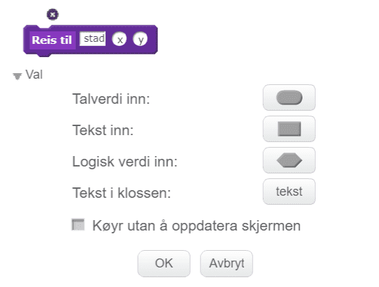

# Introduksjon {.intro}

Kor i all verda? er eit reise- og geografispel der ein raskast mogleg skal flyge
innom reisemål spreidd over heile Europa. Dette er den andre delen av tre. Her
skal me spesielt sjå på korleis me kan gjere kartet større enn skjermen ved å la
kartet rulle i bakgrunnen. Undervegs skal me sjå nærare på kva eit
koordinatsystem er.

I den siste delen skal me lage lister som gjer det enklare å leggje til mange
reisemål. Me skal dessutan lage ein skikkeleg intro til spelet.


# Steg 0: Forrige gang {.activity}

*No skal me fortsetje med det programmet me laga i del 1.*

## Sjekkliste {.check}

Sidan me skal forandre og vidareutvikle fleire ting treng ikkje spelet du laga i
del 1 vere heilt perfekt. Likevel må du sjekke at

- [ ] du har eit helikopter som du kan styre rundt på skjermen med piltastane.

- [ ] du har ein stadfigur som kan bli funne av helikopteret.

Viss dette ikkje fungerer må du gå tilbake til del 1 og gjere det ferdig.


# Steg 1: Bakgrunnen som figur {.activity}

*No vil me at bakgrunnen skal bli flyttbar. Vanlege bakgrunnar i Scratch kan me
ikkje flytte på. Difor må me "jukse litt" og la bakgrunnen vere ein figur.*

## Sjekkliste {.check}

- [ ] Slett `Europakart`-bakgrunnen din. Ein heilt kvit bakgrunn passar bra no.

- [ ] Lag ein ny figur ved å klikke  ved sidan av `Ny figur`. Vel fila
  `europakart.png` som du lasta ned forrige gong. Viss du ikkje har denne lett
  tilgjengeleg kan du laste den ned att frå [europakart.png](europakart.png).

- [ ] Gi den nye kartfiguren namnet `Kart`.

- [ ] For å vere sikre på at figuren ligg bakerst som ein bakgrunn kan me starte
  med følgande kode:

  ```blocks
  når @greenFlag vert trykt på
  flytt bakover (50) lag
  ```

- [ ] Me vil gjere figuren så stor som mogleg. Diverre har Scratch ei øvre
  grense for kor store figurar kan vere. Du kan sjå det om du fyrst kryssar av
  for at `storleik`{.blocklooks} skal visast på kart-figuren. Så kan du endre
  storleiken med

  ```blocks
  set storleik til (9999) %
  ```

  No kan du sjå at storleiken ikkje blir sett til `9999`, men til eit mindre
  tal. Legg på ein kloss som gjer kartet så stort som mogleg når ein klikkar på
  det grøne flagget.

- [ ] Til seinare er det greit å `skjule`{.blocklooks} kartfiguren når me
  klikkar på det grøne flagget, slik at det blir enklare å lage ein intro
  seinare.


# Koordinatsystem {.activity}

I del 1 såg me så vidt på korleis me brukar koordinatar for å beskrive kor
helikopteret og reisemålet er på skjermen (og kartet). Om du trykkar
`i`{.blockmotion} på ein figur vil du alltid sjå koordinatane til figuren, som
to tal `x` og `y`.


Punktet midt på skjermen har koordinatane `x: 0` og `y: 0`. Talet ved `x`
beskriv kor eit punkt er sidevegs frå det. Viss `x` er mindre enn null er
punktet til venstre for midten, medan ein positiv `x` er til høgre for midten.
På same måte seier `y` kor høgt på skjermen eit punkt er. Ein positiv `y` tyder
at punktet er over midten, medan eit punkt med negativ `y` er under midten av
skjermen.


Vanlegvis passar Scratch på koordinatane for oss, slik at me ikkje treng å tenke
så mykje på dei.

No skal me gjere noko spesielt. Me skal lage ein illusjon av at helikopeteret
flyttar på seg, men eigentleg er det bakgrunnen som flyttar seg. For å gjere det
må me lage våre eigne `X`- og `Y`-variablar som me brukar for å kople
helikopteret, staden og bakgrunnen.


# Steg 2: Nye kontrollar for helikopteret {.activity}

*Fyrst vil me endre kva som skjer når me trykkar på piltastane.*

## Sjekkliste {.check}

- [ ] Lag to nye variablar som gjeld for alle figurar. Desse skal heite `X` og
  `Y`, og beskriv kor helikopteret er i forhold til kartet.

- [ ] No skal me endre kva som skjer når du trykkar på piltastane. I staden for
  at helikopteret skal

  ```blocks
  gå (hastigheit) steg
  ```

  vil me at `X`{.blockdata} eller `Y`{.blockdata} skal endrast med
  `hastigheit`{.blockdata} eller med

  ```blocks
  ((0) - (hastigheit))
  ```

  Oppdater alle fire viss-løkkene på helikopteret.

## Test prosjektet {.flag}

__Klikk på det grøne flagget.__

- [ ] No skal helikopteret __ikkje__ flytte seg når du trykkar på piltastane.
  Viss helikopteret flyttar på seg må du slette `gå`{.blockmotion}-klossane.

- [ ] Helikopteret skal framleis snu seg til høgre eller venstre når du trykkar
  på piltastane.


# Steg 3: Flytt kartet {.activity}

*No kan me flytte kartet når helikopteret flyg rundt omkring.*

## Sjekkliste {.check}

Dette steget er eigentleg ganske lett. Det einaste me må passe på er at me skal
flytte kartet __motsett__ veg av den helikopteret skal flyge. Til dømes må
kartet flytte seg nedover viss me vil at helikopteret skal fly oppover.

- [ ] Legg til denne koden på kartet:

  ```blocks
  når eg får meldinga [Nytt spel v]
  vis
  gjenta for alltid
      gå til x: ((0) - (X)) y: ((0) - (Y))
  slutt
  ```

## Test prosjektet {.flag}

__Klikk på det grøne flagget.__

- [ ] Ser det ut som om helikopteret flyttar på seg når du trykkar på
  piltastane?

- [ ] Sjå nøye etter. Ser du at helikopteret faktisk står på same stad heile
  tida?

- [ ] Kva skjer viss du flyr ut av kartet?

## Utfordring {.challenge}

Korleis kan du avgrense kor helikopteret flyr? Kan du leggje på kode slik at
helikopteret ikkje kan flyge ut av kartet?


# Steg 4: La staden følgje med {.activity}

*Me må la reisemålet flytte seg med kartet.*

## Sjekkliste {.check}

- [ ] Sidan det er vanskeleg å sjå om reisemålet er med når det er usynleg, så
  endrar me usynlegheita til stad-figuren. Til dømes kan du setje

  ```blocks
  set [gjennomsiktig v]-effekt til (50)
  ```

- [ ] For at det skal sjå ut som om staden ligg i ro på kartet må stad-figuren
  flytte seg saman med kartet. Då treng me to variablar som heldt greie på kor
  staden skal liggje i forhold til kartet. Lag to variablar som heiter `stadX`
  og `stadY`. Begge desse skal berre gjelde for stad-figuren.

- [ ] Byt ut

  ```blocks
  gå til x: (-98) y: (-120)
  ```

  med kode som set variablane i staden:

  ```blocks
  set [stadX v] til [-98]
  set [stadY v] til [-120]
  ```

- [ ] Me kan lage ei heilt ny blokk som flyttar staden rundt på skjermen.

  ```blocks
  når eg får meldinga [Nytt spel v]
  gjenta for alltid
      gå til x: ((stadX) - (X)) y: ((stadY) - (Y))
  slutt
  ```

  Prøv spelet. Flyttar den raude prikken seg rundt på kartet?

- [ ] Du ser kanskje at den raude prikken ikkje ligg ved Barcelona lengre? Sidan
  kartet er større stemmer ikkje dei gamle koordinatane.

  Endre verdiane for `X` og `Y` til det ser ut som om reisemålet ligg omtrent
  på riktig stad att.


# Steg 5: Fleire stader {.activity}

*No skal me leggje til fleire reisemål i spelet vårt.*

## Sjekkliste {.check}

Viss du berre ser på koden me har lagt på stad-figuren kan det synast som om det
er mykje arbeidå leggje til eit nytt reisemål. Men om me ser nøyare på koden kan
me sjå at ein ny stad kan bruke mykje av den same koden. Me må berre endre
namnet (`Reis til`{.blockdata}) og koordinatane (`X`{.blockdata} og
`Y`{.blockdata}).

Dette er eit godt døme på når det kan løne seg å bruke funksjonar. I Scratch
tilsvarar det å lage eigne klossar.

- [ ] Klikk på `Flere klosser`{.blockmoreblocks} og lag ein kloss som ser slik
  ut:

  

  der `stad` er tekst, og `x` og `y` er talverdiar:

- [ ] Etter at du klikkar `OK` dukkar det opp ein ny kloss på skjermen:

  ```blocks
  definer Reis til (stad) (x) (y)
  ```

  Under denne klossen kan me definere kva funksjonen vår skal gjere.

- [ ] Flytt skriptet ditt frå `Ny stad`{.blockevents}-blokka til den nye
  funksjonen, og endre litt - spesielt i variablane - slik at funksjonen din ser
  slik ut:

  ```blocks
  definer Reis til (stad) (x) (y)
  set [gjennomsiktig v]-effekt til (100)
  set [stadX v] til (x)
  set [stadY v] til (y)
  set [Reis til v] til (stad)
  vent til <rører [Helikopter v]?>
  set [gjennomsiktig v]-effekt til (0)
  sei (set saman [Fant ] (stad))
  gjenta (5) gongar
      gjenta (10) gongar
          endra storleik med (10)
      slutt
      gjenta (10) gongar
          endra storleik med (-10)
      slutt
  slutt
  sei []
  ```

- [ ] Til slutt kan me endre `Nytt spel`{.blockevents}-blokka slik at me brukar
  den nye funksjonen. Til dømes

  ```blocks
  når eg får meldinga [Nytt spel v]
  vis
  Reis til [London] (-135) (-30) :: custom
  Reis til [Oslo] (-30) (75) :: custom
  Reis til [Barcelona] (-135) (-175) :: custom
  ```

- [ ] Om du prøver spelet no oppdagar du kanskje eit nytt problem. Viss du ikkje
  flyttar seg etter å ha funne det fyrste reisemålet, så finn du automatisk det
  neste. Det er fordi me ikkje rekk å flytte sirkelen før me testar om den er
  borti helikopteret.

  Den enklaste måten å løyse dette på er å leggje på klossen

  ```blocks
  vent til <ikkje <rører [Helikopter v]?>>
  ```

  rett før me testar om helikopteret er borti sirkelen inne i funksjonen vår.

## Test prosjektet {.flag}

__Klikk på det grøne flagget.__

- [ ] Flyr helikopteret rundt på kartet på ein naturleg måte?

- [ ] Fungerer reisemåla slik dei skal? Ligg de omtrent der dei skal vere?

- [ ] Kan du reise til fleire reisemål på rad?


# Neste gong {.activity}

No er spelet vårt mykje kulare enn etter del 1! Neste gong skal me fullføre
spelet ved å lage lister som gjer det enklare å lage ei tilfeldig reiserute. Me
skal sjå på korleis me kan lage ein intro til spelet, leggje til ei
tidsavgrensing og poengsum.

## Prøv sjølv {.challenge}

- [ ] Kan du leggje til fleire reisemål på eiga hand? Hugs at det er lurt å ha
  reisemålet synleg medan du testar. Då blir det enklare å finne koordinatane.

- [ ] Spelet blir meir morosamt viss ikkje reisemåla kjem i den same rekkefølgja
  kvar gong. Korleis kan du få reisemåla til å kome i tilfeldig rekkefølgje?
  Prøv å lage kode som gjer det!

- [ ] Kartet er ikkje så veldig stort no heller. Ein måte å kome rundt
  avgrensinga på storleik i Scratch er å la bakgrunnen bestå av fleire delar.
  Fila [europakart.zip](europakart.zip) inneheldt 9 kartfliser du kan prøve å
  pusle saman. Då må du laste inn kvar av dei som ein eigen figur. Kvar av dei
  treng omtrent same kode som kartet me har brukt til no. Du må berre endre litt
  i `gå til`{.blockmotion}-klossane.
