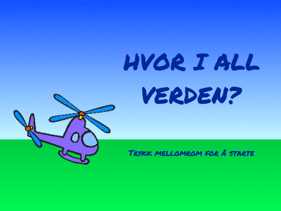
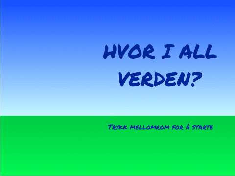
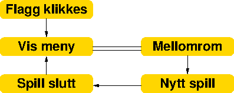

# Introduksjon {.intro}

Kor i all verda? er eit reise- og geografispel der ein raskast mogleg skal flyge
innom reisemål spreidd over heile Europa. Dette er den siste av tre delar. I
denne delen skal me lage lister som gjer det enklare å leggje til mange reisemål
og korleis me får dei til å kome i tilfeldig rekkefølgje. Me skal avslutte med å
lage ein skikkeleg intro til spelet.




# Steg 0: Forrige gong {.activity}

*No skal me fortsetje med det programmet me laga i del 1 og del 2.*

## Sjekkliste {.check}

Sjekk spesielt at

- [ ] du har eit helikopter som du kan styre over ein rullande bakgrunn med
  piltastane.

- [ ] du har ein stad-figur som kan bli funne av helikopteret.

- [ ] du har laga ein ny kloss (funksjon) som heiter `Reis
  til`{.blockmoreblocks}.


# Steg 1: Lag lister {.activity}

*No skal me flytte reisemåla våre over i lister. Dette gjer det neklare å leggje
til fleire reisemål og å velje reisemål tilfeldig.*

## Sjekkliste {.check}

- [ ] Vel stad-figuren, og klikk på `Data`{.blockdata}-kategorien. Lag ei liste
  som du kallar `stader` og let gjelde berre for denne figuren.

- [ ] No dukkar det opp ein grå boks på scena som heiter `Stad: stader`. Me kan
  la denne liggje inntil vidare. Du kan også sjå at det har kome nokre nye
  klossar som gjer ting med lister. Forstår du kva nokre av desse gjer?

- [ ] La oss fylle opp lista! Me startar med ei ny melding, og så kan me leggje
  til ting i lista.

  ```blocks
  når eg får meldinga [Lag lister v]
  legg [London] til [stader v]
  legg [Oslo] til [stader v]
  legg [Barcelona] til [stader v]
  ```

  Du kan gjerne bruke dei same reisemåla du allereie har lagt inn.

- [ ] Klikk på blokka du laget over slik at den køyrer. Blir den grå boksen på
  scena fylt med stader? Kva skjer viss du klikkar fleire gonger?

- [ ] Me kan sikre oss at kvar stad berre ligg i lista ein gong ved å tømme
  lista før me fyller ho. Legg til

  ```blocks
  slett (alle v) i [stader v]
  ```

  i koden før du legg til det fyrste reisemålet.

Ei lita utfordring med lister er at dei berre inneheldt ein type verdiar. I
dette tilfellet er det stadnamn. For reisemåla må me også halde styr på
koordinatane som seier kor staden er. Ein måte å gjere det på er å bruke tre
lister.

- [ ] Lag to nye lister, `staderX` og `staderY` som også berre gjeld for
  stad-figuren.

- [ ] No vil me utvide `Lag lister`-blokka slik at me fyller opp alle tre
  listene. Bruk dine eigne reisemål og koordinatar her om du vil:

  ```blocks
  når eg får meldinga [Lag lister v]
  slett (alle v) i [stader v]
  slett (alle v) i [staderX v]
  slett (alle v) i [staderY v]
  legg [London] til [stader v]
  legg [-135] til [staderX v]
  legg [-30] til [staderY v]
  legg [Oslo] til [stader v]
  legg [-30] til [staderX v]
  legg [75] til [staderY v]
  legg [Barcelona] til [stader v]
  legg [-135] til [staderX v]
  legg [-175] til [staderY v]
  ```

  Pass på at dei tre listene er samkøyrte slik at det er verdier for same
  reisemål som står på same plass i kvar liste.

# Steg 2: Vel eit reisemål tilfeldig {.activity}

*No skal me begynne å bruke listene våre til å velje stader å reise til
tilfeldig.*

## Sjekkliste {.check}

- [ ] Fyrst vil me lage listene våre når spelet startar. Engre på koden for
  `Nytt spel`{.blockevents} slik,

  ```blocks
  når eg får meldinga [Nytt spel v]
  send meldinga [Lag lister v]
  vis
  send meldinga [Ny stad v] og vent
  ```

- [ ] Lag ein ny variabel som heiter `stad`{.blockdata} og som berre gjeld for
  stad-figuren. Denne variabelen vil vere eit tal som identifiserer kva
  posisjon i listene det gjeldande reisemålet har.

- [ ] Koden for `Ny stad`{.blockevents} blir heilt ny. No skal me bruke både
  listene våre og den nye `Reis til`{.blockmoreblocks}-klossen me laga forrige
  gong.

  ```blocks
  når eg får meldinga [Ny stad v]
  sett [stad v] til (tilfeldig tal frå (1) til (lengda til [stader v]))
  Reis til (element (stad) i [stader v]) (element (stad) i [staderX v]) (element (stad) i [staderY v]) :: custom
  ```

- [ ] Prøv å køyre spelet fleire gonger. Virkar det som om reisemålet blir valt
  tilfeldig?

- [ ] For å få fleire reiseoppgåver i kvart spel kan me leggje ei `gjenta _
  gongar`{.blockcontrol}-løkke rundt sendinga av meldinga `Ny stad` i `Nytt
  spel`{.blockevents}-blokka. Kor mange gonger vil du gjenta meldinga?


# Steg 3: Fjern reisemål frå lista {.activity}

*I spelet vårt hender det at same reisemål blir valt tilfeldig fleire gonger
etter kvarandre. Dette kan me unngå ved å fjerne eit reisemål frå lista etter
kvart som me har funne det.*

## Sjekkliste {.check}

- [ ] For å ikkje bli spurt om å reise til same stad fleire gonger vil me slette
  reisemålet frå lista når me har funne det. Legg til slettekommandoar heilt
  nedst i `Ny stad`{.blockevents}-blokka,

  ```blocks
  slett (stad) i [stader v]
  slett (stad) i [staderX v]
  slett (stad) i [staderY v]
  ```

- [ ] Kva skjer viss du prøver å gi fleire oppgåver enn det er reisemål? Prøv
  sjølv!

  Den enklaste måten å unngå problemet på er å gi færre oppgåver eller leggje
  inn fleire reisemål i listene!

  Alternativt kan du leggje inn ein `viss`{.blockcontrol}-test som sjekker om
  lengda til `stader` er 0 øvst i `Ny stad`-blokka. Viss den er det kan du sende
  en ny `Lag lister`-melding for å byggje lista på nytt.


# Steg 4: Ein introduksjon {.activity}

*No er me nesten ferdige med spelet vårt. Men me vil forbetre det som kallast
programflyten slik at me får ein startmeny, og slik at me kan spele fleire
gonger.*

## Sjekkliste {.check}

- [ ] Lag ein ny bakgrunn som kan brukast på startskjermen. Me har teikna ein ny
  bakgrunn sjølv ved å bruke vektorgrafikk, setje saman to store firkantar og
  fylle dei med fargeovergangar. Så skreiv me litt tekst på bakgrunnen.

  

  Kall denne bakgrunnen for `meny`.

No skal me sende fleire meldingar som definerer programflyten. Me vil at menyen
skal kome til syne når me trykkar på det grøne flagget. Frå menyen vil me at eit
nytt spel skal starte viss me trykkar mellomrom-tasten. Når spelet er slutt vil
me at menyen skal visast att. Me kan teikne programflyten om lag slik:



- [ ] For å lage programflyten kan me bruke skript på scena. Lag dei følgjande
  enkle skripta:

  ```blocks
  når @greenFlag vert trykt på
  send meldinga [Vis meny v]

  når eg får meldinga [Vis meny v]
  byt bakgrunn til [meny v]

  når [mellomrom v] vert trykt
  viss <(bakgrunnsnavn) = [meny]>
      send meldinga [Nytt spel v]
  slutt

  når eg får meldinga [Nytt spel v]
  byt bakgrunn til [spel v]

  når eg får meldinga [spel slutt v]
  send meldinga [Vis meny v]
  ```

  Samanlikne desse skripta med programflyten over. Ser du korleis dei heng
  saman?

- [ ] Me må sende ei melding når spelet er slutt. Korleis veit me at spelet er
  slutt?

  Spelet er ferdig når me har besøkt alle reisemåla. Det betyr at me må sende
  meldinga `spel slutt` etter `gjenta`{.blockcontrol}-blokka på stad-figuren.

  Legg til denne meldinga og prøv spelet ditt. Virkar programflyten? Startar
  spelet når du trykkar mellomrom? Kjem du attende til menyen når spelet er
  slutt?

- [ ] Eit problem er at helikopteret, staden og kartet blir liggjande over
  menyen når spelet er slutt. Me må passe på at desse gøymast. Legg til
  følgjande kode til alle dei tre figurane:

  ```blocks
  når eg får meldinga [spel slutt v]
  gøym
  stopp [andre skript i figuren v] :: control
  ```

  Med `stopp`{.blockcontrol}-klossen passar me på at alle skripta stoppar når
  spelet er slutt.

## Test prosjektet {.flag}

__Klikk på det grøne flagget.__

- [ ] Fungerer programflyten som den skal? Startar spelet når du trykkar på
  mellomrom-tasten? Kjem du tilbake til menyen når spelet er slutt?

- [ ] Blir alle figurane vist og gøymt når dei skal?


# Steg 5: Ta tida {.activity}

*For å gjere spelet meir spanande avsluttar me med å gi spelaren avgrensa tid
for å finne reisemåla.*

## Sjekkliste {.check}

- [ ] Lag ein ny variabel, `Tid`{.blockdata}, som gjeld for alle figurar. Det
  ser ganske bra ut om du høgreklikkar på `Tid`{.blockgrey}-boksen på scena og
  veljer `stor`.

- [ ] På scena kan du setje `Tid`{.blockdata} til, til dømes, 30 (sekund) etter
  at `Nytt spel`{.blockevents} blir motteke. Lag ei løkke som gjentek seg til
  `Tid`{.blockdata} er 0. Inne i løkka kan du endre `Tid`{.blockdata} med -1, og
  vente 1 sekund. Avslutt med å sende ut meldinga `spel slutt` etter løkka.

- [ ] Kanskje du kan gi spelaren litt ekstra tid kvar gong han finn ein stad?

- [ ] Til slutt må du leggje på ein `stopp`{.blockcontrol}-kloss også på scena
  når spelet er slutt for at tida skal stoppe når spelaren har funne alle
  reisemåla.

## Test prosjektet {.flag}

__Klikk på det grøne flagget.__

- [ ] Fungerer tidtakinga? Blir tida telt ned mot 0?

- [ ] Blir spelet avslutta når du har funne alle reisemåla? Blir spelet avslutta
  når tida går ut?

## Legg ut prosjektet {.save}

No er me ferdige med spelet! Veldig bra! Me håpar du har lært mykje spanande
gjennom dette spelet. Du kan dele spelet med familie og vener ved å trykkje
`Legg ut` øvst til høgre på skjermen.

## Prøv sjølv {.challenge}

- [ ] Sjølv om leksjonane er ferdige tyder det ikkje at du ikkje kan
  vidareutvikle spelet ditt. Ei enkel utviding er å leggje til fleire reisemål.
  Her er til dømes to nye stader du kan leggje til:

  ```blocks
  legg [Reykjavik] til [stader v]
  legg [-215] til [staderX v]
  legg [210] til [staderY v]
  legg [Roma] til [stader v]
  legg [-30] til [staderX v]
  legg [-180] til [staderY v]
  ```

  Pass på at koordinatane stemmer. Det er endå betre om du finn på dine eigne
  reisemål. Hugs at det ikkje må vere byar, det kan også vere fjell, sjøar eller
  kanskje land!

- [ ] Ein variant av spelet kan også vere å bytte ut kartet over Europa med eit
  kart over eit anna område. Det finst mange kart på nettet, så prøv deg fram!

- [ ] Viss spelet er vanskeleg går det an å gi spelaren eit hint ved å la
  sirkelen sakte kome til syne når tida går. Du lagar ei løkke som startar når
  `Ny stad`{.blockevents} blir motteke, og som sakte endrar den gjennomsiktige
  effekten ned mot 0 vil spelaren enklare kunne finne dei vanskelege reisemåla.

- [ ] Du kan lage fleire nivå, til dømes lett og vanskeleg. Då lagar du ulike
  lister avhengig av kva nivå spelaren vel, til dømes ved å trykke `1` eller `2`
  i staden for mellomrom når spelet startar.

Heilt til slutt, hugs at dette er _ditt_ spel som _du_ har laga! Du bestemmer
sjølv korleis du vil at spelet skal fungere!
