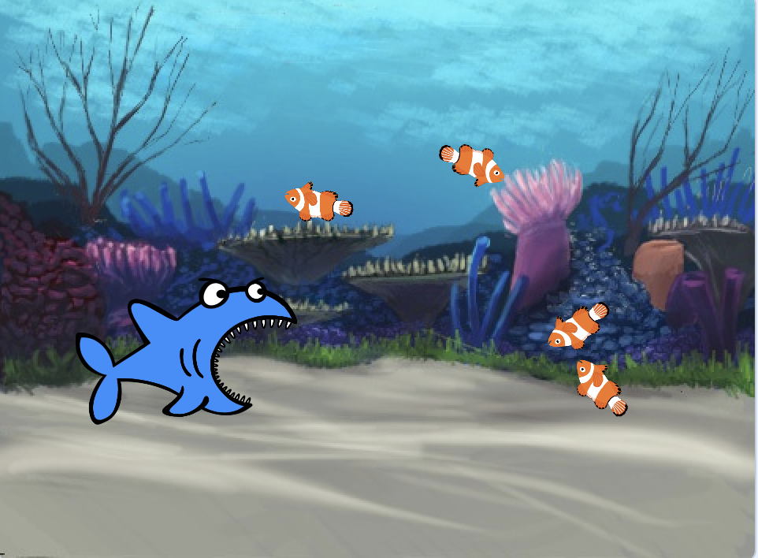

# Introduksjon {.intro}

Vi skal nå lage et JafseFisk-spill! Målet i spillet er å hjelpe
JafseFisk med å spise alle byttedyrene som svømmer rundt i havet.



# Steg 1: JafseFisk følger musepekeren {.activity}

*Først skal vi lage JafseFisk som svømmer rundt i havet!*

## Sjekkliste {.check}

+ Start et nytt Scratch prosjekt.

+ __Riktig bakgrunn__ får du ved å velge `Scene` og så
  `Bakgrunner`-fanen. Importer bakgrunnen `Natur/underwater3` ved å
  velge
  . Slett
  så den opprinnelige bakgrunnen `backdrop1`.

+ Endre Sprite1's navn til `JafseFisk` ved å klikke på katten og
  deretter på det blå `i`{.blockmotion}-symbolet.

+ Gi figuren en haidrakt ved å gå til `Drakter`-fanen og velge
  . Velg
  drakten `Dyr/shark-b`. Kall drakten `Åpen munn`. Slett så figurens
  kattedrakter.

+ Klikk på det blå `i`{.blockmotion}-symbolet igjen, og pass på at
  figuren bare kan bevege seg fra side til side ved å velge
  rotasjonsmåte .

+ Få fisken til å følge musepekeren rundt i sjøen ved å lage dette
  skriptet:

  ```blocks
  når grønt flagg klikkes
  for alltid
      pek mot [musepeker v]
      gå (3) steg
  slutt
  ```

## Test Prosjektet {.flag}

__Klikk på det grønne flagget.__

+ Flytt musepekeren rundt i sjøen. Følger fisken etter?

+ Hva skjer hvis du ikke flytter musepekeren og fisken når den igjen?

+ Hvordan ser den ut? Hvorfor gjør den dette?

## Sjekkliste {.check}

+ Du kan stoppe JafseFisks maniske flipping hvis du sørger for at den
  bare flytter seg når den ikke er for nær musepekeren (`avstand
  til [musepeker v]`{.b} ligger i
  `Sansning`{.blocksensing}-kategorien).

  ```blocks
  når grønt flagg klikkes
  for alltid
      hvis <(avstand til [musepeker v]) > [10]>
          pek mot [musepeker v]
          gå (3) steg
      slutt
  slutt
  ```

## Ting å prøve {.try}

Hvis du vil kan du forandre tallene i skriptet, og se hvordan det
forandrer bevegelsene.

+ Sett avstandsgrensen til et stort tall (f.eks. 100), eller et lite
  tall (f.eks. 1).

+ Sett antall steg fisken flytter seg til et stort tall (f.eks. 20)
  eller et lite tall (f.eks. 1, eller til og med 0, hva skjer?).

# Steg 2: Legg til byttedyr {.activity}

*Det er på tide å gi JafseFisk noe å spise!*

## Sjekkliste {.check}

+ Legg til en ny figur fra biblioteket ved å bruke `Dyr/Fish2`. Gi
  figuren navnet `Byttedyr`.

+ Gjør figuren mindre ved å bruke krympeknappen
   som ligger over den røde
  stopp-knappen.

+ Få byttedyret til å bevege seg i tilfeldige retninger. Først skal vi
  la det bevege seg litt framover, og så snu en tilfeldig valgt vinkel
  med eller mot klokka, og deretter gjenta.

  ```blocks
  når grønt flagg klikkes
  for alltid
      gå (2) steg
      vend venstre (tilfeldig tall fra (-20) til (20)) grader
      sprett tilbake ved kanten
  slutt
  ```

## Test prosjektet {.flag}

__Klikk på det grønne flagget.__

+ Svømmer byttedyret rundt slik du forventet?

+ Ser bevegelsene naturlige ut?

*For øyeblikket samspiller ikke JafseFisk og byttedyret med
 hverandre. Det skal vi gjøre noe med i neste steg.*

## Ting å prøve {.try}

+ Prøv å forandre tallene for `gå (2) steg`{.b} og `tilfeldig
  tall fra (-20) til (20)`{.b}. Hvordan forandrer det byttedyrets
  bevegelser?

+ Hva gjør `sprett tilbake ved kanten`{.b}? Fjern
  klossen og se hva som skjer.

# Steg 3: JafseFisk spiser byttet {.activity}

*Nå skal vi la JafseFisk spise byttet!*

Når JafseFisk har fanget byttet i munnen skal to ting skje: JafseFisk
må lukke munnen og lage en gomlelyd. Videre må byttet forsvinne, for
så å dukke opp igjen en liten stund senere.

## Sjekkliste {.check}

+ Vi starter med å la byttet forsvinne hvis det berører JafseFisk, og
  så komme tilbake etter 3 sekunder. Bruk
  `berører [JafseFisk v]?`{.b} for å sjekke om byttet kommer borti
  JafseFisk. Utvid skriptet på byttedyret slik som dette:

  ```blocks
  når grønt flagg klikkes
  for alltid
      gå (2) steg
      vend venstre (tilfeldig tall fra (-20) til (20)) grader
      sprett tilbake ved kanten
      hvis <berører [JafseFisk v]?>
          skjul
          vent (3) sekunder
          vis
      slutt
  slutt
  ```

## Test prosjektet {.flag}

__Klikk på det grønne flagget.__

+ Legg merke til at byttet forsvinner uansett hvor det berører
  JafseFisk.

+ Dessuten kan JafseFisk bare vente 3 sekunder og så spise byttet i
  samme øyeblikk som det dukker opp igjen, det er ikke særlig
  rettferdig!

## Sjekkliste {.check}

*Hvordan kan vi sikre at byttet bare forsvinner hvis det berører
 JafseFisks munn? Tja, vi kan bruke `<berører fargen [#FFFFFF]?>`{.b}
 og se om den berører det hvite på fiskens tenner.*

+ Legg til `<berører fargen [#FFFFFF]?>`{.b} i tillegg til
  `<berører [JafseFisk v]?>`{.b} i skriptet ditt. For å velge hvit
  klikker du på fargen i klossen og deretter på fiskens tenner.

+ Nå kan vi la byttet flytte seg til et tilfeldig punkt på skjermen
  før det dukker opp igjen ved å bruke `gå til x: (tilfeldig tall fra (-220) til (220)) y: (tilfeldig tall fra (-170) til (170))`{.b}
  som vi gir tilfeldige verdier for `x` og `y`.

  ```blocks
  når grønt flagg klikkes
  for alltid
      gå (2) steg
      vend venstre (tilfeldig tall fra (-20) til (20)) grader
      sprett tilbake ved kanten
      hvis <<berører [JafseFisk v]?> og <berører fargen [#FFFFFF]?>>
          skjul
          vent (3) sekunder
          gå til x: (tilfeldig tall fra (-220) til (220)) y: (tilfeldig tall fra (-170) til (170))
          vis
      slutt
  slutt
  ```

## Test prosjektet {.flag}

__Klikk på det grønne flagget.__

+ Forsvinner byttet bare når det berører fiskens tenner?

+ Kommer det tilbake et tilfeldig sted på skjermen – altså ikke samme
  sted som det ble spist?

# Steg 4: JafseFisk reagerer {.activity}

*JafseFisk må vite når den har spist noe slik at den kan gi fra seg en
 lyd og bytte drakt.*

## Sjekkliste {.check}

+ For at JafseFisk skal vite hva som skjer kan vi la byttet
  `send melding [Du tok meg! v]`{.b} om at det er spist, før det
  forsvinner.

  ```blocks
  når grønt flagg klikkes
  for alltid
      gå (2) steg
      vend venstre (tilfeldig tall fra (-20) til (20)) grader
      sprett tilbake ved kanten
      hvis <<berører [JafseFisk v]?> og <berører fargen [#FFFFFF]?>>
          send melding [Du tok meg! v]
          skjul
          vent (3) sekunder
          gå til x: (tilfeldig tall fra (-220) til (220)) y: (tilfeldig tall fra (-170) til (170))
          vis
      slutt
  slutt
  ```

Nå vil vi at JafseFisk reagerer på denne meldingen ved å lage en
gomlelyd og klikke med kjevene.

+ Legg til drakten `Dyr/shark-a` og lyden `Effekter/bubbles` på
  JafseFisk. Kall drakten `Lukket munn`.

+ Legg så til et nytt skript til JafseFisk slik at han kan svare på
  meldingen `Du tok meg!` fra byttedyret. Dette skriptet gjør at
  fisken spiller av boblelyden og `bytt drakt til [Åpen munn v]`{.b}
  drakten, venter litt og så bytter tilbake.

  ```blocks
  når jeg mottar [Du tok meg! v]
  spill lyden [bubbles v]
  gjenta (2) ganger
      bytt drakt til [Lukket munn v]
      vent (0.5) sekunder
      bytt drakt til [Åpen munn v]
      vent (0.5) sekunder
  slutt
  ```

Nå er JafseFisk klar til å spise, så la oss fylle havet med byttedyr.

+ Høyreklikk på byttedyret og velg `lag kopi` til du føler at du har
  fått nok fisk.

## Test prosjektet {.flag}

__Klikk på det grønne flagget.__

+ Spiser JafseFisk byttet?

+ Spiser den alle byttedyrene?

## Noe å tenke på {.protip}

Hvorfor bør vi legge til `vis`{.b} i starten av
byttedyrets skript? Tenk på hva som vil skje om byttet blir spist og
spillet stoppes før det dukker opp igjen. Og hva vil skje om spillet
deretter blir startet igjen?

## Lagre prosjektet {.save}

__Godt gjort!__ Du har i grunn fullført spillet! Men det finnes flere
muligheter for utvidelse av spillet. Er du klar for en utfordring?

## Utfordring 1: Forandre bevegelsene til byttedyrene {.challenge}

For øyeblikket beveger alle byttedyrene seg likt. __Kan du få ett av
dem til å bevege seg annerledes?__

__Hint:__ Ikke bruke for lang tid på denne oppgaven uten å se på de
andre utfordringene i dette prosjektet.

__Velg deg ut et byttedyr å eksperimentere med.__ Hvis de har samme
drakt, bytt farge med `sett [farge v] effekt til (0)`{.b}. Slik
kan du se forskjell fra resten av byttedyrene. Prøv nå å få dette
byttedyret til å bevege seg saktere enn de andre.

__Hint:__ Se på klossen `gå (2) steg`{.b}.

## Test prosjektet {.flag}

__Klikk på det grønne flagget.__

+ Beveger byttet seg saktere? Gjør dette spillet bedre?

+ Hvis du klarte dette, prøv å gjøre et av byttedyrene __raskere enn
  de andre.__

+ Beveger byttedyrene seg på en fornuftig måte?  Gjør disse
  forandringene spillet bedre?

  __Hint:__ Hvis byttet ditt svømmer rundt i sirkler, sjekk verdiene
  i `vend venstre (tilfeldig tall fra (-20) til (20)) grader`{.b}.

+ Hva om du lar alle byttedyrene bevege seg forskjellig, ved å bruke
  forskjellige kombinasjoner av disse bevegelsene?

+ Gjør noen av disse forandringene spillet bedre? Gjør de spillet med
  interessant, morsommere, vanskeligere eller lettere? Er noe av dette
  bedre synes du?

## Utfordring 2: Hjelp byttet å unngå JafseFisk {.challenge}

Byttedyrene i dette spillet er skikkelig dumme! De svømmer bare
tilfeldig rundt til de blir spist. Ekte fisk svømmer vekk fra
rovfisker. Nå vil vi __la ett av byttedyrene svømme vekk fra
JafseFisk.__

Det fins ingen kloss i Scratch som kan gi oss retningen vekk fra en
annen figur. Men du kan få en figur til å snu seg i retningen mot en
annen, og deretter la den snu seg i motsatt retning. Klossene du
trenger er i `Bevegelse`{.blockmotion}-kategorien.

Prøv nå å hjelpe et av byttedyrene med å __snu seg vekk fra
JafseFisk__. La den også virre litt mens den svømmer bort!  Du vil
kanskje oppdage at byttet setter seg fast i et hjørne? Du vil kanskje
at byttet bare ønsker å flykte dersom JafseFisk kommer for nære?
__Hint:__ Se tilbake på hvordan vi brukte `(avstand til [musepeker v])`{.b} tidligere i spillet.

## Test prosjektet {.flag}

__Klikke på det grønne flagget.__

+ Gjør dette at fisken blir vanskeligere å ta? Gjør det spillet bedre?

## Utfordring 3: Legg til poeng {.challenge}

Det er ikke nok bare å spise fisk. Hvordan vet du at du er en bedre
spiller enn vennene dine? Du må kunne __samle poeng__, så la oss legge
til __en poengtavle.__ Lag en variabel som heter `(poeng)`{.b},
og endre denne når JafseFisk spiser.  Pass på at poengene går tilbake
til null ved begynnelsen av spillet. Hvor skal du legge inn disse
endringene?

## Test prosjektet {.flag}

__Klikk på det grønne flagget.__

+ Går poengsummen opp hver gang JafseFisk spiser byttedyr?

+ Går den tilbake til null når spillet starter?

## Utfordring 4: Legg til en nedtelling {.challenge}

Gi deg selv __en tidsfrist__. Hvor mange fisk kan du spise på 30
sekunder?

Legg til en ny variabel, `(tid)`{.b}. Lag et nytt skript som
setter variabelen til for eksempel `30`, for deretter å endre denne
med `-1`, vente 1 sekund, og endre igjen, helt til den når null. Til
slutt kan du bruke en `stop [alle v]`{.b}-kloss for å slutte
spillet.

## Test prosjektet {.flag}

__Klikk på det grønne flagget.__

+ Begynner tidtakeren på 30?

+ Teller den ned med rett hastighet?

+ Kan du fange fisk mens tiden telles ned?

+ Stopper spillet når telleren når null?

## Utfordring 5: Legg til bonuspoeng {.challenge}

Legg til en belønning med mange bonuspoeng om du klarer å spise alle
fiskene samtidig. Hvordan kan du vite hvor mange som er spist?

__Hint:__ En måte å gjøre dette på er å bruke en variabel for å
__telle__ hvor mange byttedyr som svømmer i havet.

## Test prosjektet {.flag}

__Klikk på det grønne flagget.__

+ Får du bonuspoeng for å spise opp alle fiskene?

## Utfordring 6: Forandre spillet: Hold byttedyrene i live! {.challenge}

Av og til kan man få glimrende nye idèer ved å gjøre det motsatte av
det man allerede har gjort.

Endre spillet slik at du i stedet __kontrollerer et byttedyr__ i et
hav av __mange JafseFisker__. Hvor lenge kan du holde det gående før
du blir spist? I stedet for å bruke poeng kan du telle liv. Hva med å
gi byttedyret 3 liv og avslutte spillet når de er brukt opp?

## Lagre prosjektet {.save}

__Godt gjort, du er ferdig! Nå kan du nyte spillet ditt!__

Ikke glem at du kan dele spillet med alle vennene og familien din ved
å klikke på `Legg ut` i topp-menyen!
