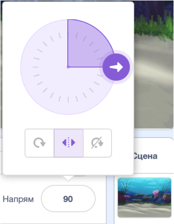

# Вступ {.intro}

Зараз ми створимо гру про Акулу! Мета гри - допомогти Акулі з'їсти всю здобич, що плаває в морі.


# Крок 1: Акула слідує за вказівником миші {.activity}

*Спершу ми змусимо Акулу плавати!*

## Контрольний список {.check}

- [ ] Почніть новий проект у Scratch.

- [ ] Щоб отримати потрібне тло, натисніть .  у правому нижньому куті екрана. Виберіть фон Під водою/underwater2.

- [ ] Видаліть початкового персонажа і додайте нового, натиснувши   і обравши `Тварини/Shark 2`.
  Назвіть персонажа `Акула`.

- [ ] Переконайтеся, що персонаж може рухатися тільки з боку в бік, вибравши режим обертання
  .

- [ ] Змусьте Акулу слідувати за вказівником миші, створивши цей скрипт

  ```blocks
  коли @greenFlag натиснуто
  змінити образ на [shark2-b v]
  завжди
      слідувати за [вказівник v]
      перемістити на (3) кроків
  slutt
  ```

## Протестуйте проект {.flag}

__Натисніть на зелений прапорець.__

- [ ] Перемістіть вказівник миші навколо водойми. Чи слідує Акула за вказівником?

- [ ] Що станеться, якщо ви не відведете вказівник миші, а Акула знову його досягне? На що це схоже? Чому вона це робить?

## Контрольний список {.check}

- [ ] Ви можете зупинити перевертання Акули, якщо переконаєтеся, що вона рухається лише тоді, коли не знаходиться надто близько до вказівника миші 
  (`відстань до [вказівник v]`{.b} знаходиться в категорії `Датчики`.

  ```blocks
  коли @greenFlag натиснуто
  змінити образ на [shark2-b v]
  завжди
      якщо <(відстань до [вказівник v]) > [10] то>
          слідувати за [вказівник v]
          перемістити на (3) кроків
      slutt
  slutt
  ```

## Речі, які варто спробувати {.challenge}

За бажанням, ви можете змінити числа в скрипті і подивитися, як це змінює рухи.

- [ ] Встановіть обмеження відстані на велике число (наприклад `100`), або на мале
  (наприклад `1`) og sjå kva som skjer.

- [ ] Встановіть кількість кроків, на які рухається Акула, на велике число (наприклад `20`)
  або на мале (наприклад `1`, або навіть `0`) що стається.


# Крок 2: Додайте здобич {.activity}

*Настав час нагодувати Акулу чимось смачненьким!*

## Контрольний список {.check}

- [ ] Додайте нового персонажа з бібліотеки, обравши `Тварини/Fish`. Надайте персонажу імʼя `Здобич`.

- [ ] Змусьте здобич рухатися у випадкових напрямках. Спочатку ми дозволимо їй трохи просунутися вперед, потім повернемо на випадково обраний кут за годинниковою стрілкою або проти годинникової стрілки, а потім повторимо.

  ```blocks
  коли @greenFlag натиснуто
  задати розмір (40)
  завжди
      перемістити на (2) кроків
      поворот @turnLeft на (випадкове від (-20) до (20)) градусів
      якщо на межі, відбити
  slutt
  ```

## Протестуйте проект {.flag}

__Натисніть на зелений прапорець.__

- [ ] Чи плаває здобич так, як ви очікували?

- [ ] Чи виглядають її рухи природно?

*Наразі Акула і здобич не взаємодіють один з одним. Ми зробимо щось з цим на наступному кроці.*

## Речі, які варто спробувати {.challenge}

- [ ] Спробуйте змінити числа в `перемістити на (2) кроків`{.b} та `випадкове від (-20)
  до (20)`{.b}. Як це змінює рухи здобичі?

- [ ] Що робить `якщо на межі, відбити`{.b}? Видаліть цей блок і подивіться, що станеться.

# Крок 3: Акула їсть здобич {.activity}

*Тепер нехай Акула з'їсть здобич!*

Коли Акула спіймала здобич у роті, мають відбутися дві речі: Акула повинна закрити свій рот і зробити звук ковтання. Здобич повинна зникнути і з'явитися через деякий час.

## Контрольний список {.check}

- [ ] Ми починаємо з того, що дозволяємо здобичі зникнути, якщо вона торкається Акули, а потім здобич повертається через `3` секунди. Використовуйте `торкається [Акула v]?`{.b} щоб перевірити, чи доторкнулася жертва до Акули. Розширте скрипт для здобичі таким чином:

  ```blocks
  коли @greenFlag натиснуто
  показати
  завжди
      перемістити на (2) кроків
      поворот @turnLeft на (випадкове від (-20) до (20)) градусів
      якщо на межі, відбити
      якщо <торкається [Акула v]? то>
          сховати
          чекати (3) секунд
          показати
      slutt
  slutt
  ```
## Протестуйте проект {.flag}

__Натисніть на зелений прапорець.__

- [ ] Зверніть увагу, що здобич зникає незалежно від того, якої частини Акули вона торкається.

- [ ] Більше того, Акула може чекати лише 3 секунди, а потім з'їсти здобич, як тільки вона знову з'явиться, що не дуже чесно!

## Контрольний список {.check}

*Як зробити так, щоб здобич зникала лише тоді, коли торкнеться рота Акули? Ну, ми можемо використати `<торкається кольору  [#FFFFFF]?>`{.b} і подивитися, чи торкається здобич білих зубів риби.*

- [ ] Додайте `<торкається кольору [#FFFFFF]?>`{.b} разом з `<торкається
  [Акула v]?>`{.b} у ваш скрипт. Щоб вибрати білий колір, клацніть на колір у блоці, а потім на зуби риби.

- [ ] Тепер ми можемо дозволити здобичі переміститися у довільну точку екрана, перш ніж вона знову з'явиться на екрані за допомогою `перемістити в x: (випадкове від (-220) до (220)) y:
  (випадкове від (-170) до (170))`{.b} ми присвоюємо випадкові значення `x` та `y` здобичі.

Ось як повинен виглядати сценарій здобичі:

  ```blocks
  коли @greenFlag натиснуто
  показати
  завжди
      перемістити на (2) кроків
      поворот @turnLeft на (випадкове від (-20) до (20)) градусів
      якщо на межі, відбити
      якщо <<торкається [Акула v]?> і <торкається кольору [#FFFFFF]?> то>
          сховати
          чекати (3) секунд
          перемістити в x: (випадкове від (-220) до (220)) y: (випадкове від (-170) до (170))
          показати
      slutt
  slutt
  ```

## Протестуйте проект {.flag}

__Натисніть на зелений прапорець.__

- [ ] Чи зникає здобич тільки тоді, коли вона торкається зубів Акули?

- [ ] Чи з'являється вона знову у випадковому місці на екрані - тобто не там, де була з'їдена?

# Steg 4: Jafsefisk reagerer {.activity}

*Jafsefisk må vite når den har ete noe slik at den kan gi frå seg ein lyd og
 bytte drakt.*

## Sjekkliste {.check}

- [ ] For at Jafsefisk skal vite kva som skjer kan me la byttet `send meldinga
  [Du tok meg! v]`{.b}, om at det har blitt ete, før det forsvinn.

  ```blocks
  når @greenFlag vert trykt på
  gjenta for alltid
      gå (2) steg
      snu @turnLeft (tilfeldig tal frå (-20) til (20)) gradar
      viss ved kant, sprett
      viss <<rører [Jafsefisk v]?> og <rører fargen [#FFFFFF]?>>
          send meldinga [Du tok meg! v]
          gøym
          vent (3) sekund
          gå til x: (tilfeldig tal frå (-220) til (220)) y: (tilfeldig tal frå (-170) til (170))
          vis
      slutt
  slutt
  ```

No vil me at Jafsefisk skal reagere på meldinga ved å lage ein gomlelyd og
klikke med kjevane.

- [ ] Legg til drakta `Dyr/shark-a` og lyden `Effekter/bubbles` på Jafsefisk.
  Kall drakta `Lukka munn`.

- [ ] Legg så til eit nytt skript til Jafsefisk slik at han kan svare på
  meldinga `Du tok meg!` frå byttedyret. Dette skriptet gjer at fisken spelar
  av boblelyden og `byt drakt til [Ope munn v]`{.b}-drakta, ventar litt og så
  byttar tilbake.

  ```blocks
  når eg får meldinga [Du tok meg! v]
  start lyden [bubbles v]
  gjenta (2) gongar
      byt drakt til [Lukka munn v]
      vent (0.5) sekund
      byt drakt til [Ope munn v]
      vent (0.5) sekund
  slutt
  ```

No er Jafsefisk klar til å ete, så la oss fylle havet med byttedyr.

- [ ] Høgreklikk på byttedyret og vel `lag kopi` til du føler at du har fått
  nok fisk.

## Test prosjektet {.flag}

__Klikk på det grøne flagget.__

- [ ] Et Jafsefisk byttet?

- [ ] Et den alle byttedyra?

## Noko å tenke på {.protip}

Kvifor bør me leggje til `vis`{.b} i starten av skriptet til byttedyret? Tenk på
kva som vil skje om byttet blir ete opp og spelet stoppar før det dukkar opp
att. Og kva skjer om me så startar spelet att?

## Lagre prosjektet {.save}

__Godt gjort!__ Du har i grunn fullført spelet! Men det finst fleire
moglegheiter for å utvide spelet. Er du klar for ei utfordring?

## Utfordring 1: Forandre rørslene til byttedyra {.challenge}

No beveger alle byttedyra seg likt. __Kan du få eitt av dei til å
bevege seg annleis?__

__Hint:__ Ikke bruk for lang tid på denne oppgåva utan å sjå på dei andre
utfordringane.

__Vel eit byttedyr å eksperimentere med.__ Viss dei har same drakt, bytt farge
med `set [farge v]-effekt til (0)`{.b}. Slik kan du ser skilnad på dette frå
dei andre byttedyra. Prøv å få dette byttedyret til å bevege seg saktare enn dei
andre.

__Hint:__ Sjå på klossen `gå (2) steg`{.b}.

## Test prosjektet {.flag}

__Klikk på det grøne flagget.__

- [ ] Beveger byttet seg saktare? Gjer dette spelet betre?

- [ ] Viss du klarte dette, prøv å gjere eit av byttedyra __raskere__ enn dei
  andre.

- [ ] Beveger byttedyra seg på ein fornuftig måte? Gjer desse forandringane
  spelet betre?

  __Hint:__ Viss byttet ditt svømmer rundt i sirklar, sjekk verdiane i `snu @turnLeft (tilfeldig tal frå (-20) til (20)) gradar`{.b}.

- [ ] Kva viss du let alle byttedyra bevege seg ulikt ved å bruke ulike
  kombinasjonar av desse rørslene?

- [ ] Gjer nokre av desse forandringane spelet betre? Gjer dei spelet meir
  interessant, morosamt, vanskelegare eller lettare? Er noko av dette betre,
  synest du?

## Utfordring 2: Hjelp byttet å unngå Jafsefisk {.challenge}

Byttedyrene i dette spelet er skikkeleg dumme! De svømmer berre tilfeldig rundt
til dei blir etne. Ekte fisk svømmer vekk frå rovfiskane. No vil me __la eitt av
byttedyra svømme vekk frå Jafsefisk.__

Det finst ingen kloss i Scratch som kan gi oss retningen vekk frå ein annan
figur. Men du kan få en figur til å snu seg i retninga mot ein annen, og så la
den snu seg i motsett retning. Klossane du treng er i
`Rørsle `{.blockmotion}-kategorien.

Prøv å hjelpe eitt av byttedyra med å __snu seg vekk frå Jafsefisk__. La den
også virre litt mens den svømmer bort! Du vil kanskje oppdage at byttet set seg
fast i eit hjørne? Kanskje vil du berre at byttet skal flykte viss Jafsefisk
kjem for nære? __Hint:__ Sjå tilbake på korleis me brukte `(avstand til
[musepeikar v])`{.b} tidlegare i spelet.

## Test prosjektet {.flag}

__Klikk på det grøne flagget.__

- [ ] Gjør dette at fisken blir vanskelegare å ta? Gjer det spelet betre?

## Utfordring 3: Legg til poeng {.challenge}

Det er ikkje nok å berre ete fisk. Korleis vet du at du er ein betre spelar enn
venene dine? Du må kunne __samle poeng__, så la oss leggje til __ei
poengtavle.__ Lag ein variabel som heiter `(poeng)`{.b}, og endre denne når
Jafsefisk et. Pass på at poenga går tilbake til null når spelet startar. Kor
skal du leggje inn desse endringane?

## Test prosjektet {.flag}

__Klikk på det grøne flagget.__

- [ ] Går poengsummen opp kvar gong Jafsefisk et byttedyr?

- [ ] Går den tilbake til null når spelet startar?

## Utfordring 4: Legg til ei nedtelling {.challenge}

Gi deg sjølv __ein tidsfrist__. Kor mange fisk kan du ete på `30` sekund?

Legg til ein ny variabel, `(tid)`{.b}. Lag eit nytt skript som set variabelen
til til dømes `30`, for så å endre denne med `-1`, vente eitt sekund, og endre
att, heilt til den når null. Til slutt kan du bruke ein `stopp [alle
v]`{.b}-kloss for å avslutte spelet.

## Test prosjektet {.flag}

__Klikk på det grøne flagget.__

- [ ] Startar tidtakaren på 30?

- [ ] Tel den ned med rett hastigheit?

- [ ] Kan du fange fisk når tida tel ned?

- [ ] Stoppar spelet når teljaren når null?

## Utfordring 5: Legg til bonuspoeng {.challenge}

Legg til ei belønning med mange bonuspoeng om du klarar å ete alle fiskane
samstundes. Korleis kan du vite hvor mange som er etne?

__Hint:__ Ein måte å gjere dette på er å bruke ein variabel for å __telje__ kor
mange byttedyr som svømmer i havet.

## Test prosjektet {.flag}

__Klikk på det grøne flagget.__

- [ ] Får du bonuspoeng for å ete opp alle fiskane?

## Utfordring 6: Forandre spelet: Hald byttedyra i live! {.challenge}

Av og til kan ein få glimrande nye idear ved å gjere det motsette av det ein
allereie har gjort.

Endre spelet slik at du i staden __kontrollerer eit byttedyr__ i eit hav med
__mange Jafsefiskar__. Kor lenge kan du halde det gåande før du blir ete? I
staden for å bruke poeng kan du telje liv. Kva med å gi byttedyret `3` liv og
avslutte spelet når dei er brukt opp?

## Lagre prosjektet {.save}

__Godt gjort, du er ferdig! No kan du nyte spelet ditt!__

Ikkje gløym at du kan dele spelet med alle venene og familien din ved å klikke
på `Legg ut` i topp-menyen!

