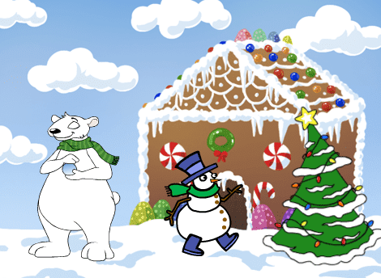

# Informasjon til veiledere

I dette prosjektet ser vi på forskjellige måter vi kan animere figurer
på. Temaet er holdt rundt jul og vinter, slik at oppgaven passer bra i
tiden før jul. Kodingen er ganske enkel, slik at dette er en fin
oppgave å introdusere Scratch med, eventuelt for barn som ikke har så
mye erfaring med Scratch.

# Forberedelser

Julekort bruker bare ressurser som er inkludert i Scratch-platformen
og krever som sådann ingen spesielle forberedelser.

Her er likevel noen generelle ting som kan være verdt å huske på:

+ Scratch er tilgjengelig på nettsiden <http://scratch.mit.edu/>. Velg
  `Programmering` eller `Prøv Det` for å begynne å programmere.
+ Alle elevene bør ha sin egen bruker i Scratch-nettverket. Uten en
  slik bruker er det mye vanskeligere å lagre spillene og programmene
  man lager. For å opprette en ny bruker, klikk `Bli Scratch-bruker`
  og følg instruksene på skjermen.
+ For å skifte språk til norsk:
  + På de vanlige nettsidene til Scratch finnes en nedtrekksmeny for
    å velge språk helt nederst på skjermen.
  + Inne i Scratch-editoren kan man trykke på jordkloden øverst til
    venstre for å endre språket som brukes.

# Læringsmål

De viktigste læringsmålene i Julekort er

1. forskjellige teknikker for å __animere figurer__,
2. hvordan man kan __la figurer komme til liv når de klikkes på__, og
3. enkel bruk av __løkker__ for å gjøre ting flere ganger.
