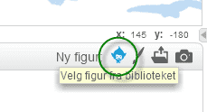
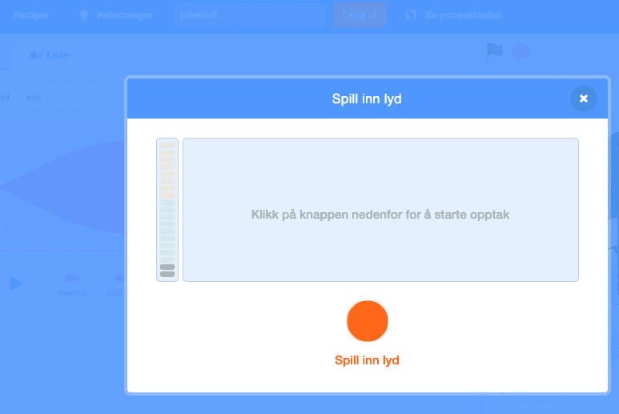

# Introduksjon {.intro}

Me skal lage eit julekort i Scratch. Det skal ha nokre enkle funksjonar og
animasjonar. Når det er ferdig vil det sjå ut om lag som på biletet under.


# Steg 1: Endre bakgrunn og finn figurar {.activity}

Når du er klar til å starte vel du `Programmering` i menyen øvst på sida
<http://scratch.mit.edu/>. Då kjem me inn i Scratch.


## Sjekkliste {.check}

- [ ] Klikk på scena ved sidan av kattefiguren `Sprite1` i vindauget for
  figurar. Trykk på  for å importere ein
  ferdig bakgrunn. Vel den bakgrunnen du vil. Så slettar du den tomme bakgrunnen
  som ligg der.

  

- [ ] Slett kattefiguren `Sprite1` ved å høgreklikke på den og slette.

- [ ] Vel nye figurar frå biblioteket. Legg til isbjørnen, snømannen og
  juletreet.

  

# Steg 2: Leggje til kode {.activity}

No skal me få figurane til å gjere ting når dei blir klikka på.

## Sjekkliste {.check}

- [ ] Vel isbjørnen og fana `Skript`{.blocklightgrey} og lag denne koden. Når
  isbjørnen blir klikka på skal den seie `God jul!`. Så skal den skifte utsjånad
  kvart sekund, 10 gonger.

  ```blocks
  når denne figuren vert trykt på
  sei [God jul!] i (2) sekund
  gjenta (10) gongar
      neste drakt
      vent (1) sekund
  slutt
  ```

## Test prosjektet ditt {.flag}

__Klikk på isbjørnen og sjå om koden din virkar.__

- [ ] Seier isbjørnen `God jul!`?

- [ ] Forandrar isbjørnen stilling?

## Sjekkliste {.check}

- [ ] Vel snømannen og fana `Skript` og lag denne koden. Snømannen skal spørje
  etter namnet ditt. Den set inn svaret i ei ny setning. Så skal den skifte
  farge.

  ```blocks
  når denne figuren vert trykt på
  spør [Kva heiter du ?] og vent
  sei (set saman  [God jul ] (svar)) i (2) sekund
  gjenta for alltid
      endra  [farge v]-effekt med (25)
  slutt
  ```

## Test prosjektet ditt {.flag}

__Klikk på snømannen og sjå om koden din virkar.__

- [ ] Spør snømannen om namnet ditt?

- [ ] Svarar snømannen med namnet ditt når du har skrive det inn?

- [ ] Forandrar snømannen farge?

## Sjekkliste {.check}

- [ ] Vel juletreet og fana `Skript`{.blocklightgrey} og lag denne
koden. No skal juletreet skifte farge og utsjånad.

  ```blocks
  når @greenFlag vert trykt på
  gjenta for alltid
      vent (0.3) sekund
      endra [farge v]-effekt med (25)
      neste drakt
  slutt
  ```

## Test prosjektet ditt {.flag}

__Trykk på det grøne flagget og sjå om alt virkar.__

- [ ] Endrar treet farge?

- [ ] Dansar treet frå side til side?

# Steg 3: Har du meir tid, seier du? {.activity}

Då har du jobba godt! Om du framleis har tid kan du prøve noko av det følgjande:

## Sjekkliste {.check}

- [ ] Legg til din eigen velkomsthelsing, til dømes "God jul" eller ein julesang
  du syng sjølv.

  Klikk på `Scene`, og vel fana `Lydar`{.blocklightgrey}.

  

  Ta opp din eigen lyd og gi den eit namn, til dømes
  `julehelsing`. Så går du inn på `Skript`{.blocklightgrey}, og
  legg inn følgjande kode:

  ```blocks
  når @greenFlag vert trykt på
  spel lyden [julehelsing v] til han er ferdig
  ```

- [ ] Kanskje finn du på nokre andre morosame animasjonar? Snømannen kan til
  dømes danse eller turne litt? Kan me ha snakkande eller hoppande galne
  julepresangar? Du bestemmer!

# Steg 4: Lagre og publisere {.activity}

Gi julekortet ditt eit namn. Vel `Lagre no` frå `Fil`menyen.


Så kan du publisere julekortet ditt ved å velje `Legg ut`.


