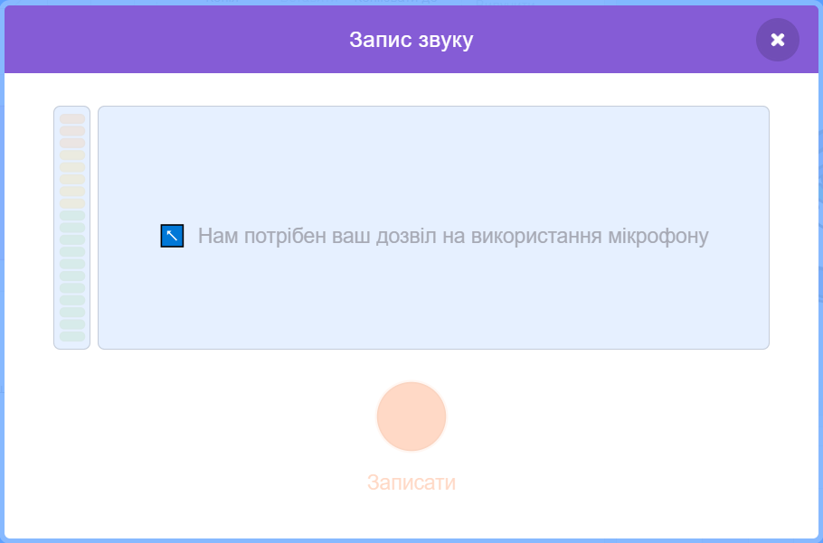
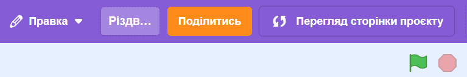

# Вступ {.intro}

Ми створимо різдвяну листівку у Scratch. Вона матиме кілька простих функцій та анімацій. Коли вона буде готова, вона виглядатиме приблизно так.


# Крок 1: Змініть фон і знайдіть фігури {.activity}

## Контрольний список {.check}

- [ ] Почніть новий проєкт. На стартовій сторінці Scratch натисніть на своє ім'я у верхньому правому куті. Потім натисніть "Мої проекти" і, нарешті, "Створити проект". Ти побачиш кота, який чекає, щоб його запрограмували!

- [ ] Натисніть
 у правому нижньому куті, щоб імпортувати готове тло. Виберіть потрібне тло. Потім натисніть `Сцена`, `Тло`, виберіть порожнє тло зліва і видаліть його, клацнувши правою кнопкою миші і вибравши `Вилучити`.

- [ ] Видаліть персонажа кота `Спрайт 1`.

- [ ] Виберіть нові фігури з бібліотеки за допомогою цієї іконки в правому нижньому куті: 

   Додайте оленя, сніговика та подарунок.


# Крок 2: Додайте код {.activity}

Тепер ми зробимо так, щоб фігури виконували певні дії при натисканні на них.

## Контрольний список {.check}

- [ ] Виберіть `reindeer` та вкладку `код`{.blocklightgrey}і створіть цей код. Коли на оленя натискають, він повинен сказати `Щасливого Різдва!`.

  ```blocks
  коли спрайт натиснуто
  говорити [Щасливого Різдва!] (2) сек
  ```

## Тестування проєкту {.flag}

__Натисніть на оленя та перевірте, чи працює ваш код.__

- [ ] Чи каже олень `Щасливого Різдва!`?

## Контрольний список {.check}

- [ ] Виберіть сніговика та вкладку `код` і створіть цей код.Сніговик запитає ваше ім'я. Він вставить відповідь у нове речення. Після цього він повинен змінити колір.

  ```blocks
  коли спрайт натиснуто
  запитати [Як Вас звати?] і чекати
  говорити (з'єднати [Щасливого Різдва! ] (відповідь)) (2) сек
  завжди
      змінити ефект [колір v] на (25)
  slutt
  ```

## Тестування проєкту {.flag}

__Натисніть на сніговика і перевірте, чи працює ваш код.__

- [ ] Чи запитує сніговик ваше ім'я?

- [ ] Чи відгукується сніговик на ваше ім'я після того, як ви його 
ввели?
- [ ] Чи змінює сніговик колір?

## Контрольний список {.check}

- [ ] Виберіть подарунок та вкладку `код`{.blocklightgrey} і створіть цей код. Тепер подарунок має змінити колір і вигляд.

  ```blocks
  коли @greenFlag натиснуто
  завжди
      чекати (0.3) секунд
      змінити ефект [колір v] на (25)
      наступний образ
  slutt
  ```

## Тестування проєкту {.flag}

__Натисніть зелений прапорець і перевірте, чи все працює.__

- [ ] Чи змінює подарунок колір?

- [ ] Чи двигається подарунок?


# Крок 3: Чи є у вас вільний час? {.activity}

Тоді ви добре попрацювали! Якщо у вас ще залишився вільний час, ви можете це зробити:

## Контрольний список {.check}

- [ ] Додайте власне привітання, наприклад, "Щасливого Різдва", або заспівайте власну різдвяну пісню.

  Клацніть на `Сцена`, і виберіть вкладку `Звуки`{.blocklightgrey}. Наведіть вказівник миші на іконку `Обрати звук` внизу ліворуч і натисніть кнопку `Записати`.

  

   Запишіть власний звук і дайте йому назву, наприклад, `різдвяне привітання`. Потім перейдіть до `коду`{.blocklightgrey},
  і введіть наступний код:

  ```blocks
  коли @greenFlag натиснуто
  відтворити звук [різдвяне привітання v] до кінця
  ```

- [ ] Може, придумати якусь іншу веселу анімацію? Сніговик може потанцювати або помандрувати? Чи можемо ми мати розмовляючі або стрибаючі божевільні різдвяні подарунки? Це залежить від вас!

# Крок 4: Зберегти та поділитись {.activity}

Дайте своїй різдвяній листівці назву. Клацніть меню `Файл` у верхньому лівому кутку і натисніть `Зберегти негайно` під ним.

Після цього ви можете опублікувати свою різдвяну листівку, вибравши `Поділитись`.


