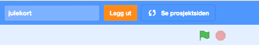

# Вступ {.intro}

Ми створимо різдвяну листівку у Scratch. Вона матиме кілька простих функцій та анімацій. Коли вона буде готова, вона виглядатиме приблизно так.


# Крок 1: Змініть фон і знайдіть фігури {.activity}

## Контрольний список {.check}

- [ ] Почніть новий проєкт. На стартовій сторінці Scratch натисніть на своє ім'я у верхньому правому куті. Потім натисніть "Мої проекти" і, нарешті, "Створити проект". Ти побачиш кота, який чекає, щоб його запрограмували!

- [ ] Натисніть
 у правому нижньому куті, щоб імпортувати готове тло. Виберіть потрібне тло. Потім натисніть `Сцена`, `Тло`, виберіть порожнє тло зліва і видаліть його, клацнувши правою кнопкою миші і вибравши `Вилучити`.

- [ ] Видаліть персонажа кота `Спрайт 1`.

- [ ] Виберіть нові фігури з бібліотеки за допомогою цієї іконки в правому нижньому куті: 

   Додайте оленя, сніговика та подарунок.


# Крок 2: Додайте код {.activity}

Тепер ми зробимо так, щоб фігури виконували певні дії при натисканні на них.

## Контрольний список {.check}

- [ ] Виберіть `reindeer` та вкладку `код`{.blocklightgrey}і створіть цей код. Коли на оленя натискають, він повинен сказати `Щасливого Різдва!`.

  ```blocks
  коли спрайт натиснуто
  говорити [Щасливого Різдва!] (2) сек
  ```

## Test prosjektet ditt {.flag}

__Klikk på isbjørnen og se om koden din virker.__

- [ ] Sier isbjørnen `God jul!`?

- [ ] Forandrer isbjørnen stilling?

## Sjekkliste {.check}

- [ ] Velg snømannen og fanen `Skript` og lag denne koden.  Snømannen skal
  spørre etter navnet ditt. Den setter svaret inn i en ny
  setning. Deretter skal den skifte farge.

  ```blocks
  når denne figuren klikkes
  spør [Hva er navnet ditt?] og vent
  si (sett sammen [God jul ] (svar)) i (2) sekunder
  gjenta for alltid
      endre [farge v] effekt med (25)
  slutt
  ```

## Test prosjektet ditt {.flag}

__Klikk på snømannen og se om koden din virker.__

- [ ] Spør snømannen om navnet ditt?

- [ ] Svarer snømannen med navnet ditt når du har skrevet det inn?

- [ ] Forandrer snømannen farge?

## Sjekkliste {.check}

- [ ] Velg juletreet og fanen `Skript`{.blocklightgrey} og lag denne
koden.  Nå skal juletreet skifte farge og utseende.

  ```blocks
  når @greenFlag klikkes
  gjenta for alltid
      vent (0.3) sekunder
      endre [farge v] effekt med (25)
      neste drakt
  slutt
  ```

## Test prosjektet ditt {.flag}

__Trykk på det grønne flagget og se om alt virker.__

- [ ] Endrer treet farge?

- [ ] Danser treet fra side til side?


# Steg 3: Har du ledig tid, sier du? {.activity}

Da har du jobbet godt! Om du fortsatt har ledig tid kan du:

## Sjekkliste {.check}

- [ ] Legge til din egen velkomsthilsen, for eksempel "God jul" eller du
kan synge din egen julesang.

  Klikk på `Scene`, og velg fanen `Lyder`{.blocklightgrey}. Flytt
  musepekeren over `Velg en lyd`-ikonet helt nede til venstre, og
  klikk `Spill inn lyd`.

  

   Ta opp din egen lyd, og gi den et navn, for
  eksempel `julehilsen`. Gå deretter inn på `Skript`{.blocklightgrey},
  og legg inn følgende kode:

  ```blocks
  når @greenFlag klikkes
  spill lyden [julehilsen v] til den er ferdig
  ```

- [ ] Kanskje finne på noen andre morsomme animasjoner? Snømannen kan
danse eller turne litt? Kan vi ha snakkende eller hoppende gale
julepresanger? Du bestemmer!


# Steg 4: Lagre og publisere {.activity}

Gi julekortet ditt et navn. Klikk `Fil`-menyen øverst til venstre, og klikk `Lagre nå` under den.

Deretter kan du publisere julekortet ditt ved å velge `Legg ut`.


